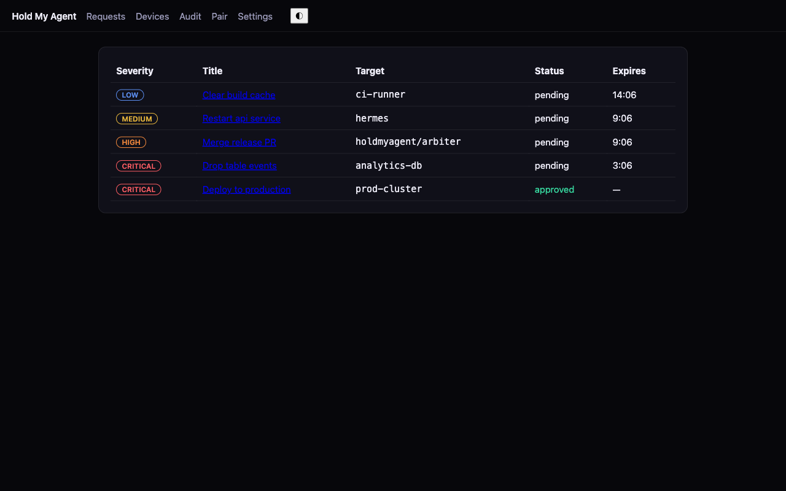
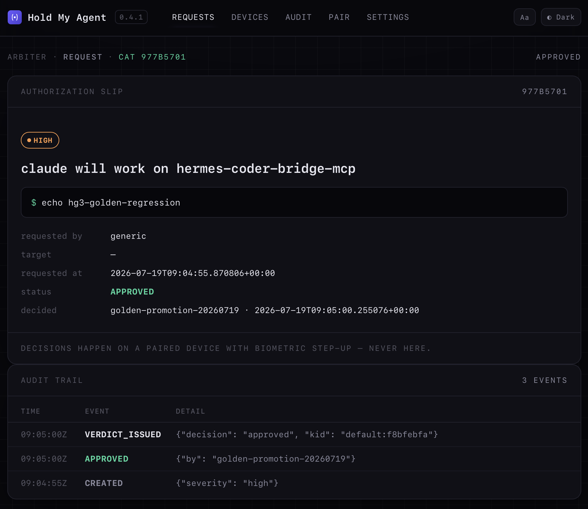
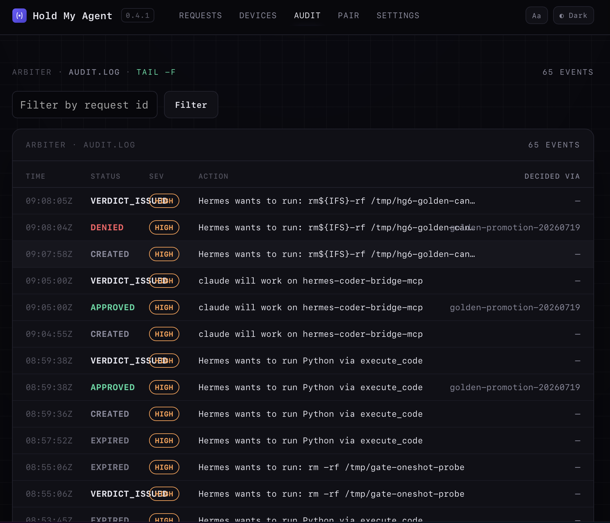
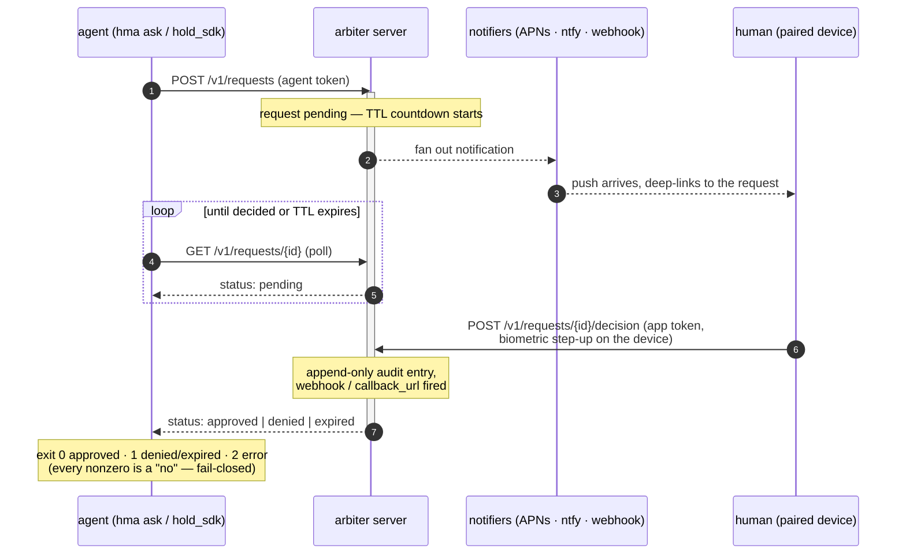

# Hold My Agent — Arbiter

Self-hosted, fail-closed approval server for AI agents. Before your agent
does something irreversible, it asks a human.

Point any coding agent, script, or automation at Arbiter with one CLI call
or SDK function. Arbiter holds the request, pushes an alert to your phone
(or a webhook, or ntfy), and waits for a real decision — approve or deny —
made by a human on a paired device. If the server is unreachable, the
request times out, or anything goes wrong, the answer defaults to **no**.
Nothing gets through by accident.

<p align="center">
  
  
  
</p>

## The five-minute loop

```bash
pip install holdmyagent
hma init          # prints your tokens + admin password
hma serve         # dashboard at http://127.0.0.1:8000/dashboard
hma ask "Drop the production table?" --severity critical && echo approved
```

`hma ask` creates a request and blocks — it does not return until the
request is decided or its TTL (5 minutes by default) runs out. Open the
dashboard in a browser and you'll see the request land in real time; the
dashboard is deliberately **view-only**, so the actual approve/deny call
has to come from somewhere that can prove a human is really there — a
paired device, or, while you're kicking the tires without a phone handy,
a direct API call using the `app_token` that `hma init` printed:

```bash
curl -X POST localhost:8000/v1/requests/<request-id>/decision \
  -H "Authorization: Bearer <app_token>" -H 'content-type: application/json' \
  -d '{"decision":"approve"}'
```

Do that (or approve it from a paired device, see below) while `hma ask` is
waiting, and it exits `0` and prints `approved`. Deny it, let it expire, or
kill the server, and it exits non-zero — `hma ask`'s whole job is to make
"can't reach the approver" and "the approver said no" indistinguishable
from a script's point of view.

**Tenants.** Arbiter is single-owner by default — `hma init && hma serve`
gives you one `default` tenant and nothing else to think about. Since 0.4.0
the same server can host **isolated tenants** (`hma tenant create`): each
tenant gets its own database, verdict-signing key, notification egress, and
rate limits in a private "cell", with a fail-closed routing layer in front.
Run one for yourself, or a fleet for your team.

## Get it on your phone

Arbiter can push a notification to your phone the moment an agent asks for
something. Two ways to wire that up, and you can run both at once:

- **ntfy** — no Apple account required. Set a topic in `config.toml`:

  ```toml
  [notify.ntfy]
  topic = "hma-a7f3c9d1"   # unguessable random string — see docs/ntfy.md
  ```

  Install the [ntfy app](https://ntfy.sh/) and subscribe to that topic.
  Alerts deep-link into **Hold My Agent for iOS** if it's installed, so
  tapping a notification jumps straight to the request. Full guidance
  (self-hosted ntfy, topic-naming) is in [`docs/ntfy.md`](docs/ntfy.md).

- **Hold My Agent for iOS** — a paid App Store app that pairs with *your*
  self-hosted server (not ours — there's no hosted backend). Run
  `hma pair` to print a QR code in your terminal, or open
  `/dashboard/pair` in a browser; scan it with the app to pair. Paired
  devices get native push via Apple's APNs, and decisions made in the app
  are the only ones that count as "a human really did this" — see
  [`docs/apns.md`](docs/apns.md) for bringing your own Apple Developer
  key.

Prefer a plain HTTP callback instead (Slack, PagerDuty, your own
notifier)? See [`docs/webhooks.md`](docs/webhooks.md) — outbound webhooks
are HMAC-signed so you can verify they actually came from your server.

## Wire it into your agent

The `hold-sdk` package gives agents and scripts a single function:

```python
from hold_sdk import request_approval

decision = request_approval(
    "Drop the production table?",
    description="DROP TABLE events;",
    severity="critical",
    target="prod-db",
)
if decision != "approved":
    raise SystemExit(f"not approved: {decision}")
```

`request_approval` is **fail-closed by design**: an unconfigured client
(no `HMA_SERVER_URL`/`HMA_AGENT_TOKEN` or `server_url`/`token`), a network
error, a malformed server response, or a local timeout all return
`"denied"` — never an exception that a caller might accidentally swallow,
and never a silent yes. Only an explicit `"approved"` from the server
means go. Full reference in [`docs/sdk.md`](docs/sdk.md), including a
generic hook example for gating a shell command through `hma ask` from
your coding agent's own hook system.

No Python? `hma ask` is a normal CLI command with the same contract:
exit `0` (approved), `1` (denied or expired), `2` (error) — wrap it around
any command you want gated, in any language that can shell out and check
an exit code.

## Enforcement: the Warden

Everything above is the *cooperative* tier: the agent asks, and well-behaved
tooling blocks on the answer. A prompt-injected or misbehaving agent can
simply skip the call.
**HMA is the gate; the warden decides whether the agent walks through it or merely promises to.**

`hold-warden` is a small trusted daemon that runs *outside* the agent's
sandbox, holds the action credentials the agent never sees, and executes
only what a human approved — verified, not promised:

- Actions live in a registry (`warden.toml`) with constrained, validated
  parameters — the agent picks from a menu, it cannot compose commands.
- Every proposal is canonicalized and hashed; the human's decision comes
  back as an **Ed25519-signed verdict bound to that exact action hash**;
  the warden re-verifies the signature and recomputes the hash before
  executing anything.
- Approvals are **single-use** (atomically consumed on the server) and go
  stale after a freshness window — no replay, no month-old "yes".

```bash
pip install holdmyagent hold-warden
hma token create my-warden --role warden        # printed once
hma-warden init --arbiter-url http://127.0.0.1:8000 --config ~/.config/hold-warden/warden.toml
hma-warden doctor --config ~/.config/hold-warden/warden.toml   # dry-run secrets + pairing
hma-warden serve  --config ~/.config/hold-warden/warden.toml
```

The agent-facing surface is three plain HTTP endpoints (`POST /v1/propose`,
`GET /v1/proposals/{id}`, `POST /v1/execute`) — no SDK required. Start with
[`docs/warden.md`](docs/warden.md); to pick the right tier (and see what
each does *not* protect against) read
[`docs/enforcement-models.md`](docs/enforcement-models.md); for the
sandboxed-agent topology (nftables egress allowlist, warden placement) see
[`docs/reference-sandboxed-agent.md`](docs/reference-sandboxed-agent.md).

## How it works



Every state change — created, decided, expired, a notifier failure — is
written to an append-only audit log, visible under `/dashboard/audit`. A
background sweep expires anything past its TTL every second, so a
request an agent gave up polling on still resolves to `expired` (not
left dangling as `pending`) and still fires the same webhook/callback
path a real decision would.

## Security model

Arbiter is built to be **self-hosted by one owner**, not run as a
multi-tenant service — read [`SECURITY.md`](SECURITY.md) for the full
threat model. In short:

- Every `/v1/*` route requires a bearer token; the dashboard requires a
  signed session cookie plus CSRF on every state-changing form.
- Repeated bad credentials are throttled with a per-IP rate limiter (both
  the API and the dashboard login return `429`).
- The dashboard is view-only by construction — there is no "approve"
  button in the web UI; decisions require the `app_token` via the API,
  which in normal use only the paired iOS app holds. A logged-in admin can
  still reveal both tokens on the dashboard's Settings page, so an admin
  session transitively grants full agent and decision capability — see
  [`SECURITY.md`](SECURITY.md).
- Fail-closed everywhere: `hma ask` and `hold_sdk.request_approval` treat
  every non-approval outcome — timeout, network failure, malformed
  response, unreachable server — the same as an explicit denial.
- No built-in TLS. Run Arbiter on a LAN, behind Tailscale, or behind a
  reverse proxy that terminates TLS — see the deploy guides below.

Found a vulnerability? See [`SECURITY.md`](SECURITY.md) for how to report
it privately.

## Deploying

Guides for running Arbiter as a long-lived service:

- **[How it all fits together → docs/architecture.md](docs/architecture.md)** — system map, request lifecycle, enforcement chain, tenancy
- [`docs/quickstart.md`](docs/quickstart.md) — local install, config, first request
- [`docs/api.md`](docs/api.md) — consolidated REST API reference (every `/v1` endpoint)
- [`docs/config.md`](docs/config.md) — full `config.toml` reference
- [`docs/cli.md`](docs/cli.md) — `hma` and `hma-warden` CLI reference
- [`docs/warden.md`](docs/warden.md) — the Warden: verified enforcement guide
- [`docs/secret-managers.md`](docs/secret-managers.md) — Bitwarden/`rbw`, 1Password `op`, `pass`, Vault recipes
- [`docs/enforcement-models.md`](docs/enforcement-models.md) — tier 0/1/2, and what each does NOT protect against
- [`docs/agent-hook.md`](docs/agent-hook.md) — gate an agent's shell/tool calls through HMA
- [`docs/reference-sandboxed-agent.md`](docs/reference-sandboxed-agent.md) — sandboxed-agent reference architecture
- [`docs/deploy-docker.md`](docs/deploy-docker.md) — Docker / Compose
- [`docs/deploy-systemd.md`](docs/deploy-systemd.md) — systemd unit (Linux)
- [`docs/deploy-launchd.md`](docs/deploy-launchd.md) — launchd (macOS)
- [`docs/deploy-nginx.md`](docs/deploy-nginx.md) — reverse proxy with WebSocket upgrade
- [`docs/deploy-tailscale.md`](docs/deploy-tailscale.md) — expose it over your tailnet only
- [`docs/apns.md`](docs/apns.md) — bring your own Apple Developer key
- [`docs/ntfy.md`](docs/ntfy.md) — topic-based push, self-hosted option
- [`docs/webhooks.md`](docs/webhooks.md) — payload shape + HMAC verification
- [`docs/sdk.md`](docs/sdk.md) — `hold-sdk` API reference + hook example

## License

MIT — see [`LICENSE`](LICENSE).
