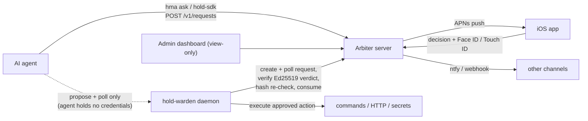
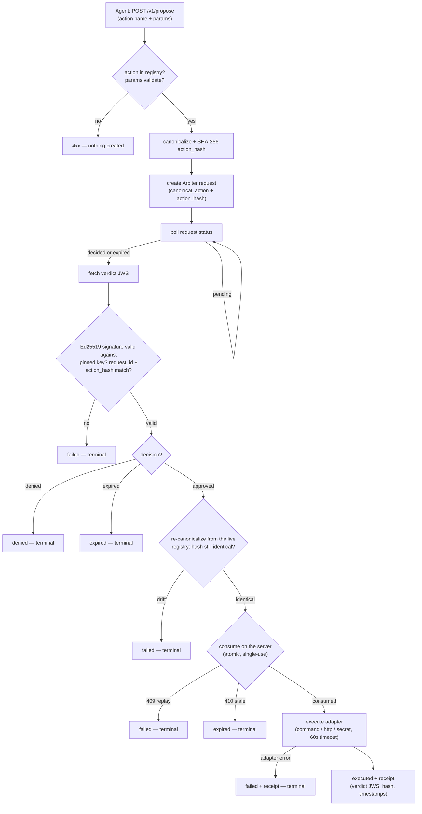
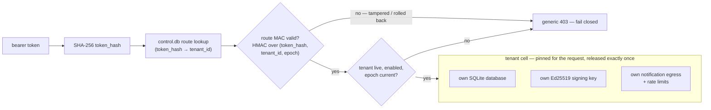

# Architecture — how it all fits together

Hold My Agent is three shipped pieces sharing one contract: **only an
explicit, verifiable "yes" from a human lets an action through, and every
other outcome is a no.**

- **`holdmyagent`** — the Arbiter server: holds approval requests, pushes
  notifications, records human decisions, signs verdicts, keeps the audit
  log.
- **`hold-sdk`** — the Python client agents call (`request_approval`,
  `ArbiterClient`); `hma ask` is the same contract as a CLI exit code.
- **`hold-warden`** — the enforcement daemon that executes approved
  actions *outside* the agent's reach, verifying the server's signed
  verdict before anything runs.


This page walks the four views that explain the whole system: the map of
the moving parts, the life of a single request, the warden's verification
chain, and how one server hosts isolated tenants.

## System map

An agent has two ways in, and they differ in who has to cooperate for a
"no" to stick (see [enforcement-models.md](enforcement-models.md)). On the
**cooperative** path, the agent itself calls the Arbiter server — via
`hma ask` or `hold-sdk` — and blocks on the answer. On the **enforced**
path, the agent holds no credentials at all: it can only *propose* an
action from a registry to the `hold-warden` daemon, which creates the
Arbiter request itself, verifies the signed verdict, and executes the
action on the agent's behalf. In both cases the server fans the request
out to notification channels, and the decision comes back from a paired
device — the web dashboard is deliberately view-only, with no approve
button to phish.



Every arrow into the server is bearer-authenticated with a role-scoped
token (`agent`, `warden`, or `app` — minted by `hma token create`, hashed
at rest). Agents create and read only their own requests; only `app`-role
credentials (in normal use, the paired iOS app) can decide them; only
`warden`-role credentials can consume an approval.

## Life of a request

A request is born with a severity, a TTL, and — when a warden created it —
a `canonical_action` plus its SHA-256 `action_hash`. The server recomputes
that hash over the received bytes and rejects a mismatch (422), so the
hash inside the eventual verdict is server-verified, not self-reported.
Creation also passes through the policy layer: per-`action_type` severity
floors, auto-deny lists, a per-identity rate limit, TTL clamping,
duplicate-collapse of identical pending requests, and `idempotency_key`
replay (a retried create returns the original row).

```mermaid
sequenceDiagram
    participant Agent
    participant Server as Arbiter server
    participant Phone as iOS app
    Agent->>Server: POST /v1/requests (agent token; severity, TTL,<br/>optional canonical_action + action_hash)
    Note over Server: policy checks + rate limit;<br/>action_hash recomputed server-side (422 on mismatch)
    Server->>Phone: push (APNs — ntfy / webhooks fan out too)
    loop until terminal status
        Agent->>Server: GET /v1/requests/{id} (poll)
    end
    alt human decides in time
        Phone->>Server: POST /v1/requests/{id}/decision<br/>(app token; Face ID / Touch ID step-up in the app)
        Note over Server: guarded atomic update — no double-decide;<br/>Ed25519 verdict signed and stored
        Server-->>Agent: status = approved / denied (+ verdict JWS)
    else TTL expires / anything fails
        Note over Server: expiry scheduler flips the row<br/>and signs an "expired" verdict
        Server-->>Agent: status = expired → treated as denied (fail-closed)
    end
```

Three details carry most of the trust:

- **Decisions are atomic.** The decide path is a guarded update
  (`WHERE status='pending'`), so two racing decisions can't both land, and
  deciding an already-expired request is refused with a 409.
- **Every terminal state gets a signed verdict.** Approve, deny, *and*
  expiry each produce an Ed25519 JWS over `{request_id, action_hash,
  decision, decided_at, approval_ttl_seconds}`, served at
  `GET /v1/requests/{id}/verdict`; the per-tenant public keys are at
  `GET /v1/keys` (any authenticated role; each tenant sees only its own).
- **Expiry is owned by the server.** A process-wide scheduler keeps a
  min-heap of deadlines and flips overdue rows even if the agent stopped
  polling — a request never dangles as `pending`, and the same
  webhook/callback path fires as for a real decision. Notifications ride a
  journaled outbox drained on startup, delivered at-most-once per
  (request, event) across restarts.

The client half of the contract is symmetric: `hma ask` exits `0` only on
`approved` (`1` denied/expired, `2` error) and `hold_sdk.request_approval`
returns `"denied"` for every failure — unconfigured client, network error,
malformed response, local timeout — never an exception a caller might
swallow.

## The warden's enforcement chain

The cooperative path trusts the agent to block on the answer. The warden
does not. It runs outside the agent's sandbox, holds the action
credentials the agent never sees, and treats the approval as a
cryptographic artifact to verify — signature, hash, freshness, and
single-use — before anything executes. Every failure edge lands on a
terminal status (`denied`, `expired`, `failed`); there is no retry into an
execute, and a warden restart mid-execution fails closed rather than guess
whether the action ran.



Walking the chain:

1. **Propose.** The agent names a registry action and fills its
   constrained parameters (`POST /v1/propose`). Unknown agent, unknown
   action, or invalid params → 4xx with zero side effects. The agent's
   whole surface is three routes — `/v1/propose`,
   `GET /v1/proposals/{id}`, and `POST /v1/execute`, a blocking
   propose-then-poll convenience wrapper.
2. **Canonicalize + hash.** The warden resolves the action template to
   its final form (argv, or URL + method + body hash, or secret name) and
   hashes the canonical encoding. That hash rides in the Arbiter request,
   where the server re-verifies it.
3. **Verify.** When the request is decided, the warden fetches the
   verdict JWS and verifies it against the **locally pinned** public key
   from `hma-warden init` — checking the signature, the tenant-bound
   audience, the request id, and the action hash. The server is not
   trusted; its signature is.
4. **Re-canonicalize.** Before executing, the warden re-derives the
   canonical action from the *live* registry and refuses on any drift —
   an action edited after approval is not the action that was approved.
5. **Consume.** `POST /v1/requests/{id}/consume` atomically marks the
   approval used: a replay gets 409, an approval older than the freshness
   window (`approval_ttl_seconds`) gets 410. This is the point of no
   return — no month-old "yes", no double execution.
6. **Execute + receipt.** Only now does an adapter run (command / HTTP /
   secret release, 60-second timeout), and the outcome is persisted as a
   receipt alongside the verdict JWS.

## Multitenant cells

Since 0.4.0 one server can host isolated tenants (`hma tenant create`),
and the isolation is structural, not row-level: there is no shared
requests table with a `tenant_id` column. Each tenant lives in its own
**cell** — its own SQLite database, its own Ed25519 verdict-signing key,
its own notification egress and rate limits. The only shared state is a
router-only control plane (`control.db`) mapping hashed bearer tokens to
tenants, and every route row carries an HMAC (keyed by a `0600` key file
beside the DB) over `(token_hash, tenant_id, epoch)` — a tampered or
rolled-back registry fails closed at resolve instead of silently
re-pointing a credential at another tenant's cell. Tenant epochs are
monotonic and never reused, so a deleted-and-recreated tenant can never
inherit stale routes.



Consequences that fall out of the cell design:

- **Tenant identity comes from the credential only.** No header, query
  parameter, or client hint can select a tenant; the resolved cell is
  pinned for the request's whole lifetime and released exactly once.
- **Verdicts are tenant-bound.** Signing keys are per-cell, key ids are
  tenant-namespaced, and the JWS audience is `hma-verdict:<tenant>` — a
  warden paired with one tenant loudly rejects a neighbour's verdict even
  if key bytes ever coincided.
- **Disable is immediate and fail-closed.** A disabled tenant's bearer
  resolves to the same generic 403 as a bad token, and its live
  `/v1/stream` sessions are torn down on the next heartbeat.
- **Single-owner stays simple.** `hma init && hma serve` gives you one
  `default` tenant and nothing else to think about; the cell machinery is
  invisible until you create a second one.

## Where to go next

- [quickstart.md](quickstart.md) — run the loop locally in five minutes.
- [enforcement-models.md](enforcement-models.md) — pick the tier that
  matches how much you trust your agent.
- [warden.md](warden.md) — deploy verified enforcement.
- [api.md](api.md) — every `/v1` endpoint in one page.
- [../SECURITY.md](../SECURITY.md) — the threat model behind all of this.
