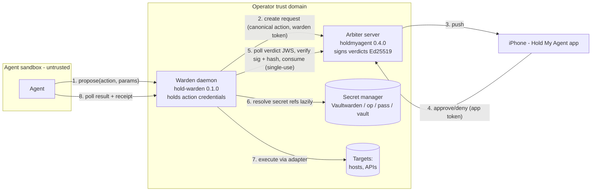

# Design — Warden: verified enforcement for Hold My Agent (0.4.0 train)

Approved 2026-07-06 (operator, brainstorm session; section-by-section sign-off). This spec is the
source of truth for the implementation plan and the overnight autonomous run. Do not re-scope.

## 1. Problem & positioning

HMA today is a well-built approval **inbox** with genuinely fail-closed clients — but the approval
is advisory. The verdict is an unsigned string in SQLite that only the *untrusted agent* reads;
nothing binds the human's "yes" to the actual action bytes; one shared bearer token covers every
agent; approvals never expire, have no consumed state, and the decision path has a TOCTOU race.
A prompt-injected or misbehaving agent can skip HMA entirely or act on a stale/foreign approval.

Our audience — self-hosting engineers who already run agents in sandboxes (nftables egress
allowlists, credential isolation) — thinks in enforcement-by-construction. For them HMA must
produce an artifact their architecture can *enforce*: a signed, action-hash-bound, single-use
verdict, and a trusted component outside the sandbox that holds the credentials and performs the
action. The market position is open: HumanLayer (the category leader) deprecated its approval SDK
and pivoted; the closest competitor (Peta) enforces only MCP traffic and has no phone story.
Nobody offers **verified enforcement for arbitrary agent actions + native iOS push ruling + fully
self-hosted**. The frame the audience will recognize instantly: **sudo for agents**.

Pitch line (docs must use it): *HMA is the gate; the warden decides whether the agent walks
through it or merely promises to.*

## 2. Decisions (locked in brainstorm — do not reopen)

| Decision | Choice |
|---|---|
| Core verb | One enforcement primitive + pluggable adapters; all three adapter classes ship in v1 (command, http, secret) |
| Component name | **Warden** (`hold-warden` package, `hma-warden` console script) |
| Packaging | Third package in the holdmyagent-arbiter monorepo: `warden/` sibling of `server/` and `sdk/` |
| Secret managers | First release: `env:` / `file:` / `cmd:` resolvers + first-class tested recipes for Bitwarden/Vaultwarden (`rbw` recommended, `bw` supported), 1Password `op`, `pass`, HashiCorp Vault |
| Overnight scope | Warden + arbiter trust upgrade + tier-1 gaps + docs + tests; **no live homelab changes, no releases/tags, no iOS changes** |
| Promoted to core | `hma ask --url`/`HMA_URL` fix; `/health` readiness (200 + DB ping, nothing deeper) |
| Deferred to v1.1+ | Hash-chained audit rows; Prometheus `/metrics`; quorum; mTLS; Go port; MCP elicitation adapter |
| callback_url SSRF | Enforced in **arbiter application logic** (create-time 422 + dispatch re-check, redirects disabled); perimeter rules are complementary, documented in the reference architecture |
| Notification outbox | Stretch tier, strictly constrained (one table, 1/5/25s ladder, max 3 attempts, stale-drop past request TTL; no DLQ) |

## 3. Architecture



Trust chain: human decision → arbiter signs verdict over `{request_id, action_hash, decision,
decided_at, expires}` → warden verifies signature against the pinned arbiter public key →
warden **recomputes the hash of what it is about to execute** and refuses on mismatch → warden
consumes the approval on the arbiter (atomic, single-use) → adapter executes → receipt.

What a fully compromised agent can still do: propose registry actions with constrained params;
spam (rate-limited, deduped). What it can never do: execute anything unapproved, alter an action
after approval, replay an approval, read other agents' requests, or see warden credentials.

## 4. The Warden (`warden/`, PyPI `hold-warden` 0.1.0)

Runtime: Python ≥3.11. Dependencies: `httpx`, `cryptography`, `pyjwt[crypto]`, `uvicorn`,
`click`, `tomlkit` — matching server conventions but **no web framework**: the HTTP layer is a
hand-written ASGI app (~100 lines). The small-enough-to-audit story is the point; the API
contract below is transport-agnostic and tests exercise the app object directly.

Console script: `hma-warden` with subcommands `init` (scaffold config + mint agent-facing tokens
+ pair with arbiter: fetch and pin public key), `serve`, `doctor` (dry-run every secret resolver
and arbiter reachability; exit non-zero on any failure), `hash <action> [--param k=v ...]` (print
the canonical document and hash — the operator's verification/debug tool).

### 4.1 Action registry (`warden.toml`)

```toml
[warden]
arbiter_url = "https://arbiter.tailnet.example:8000"
arbiter_token = "env:HMA_WARDEN_TOKEN"        # warden-role token, a secret ref like any other
arbiter_pubkey = "kid1:base64..."             # pinned at `hma-warden init`, rotatable
bind = "127.0.0.1"                            # sandbox-facing API bind
port = 8646

[agents.hermes]                                # agent-facing bearer tokens, per agent identity
token = "env:WARDEN_AGENT_HERMES"

[actions.restart_service]
adapter = "command"
severity = "high"                              # warden-set, never agent-set
ttl_seconds = 300
description = "Restart a systemd unit on hermes"
argv = ["ssh", "-o", "BatchMode=yes", "kclear@hermes", "sudo", "systemctl", "restart", "{unit}"]
  [actions.restart_service.params.unit]
  type = "enum"
  values = ["nginx", "caddy", "holdmyagent-server"]

[actions.post_status]
adapter = "http"
severity = "medium"
url = "https://api.example.com/v1/status"
method = "POST"
body_template = '{"text": "{text}"}'
headers = { Authorization = "secret:api_bearer" }   # name references [secrets]
  [actions.post_status.params.text]
  type = "string"
  max_len = 500
  pattern = "^[^\\x00-\\x08\\x0b\\x0c\\x0e-\\x1f]*$"

[actions.release_deploy_key]
adapter = "secret"
severity = "critical"
secret = "secret:deploy_key"

[secrets]
api_bearer = "cmd:rbw get api-bearer"          # Vaultwarden via rbw agent
deploy_key = "file:/etc/warden/deploy_key"     # 0600
```

Rules: params are **constrained only** (enum / pattern+max_len / int ranges) — no free-form shell,
no param interpolation into argv positions that could splice flags (each `{param}` must occupy an
entire argv element or a bounded body/url segment). Unknown params, missing params, or validation
failure → propose rejected with 422. Secrets appear in config only as references; resolved values
never enter the canonical document, the arbiter payload, receipts, or logs.

### 4.2 Secret resolvers

Schemes: `env:VAR`, `file:/path` (must be 0600 or warn), `cmd:<argv string>` (run, stdout
stripped = secret; non-zero exit = resolution failure). Resolution is **lazy** — at execution
time, so a locked vault fails that one action closed instead of crashing the daemon. `hma-warden
doctor` dry-runs all resolvers but **never prints resolved values** — it evaluates only the exit
code and a non-empty-length check, reporting `ok (non-empty)` / `FAILED (exit N)` per resolver,
so troubleshooting on a live host can't dump vault contents to a terminal or scrollback.
Documented, CI-tested recipes (fake CLIs in tests): Bitwarden /
Vaultwarden via `rbw get` (recommended: background agent handles unlock for daemons) and
`bw get password` (requires `BW_SESSION`); 1Password `op read op://...`; `pass show`; `vault kv
get -field=...`. Docs page: `docs/secret-managers.md`.

### 4.3 Agent-facing API (bearer auth per `[agents.*]`, all JSON)

- `POST /v1/propose {action, params, idempotency_key?}` → `201 {proposal_id, request_id, status:
  "pending", expires_at}`. Idempotent per (agent, idempotency_key): retry returns the original.
- `GET /v1/proposals/{id}` → `{status: pending|executing|executed|denied|expired|failed,
  result?: {exit_code, stdout_tail, stderr_tail} | {http_status, body_sha256} | {secret},
  receipt?: {...verdict fields, executed_at}}`. Only the proposing agent's token can read it.
- `POST /v1/execute {action, params, timeout_s?}` — blocking convenience wrapper (long-poll up to
  timeout, default 240s, then `202 {proposal_id}` so the caller can switch to polling). The async
  pair is primary: agent-runtime turn timeouts are a real constraint (Knossos).
- `GET /health` → 200 when config loaded and arbiter last reachable within 60s (cached probe).

Fail-closed table (contract, tested): arbiter unreachable at propose → 502, no side effects;
unreachable at verdict poll → keep polling until request `expires_at`, then `expired`; signature
invalid / key mismatch → `failed` + audit, never execute; hash mismatch → `failed`, never
execute; consume 409 (already consumed) → `failed`, never execute; arbiter 401/403 (warden token
revoked or rotated) → proposal `failed`, CRITICAL local log line naming the cause, daemon stays
up and keeps serving (no unhandled-exception crash; recovery = fix token + restart); adapter
timeout/error → `failed` with receipt recording the attempt; `secret` resolution failure →
`failed`.

### 4.4 Canonicalization (golden-vectored)

Only the warden canonicalizes; the arbiter treats the canonical document as opaque bytes. The
canonical document is a JSON object serialized with `json.dumps(obj, sort_keys=True,
separators=(",", ":"), ensure_ascii=False)`, UTF-8 encoded; `action_hash = sha256(bytes).hexdigest()`.

```json
{"action":"restart_service","adapter":"command","params":{"unit":"nginx"},
 "resolved":{"argv":["ssh","-o","BatchMode=yes","kclear@hermes","sudo","systemctl","restart","nginx"]},
 "v":1,"warden":"knossos-warden"}
```

Per adapter, `resolved` is: command → `{argv: [...]}` (final literal argv); http → `{method, url,
header_names: [...], body_sha256}` (header *names* only — values may be secrets); secret →
`{secret: "<name>"}` (reference only). The warden sends the canonical string in the create
request; the arbiter stores it verbatim, hashes the received bytes server-side, and both hashes
must agree (server rejects create on mismatch with the warden-supplied hash). At execute time the
warden re-canonicalizes from its registry + stored params and refuses on any drift. Golden
vectors: a `tests/vectors/*.json` fixture set pinning (input → canonical string → hash) for all
three adapters, unicode params, param ordering, nested body templates, and the **empty-params
case** (a zero-input action must serialize as `"params":{}` — never key-dropped — identically on
warden and arbiter).

### 4.5 Execution adapters

- `command`: `subprocess.run(argv, timeout, capture_output)` — argv only, `shell=False`, env
  scrubbed to a documented minimal set + configured extras. Receipt: exit code, stdout/stderr
  tails (4 KiB each, truncation marked).
- `http`: httpx request with resolved headers; redirects disabled; timeout. Receipt: status code,
  response `body_sha256`, first 1 KiB.
- `secret`: returns the resolved value once in the proposal result; single retrieval enforced
  (result is deleted after first read; receipt records release, never the value).

Warden persistence: a small SQLite db (proposals, receipts) in the warden's data dir — restart-safe,
and receipts survive independently of the arbiter's audit log. Retention is deliberately dumb for
v0.1.0: on startup, `DELETE` proposals/receipts older than `retention_days` (config, default 7) —
no background pruning task; a propose-spamming agent cannot grow the DB unboundedly across
restarts, and rate limits bound within-uptime growth.

Config reload: **none in v0.1.0** — `warden.toml` changes require a daemon restart (no SIGHUP
handler). In-flight blocking `POST /v1/execute` calls may be dropped when the socket closes on
restart; the async propose/poll pair is restart-safe (proposals persist). Both behaviors are
documented in `docs/warden.md`, with agents pointed at the async pair + idempotency keys for
retry safety.

## 5. Arbiter 0.4.0 trust upgrade (`server/`)

All /v1 changes are additive; existing clients (iOS 0.5.0, hold-sdk 0.2.1) keep working.

1. **Signed verdicts.** Ed25519 keypair minted at init/first-serve (private key 0600 alongside
   config; `kid` = short fingerprint). Decision and expiry paths emit a verdict JWS (EdDSA via
   existing pyjwt) over `{request_id, action_hash, decision, decided_at, expires}`; stored on the
   request row. `GET /v1/requests/{rid}/verdict` (agent-or-app-or-warden) returns it;
   `GET /v1/keys` returns the kid-versioned public key set (unauthenticated, like /health).
2. **Action-hash binding.** `RequestCreate` gains optional `canonical_action: str` +
   `action_hash: str`; server recomputes sha256 over the received canonical bytes and 422s on
   mismatch; stores both; hash rides in the verdict. Requests without canonical_action (plain SDK
   / `hma ask` cooperative tier) get `action_hash = null` and verdicts sign `action_hash: null` —
   verifiably *unbound*, and the docs say exactly what that means.
3. **Single-use consume.** `POST /v1/requests/{rid}/consume` (warden role): atomic
   `UPDATE ... SET consumed_at=? WHERE id=? AND status='approved' AND consumed_at IS NULL`
   (rowcount check; 409 otherwise). Approval freshness: `approval_ttl_seconds` (config, default
   600) — consume refuses (410) approvals older than the window; the sweeper flips stale
   approvals to `expired` so the UI reflects reality.
4. **Per-identity tokens.** `tokens` table: id, name, role (`agent|warden|app`), token_hash
   (sha256), scopes JSON (v1: `action_types: [...]`, `max_severity`), created_at, expires_at,
   last_used_at, revoked_at. `hma token create|list|revoke`. Auth accepts DB tokens + legacy
   config tokens (deprecated warning at serve when legacy in use). Requests stamp `requested_by`
   (token name). Agent reads restricted to own requests; warden role: create, read-own, consume;
   decisions remain app-role-only. `decided_by` = authenticated identity, falling back to today's
   device heuristic only for legacy app tokens.
5. **Correctness.** Guarded decision UPDATE (`AND status='pending'`, rowcount) killing the
   TOCTOU; decision checks `expires_at` at write time; `ttl_seconds` clamped server-side
   (config min/max, default 30..86400); `idempotency_key` column + unique(requested_by,
   idempotency_key) — retries return the existing request (200, not 201).
6. **Policy layer** (config `[policy]`, enforced at create): per-`action_type` severity floors
   (effective severity = max(agent-claimed, floor)); `deny = ["action_type", ...]` auto-deny
   list; per-identity create rate limit (default 30/min) returning 429; duplicate-collapse —
   identical (requested_by, action_hash|title, pending) returns the existing request.
7. **Audit.** Plain append-only table stays (NO hash chain in v1 — deferred deliberately);
   attribution from authenticated identity; new events: consumed, verdict_issued,
   policy_denied, rate_limited. `GET /v1/audit/export?format=jsonl` (app/admin) + `hma audit
   export`.
8. **callback_url allowlist.** `[notify] callback_allowlist = ["10.0.0.0/8", "https://x.y/*"]`
   — checked at create (422) and at dispatch; redirects disabled on callback POSTs. Absent
   allowlist → current behavior + loud startup warning when a callback_url is first used.
9. **Promoted core ops:** `/health` does a real DB ping (`SELECT 1`) → 200/503, still cheap;
   `hma ask`/`hma status` gain `--url` and `HMA_URL` env (default remains localhost).
10. **Stretch (sacrifice first):** notification outbox as constrained in §2.

## 6. Integration surfaces

- **hold-sdk 0.3.0:** add `idempotency_key`, expose `callback_url`, remove the dead `app_token`
  constructor param, and emit a loud warning when `verify=False` is passed — pointing at the
  right fix (add your CA to the trust store / use a real cert) rather than TLS bypass. Stays a
  pure arbiter client — the warden API is documented plain HTTP (3 endpoints), no SDK coupling.
- **Claude Code hook example:** a worked PreToolUse hook in `docs/claude-code-hook.md` — a
  command hook shelling to `hma ask` as the fully-worked example, with the HTTP-hook variant
  sketched alongside — the cooperative on-ramp (tier 1).
- **Enforcement-models doc** (`docs/enforcement-models.md`): tier 0 prompt convention / tier 1
  harness hook / tier 2 warden — with the honest pitch line, and an explicit "what each tier does
  NOT protect against" per tier.

## 7. Knossos / sandboxed-agent reference architecture (doc only tonight)

`docs/reference-sandboxed-agent.md`: generic topology (agent sandbox whose egress allowlist
permits ONLY warden + arbiter; warden host-side outside the sandbox trust domain; phone on the
tailnet; arbiter never colocated with the agent user — with the nft rule snippet and the
colocation warning the quickstart currently lacks). Appendix A maps it to Knossos concretely:
`hma.yaml` OpenShell preset shape (endpoints + literal binary allowlist incl. the venv python
glob), warden as a linger-backed `--user` unit (gemini-adapter precedent), arbiter reachability
via tailnet-direct (BlueBubbles precedent) or the ADR-0028 prometheus bridge relay, preset must
be appended to `NEMOCLAW_POLICY_PRESETS` (the [8/8] overwrite trap), and the **G8-HMA staging
gate spec**: approve unblocks exactly once; deny holds; TTL-expiry holds; replay (second consume)
refused; tampered verdict refused. Deployment itself is a later supervised run through
knossos-staging-gates — explicitly out of scope for the overnight GOAL.

## 8. Docs plan (closing the recon's highest-leverage gaps)

New: `docs/api.md` (consolidated REST reference incl. all new endpoints), `docs/config.md`
(full config.toml reference — including `[notify.severities]`, today changelog-only),
`docs/cli.md` (hma + hma-warden), `docs/warden.md` (guide), `docs/secret-managers.md`,
`docs/enforcement-models.md`, `docs/reference-sandboxed-agent.md`, `docs/claude-code-hook.md`.
Rewrite: `SECURITY.md` gains a first-class **malicious-agent analysis** (self-reported severity,
consent phishing, cross-agent reads, notification flooding — and which 0.4.0 features close
each) plus an honest "what HMA does NOT protect against" table. README: enforcement story +
warden quickstart + pitch line.

## 9. Testing gates (all in CI; a failing gate stops the overnight run's task)

- Server pytest additions: verdict signing/verification round-trip; consume atomicity with a
  genuinely concurrent double-consume test (threads); approval-freshness refusal; token
  roles/scoping incl. cross-agent read denial; policy floors/deny/rate-limit/dedupe; idempotency
  replay; TOCTOU guard (concurrent approve+deny → exactly one wins, recorded consistently);
  callback allowlist; clamps; /health 503 on closed DB.
- Warden pytest: canonicalization golden vectors (fixture files); hash-mismatch refusal;
  signature verification (wrong key, expired verdict, tampered payload); param validation;
  adapter execution (command echo, http against a local test server, secret single-read); secret
  resolvers against fake `rbw`/`bw`/`op`/`pass`/`vault` CLIs on PATH; fail-closed table (§4.3)
  exercised case by case.
- E2E: extend `scripts/smoke.sh` — arbiter + warden up, propose → approve via curl (app token)
  → command adapter echoes → receipt verified (signature + hash) → second consume 409. An
  adversarial smoke: deny path, expiry path, tampered-verdict path.
- Existing 122+ server tests and SDK tests stay green throughout.

## 10. Versioning & compatibility

holdmyagent 0.4.0, hold-sdk 0.3.0, hold-warden 0.1.0. All /v1 additive; legacy static tokens
deprecated-but-working; iOS 0.5.0 unaffected (ignores unknown fields). CHANGELOG entries per
package (keep-a-changelog). **No tags, no PyPI/brew/ghcr publishing overnight.** Morning
housekeeping note for the operator: v0.3.0 was never tagged on origin, so the tag-triggered
release CI (ghcr image, GitHub Release, sdk publish) never ran for 0.3.0 — decide whether to
back-tag or fold into the 0.4.0 release.

## 11. Out of scope (fenced)

iOS app changes (executed-state/receipt UI → 0.6.0 train); quorum/multi-approver; mTLS;
hash-chained audit; Prometheus /metrics; Go/static-binary port; MCP elicitation adapter;
wildcard/forwarding proxy mode; live Knossos or homelab changes; any publishing/releases.

## 12. Success criteria (the overnight GOAL's verification gates)

1. Monorepo gains `warden/` (hold-warden 0.1.0) with the §4 contract implemented; `hma-warden
   init|serve|doctor|hash` work end-to-end against a local arbiter.
2. Arbiter 0.4.0 implements §5 items 1–9 with migrations (SCHEMA_VERSION bump chain intact);
   stretch item 10 only if all gates already green.
3. Every §9 gate passes locally (server, warden, sdk suites + both smokes) and in CI config.
4. Docs of §6–§8 exist, are linked from README, and contain no placeholder/TBD text.
5. Work lands as reviewable PR(s) from feature branch(es) — no pushes to main, no releases.
6. A morning report: what shipped, what was sacrificed (stretch), the 0.3.0 tag note, and the
   supervised next steps (Knossos staging deploy via G1–G8, iOS 0.6.0 receipt UI).
