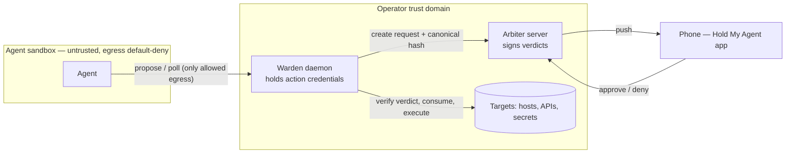

# Reference architecture: HMA for a sandboxed agent

The flagship topology: an untrusted agent in a sandbox whose egress
allowlist permits **only** the warden (and, for the cooperative tier, the
arbiter); the warden on a trusted host outside the sandbox holding all
action credentials; the arbiter reachable by your phone. Approval becomes a
property of the network, not of the agent's goodwill.



## Placement rules

1. **The agent's egress allowlist permits only the warden** (tier 2) — plus
   the arbiter, if you also want the cooperative `hma ask` path from inside
   the sandbox. Nothing else: no direct route to the targets the warden
   acts on.
2. **The warden runs outside the sandbox trust domain** — different host or
   at minimum a different user the agent cannot read or signal. Its
   `warden.toml`, secret refs, and SQLite must be unreadable by the agent.
3. **Never colocate the arbiter (or its `config.toml`) with the agent
   user.** The quickstart's one-machine demo is a demo: `config.toml` is
   mode 0600, but the same-user agent can read it, take both tokens, and
   approve its own requests. In this architecture that is a full bypass.
4. **The phone reaches the arbiter over your tailnet or LAN** — never expose
   the raw server to the internet (see `deploy-tailscale.md` /
   `deploy-nginx.md`).

## The nftables snippet

For a sandbox VM at `10.0.50.20`, warden at `10.0.10.5:8646`, arbiter at
`10.0.10.6:8000`:

```nft
# /etc/nftables.d/agent-egress.nft
table inet agent_egress {
  chain forward {
    type filter hook forward priority 0; policy drop;
    ct state established,related accept
    ip saddr 10.0.50.20 ip daddr 10.0.10.5 tcp dport 8646 accept \
      comment "agent -> warden: propose/poll"
    ip saddr 10.0.50.20 ip daddr 10.0.10.6 tcp dport 8000 accept \
      comment "agent -> arbiter: cooperative hma ask (optional — remove for warden-only)"
    ip saddr 10.0.50.20 udp dport 53 accept \
      comment "DNS — drop this too if you pin IPs in the agent's config"
  }
}
```

Port-level rules are the coarse outer layer; if your sandbox stack has an
L7 proxy (per-host/method allowlisting), express the same two destinations
there as well and keep both layers.

## What this buys you

With the rules above, a fully compromised agent can talk to exactly two
services, both of which treat it as untrusted. Every privileged action is:
proposed from a fixed registry -> approved by a human on a device the agent
cannot reach -> executed by a daemon whose credentials the agent has never
seen -> receipted. The failure modes that remain are the honest ones listed
in [`enforcement-models.md`](enforcement-models.md) (compromised trust-domain
hosts, over-broad registries, humans approving bad-but-accurate requests).

---

## Appendix A: mapping onto Knossos (OpenShell/NemoClaw sandbox)

A concrete instantiation for a Hermes agent in an OpenShell rootless-Podman
sandbox with a preset-based L7 egress proxy (the "Knossos" reference stack).
**This appendix is a design mapping — actually deploying it is a separate,
supervised run through the knossos staging-gate discipline (G1-G8 on an
ephemeral clone, then golden cutover), explicitly out of scope for the
release this doc ships in.**

### Egress preset (`hma.yaml`)

OpenShell presets pair endpoint rules with a **literal binary allowlist** —
a preset without the right binaries denies everything even when the host
rule is correct. Mirror the structure of the stack's existing
`policies/presets/honcho.yaml` exactly (binaries are a sibling of
endpoints):

```yaml
# nemoclaw-blueprint/policies/presets/hma.yaml
endpoints:
  - host: <warden-or-arbiter address — see "Reaching the arbiter" below>
    port: 8646
    rules:
      - methods: [GET, POST]
        path: "/**"
binaries:
  - /opt/hermes/.venv/bin/python    # the agent venv's python — required
  - /usr/local/bin/python3
  - /usr/bin/python3*               # glob — literal matching otherwise
enforcement: enforce
```

Two traps with live precedent:

- **The preset-list overwrite:** onboarding's balanced-presets step
  unconditionally rewrites egress policy and **drops any preset not named**
  in `NEMOCLAW_POLICY_PRESETS`. Append `hma` to that list in the onboard
  script (`scripts/phases/p2-onboard.sh`) or the integration silently loses
  egress on the next re-onboard.
- **Baked-at-onboard config:** the sandbox filesystem and config are locked
  at create time — "just add the endpoint live" fails silently. Preset
  changes require a full re-onboard through the recipe.

Bake the client side the same way the stack bakes other integrations: pip
install `hold-sdk` in the Hermes base image with a fail-loud build assert
(`RUN /venv/bin/python -c 'import hold_sdk'`), and pass the agent-facing
warden token via the platform's `config.extra` path — never a bare image
ENV (the secret boundary strips secret-shaped env vars).

### The warden as a linger-backed `--user` unit

On the sandbox VM, host-side services survive reboots only as
**linger-backed systemd `--user` units** (bare processes are reaped by
logind shortly after the session ends). Follow the stack's existing adapter
sidecar precedent: an `/opt/hold-warden` install owned by the service user,
a 0600 env file for `env:` secret refs, and:

```ini
# ~/.config/systemd/user/hold-warden.service   (then: loginctl enable-linger <user>)
[Unit]
Description=Hold My Agent warden
After=network-online.target

[Service]
ExecStart=/opt/hold-warden/.venv/bin/hma-warden serve --config /opt/hold-warden/warden.toml
Restart=on-failure

[Install]
WantedBy=default.target
```

The warden binds loopback/VM-internal; the sandbox reaches it through the
gateway path (`host.containers.internal`), exactly like the existing
adapter sidecar. Because the warden runs *outside* the sandbox it has the
VM's broad egress — which is the point: it holds the action credentials the
sandbox never sees.

### Reaching the arbiter

The agent-stack VLAN is walled off from the VLAN where the arbiter lives —
a preset pointing at the arbiter's LAN IP dead-ends. Two proven paths:

- **Tailnet-direct** (the BlueBubbles precedent): the arbiter host joins
  the tailnet; the preset/warden endpoint is its tailnet IP. Tailscale UDP
  is already allowed at the VM firewall; zero router changes.
- **Bridge-IP relay** (the ADR-0028 precedent): `systemd-socket-proxyd` on
  the KVM host listening on the libvirt bridge IP
  (`192.168.122.1:<port>`), forwarding over the tailnet to the arbiter.
  Bridge-IP traffic is host INPUT, so it needs one host-firewall allow from
  `192.168.122.0/24` and bypasses the guest-egress forward chain — also
  zero router changes.

Tailnet-direct is simpler; the relay keeps the arbiter host off the
tailnet. Either way the warden's `arbiter_url` and the `hma.yaml` endpoint
point at the chosen address.

### G8-HMA: the staging gate

Add one gate to the stack's staging suite (run on an ephemeral clone before
any golden cutover; live-credential legs re-verified at cutover):

**G8-HMA — real approval round-trip, enforced semantics:**

1. **Approve unblocks exactly once.** Agent proposes a registry action; a
   real phone approval executes it; the proposal reaches `executed` with a
   receipt whose verdict signature and action hash verify.
2. **Deny holds.** A denied proposal ends `denied` with zero side effects
   on the target.
3. **TTL-expiry holds.** An unanswered proposal past its TTL ends `expired`
   with zero side effects.
4. **Replay refused.** A second consume of the already-consumed approval is
   refused (409) and nothing executes twice.
5. **Tampered verdict refused.** A bit-flipped/re-signed verdict JWS fails
   verification; the proposal ends `failed` and never executes.

Pass all five on staging, then promote and re-verify on the golden VM.
