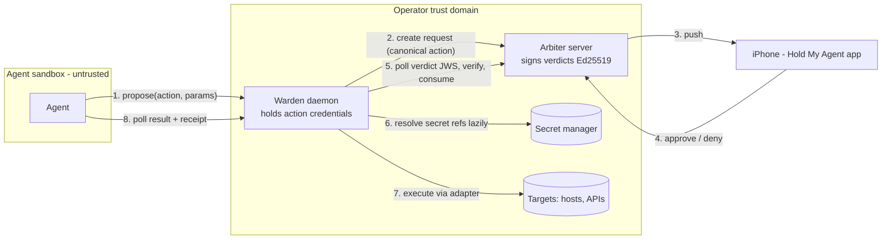

# Warden Verified Enforcement (0.4.0 train) Implementation Plan

> **For agentic workers:** REQUIRED SUB-SKILL: Use superpowers:subagent-driven-development (recommended) or superpowers:executing-plans to implement this plan task-by-task. Steps use checkbox (`- [ ]`) syntax for tracking.

**Goal:** Ship the Warden (hold-warden 0.1.0 — a small trusted daemon that executes registry actions only against signed, action-hash-bound, single-use approvals) plus the arbiter 0.4.0 trust upgrade (Ed25519 verdicts, per-identity tokens, consume semantics, policy layer, correctness fixes), the SDK 0.3.0 refresh, the E2E smokes, and the full docs set — as one reviewable PR.

**Architecture:** Third package `warden/` beside `server/` and `sdk/` in the monorepo. The warden holds action credentials outside the agent's trust domain, canonicalizes proposed actions, and executes only after verifying an Ed25519 verdict JWS from the arbiter that binds the human's decision to the exact action hash, then atomically consuming the approval (single-use). The arbiter gains the trust surface the warden verifies against, per-identity tokens with scoping, a create-time policy engine, and the audit/correctness fixes. Spec: `docs/specs/2026-07-06-warden-enforcement-design.md` (source of truth — do not re-scope).

**Tech Stack:** Python ≥3.11; warden: httpx, cryptography, pyjwt[crypto], uvicorn (hand-written ASGI, no framework), click, tomlkit; server: existing FastAPI/SQLite stack + pyjwt EdDSA; pytest everywhere; bash E2E smokes; GitHub Actions CI.

## Global Constraints

- Monorepo `<repo-root>` (path contains spaces — always quote). Work on branch `feat/warden-enforcement`, created from `design/warden-enforcement`. Never push to main. No tags, no PyPI/brew/ghcr publishing, no iOS changes, no live homelab changes.
- Versions: holdmyagent 0.4.0, hold-sdk 0.3.0, hold-warden 0.1.0. All /v1 API changes additive; iOS 0.5.0 and hold-sdk 0.2.1 keep working; the request `status` enum is UNCHANGED (pending|approved|denied|expired) — consumption is a `consumed_at` column, never a new status.
- Dev env (one-time, Task 1): `python3 -m venv .venv && .venv/bin/pip install -e ./server -e ./sdk -e ./warden pytest`. Test commands: `cd server && ../.venv/bin/python -m pytest`, `cd warden && ../.venv/bin/python -m pytest`, `cd sdk && ../.venv/bin/python -m pytest`.
- TDD per task: failing test → run → minimal implementation → run green → commit. Conventional commits ending with .
- The existing 122+ server tests and the sdk tests must be green after every task. `scripts/smoke.sh` must stay green.
- Secrets hygiene: resolved secret values never appear in logs, receipts, canonical documents, arbiter payloads, or doctor output (`ok (non-empty)` / `FAILED (exit N)` only).
- Severity rank order everywhere: low < medium < high < critical.
- Task 28 (notification outbox) is STRETCH: execute only if Tasks 1–27 and both smokes are green.

### Consciously accepted deviations (signed off — do not "fix")

- The verdict JWS carries `approval_ttl_seconds` (verifier computes staleness from `decided_at + ttl`) instead of a precomputed `expires` claim — equivalent, internally consistent.
- Policy auto-deny returns a create-time 403 without creating a denied request row; the `policy_denied` audit event (request_id `-`) preserves the record.
- `run_command`'s `extra_env` parameter is dormant in v0.1.0 (no config surface); docs state the PATH-only scrub.
- Warden→arbiter idempotency keys are sha256("{agent}:{key}") — always 64 hex chars.
- Consume 410 (stale approval) maps the warden proposal to `expired`; verdicts older than the approval TTL fail verification regardless of decision value (fail-closed).
- Verdict-signing payload, endpoint shapes, DDL, and all cross-task names follow the contracts embedded in each task's Interfaces block; when a task body and an Interfaces block disagree, the Interfaces block wins.

---

## Group A — Warden foundation (Tasks 1–4)

Repo root (all paths below are relative to it; it contains spaces — always quote):
`<repo-root>`

Dependency order inside this group: Task 1 first (creates the package and `config.py`);
Tasks 2 and 3 are independent of each other; Task 4 modifies the `config.py` created in Task 1.
Work happens on branch `feat/warden-enforcement`. The root `.gitignore` already ignores
`.venv/`, `__pycache__/`, `*.egg-info/` — no gitignore changes needed.

---

### Task 1: warden/ package scaffold + WardenConfig.load happy path

**Files:**
- Create: `warden/pyproject.toml`
- Create: `warden/README.md`
- Create: `warden/hold_warden/__init__.py`
- Create: `warden/hold_warden/config.py`
- Create: `warden/tests/__init__.py`
- Test: `warden/tests/test_config.py`

**Interfaces:**
- Consumes: nothing existing — this is a brand-new sibling package of `server/` and `sdk/`. Uses stdlib `tomllib` (Python ≥3.11) for reading; `tomlkit` is a declared dependency because later tasks (`hma-warden init`, Task 11) write TOML.
- Produces (consumed by Tasks 4, 9, 10, 11):
  - `class ConfigError(Exception)`
  - `@dataclass ParamSpec: type: str; values: list[str] | None; pattern: str | None; max_len: int | None; min: int | None; max: int | None`
  - `@dataclass ActionSpec: name: str; adapter: str; severity: str; ttl_seconds: int; description: str; argv: list[str] | None; url: str | None; method: str | None; body_template: str | None; headers: dict[str, str] | None; secret: str | None; params: dict[str, ParamSpec]`
  - `@dataclass WardenConfig: arbiter_url: str; arbiter_token_ref: str; arbiter_pubkey: str; warden_name: str; bind: str; port: int; retention_days: int; agents: dict[str, str]; actions: dict[str, ActionSpec]; secrets: dict[str, str]` with `@classmethod def load(cls, path: Path) -> "WardenConfig"` raising `ConfigError` with an actionable message.
  - Console script `hma-warden = "hold_warden.cli:main"` is declared in `pyproject.toml` now so the editable install never needs re-running; `hold_warden/cli.py` itself is created in Task 11 (Group C) — invoking `hma-warden` before then fails with `ModuleNotFoundError`, which is expected and fine.
  - TOML key mapping (pinned): `[warden] arbiter_token` → field `arbiter_token_ref`; `[warden] name` → field `warden_name`. Defaults: `bind` `"127.0.0.1"`, `port` `8646`, `retention_days` `7`, action `ttl_seconds` `300`, action `severity` `"medium"`.

**Steps:**

- [ ] **Step 1: Create the working branch**

```bash
cd "<repo-root>" && \
  git checkout feat/warden-enforcement 2>/dev/null || \
  git checkout -b feat/warden-enforcement design/warden-enforcement
```

  Expected: `Switched to a new branch 'feat/warden-enforcement'` (or a plain switch if another
  group already created it). Never work on `main`.

- [ ] **Step 2: Scaffold the package files**

  Create `warden/pyproject.toml`:

```toml
[project]
name = "hold-warden"
version = "0.1.0"
description = "Warden: verified enforcement daemon for Hold My Agent — executes only signed, single-use approvals"
readme = "README.md"
license = {text = "MIT"}
requires-python = ">=3.11"
dependencies = [
  "httpx>=0.27",
  "cryptography>=42",
  "pyjwt[crypto]>=2.9",
  "uvicorn>=0.32",
  "click>=8.1",
  "tomlkit>=0.12",
]

[project.optional-dependencies]
dev = ["pytest>=8.3", "ruff>=0.6"]

[project.scripts]
hma-warden = "hold_warden.cli:main"

[project.urls]
Homepage = "https://holdmyagent.com"
Repository = "https://github.com/holdmyagent/arbiter"

[tool.pytest.ini_options]
addopts = "-q"
testpaths = ["tests"]

[tool.ruff]
line-length = 110
target-version = "py311"

[build-system]
requires = ["setuptools>=68"]
build-backend = "setuptools.build_meta"

[tool.setuptools.packages.find]
where = ["."]
include = ["hold_warden*"]
```

  Create `warden/README.md`:

```markdown
# hold-warden

Warden — the enforcement daemon for [Hold My Agent](https://holdmyagent.com).

The agent proposes; the human rules on their phone; the warden verifies the
signed verdict against the exact action bytes and executes with credentials
the agent never sees. HMA is the gate; the warden decides whether the agent
walks through it or merely promises to.

See `docs/warden.md` in the repository root for the full guide.
```

  Create `warden/hold_warden/__init__.py`:

```python
"""hold-warden: verified enforcement daemon for Hold My Agent."""

__version__ = "0.1.0"
```

  Create `warden/tests/__init__.py` as an empty file:

```bash
touch "<repo-root>/warden/tests/__init__.py"
```

- [ ] **Step 3: Dev-install into the single root venv and verify the import**

  One venv at the repo root serves all three packages (create it only if missing — it
  usually already exists with server+sdk installed):

```bash
cd "<repo-root>" && \
  { [ -x .venv/bin/python ] || python3 -m venv .venv; } && \
  .venv/bin/pip install -e ./server -e ./sdk -e ./warden pytest
```

  Expected: ends with `Successfully installed hold-warden-0.1.0` (among others). Verify:

```bash
cd "<repo-root>" && \
  .venv/bin/python -c "import hold_warden; print(hold_warden.__version__)"
```

  Expected output: `0.1.0`

- [ ] **Step 4: Write the failing config test**

  Create `warden/tests/test_config.py` (the sample TOML is the spec §4.1 registry verbatim,
  plus the required `[warden] name` key):

```python
"""WardenConfig.load happy path + missing-file error."""
from pathlib import Path

import pytest

from hold_warden.config import ActionSpec, ConfigError, ParamSpec, WardenConfig

SAMPLE = '''
[warden]
name = "knossos-warden"
arbiter_url = "https://arbiter.tailnet.example:8000"
arbiter_token = "env:HMA_WARDEN_TOKEN"
arbiter_pubkey = "kid1:bm90LWEtcmVhbC1rZXk"
bind = "127.0.0.1"
port = 8646
retention_days = 7

[agents.hermes]
token = "env:WARDEN_AGENT_HERMES"

[actions.restart_service]
adapter = "command"
severity = "high"
ttl_seconds = 300
description = "Restart a systemd unit on hermes"
argv = ["ssh", "-o", "BatchMode=yes", "kclear@hermes", "sudo", "systemctl", "restart", "{unit}"]
  [actions.restart_service.params.unit]
  type = "enum"
  values = ["nginx", "caddy", "holdmyagent-server"]

[actions.post_status]
adapter = "http"
severity = "medium"
url = "https://api.example.com/v1/status"
method = "POST"
body_template = '{"text": "{text}"}'
headers = { Authorization = "secret:api_bearer" }
  [actions.post_status.params.text]
  type = "string"
  max_len = 500
  pattern = "^[^\\\\x00-\\\\x08\\\\x0b\\\\x0c\\\\x0e-\\\\x1f]*$"

[actions.release_deploy_key]
adapter = "secret"
severity = "critical"
secret = "secret:deploy_key"

[secrets]
api_bearer = "cmd:rbw get api-bearer"
deploy_key = "file:/etc/warden/deploy_key"
'''


@pytest.fixture
def cfg(tmp_path: Path) -> WardenConfig:
    path = tmp_path / "warden.toml"
    path.write_text(SAMPLE, encoding="utf-8")
    return WardenConfig.load(path)


def test_load_warden_table(cfg: WardenConfig) -> None:
    assert cfg.warden_name == "knossos-warden"
    assert cfg.arbiter_url == "https://arbiter.tailnet.example:8000"
    assert cfg.arbiter_token_ref == "env:HMA_WARDEN_TOKEN"
    assert cfg.arbiter_pubkey == "kid1:bm90LWEtcmVhbC1rZXk"
    assert cfg.bind == "127.0.0.1"
    assert cfg.port == 8646
    assert cfg.retention_days == 7


def test_load_agents_and_secrets(cfg: WardenConfig) -> None:
    assert cfg.agents == {"hermes": "env:WARDEN_AGENT_HERMES"}
    assert cfg.secrets == {"api_bearer": "cmd:rbw get api-bearer",
                           "deploy_key": "file:/etc/warden/deploy_key"}


def test_load_command_action(cfg: WardenConfig) -> None:
    spec = cfg.actions["restart_service"]
    assert isinstance(spec, ActionSpec)
    assert spec.adapter == "command"
    assert spec.severity == "high"
    assert spec.ttl_seconds == 300
    assert spec.description == "Restart a systemd unit on hermes"
    assert spec.argv == ["ssh", "-o", "BatchMode=yes", "kclear@hermes",
                         "sudo", "systemctl", "restart", "{unit}"]
    unit = spec.params["unit"]
    assert isinstance(unit, ParamSpec)
    assert unit.type == "enum"
    assert unit.values == ["nginx", "caddy", "holdmyagent-server"]


def test_load_http_action(cfg: WardenConfig) -> None:
    spec = cfg.actions["post_status"]
    assert spec.adapter == "http"
    assert spec.url == "https://api.example.com/v1/status"
    assert spec.method == "POST"
    assert spec.body_template == '{"text": "{text}"}'
    assert spec.headers == {"Authorization": "secret:api_bearer"}
    assert spec.ttl_seconds == 300  # default
    text = spec.params["text"]
    assert text.type == "string"
    assert text.max_len == 500
    assert text.pattern is not None


def test_load_secret_action(cfg: WardenConfig) -> None:
    spec = cfg.actions["release_deploy_key"]
    assert spec.adapter == "secret"
    assert spec.severity == "critical"
    assert spec.secret == "secret:deploy_key"
    assert spec.params == {}


def test_load_missing_file_raises_actionable_config_error(tmp_path: Path) -> None:
    with pytest.raises(ConfigError, match="hma-warden init"):
        WardenConfig.load(tmp_path / "nope.toml")
```

- [ ] **Step 5: Run it — expect a red import failure**

```bash
cd "<repo-root>/warden" && \
  ../.venv/bin/python -m pytest tests/test_config.py
```

  Expected failure: collection error `ModuleNotFoundError: No module named 'hold_warden.config'`.

- [ ] **Step 6: Implement `warden/hold_warden/config.py` (happy-path load)**

```python
"""Warden configuration: warden.toml -> WardenConfig.

Secrets appear in config only as references (env:/file:/cmd:/secret:) and are
never resolved here.
"""
from __future__ import annotations

import tomllib
from dataclasses import dataclass, field
from pathlib import Path

_ADAPTERS = ("command", "http", "secret")
_SEVERITIES = ("low", "medium", "high", "critical")
_PARAM_TYPES = ("enum", "string", "int")


class ConfigError(Exception):
    """warden.toml is missing, unparseable, or invalid. Message says how to fix it."""


@dataclass
class ParamSpec:
    type: str  # "enum" | "string" | "int"
    values: list[str] | None = None
    pattern: str | None = None
    max_len: int | None = None
    min: int | None = None
    max: int | None = None


@dataclass
class ActionSpec:
    name: str
    adapter: str
    severity: str
    ttl_seconds: int
    description: str
    argv: list[str] | None
    url: str | None
    method: str | None
    body_template: str | None
    headers: dict[str, str] | None
    secret: str | None
    params: dict[str, ParamSpec] = field(default_factory=dict)


@dataclass
class WardenConfig:
    arbiter_url: str
    arbiter_token_ref: str
    arbiter_pubkey: str  # pinned "kid:b64url"
    warden_name: str
    bind: str
    port: int
    retention_days: int
    agents: dict[str, str]  # agent name -> token secret ref
    actions: dict[str, ActionSpec]
    secrets: dict[str, str]  # secret name -> secret ref

    @classmethod
    def load(cls, path: Path) -> "WardenConfig":
        try:
            raw = path.read_bytes()
        except OSError as exc:
            raise ConfigError(
                f"cannot read config {path}: {exc.strerror} — "
                f"run 'hma-warden init' to create one") from exc
        try:
            doc = tomllib.loads(raw.decode("utf-8"))
        except (tomllib.TOMLDecodeError, UnicodeDecodeError) as exc:
            raise ConfigError(f"invalid TOML in {path}: {exc}") from exc

        warden = doc.get("warden")
        if not isinstance(warden, dict):
            raise ConfigError(f"{path}: missing [warden] table")
        for key in ("arbiter_url", "arbiter_token", "arbiter_pubkey", "name"):
            if not warden.get(key):
                raise ConfigError(f"{path}: [warden] requires {key} = \"...\"")

        agents: dict[str, str] = {}
        for agent_name, tbl in doc.get("agents", {}).items():
            token = tbl.get("token") if isinstance(tbl, dict) else None
            if not token:
                raise ConfigError(
                    f"{path}: [agents.{agent_name}] requires token = \"<secret ref>\"")
            agents[agent_name] = token

        secrets = dict(doc.get("secrets", {}))
        actions: dict[str, ActionSpec] = {}
        for action_name, tbl in doc.get("actions", {}).items():
            actions[action_name] = _parse_action(path, action_name, tbl)

        return cls(
            arbiter_url=warden["arbiter_url"],
            arbiter_token_ref=warden["arbiter_token"],
            arbiter_pubkey=warden["arbiter_pubkey"],
            warden_name=warden["name"],
            bind=warden.get("bind", "127.0.0.1"),
            port=int(warden.get("port", 8646)),
            retention_days=int(warden.get("retention_days", 7)),
            agents=agents,
            actions=actions,
            secrets=secrets,
        )


def _parse_action(path: Path, name: str, tbl: object) -> ActionSpec:
    if not isinstance(tbl, dict):
        raise ConfigError(f"{path}: [actions.{name}] must be a table")
    adapter = tbl.get("adapter")
    if adapter not in _ADAPTERS:
        raise ConfigError(
            f"{path}: [actions.{name}] adapter must be one of: {', '.join(_ADAPTERS)}")
    severity = tbl.get("severity", "medium")
    if severity not in _SEVERITIES:
        raise ConfigError(
            f"{path}: [actions.{name}] severity must be one of: {', '.join(_SEVERITIES)}")
    params: dict[str, ParamSpec] = {}
    for pname, ptbl in tbl.get("params", {}).items():
        if not isinstance(ptbl, dict) or ptbl.get("type") not in _PARAM_TYPES:
            raise ConfigError(
                f"{path}: [actions.{name}.params.{pname}] type must be one of: "
                f"{', '.join(_PARAM_TYPES)}")
        params[pname] = ParamSpec(
            type=ptbl["type"], values=ptbl.get("values"), pattern=ptbl.get("pattern"),
            max_len=ptbl.get("max_len"), min=ptbl.get("min"), max=ptbl.get("max"))
    return ActionSpec(
        name=name, adapter=adapter, severity=severity,
        ttl_seconds=int(tbl.get("ttl_seconds", 300)),
        description=tbl.get("description", ""),
        argv=tbl.get("argv"), url=tbl.get("url"), method=tbl.get("method"),
        body_template=tbl.get("body_template"), headers=tbl.get("headers"),
        secret=tbl.get("secret"), params=params)
```

- [ ] **Step 7: Run green**

```bash
cd "<repo-root>/warden" && \
  ../.venv/bin/python -m pytest tests/test_config.py
```

  Expected: `6 passed`.

- [ ] **Step 8: Lint and commit**

```bash
cd "<repo-root>/warden" && \
  ../.venv/bin/python -m ruff check hold_warden tests
```

  Expected: `All checks passed!` (if `ruff` is missing from the venv, `../.venv/bin/pip install ruff` first). Then:

```bash
cd "<repo-root>" && \
  git add warden && \
  git commit -m "feat(warden): scaffold hold-warden 0.1.0 package + WardenConfig.load"
```

---

### Task 2: canonical.py canonicalize() + golden vectors

**Files:**
- Create: `warden/hold_warden/canonical.py`
- Create: `warden/tests/vectors/command_simple.json`
- Create: `warden/tests/vectors/command_unicode.json`
- Create: `warden/tests/vectors/http_post.json`
- Create: `warden/tests/vectors/secret_release.json`
- Create: `warden/tests/vectors/empty_params.json`
- Create: `warden/tests/vectors/param_order.json`
- Create: `warden/tests/vectors/http_nested.json`
- Test: `warden/tests/test_canonical.py`

**Interfaces:**
- Consumes: nothing (stdlib `json` + `hashlib` only). Requires Task 1's package scaffold to exist.
- Produces (consumed by Orchestrator Task 9, `hma-warden hash` Task 11, smoke Task 24):

```python
def canonicalize(action: str, adapter: str, params: dict[str, str],
                 resolved: dict, warden: str) -> tuple[str, str]:
    """Returns (canonical_str, action_hash). canonical_str = json.dumps(
    {"action":..., "adapter":..., "params":..., "resolved":..., "v":1, "warden":...},
    sort_keys=True, separators=(",", ":"), ensure_ascii=False); hash = sha256(utf8).hexdigest()."""
```

  Pinned `resolved` shapes: command → `{"argv": [...]}`; http → `{"method": str, "url": str, "header_names": sorted([...]), "body_sha256": str|None}`; secret → `{"secret": "<name>"}`. `params` is ALWAYS present, even when `{}`.
- The vector files are the cross-component contract: the arbiter re-hashes the canonical bytes server-side (Task 19) and the smoke (Task 24) asserts end-to-end agreement. **Never regenerate a vector to make a failing test pass** — a mismatch means `canonicalize()` broke.

**Steps:**

- [ ] **Step 1: Write the seven golden vector files**

  All hashes below were computed with `hashlib.sha256(canonical.encode("utf-8")).hexdigest()`
  over exactly the `canonical` string shown; copy the files byte-for-byte (they are UTF-8).

  Create `warden/tests/vectors/command_simple.json`:

```json
{
  "name": "command adapter, simple enum param",
  "input": {
    "action": "restart_service",
    "adapter": "command",
    "params": {
      "unit": "nginx"
    },
    "resolved": {
      "argv": [
        "ssh",
        "-o",
        "BatchMode=yes",
        "kclear@hermes",
        "sudo",
        "systemctl",
        "restart",
        "nginx"
      ]
    },
    "warden": "knossos-warden"
  },
  "canonical": "{\"action\":\"restart_service\",\"adapter\":\"command\",\"params\":{\"unit\":\"nginx\"},\"resolved\":{\"argv\":[\"ssh\",\"-o\",\"BatchMode=yes\",\"kclear@hermes\",\"sudo\",\"systemctl\",\"restart\",\"nginx\"]},\"v\":1,\"warden\":\"knossos-warden\"}",
  "hash": "b0dff24fb7fe08b4deef360c86f29b861feb927d014407fcb4d8ff019880d467"
}
```

  Create `warden/tests/vectors/command_unicode.json`:

```json
{
  "name": "command adapter, unicode param value survives ensure_ascii=False",
  "input": {
    "action": "post_note",
    "adapter": "command",
    "params": {
      "text": "café ☕ déjà"
    },
    "resolved": {
      "argv": [
        "notify-send",
        "café ☕ déjà"
      ]
    },
    "warden": "knossos-warden"
  },
  "canonical": "{\"action\":\"post_note\",\"adapter\":\"command\",\"params\":{\"text\":\"café ☕ déjà\"},\"resolved\":{\"argv\":[\"notify-send\",\"café ☕ déjà\"]},\"v\":1,\"warden\":\"knossos-warden\"}",
  "hash": "8f5c7091072ac83c42dd411ace7fa427cb092488151b5ac9fd22bbe6b9e2289a"
}
```

  Create `warden/tests/vectors/http_post.json` (note: `resolved` keys land alphabetically in
  the canonical string because of `sort_keys=True` — `body_sha256` before `header_names`):

```json
{
  "name": "http adapter: body_sha256 + sorted header_names (names only, never values)",
  "note": "body_sha256 is sha256 of the UTF-8 bytes of the resolved body: {\"text\": \"deploy done\"}",
  "input": {
    "action": "post_status",
    "adapter": "http",
    "params": {
      "text": "deploy done"
    },
    "resolved": {
      "method": "POST",
      "url": "https://api.example.com/v1/status",
      "header_names": [
        "Authorization",
        "Content-Type"
      ],
      "body_sha256": "5a435dff38ad22b81a3bd3ab981090a2610df729be73f13c7bfd0d146283e5a6"
    },
    "warden": "knossos-warden"
  },
  "canonical": "{\"action\":\"post_status\",\"adapter\":\"http\",\"params\":{\"text\":\"deploy done\"},\"resolved\":{\"body_sha256\":\"5a435dff38ad22b81a3bd3ab981090a2610df729be73f13c7bfd0d146283e5a6\",\"header_names\":[\"Authorization\",\"Content-Type\"],\"method\":\"POST\",\"url\":\"https://api.example.com/v1/status\"},\"v\":1,\"warden\":\"knossos-warden\"}",
  "hash": "853953fea43efe00b75bfbe66f5ca87745de2cf6af751ead3cd1e8d3226410c2"
}
```

  Create `warden/tests/vectors/secret_release.json`:

```json
{
  "name": "secret adapter: resolved carries the secret NAME only, never the value",
  "input": {
    "action": "release_deploy_key",
    "adapter": "secret",
    "params": {},
    "resolved": {
      "secret": "deploy_key"
    },
    "warden": "knossos-warden"
  },
  "canonical": "{\"action\":\"release_deploy_key\",\"adapter\":\"secret\",\"params\":{},\"resolved\":{\"secret\":\"deploy_key\"},\"v\":1,\"warden\":\"knossos-warden\"}",
  "hash": "958a05997a7115662b4c14dea8fd3dd020defa6b98e07399d6e27dee190e8e65"
}
```

  Create `warden/tests/vectors/empty_params.json`:

```json
{
  "name": "empty params: {} must serialize as \"params\":{} — never key-dropped",
  "input": {
    "action": "rotate_logs",
    "adapter": "command",
    "params": {},
    "resolved": {
      "argv": [
        "logrotate",
        "--force",
        "/etc/logrotate.conf"
      ]
    },
    "warden": "knossos-warden"
  },
  "canonical": "{\"action\":\"rotate_logs\",\"adapter\":\"command\",\"params\":{},\"resolved\":{\"argv\":[\"logrotate\",\"--force\",\"/etc/logrotate.conf\"]},\"v\":1,\"warden\":\"knossos-warden\"}",
  "hash": "278fa00380c25be8955fd7d13e614f8e5e220e5f3cb50ae353f7b2d2f07899af"
}
```

  Create `warden/tests/vectors/param_order.json` (the two inputs differ ONLY in the textual
  key order of `params` — `json.loads` preserves that order in the dict, so this pins
  ordering invariance):

```json
{
  "name": "param-ordering invariance: same params in different key order canonicalize identically",
  "input": {
    "action": "restart_service",
    "adapter": "command",
    "params": {
      "reason": "high cpu",
      "unit": "nginx"
    },
    "resolved": {
      "argv": [
        "systemctl",
        "restart",
        "nginx"
      ]
    },
    "warden": "knossos-warden"
  },
  "input_reordered": {
    "action": "restart_service",
    "adapter": "command",
    "params": {
      "unit": "nginx",
      "reason": "high cpu"
    },
    "resolved": {
      "argv": [
        "systemctl",
        "restart",
        "nginx"
      ]
    },
    "warden": "knossos-warden"
  },
  "canonical": "{\"action\":\"restart_service\",\"adapter\":\"command\",\"params\":{\"reason\":\"high cpu\",\"unit\":\"nginx\"},\"resolved\":{\"argv\":[\"systemctl\",\"restart\",\"nginx\"]},\"v\":1,\"warden\":\"knossos-warden\"}",
  "hash": "df558c5c7dd39ad680bcb877cef17676921d526bf9026939a774a61244cd1931"
}
```

  Create `warden/tests/vectors/http_nested.json` (http adapter with a NESTED-JSON
  `body_template` — `{"report": {"text": "{text}", "tags": ["auto", "warden"]}, "dry_run": false}`
  with param `text="disk almost full"`; `body_sha256` is the sha256 of the final substituted
  body string, exactly as `resolve_template` computes it):

```json
{
  "name": "http adapter, nested-JSON body_template: hash binds the fully substituted nested body",
  "note": "body_sha256 is sha256 of the UTF-8 bytes of the resolved body: {\"report\": {\"text\": \"disk almost full\", \"tags\": [\"auto\", \"warden\"]}, \"dry_run\": false}",
  "input": {
    "action": "file_report",
    "adapter": "http",
    "params": {
      "text": "disk almost full"
    },
    "resolved": {
      "method": "POST",
      "url": "https://api.example.com/v1/reports",
      "header_names": [
        "Authorization",
        "Content-Type"
      ],
      "body_sha256": "3f0428d8154db426d9471405a06e4f263f05ee5a9cb1a1a77ef7ceccd4dfa325"
    },
    "warden": "knossos-warden"
  },
  "canonical": "{\"action\":\"file_report\",\"adapter\":\"http\",\"params\":{\"text\":\"disk almost full\"},\"resolved\":{\"body_sha256\":\"3f0428d8154db426d9471405a06e4f263f05ee5a9cb1a1a77ef7ceccd4dfa325\",\"header_names\":[\"Authorization\",\"Content-Type\"],\"method\":\"POST\",\"url\":\"https://api.example.com/v1/reports\"},\"v\":1,\"warden\":\"knossos-warden\"}",
  "hash": "3fd57fa4160a21f87b3e7aef227f77ca5e9e7201548875b3398f628d56a7204e"
}
```

- [ ] **Step 2: Write the failing golden-vector test**

  Create `warden/tests/test_canonical.py`:

```python
"""Golden-vector tests for canonicalize(). The vectors pin the exact bytes the
arbiter stores and the human approval is bound to — never regenerate them to
make a failing test pass; a mismatch means canonicalize() broke."""
import json
from pathlib import Path

import pytest

from hold_warden.canonical import canonicalize

VECTOR_DIR = Path(__file__).parent / "vectors"
VECTOR_FILES = sorted(VECTOR_DIR.glob("*.json"))


def _load(path: Path) -> dict:
    return json.loads(path.read_text(encoding="utf-8"))


def _run(inp: dict) -> tuple[str, str]:
    return canonicalize(inp["action"], inp["adapter"], inp["params"],
                        inp["resolved"], inp["warden"])


def test_vector_set_is_complete() -> None:
    assert {p.stem for p in VECTOR_FILES} >= {
        "command_simple", "command_unicode", "http_post", "http_nested",
        "secret_release", "empty_params", "param_order"}


@pytest.mark.parametrize("path", VECTOR_FILES, ids=lambda p: p.stem)
def test_golden_vector(path: Path) -> None:
    vec = _load(path)
    canonical, action_hash = _run(vec["input"])
    assert canonical == vec["canonical"]
    assert action_hash == vec["hash"]
    assert len(action_hash) == 64


def test_empty_params_never_key_dropped() -> None:
    vec = _load(VECTOR_DIR / "empty_params.json")
    canonical, _ = _run(vec["input"])
    assert '"params":{}' in canonical


def test_param_ordering_invariance() -> None:
    vec = _load(VECTOR_DIR / "param_order.json")
    # json.loads preserves the file's key order in dicts, so the two inputs
    # really do carry different insertion orders into canonicalize().
    assert list(vec["input"]["params"]) != list(vec["input_reordered"]["params"])
    assert _run(vec["input"]) == _run(vec["input_reordered"]) == (vec["canonical"], vec["hash"])


def test_unicode_is_not_ascii_escaped() -> None:
    vec = _load(VECTOR_DIR / "command_unicode.json")
    canonical, _ = _run(vec["input"])
    assert "café ☕ déjà" in canonical
    assert "\\u" not in canonical
```

- [ ] **Step 3: Run it — expect a red import failure**

```bash
cd "<repo-root>/warden" && \
  ../.venv/bin/python -m pytest tests/test_canonical.py
```

  Expected failure: collection error `ModuleNotFoundError: No module named 'hold_warden.canonical'`.

- [ ] **Step 4: Implement `warden/hold_warden/canonical.py`**

```python
"""Canonical action documents — the exact bytes a human approval is bound to.

Only the warden canonicalizes; the arbiter treats the canonical document as
opaque bytes and re-hashes them server-side. Any byte difference here breaks
the trust chain, so this module is golden-vectored (tests/vectors/*.json).
"""
from __future__ import annotations

import hashlib
import json


def canonicalize(action: str, adapter: str, params: dict[str, str],
                 resolved: dict, warden: str) -> tuple[str, str]:
    """Return (canonical_str, action_hash).

    canonical_str is json.dumps of {"action", "adapter", "params", "resolved",
    "v": 1, "warden"} with sort_keys=True, separators=(",", ":"),
    ensure_ascii=False. action_hash is sha256 of the UTF-8 bytes, hexdigest.
    `params` is ALWAYS present in the document, even when {}.
    """
    doc = {
        "action": action,
        "adapter": adapter,
        "params": params,
        "resolved": resolved,
        "v": 1,
        "warden": warden,
    }
    canonical = json.dumps(doc, sort_keys=True, separators=(",", ":"), ensure_ascii=False)
    action_hash = hashlib.sha256(canonical.encode("utf-8")).hexdigest()
    return canonical, action_hash
```

- [ ] **Step 5: Run green**

```bash
cd "<repo-root>/warden" && \
  ../.venv/bin/python -m pytest tests/test_canonical.py
```

  Expected: `11 passed` (1 completeness + 7 parametrized vectors + 3 property tests).

- [ ] **Step 6: Lint and commit**

```bash
cd "<repo-root>/warden" && \
  ../.venv/bin/python -m ruff check hold_warden tests
```

  Expected: `All checks passed!` Then:

```bash
cd "<repo-root>" && \
  git add warden && \
  git commit -m "feat(warden): canonicalize() with golden vectors"
```

---

### Task 3: secrets.py resolve() + doctor_check() + fake secret-manager CLIs

**Files:**
- Create: `warden/hold_warden/secrets.py`
- Create: `warden/tests/fakes/rbw` (executable shell script)
- Create: `warden/tests/fakes/bw` (executable shell script)
- Create: `warden/tests/fakes/op` (executable shell script)
- Create: `warden/tests/fakes/pass` (executable shell script)
- Create: `warden/tests/fakes/vault` (executable shell script)
- Test: `warden/tests/test_secrets.py`

**Interfaces:**
- Consumes: stdlib only (`os`, `shlex`, `stat`, `subprocess`, `logging`, `pathlib`). Requires Task 1's package scaffold.
- Produces (consumed by Orchestrator Task 9, `hma-warden doctor` Task 11, docs Task 12):

```python
class SecretResolutionError(Exception): ...   # carries .reason: short value-free code
def resolve(ref: str, timeout_s: int = 10) -> str        # schemes env: file: cmd:
class DoctorResult(NamedTuple): ref_scheme: str; ok: bool; detail: str
def doctor_check(ref: str) -> DoctorResult
```

- Hard rules (tested): resolved values NEVER appear in log lines, exception messages, or `DoctorResult.detail`. `detail` is exactly `"ok (non-empty)"` on success or `"FAILED (<reason>)"` on failure — e.g. `"FAILED (exit 1)"`, `"FAILED (empty output)"`, `"FAILED (timeout)"`, `"FAILED (unset or empty)"`. `file:` refs warn (never fail) when the file is group/world-readable (not 0600). `cmd:` refs run with `shell=False` via `shlex.split`, honor `timeout_s`, and treat non-zero exit or empty stdout as failure. Resolution is lazy — callers resolve at execution time, so a locked vault fails one action closed instead of crashing the daemon.
- The five fake CLIs mimic the documented recipes (`rbw get`, `bw get password` + `BW_SESSION`, `op read op://…`, `pass show`, `vault kv get -field=…`) and are PATH-prepended in tests so no real secret manager is ever touched; Task 11's doctor tests and Task 12's docs reuse them.

**Steps:**

- [ ] **Step 1: Write the five fake secret-manager CLIs and mark them executable**

  Create `warden/tests/fakes/rbw`:

```sh
#!/bin/sh
# Fake rbw (unofficial Bitwarden/Vaultwarden CLI) for tests: `rbw get NAME`.
if [ "$1" != "get" ] || [ -z "$2" ]; then
  echo "fake-rbw: usage: rbw get NAME" >&2
  exit 2
fi
case "$2" in
  api-bearer) echo "fake-rbw-secret-api-bearer" ;;
  *) echo "fake-rbw: no such entry: $2" >&2; exit 1 ;;
esac
```

  Create `warden/tests/fakes/bw`:

```sh
#!/bin/sh
# Fake bw (official Bitwarden CLI) for tests: `bw get password NAME`; needs BW_SESSION.
if [ -z "$BW_SESSION" ]; then
  echo "fake-bw: You are not logged in." >&2
  exit 1
fi
if [ "$1" != "get" ] || [ "$2" != "password" ] || [ -z "$3" ]; then
  echo "fake-bw: usage: bw get password NAME" >&2
  exit 2
fi
case "$3" in
  api-bearer) echo "fake-bw-secret-api-bearer" ;;
  *) echo "fake-bw: Not found." >&2; exit 1 ;;
esac
```

  Create `warden/tests/fakes/op`:

```sh
#!/bin/sh
# Fake 1Password CLI for tests: `op read op://vault/item/field`.
if [ "$1" != "read" ] || [ -z "$2" ]; then
  echo "fake-op: usage: op read op://vault/item/field" >&2
  exit 2
fi
case "$2" in
  op://homelab/api-bearer/credential) echo "fake-op-secret-api-bearer" ;;
  *) echo "fake-op: item not found: $2" >&2; exit 1 ;;
esac
```

  Create `warden/tests/fakes/pass`:

```sh
#!/bin/sh
# Fake pass (password-store) for tests: `pass show NAME`.
if [ "$1" != "show" ] || [ -z "$2" ]; then
  echo "fake-pass: usage: pass show NAME" >&2
  exit 2
fi
case "$2" in
  homelab/api-bearer) echo "fake-pass-secret-api-bearer" ;;
  *) echo "fake-pass: $2 is not in the password store." >&2; exit 1 ;;
esac
```

  Create `warden/tests/fakes/vault`:

```sh
#!/bin/sh
# Fake HashiCorp Vault CLI for tests: `vault kv get -field=token secret/PATH`.
if [ "$1" != "kv" ] || [ "$2" != "get" ] || [ "$3" != "-field=token" ] || [ -z "$4" ]; then
  echo "fake-vault: usage: vault kv get -field=token secret/PATH" >&2
  exit 2
fi
case "$4" in
  secret/api-bearer) echo "fake-vault-secret-api-bearer" ;;
  *) echo "fake-vault: no value found at $4" >&2; exit 1 ;;
esac
```

  Make them executable (git preserves the exec bit):

```bash
chmod +x "<repo-root>/warden/tests/fakes/"*
```

- [ ] **Step 2: Write the failing secrets test**

  Create `warden/tests/test_secrets.py`:

```python
"""Secret resolver tests. cmd: recipes run against the fake CLIs in tests/fakes/
(PATH-prepended) so no real secret manager is ever touched. Doctor output must
never contain a resolved value."""
import os
import subprocess
from pathlib import Path

import pytest

from hold_warden.secrets import DoctorResult, SecretResolutionError, doctor_check, resolve

FAKES = Path(__file__).parent / "fakes"


@pytest.fixture
def fake_clis(monkeypatch: pytest.MonkeyPatch) -> None:
    monkeypatch.setenv("PATH", f"{FAKES}:{os.environ['PATH']}")


# --- env: ---

def test_env_resolves(monkeypatch: pytest.MonkeyPatch) -> None:
    monkeypatch.setenv("WARDEN_TEST_SECRET", "s3cret-value")
    assert resolve("env:WARDEN_TEST_SECRET") == "s3cret-value"


def test_env_unset_fails_closed(monkeypatch: pytest.MonkeyPatch) -> None:
    monkeypatch.delenv("WARDEN_TEST_SECRET", raising=False)
    with pytest.raises(SecretResolutionError):
        resolve("env:WARDEN_TEST_SECRET")


# --- file: ---

def test_file_resolves_and_strips(tmp_path: Path) -> None:
    secret_file = tmp_path / "deploy_key"
    secret_file.write_text("s3cret-value\n", encoding="utf-8")
    secret_file.chmod(0o600)
    assert resolve(f"file:{secret_file}") == "s3cret-value"


def test_file_loose_mode_warns_but_resolves(
        tmp_path: Path, caplog: pytest.LogCaptureFixture) -> None:
    secret_file = tmp_path / "deploy_key"
    secret_file.write_text("s3cret-value\n", encoding="utf-8")
    secret_file.chmod(0o644)
    with caplog.at_level("WARNING", logger="hold_warden.secrets"):
        assert resolve(f"file:{secret_file}") == "s3cret-value"
    assert any("0600" in rec.getMessage() for rec in caplog.records)
    assert all("s3cret-value" not in rec.getMessage() for rec in caplog.records)


def test_file_missing_fails_closed(tmp_path: Path) -> None:
    with pytest.raises(SecretResolutionError):
        resolve(f"file:{tmp_path / 'nope'}")


# --- cmd: against the fake CLIs ---

@pytest.mark.parametrize("ref,expected", [
    ("cmd:rbw get api-bearer", "fake-rbw-secret-api-bearer"),
    ("cmd:op read op://homelab/api-bearer/credential", "fake-op-secret-api-bearer"),
    ("cmd:pass show homelab/api-bearer", "fake-pass-secret-api-bearer"),
    ("cmd:vault kv get -field=token secret/api-bearer", "fake-vault-secret-api-bearer"),
])
def test_cmd_recipes_resolve(fake_clis: None, ref: str, expected: str) -> None:
    assert resolve(ref) == expected


def test_cmd_bw_requires_session(fake_clis: None, monkeypatch: pytest.MonkeyPatch) -> None:
    monkeypatch.delenv("BW_SESSION", raising=False)
    with pytest.raises(SecretResolutionError) as excinfo:
        resolve("cmd:bw get password api-bearer")
    assert excinfo.value.reason == "exit 1"
    monkeypatch.setenv("BW_SESSION", "fake-session")
    assert resolve("cmd:bw get password api-bearer") == "fake-bw-secret-api-bearer"


def test_cmd_nonzero_exit_fails_closed(fake_clis: None) -> None:
    with pytest.raises(SecretResolutionError) as excinfo:
        resolve("cmd:rbw get unknown-entry")
    assert excinfo.value.reason == "exit 1"


def test_cmd_timeout_fails_closed(monkeypatch: pytest.MonkeyPatch) -> None:
    def fake_run(*args: object, **kwargs: object) -> None:
        raise subprocess.TimeoutExpired(cmd="sleepy", timeout=10)
    monkeypatch.setattr(subprocess, "run", fake_run)
    with pytest.raises(SecretResolutionError) as excinfo:
        resolve("cmd:sleepy forever")
    assert excinfo.value.reason == "timeout"


def test_unknown_scheme_fails_closed() -> None:
    with pytest.raises(SecretResolutionError) as excinfo:
        resolve("vault:not-a-scheme")
    assert excinfo.value.reason == "unknown scheme"


# --- doctor_check: never a value, only ok (non-empty) / FAILED (<reason>) ---

def test_doctor_ok_never_contains_value(monkeypatch: pytest.MonkeyPatch) -> None:
    monkeypatch.setenv("WARDEN_TEST_SECRET", "s3cret-value")
    result = doctor_check("env:WARDEN_TEST_SECRET")
    assert result == DoctorResult(ref_scheme="env", ok=True, detail="ok (non-empty)")
    assert "s3cret-value" not in result.detail


def test_doctor_cmd_failure_reports_exit_code(fake_clis: None) -> None:
    result = doctor_check("cmd:rbw get unknown-entry")
    assert result.ref_scheme == "cmd"
    assert result.ok is False
    assert result.detail == "FAILED (exit 1)"


def test_doctor_empty_output_reports_empty(tmp_path: Path) -> None:
    empty = tmp_path / "empty_secret"
    empty.write_text("\n", encoding="utf-8")
    empty.chmod(0o600)
    result = doctor_check(f"file:{empty}")
    assert result == DoctorResult(ref_scheme="file", ok=False, detail="FAILED (empty output)")
```

  Note: the timeout test monkeypatches `subprocess.run` to raise `TimeoutExpired` instead of
  running a slow child — no test sleeps.

- [ ] **Step 3: Run it — expect a red import failure**

```bash
cd "<repo-root>/warden" && \
  ../.venv/bin/python -m pytest tests/test_secrets.py
```

  Expected failure: collection error `ModuleNotFoundError: No module named 'hold_warden.secrets'`.

- [ ] **Step 4: Implement `warden/hold_warden/secrets.py`**

```python
"""Secret reference resolvers: env:VAR, file:/path, cmd:<argv string>.

Resolution is lazy (at execution time). Resolved values NEVER appear in logs,
exception messages, DoctorResult.detail, canonical documents, or arbiter
payloads. Exception messages carry a short value-free `reason` code so
`hma-warden doctor` can report failures without leaking anything.
"""
from __future__ import annotations

import logging
import os
import shlex
import stat
import subprocess
from pathlib import Path
from typing import NamedTuple

log = logging.getLogger("hold_warden.secrets")


class SecretResolutionError(Exception):
    """A secret reference could not be resolved. `reason` is short and value-free."""

    def __init__(self, message: str, reason: str = "error"):
        super().__init__(message)
        self.reason = reason


class DoctorResult(NamedTuple):
    ref_scheme: str
    ok: bool
    detail: str  # only "ok (non-empty)" or "FAILED (<reason>)" — NEVER a value


def resolve(ref: str, timeout_s: int = 10) -> str:
    """Resolve a secret reference to its value. Raises SecretResolutionError."""
    if ref.startswith("env:"):
        return _resolve_env(ref[4:])
    if ref.startswith("file:"):
        return _resolve_file(ref[5:])
    if ref.startswith("cmd:"):
        return _resolve_cmd(ref[4:], timeout_s)
    raise SecretResolutionError(
        "secret ref must start with env:, file:, or cmd:", reason="unknown scheme")


def doctor_check(ref: str) -> DoctorResult:
    """Dry-run one resolver. detail never contains the resolved value."""
    scheme = ref.split(":", 1)[0] if ":" in ref else "?"
    try:
        resolve(ref)
    except SecretResolutionError as exc:
        return DoctorResult(ref_scheme=scheme, ok=False, detail=f"FAILED ({exc.reason})")
    return DoctorResult(ref_scheme=scheme, ok=True, detail="ok (non-empty)")


def _resolve_env(var: str) -> str:
    value = os.environ.get(var, "")
    if not value:
        raise SecretResolutionError(f"env var {var} is unset or empty", reason="unset or empty")
    return value


def _resolve_file(path_str: str) -> str:
    path = Path(path_str)
    try:
        mode = stat.S_IMODE(path.stat().st_mode)
        value = path.read_text(encoding="utf-8").strip()
    except OSError as exc:
        raise SecretResolutionError(
            f"cannot read secret file {path}: {exc.strerror}", reason="unreadable") from exc
    if mode & 0o077:
        log.warning("secret file %s has mode %s; expected 0600 (run: chmod 600 %s)",
                    path, oct(mode), path)
    if not value:
        raise SecretResolutionError(f"secret file {path} is empty", reason="empty output")
    return value


def _resolve_cmd(cmdline: str, timeout_s: int) -> str:
    argv = shlex.split(cmdline)
    if not argv:
        raise SecretResolutionError("cmd: ref has an empty command", reason="empty command")
    try:
        proc = subprocess.run(argv, capture_output=True, text=True, timeout=timeout_s)
    except subprocess.TimeoutExpired as exc:
        raise SecretResolutionError(
            f"cmd {argv[0]} timed out after {timeout_s}s", reason="timeout") from exc
    except OSError as exc:
        raise SecretResolutionError(
            f"cmd {argv[0]} could not run: {exc.strerror}", reason="not runnable") from exc
    if proc.returncode != 0:
        # stderr is deliberately NOT included: vault CLIs may echo sensitive context.
        raise SecretResolutionError(
            f"cmd {argv[0]} exited {proc.returncode}", reason=f"exit {proc.returncode}")
    value = proc.stdout.strip()
    if not value:
        raise SecretResolutionError(
            f"cmd {argv[0]} produced empty output", reason="empty output")
    return value
```

- [ ] **Step 5: Run green**

```bash
cd "<repo-root>/warden" && \
  ../.venv/bin/python -m pytest tests/test_secrets.py
```

  Expected: `16 passed`.

- [ ] **Step 6: Lint and commit (verify the exec bits made it into the index)**

```bash
cd "<repo-root>/warden" && \
  ../.venv/bin/python -m ruff check hold_warden tests
```

  Expected: `All checks passed!` Then:

```bash
cd "<repo-root>" && \
  git add warden && \
  git ls-files --stage warden/tests/fakes/
```

  Expected: all five fakes listed with mode `100755` (if any show `100644`, re-run the
  `chmod +x` from Step 1 and `git add warden` again). Then:

```bash
cd "<repo-root>" && \
  git commit -m "feat(warden): secret resolvers env:/file:/cmd: + doctor_check"
```

---

### Task 4: ParamSpec/ActionSpec validate_params + resolve_template + load-time template rules

**Files:**
- Modify: `warden/hold_warden/config.py` (created in Task 1, 133 lines; this task replaces the whole file with the extended version below — the Task 1 dataclasses and `load()` flow are preserved verbatim, with additions marked)
- Test: `warden/tests/test_params.py`

**Interfaces:**
- Consumes: `ConfigError`, `ParamSpec`, `ActionSpec`, `WardenConfig` from Task 1; `hashlib` for body hashing (same hashing as Task 2's http vector).
- Produces (consumed by Orchestrator Task 9, ASGI api Task 10, cli Task 11):
  - `class ParamValidationError(Exception)` in `hold_warden.config`
  - `ActionSpec.validate_params(self, params: dict[str, str]) -> None` — raises `ParamValidationError` on unknown/missing params, enum violation, string `pattern`/`max_len` violation, or int out of `min`/`max` range.
  - `ActionSpec.resolve_template(self, params: dict[str, str]) -> dict` — returns the pinned canonical `resolved` shape with NO secret values: command → `{"argv": [...]}` (each `{param}` placeholder replaced only when it is an ENTIRE argv element); http → `{"method", "url", "header_names", "body_sha256"}` where `url`/`body_template` get `{param}` substitution, `header_names` is `sorted(headers.keys())` (names only — header values may be `secret:` refs and stay untouched references in `ActionSpec.headers`), and `body_sha256` is `sha256(utf8(resolved_body)).hexdigest()` or `None` when there is no `body_template`; secret → `{"secret": "<name>"}` (the name after the `secret:` prefix — a reference, never the value).
  - `WardenConfig.load` now REJECTS at load time (all `ConfigError`): argv elements that embed interpolation inside a larger string (`"--flag={x}"` style — each `{param}` must occupy an entire argv element); placeholders referencing undeclared params in argv/url/body_template; `command` actions without `argv`; `http` actions without `url`+`method`; http header `secret:` refs naming secrets absent from `[secrets]`; `secret` actions whose `secret` is missing the `secret:` prefix or names an undeclared secret.

**Steps:**

- [ ] **Step 1: Write the failing param/template tests**

  Create `warden/tests/test_params.py`:

```python
"""validate_params + resolve_template + load-time template rules."""
import hashlib
import json
from pathlib import Path

import pytest

from hold_warden.config import (
    ActionSpec,
    ConfigError,
    ParamSpec,
    ParamValidationError,
    WardenConfig,
)


def command_spec() -> ActionSpec:
    return ActionSpec(
        name="restart_service", adapter="command", severity="high", ttl_seconds=300,
        description="", argv=["systemctl", "restart", "{unit}"], url=None, method=None,
        body_template=None, headers=None, secret=None,
        params={"unit": ParamSpec(type="enum", values=["nginx", "caddy"])})


def http_spec() -> ActionSpec:
    return ActionSpec(
        name="post_status", adapter="http", severity="medium", ttl_seconds=300,
        description="", argv=None, url="https://api.example.com/v1/status",
        method="POST", body_template='{"text": "{text}"}',
        headers={"Authorization": "secret:api_bearer", "Content-Type": "application/json"},
        secret=None,
        params={"text": ParamSpec(type="string", max_len=500,
                                  pattern="^[^\\x00-\\x08\\x0b\\x0c\\x0e-\\x1f]*$")})


def secret_spec() -> ActionSpec:
    return ActionSpec(
        name="release_deploy_key", adapter="secret", severity="critical", ttl_seconds=300,
        description="", argv=None, url=None, method=None, body_template=None,
        headers=None, secret="secret:deploy_key", params={})


def int_spec() -> ActionSpec:
    return ActionSpec(
        name="scale_workers", adapter="command", severity="medium", ttl_seconds=300,
        description="", argv=["scale-tool", "{count}"], url=None, method=None,
        body_template=None, headers=None, secret=None,
        params={"count": ParamSpec(type="int", min=1, max=10)})


# --- validate_params ---

def test_enum_accepts_listed_value() -> None:
    command_spec().validate_params({"unit": "nginx"})  # no raise


def test_enum_rejects_unlisted_value() -> None:
    with pytest.raises(ParamValidationError, match="unit"):
        command_spec().validate_params({"unit": "rm -rf /"})


def test_unknown_param_rejected() -> None:
    with pytest.raises(ParamValidationError, match="unknown"):
        command_spec().validate_params({"unit": "nginx", "extra": "x"})


def test_missing_param_rejected() -> None:
    with pytest.raises(ParamValidationError, match="missing"):
        command_spec().validate_params({})


def test_string_max_len_enforced() -> None:
    with pytest.raises(ParamValidationError, match="max_len"):
        http_spec().validate_params({"text": "x" * 501})


def test_string_pattern_rejects_control_chars() -> None:
    with pytest.raises(ParamValidationError, match="pattern"):
        http_spec().validate_params({"text": "evil\x00payload"})


def test_string_pattern_accepts_clean_text() -> None:
    http_spec().validate_params({"text": "deploy done"})  # no raise


def test_int_range_enforced() -> None:
    spec = int_spec()
    spec.validate_params({"count": "5"})  # no raise
    with pytest.raises(ParamValidationError, match=">= 1"):
        spec.validate_params({"count": "0"})
    with pytest.raises(ParamValidationError, match="<= 10"):
        spec.validate_params({"count": "11"})
    with pytest.raises(ParamValidationError, match="integer"):
        spec.validate_params({"count": "ten"})


# --- resolve_template ---

def test_command_whole_element_substitution() -> None:
    resolved = command_spec().resolve_template({"unit": "nginx"})
    assert resolved == {"argv": ["systemctl", "restart", "nginx"]}


def test_http_resolved_shape_and_body_sha256() -> None:
    resolved = http_spec().resolve_template({"text": "deploy done"})
    expected_body = '{"text": "deploy done"}'
    assert resolved == {
        "method": "POST",
        "url": "https://api.example.com/v1/status",
        "header_names": ["Authorization", "Content-Type"],
        "body_sha256": hashlib.sha256(expected_body.encode("utf-8")).hexdigest(),
    }
    # cross-check against the http_post golden vector's pinned body hash
    assert resolved["body_sha256"] == (
        "5a435dff38ad22b81a3bd3ab981090a2610df729be73f13c7bfd0d146283e5a6")


def test_http_url_templating() -> None:
    spec = http_spec()
    spec.url = "https://api.example.com/v1/status/{channel}"
    spec.params["channel"] = ParamSpec(type="enum", values=["ops", "dev"])
    resolved = spec.resolve_template({"text": "deploy done", "channel": "ops"})
    assert resolved["url"] == "https://api.example.com/v1/status/ops"


def test_http_header_secret_refs_stay_references() -> None:
    spec = http_spec()
    resolved = spec.resolve_template({"text": "deploy done"})
    dumped = json.dumps(resolved)
    assert "secret:" not in dumped            # no refs in the resolved shape
    assert "api_bearer" not in dumped         # not even the secret's name
    assert resolved["header_names"] == ["Authorization", "Content-Type"]  # sorted names only
    assert spec.headers == {"Authorization": "secret:api_bearer",
                            "Content-Type": "application/json"}  # spec untouched


def test_http_without_body_template_hashes_none() -> None:
    spec = http_spec()
    spec.body_template = None
    spec.params = {}
    assert spec.resolve_template({})["body_sha256"] is None


def test_secret_resolved_is_name_reference_only() -> None:
    assert secret_spec().resolve_template({}) == {"secret": "deploy_key"}


# --- load-time template rules ---

BASE_TOML = '''
[warden]
name = "test-warden"
arbiter_url = "http://127.0.0.1:8000"
arbiter_token = "env:HMA_WARDEN_TOKEN"
arbiter_pubkey = "kid1:bm90LWEtcmVhbC1rZXk"

[agents.test]
token = "env:WARDEN_AGENT_TEST"
'''


def load_toml(tmp_path: Path, body: str) -> WardenConfig:
    path = tmp_path / "warden.toml"
    path.write_text(BASE_TOML + body, encoding="utf-8")
    return WardenConfig.load(path)


def test_load_rejects_embedded_flag_interpolation(tmp_path: Path) -> None:
    with pytest.raises(ConfigError, match="entire argv element"):
        load_toml(tmp_path, '''
[actions.bad]
adapter = "command"
argv = ["tool", "--unit={unit}"]
  [actions.bad.params.unit]
  type = "enum"
  values = ["nginx"]
''')


def test_load_rejects_undeclared_argv_param(tmp_path: Path) -> None:
    with pytest.raises(ConfigError, match="undeclared param"):
        load_toml(tmp_path, '''
[actions.bad]
adapter = "command"
argv = ["tool", "{ghost}"]
''')


def test_load_rejects_undeclared_body_param(tmp_path: Path) -> None:
    with pytest.raises(ConfigError, match="undeclared param"):
        load_toml(tmp_path, '''
[actions.bad]
adapter = "http"
url = "https://api.example.com/x"
method = "POST"
body_template = '{"text": "{ghost}"}'
''')


def test_load_rejects_command_without_argv(tmp_path: Path) -> None:
    with pytest.raises(ConfigError, match="requires argv"):
        load_toml(tmp_path, '''
[actions.bad]
adapter = "command"
''')


def test_load_rejects_http_without_method(tmp_path: Path) -> None:
    with pytest.raises(ConfigError, match="url and method"):
        load_toml(tmp_path, '''
[actions.bad]
adapter = "http"
url = "https://api.example.com/x"
''')


def test_load_rejects_secret_action_without_declared_secret(tmp_path: Path) -> None:
    with pytest.raises(ConfigError, match="no 'ghost'"):
        load_toml(tmp_path, '''
[actions.bad]
adapter = "secret"
secret = "secret:ghost"
''')


def test_load_rejects_header_ref_to_missing_secret(tmp_path: Path) -> None:
    with pytest.raises(ConfigError, match="ghost"):
        load_toml(tmp_path, '''
[actions.bad]
adapter = "http"
url = "https://api.example.com/x"
method = "POST"
headers = { Authorization = "secret:ghost" }
''')


def test_load_accepts_whole_element_placeholder(tmp_path: Path) -> None:
    cfg = load_toml(tmp_path, '''
[actions.good]
adapter = "command"
argv = ["systemctl", "restart", "{unit}"]
  [actions.good.params.unit]
  type = "enum"
  values = ["nginx"]
''')
    assert cfg.actions["good"].argv == ["systemctl", "restart", "{unit}"]
```

- [ ] **Step 2: Run it — expect a red import failure**

```bash
cd "<repo-root>/warden" && \
  ../.venv/bin/python -m pytest tests/test_params.py
```

  Expected failure: collection error
  `ImportError: cannot import name 'ParamValidationError' from 'hold_warden.config'`.

- [ ] **Step 3: Replace `warden/hold_warden/config.py` with the extended version**

  The Task 1 content is preserved; new pieces are the module docstring's template-rule text,
  the `hashlib`/`re` imports, `_PLACEHOLDER_RE`, `ParamValidationError`, the two `ActionSpec`
  methods, `_substitute`, `_validate_action`, and the `_validate_action(...)` call inside
  `load()`. Full file:

```python
"""Warden configuration: warden.toml -> WardenConfig.

Params are constrained-only (enum / pattern+max_len / int ranges). Each
"{param}" placeholder must occupy an ENTIRE argv element (or a bounded segment
of url/body_template) — embedded interpolation like "--flag={x}" is rejected
at load time so params can never splice flags or shell syntax.
Secrets appear in config only as references (env:/file:/cmd:/secret:) and are
never resolved here.
"""
from __future__ import annotations

import hashlib
import re
import tomllib
from dataclasses import dataclass, field
from pathlib import Path

_PLACEHOLDER_RE = re.compile(r"\{([A-Za-z_][A-Za-z0-9_]*)\}")

_ADAPTERS = ("command", "http", "secret")
_SEVERITIES = ("low", "medium", "high", "critical")
_PARAM_TYPES = ("enum", "string", "int")


class ConfigError(Exception):
    """warden.toml is missing, unparseable, or invalid. Message says how to fix it."""


class ParamValidationError(Exception):
    """Agent-supplied params failed validation against the action's ParamSpecs."""


@dataclass
class ParamSpec:
    type: str  # "enum" | "string" | "int"
    values: list[str] | None = None
    pattern: str | None = None
    max_len: int | None = None
    min: int | None = None
    max: int | None = None


@dataclass
class ActionSpec:
    name: str
    adapter: str
    severity: str
    ttl_seconds: int
    description: str
    argv: list[str] | None
    url: str | None
    method: str | None
    body_template: str | None
    headers: dict[str, str] | None
    secret: str | None
    params: dict[str, ParamSpec] = field(default_factory=dict)

    def validate_params(self, params: dict[str, str]) -> None:
        """Raise ParamValidationError unless params exactly match the declared specs."""
        unknown = sorted(set(params) - set(self.params))
        if unknown:
            raise ParamValidationError(
                f"unknown params for action {self.name}: {', '.join(unknown)}")
        missing = sorted(set(self.params) - set(params))
        if missing:
            raise ParamValidationError(
                f"missing params for action {self.name}: {', '.join(missing)}")
        for pname, spec in self.params.items():
            value = params[pname]
            if not isinstance(value, str):
                raise ParamValidationError(f"param {pname} must be a string")
            if spec.type == "enum":
                if value not in (spec.values or []):
                    raise ParamValidationError(
                        f"param {pname} must be one of: {', '.join(spec.values or [])}")
            elif spec.type == "string":
                if spec.max_len is not None and len(value) > spec.max_len:
                    raise ParamValidationError(
                        f"param {pname} is longer than max_len {spec.max_len}")
                if spec.pattern is not None and re.fullmatch(spec.pattern, value) is None:
                    raise ParamValidationError(
                        f"param {pname} does not match pattern {spec.pattern}")
            elif spec.type == "int":
                try:
                    number = int(value, 10)
                except ValueError:
                    raise ParamValidationError(f"param {pname} must be an integer") from None
                if spec.min is not None and number < spec.min:
                    raise ParamValidationError(f"param {pname} must be >= {spec.min}")
                if spec.max is not None and number > spec.max:
                    raise ParamValidationError(f"param {pname} must be <= {spec.max}")

    def resolve_template(self, params: dict[str, str]) -> dict:
        """Return the canonical `resolved` shape for this adapter.

        Secret VALUES never appear here: http headers contribute sorted NAMES
        only (values may be secret refs and stay references in self.headers);
        the secret adapter contributes the secret NAME only.
        Call validate_params() first — this method assumes params are valid.
        """
        if self.adapter == "command":
            argv = []
            for element in self.argv or []:
                match = _PLACEHOLDER_RE.fullmatch(element)
                argv.append(params[match.group(1)] if match else element)
            return {"argv": argv}
        if self.adapter == "http":
            url = _substitute(self.url or "", params)
            header_names = sorted((self.headers or {}).keys())
            body_sha256 = None
            if self.body_template is not None:
                body = _substitute(self.body_template, params)
                body_sha256 = hashlib.sha256(body.encode("utf-8")).hexdigest()
            return {"method": self.method, "url": url,
                    "header_names": header_names, "body_sha256": body_sha256}
        # load() guarantees adapter is command|http|secret
        return {"secret": (self.secret or "").removeprefix("secret:")}


def _substitute(template: str, params: dict[str, str]) -> str:
    return _PLACEHOLDER_RE.sub(lambda m: params[m.group(1)], template)


@dataclass
class WardenConfig:
    arbiter_url: str
    arbiter_token_ref: str
    arbiter_pubkey: str  # pinned "kid:b64url"
    warden_name: str
    bind: str
    port: int
    retention_days: int
    agents: dict[str, str]  # agent name -> token secret ref
    actions: dict[str, ActionSpec]
    secrets: dict[str, str]  # secret name -> secret ref

    @classmethod
    def load(cls, path: Path) -> "WardenConfig":
        try:
            raw = path.read_bytes()
        except OSError as exc:
            raise ConfigError(
                f"cannot read config {path}: {exc.strerror} — "
                f"run 'hma-warden init' to create one") from exc
        try:
            doc = tomllib.loads(raw.decode("utf-8"))
        except (tomllib.TOMLDecodeError, UnicodeDecodeError) as exc:
            raise ConfigError(f"invalid TOML in {path}: {exc}") from exc

        warden = doc.get("warden")
        if not isinstance(warden, dict):
            raise ConfigError(f"{path}: missing [warden] table")
        for key in ("arbiter_url", "arbiter_token", "arbiter_pubkey", "name"):
            if not warden.get(key):
                raise ConfigError(f"{path}: [warden] requires {key} = \"...\"")

        agents: dict[str, str] = {}
        for agent_name, tbl in doc.get("agents", {}).items():
            token = tbl.get("token") if isinstance(tbl, dict) else None
            if not token:
                raise ConfigError(
                    f"{path}: [agents.{agent_name}] requires token = \"<secret ref>\"")
            agents[agent_name] = token

        secrets = dict(doc.get("secrets", {}))
        actions: dict[str, ActionSpec] = {}
        for action_name, tbl in doc.get("actions", {}).items():
            spec = _parse_action(path, action_name, tbl)
            _validate_action(path, spec, secrets)
            actions[action_name] = spec

        return cls(
            arbiter_url=warden["arbiter_url"],
            arbiter_token_ref=warden["arbiter_token"],
            arbiter_pubkey=warden["arbiter_pubkey"],
            warden_name=warden["name"],
            bind=warden.get("bind", "127.0.0.1"),
            port=int(warden.get("port", 8646)),
            retention_days=int(warden.get("retention_days", 7)),
            agents=agents,
            actions=actions,
            secrets=secrets,
        )


def _parse_action(path: Path, name: str, tbl: object) -> ActionSpec:
    if not isinstance(tbl, dict):
        raise ConfigError(f"{path}: [actions.{name}] must be a table")
    adapter = tbl.get("adapter")
    if adapter not in _ADAPTERS:
        raise ConfigError(
            f"{path}: [actions.{name}] adapter must be one of: {', '.join(_ADAPTERS)}")
    severity = tbl.get("severity", "medium")
    if severity not in _SEVERITIES:
        raise ConfigError(
            f"{path}: [actions.{name}] severity must be one of: {', '.join(_SEVERITIES)}")
    params: dict[str, ParamSpec] = {}
    for pname, ptbl in tbl.get("params", {}).items():
        if not isinstance(ptbl, dict) or ptbl.get("type") not in _PARAM_TYPES:
            raise ConfigError(
                f"{path}: [actions.{name}.params.{pname}] type must be one of: "
                f"{', '.join(_PARAM_TYPES)}")
        params[pname] = ParamSpec(
            type=ptbl["type"], values=ptbl.get("values"), pattern=ptbl.get("pattern"),
            max_len=ptbl.get("max_len"), min=ptbl.get("min"), max=ptbl.get("max"))
    return ActionSpec(
        name=name, adapter=adapter, severity=severity,
        ttl_seconds=int(tbl.get("ttl_seconds", 300)),
        description=tbl.get("description", ""),
        argv=tbl.get("argv"), url=tbl.get("url"), method=tbl.get("method"),
        body_template=tbl.get("body_template"), headers=tbl.get("headers"),
        secret=tbl.get("secret"), params=params)


def _validate_action(path: Path, spec: ActionSpec, secrets: dict[str, str]) -> None:
    """Adapter shape + template rules, enforced at load so a bad registry never serves."""
    declared = set(spec.params)
    if spec.adapter == "command":
        if not spec.argv:
            raise ConfigError(f"{path}: [actions.{spec.name}] command adapter requires argv")
        for element in spec.argv:
            names = _PLACEHOLDER_RE.findall(element)
            if names and _PLACEHOLDER_RE.fullmatch(element) is None:
                raise ConfigError(
                    f"{path}: [actions.{spec.name}] argv element {element!r} embeds a param "
                    f"inside a larger string; each {{param}} must be an entire argv element "
                    f"(split \"--flag={{x}}\" into \"--flag\", \"{{x}}\")")
            for pname in names:
                if pname not in declared:
                    raise ConfigError(
                        f"{path}: [actions.{spec.name}] argv references undeclared param "
                        f"{{{pname}}} — declare [actions.{spec.name}.params.{pname}]")
    elif spec.adapter == "http":
        if not spec.url or not spec.method:
            raise ConfigError(
                f"{path}: [actions.{spec.name}] http adapter requires url and method")
        for source, text in (("url", spec.url), ("body_template", spec.body_template or "")):
            for pname in _PLACEHOLDER_RE.findall(text):
                if pname not in declared:
                    raise ConfigError(
                        f"{path}: [actions.{spec.name}] {source} references undeclared param "
                        f"{{{pname}}} — declare [actions.{spec.name}.params.{pname}]")
        for hname, hval in (spec.headers or {}).items():
            if hval.startswith("secret:") and hval.removeprefix("secret:") not in secrets:
                raise ConfigError(
                    f"{path}: [actions.{spec.name}] header {hname} references "
                    f"{hval!r} but [secrets] has no {hval.removeprefix('secret:')!r}")
    else:  # secret adapter
        if not spec.secret or not spec.secret.startswith("secret:"):
            raise ConfigError(
                f"{path}: [actions.{spec.name}] secret adapter requires "
                f"secret = \"secret:<name>\"")
        sname = spec.secret.removeprefix("secret:")
        if sname not in secrets:
            raise ConfigError(
                f"{path}: [actions.{spec.name}] references secret:{sname} but "
                f"[secrets] has no {sname!r}")
```

- [ ] **Step 4: Run green — new tests plus the whole warden suite**

```bash
cd "<repo-root>/warden" && \
  ../.venv/bin/python -m pytest tests/test_params.py
```

  Expected: `22 passed`. Then the full warden suite (Tasks 1–4 together):

```bash
cd "<repo-root>/warden" && \
  ../.venv/bin/python -m pytest
```

  Expected: `55 passed` (6 config + 11 canonical + 16 secrets + 22 params).

- [ ] **Step 5: Verify the existing server suite is untouched**

```bash
cd "<repo-root>/server" && \
  ../.venv/bin/python -m pytest
```

  Expected: all existing server tests pass (122+, exact count unchanged from before Group A —
  this group never touches `server/`).

- [ ] **Step 6: Lint and commit**

```bash
cd "<repo-root>/warden" && \
  ../.venv/bin/python -m ruff check hold_warden tests
```

  Expected: `All checks passed!` Then:

```bash
cd "<repo-root>" && \
  git add warden && \
  git commit -m "feat(warden): param validation + whole-element template resolution"
```

## Group B — Warden trust + execution (Tasks 5–8)

<!-- Group B (warden trust + execution) — Tasks 5–8. All paths are relative to the monorepo
root <repo-root> unless absolute.
All four tasks depend only on Task 1 (warden scaffold: warden/pyproject.toml declaring httpx,
cryptography, pyjwt[crypto], uvicorn, click, tomlkit; hold_warden/__init__.py; the root venv
installed with `-e ./warden`). Tasks 5, 6, 7, 8 are independent of each other and can run in
any order or in parallel. Every command below is written to be run from the monorepo root. -->

### Task 5: Verdict verifier (`hold_warden/verdict.py`)

The warden's trust anchor. At `hma-warden init` the warden pins the arbiter's Ed25519 public key
as a `"kid:b64url"` string (kid = first 8 hex chars of `sha256(raw public bytes)`, b64url =
unpadded base64url of the 32 raw public bytes — the same value as the JWKS `x` field). Every
verdict the arbiter returns is a JWS signed with `algorithm="EdDSA"`, header `{"kid": kid}`, and
payload `{"iss":"hma","aud":"hma-verdict","jti":request_id,"iat":now,"hma":{"request_id",
"action_hash","decision","decided_at","approval_ttl_seconds"}}`. The verifier must raise
`VerdictError` on ANY failure — signature, algorithm (an HS256 token must never verify), kid
mismatch, audience, request_id mismatch, action_hash mismatch (including the unbound case where
the expected hash is `None`), staleness (`decided_at + approval_ttl_seconds < now`), or any
malformed input. The caller (service.py, Task 9) treats `VerdictError` as fail-closed: proposal
marked `failed`, never executed.

**Files:**
- Create: `warden/hold_warden/verdict.py`
- Modify: none (all-new file; the Task 1 scaffold is not edited)
- Test: `warden/tests/test_verdict.py` (create)

**Interfaces:**
- Consumes: the pinned `"kid:b64url"` string (stored as `WardenConfig.arbiter_pubkey`, Task 1);
  verdict JWS strings produced by the arbiter's `sign_verdict(...)` (Task 14 — the tests replicate
  its exact output shape with an in-test keypair, so no arbiter code is needed).
- Produces (PIN-exact — do not rename anything):

```python
@dataclass
class Verdict:
    request_id: str
    action_hash: str | None
    decision: str
    decided_at: str
    approval_ttl_seconds: int

class VerdictError(Exception): ...

class VerdictVerifier:
    def __init__(self, pubkey: str): ...   # "kid:b64url" pinned string
    def verify(self, jws: str, expected_request_id: str,
               expected_action_hash: str | None) -> Verdict   # VerdictError on ANY mismatch/staleness
```

**Steps:**

- [ ] **Step 1: Write the failing happy-path tests.** Create `warden/tests/test_verdict.py` with
  exactly this content:

```python
"""hold_warden.verdict — the warden's trust anchor.

The signing helpers here mirror the arbiter's signing contract exactly
(Ed25519 / EdDSA JWS, headers={"kid": kid}, payload {"iss":"hma",
"aud":"hma-verdict","jti":request_id,"iat":now,"hma":{...}}), so these tests
stand in for a real arbiter without any network or server code.
"""
from __future__ import annotations

import base64
import hashlib
import json
from datetime import datetime, timedelta, timezone

import jwt
import pytest
from cryptography.hazmat.primitives.asymmetric.ed25519 import Ed25519PrivateKey
from cryptography.hazmat.primitives.serialization import Encoding, PublicFormat

from hold_warden.verdict import Verdict, VerdictError, VerdictVerifier


def _keypair() -> tuple[Ed25519PrivateKey, str, str]:
    """Returns (private_key, kid, pinned) where pinned = "kid:b64url" exactly as
    `hma-warden init` stores it: kid = first 8 hex chars of sha256(raw public
    bytes); b64url = unpadded base64url of the 32 raw public bytes."""
    key = Ed25519PrivateKey.generate()
    raw = key.public_key().public_bytes(Encoding.Raw, PublicFormat.Raw)
    kid = hashlib.sha256(raw).hexdigest()[:8]
    b64 = base64.urlsafe_b64encode(raw).rstrip(b"=").decode()
    return key, kid, f"{kid}:{b64}"


def _sign(key: Ed25519PrivateKey, kid: str, *, request_id: str, action_hash: str | None,
          decision: str = "approved", decided_at: str | None = None,
          approval_ttl_seconds: int = 600, aud: str = "hma-verdict") -> str:
    """Mirror of the arbiter's sign_verdict() output (PIN Task 14)."""
    now = datetime.now(timezone.utc)
    payload = {
        "iss": "hma",
        "aud": aud,
        "jti": request_id,
        "iat": int(now.timestamp()),
        "hma": {
            "request_id": request_id,
            "action_hash": action_hash,
            "decision": decision,
            "decided_at": decided_at or now.isoformat(),
            "approval_ttl_seconds": approval_ttl_seconds,
        },
    }
    return jwt.encode(payload, key, algorithm="EdDSA", headers={"kid": kid})


def test_valid_bound_verdict_round_trip():
    key, kid, pinned = _keypair()
    token = _sign(key, kid, request_id="rid-1", action_hash="a1" * 32)
    v = VerdictVerifier(pinned).verify(token, "rid-1", "a1" * 32)
    assert isinstance(v, Verdict)
    assert v.request_id == "rid-1"
    assert v.action_hash == "a1" * 32
    assert v.decision == "approved"
    assert v.approval_ttl_seconds == 600
    datetime.fromisoformat(v.decided_at)  # decided_at is a parseable ISO timestamp


def test_valid_unbound_verdict_action_hash_none():
    # Cooperative-tier requests (plain SDK / hma ask) have action_hash = null;
    # the verdict signs action_hash: null and the warden expects None.
    key, kid, pinned = _keypair()
    token = _sign(key, kid, request_id="rid-2", action_hash=None, decision="denied")
    v = VerdictVerifier(pinned).verify(token, "rid-2", None)
    assert v.action_hash is None
    assert v.decision == "denied"
```

- [ ] **Step 2: Run it and watch it fail.**
  `cd warden && ../.venv/bin/python -m pytest tests/test_verdict.py -q`
  Expected: collection error — `ModuleNotFoundError: No module named 'hold_warden.verdict'`.

- [ ] **Step 3: Minimal implementation — parse the pinned key and decode EdDSA.** Create
  `warden/hold_warden/verdict.py`:

```python
"""Verdict verification — the warden's trust anchor.

The pinned arbiter public key is a "kid:b64url" string (kid = first 8 hex of
sha256(raw public bytes); b64url = unpadded base64url of the 32 raw Ed25519
public bytes — identical to the JWKS `x` value served at GET /v1/keys).
"""
from __future__ import annotations

import base64
from dataclasses import dataclass
from datetime import datetime, timedelta, timezone

import jwt
from cryptography.hazmat.primitives.asymmetric.ed25519 import Ed25519PublicKey

AUDIENCE = "hma-verdict"


class VerdictError(Exception):
    """Raised on ANY verification failure. Callers must never execute after this."""


@dataclass
class Verdict:
    request_id: str
    action_hash: str | None
    decision: str
    decided_at: str
    approval_ttl_seconds: int


class VerdictVerifier:
    def __init__(self, pubkey: str):
        kid, b64 = pubkey.split(":", 1)
        raw = base64.urlsafe_b64decode(b64 + "=" * (-len(b64) % 4))
        self._kid = kid
        self._key = Ed25519PublicKey.from_public_bytes(raw)

    def verify(self, jws: str, expected_request_id: str,
               expected_action_hash: str | None) -> Verdict:
        payload = jwt.decode(jws, self._key, algorithms=["EdDSA"], audience=AUDIENCE)
        hma = payload["hma"]
        return Verdict(
            request_id=hma["request_id"],
            action_hash=hma["action_hash"],
            decision=hma["decision"],
            decided_at=hma["decided_at"],
            approval_ttl_seconds=int(hma["approval_ttl_seconds"]),
        )
```

- [ ] **Step 4: Run green.**
  `cd warden && ../.venv/bin/python -m pytest tests/test_verdict.py -q`
  Expected: `2 passed`.

- [ ] **Step 5: Commit.**
  ```bash
  git add warden/hold_warden/verdict.py warden/tests/test_verdict.py
  git commit -m "feat(warden): VerdictVerifier — EdDSA verify against the pinned kid:b64url arbiter key"
  ```

- [ ] **Step 6: Write the failing crypto-rejection tests.** Append to
  `warden/tests/test_verdict.py`:

```python
def test_wrong_key_rejected():
    key1, kid1, pinned = _keypair()
    key2, _, _ = _keypair()
    # Signed by the WRONG private key but carrying the pinned kid in the header.
    token = _sign(key2, kid1, request_id="rid-1", action_hash="h1")
    with pytest.raises(VerdictError):
        VerdictVerifier(pinned).verify(token, "rid-1", "h1")


def test_kid_header_mismatch_rejected():
    key, _, pinned = _keypair()
    # Signed by the RIGHT key but claiming a foreign kid — must still be refused.
    token = _sign(key, "deadbeef", request_id="rid-1", action_hash="h1")
    with pytest.raises(VerdictError):
        VerdictVerifier(pinned).verify(token, "rid-1", "h1")


def test_tampered_payload_rejected():
    key, kid, pinned = _keypair()
    token = _sign(key, kid, request_id="rid-1", action_hash="h1", decision="denied")
    header, payload, sig = token.split(".")
    body = json.loads(base64.urlsafe_b64decode(payload + "=" * (-len(payload) % 4)))
    body["hma"]["decision"] = "approved"  # flip the decision, keep the old signature
    forged = base64.urlsafe_b64encode(json.dumps(body).encode()).rstrip(b"=").decode()
    with pytest.raises(VerdictError):
        VerdictVerifier(pinned).verify(f"{header}.{forged}.{sig}", "rid-1", "h1")


def test_alg_confusion_hs256_rejected():
    # Classic key-confusion attack: HMAC-sign the token using the PUBLIC key
    # material as the shared secret. algorithms=["EdDSA"] must refuse it.
    key, kid, pinned = _keypair()
    b64_pub = pinned.split(":", 1)[1]
    now = datetime.now(timezone.utc)
    payload = {
        "iss": "hma", "aud": "hma-verdict", "jti": "rid-1", "iat": int(now.timestamp()),
        "hma": {"request_id": "rid-1", "action_hash": "h1", "decision": "approved",
                "decided_at": now.isoformat(), "approval_ttl_seconds": 600},
    }
    token = jwt.encode(payload, b64_pub, algorithm="HS256", headers={"kid": kid})
    with pytest.raises(VerdictError):
        VerdictVerifier(pinned).verify(token, "rid-1", "h1")


def test_wrong_audience_rejected():
    key, kid, pinned = _keypair()
    token = _sign(key, kid, request_id="rid-1", action_hash="h1", aud="not-hma-verdict")
    with pytest.raises(VerdictError):
        VerdictVerifier(pinned).verify(token, "rid-1", "h1")


def test_garbage_token_rejected():
    _, _, pinned = _keypair()
    with pytest.raises(VerdictError):
        VerdictVerifier(pinned).verify("not-a-jws", "rid-1", "h1")


def test_malformed_pinned_key_rejected():
    with pytest.raises(VerdictError):
        VerdictVerifier("missing-colon-and-not-base64")
```

- [ ] **Step 7: Run and watch the new tests fail.**
  `cd warden && ../.venv/bin/python -m pytest tests/test_verdict.py -q`
  Expected: 7 failures — `test_wrong_key_rejected` / `test_tampered_payload_rejected` raise
  `jwt.exceptions.InvalidSignatureError` (not `VerdictError`), `test_alg_confusion_hs256_rejected`
  raises `jwt.exceptions.InvalidAlgorithmError`, `test_wrong_audience_rejected` raises
  `jwt.exceptions.InvalidAudienceError`, `test_garbage_token_rejected` raises
  `jwt.exceptions.DecodeError`, `test_malformed_pinned_key_rejected` raises `ValueError`, and
  `test_kid_header_mismatch_rejected` fails with `DID NOT RAISE` (no kid check yet). The 2
  original tests stay green.

- [ ] **Step 8: Implement the guarded constructor + kid check + error wrapping.** Replace the
  `VerdictVerifier` class in `warden/hold_warden/verdict.py` with:

```python
class VerdictVerifier:
    def __init__(self, pubkey: str):
        try:
            kid, b64 = pubkey.split(":", 1)
            raw = base64.urlsafe_b64decode(b64 + "=" * (-len(b64) % 4))
            key = Ed25519PublicKey.from_public_bytes(raw)
        except Exception as exc:
            raise VerdictError(
                f"invalid pinned arbiter_pubkey (expected 'kid:b64url'): {exc}") from exc
        self._kid = kid
        self._key = key

    def verify(self, jws: str, expected_request_id: str,
               expected_action_hash: str | None) -> Verdict:
        try:
            header = jwt.get_unverified_header(jws)
        except jwt.InvalidTokenError as exc:
            raise VerdictError(f"malformed verdict token: {exc}") from exc
        if header.get("kid") != self._kid:
            raise VerdictError(
                f"verdict kid {header.get('kid')!r} does not match pinned kid {self._kid!r}")
        try:
            payload = jwt.decode(jws, self._key, algorithms=["EdDSA"], audience=AUDIENCE)
        except jwt.InvalidTokenError as exc:
            raise VerdictError(f"verdict signature/claims invalid: {exc}") from exc
        hma = payload.get("hma")
        if not isinstance(hma, dict):
            raise VerdictError("verdict missing 'hma' claim")
        try:
            return Verdict(
                request_id=hma["request_id"],
                action_hash=hma["action_hash"],
                decision=hma["decision"],
                decided_at=hma["decided_at"],
                approval_ttl_seconds=int(hma["approval_ttl_seconds"]),
            )
        except (KeyError, TypeError, ValueError) as exc:
            raise VerdictError(f"verdict 'hma' claim malformed: {exc}") from exc
```

- [ ] **Step 9: Run green.**
  `cd warden && ../.venv/bin/python -m pytest tests/test_verdict.py -q`
  Expected: `9 passed`.

- [ ] **Step 10: Commit.**
  ```bash
  git add warden/hold_warden/verdict.py warden/tests/test_verdict.py
  git commit -m "feat(warden): VerdictVerifier fail-closes on signature, kid, algorithm, audience, and malformed tokens"
  ```

- [ ] **Step 11: Write the failing binding + staleness tests.** Append to
  `warden/tests/test_verdict.py`:

```python
def test_wrong_request_id_rejected():
    key, kid, pinned = _keypair()
    token = _sign(key, kid, request_id="rid-OTHER", action_hash="h1")
    with pytest.raises(VerdictError):
        VerdictVerifier(pinned).verify(token, "rid-1", "h1")


def test_wrong_action_hash_rejected():
    key, kid, pinned = _keypair()
    token = _sign(key, kid, request_id="rid-1", action_hash="h-OTHER")
    with pytest.raises(VerdictError):
        VerdictVerifier(pinned).verify(token, "rid-1", "h1")


def test_bound_verdict_rejected_when_unbound_expected():
    key, kid, pinned = _keypair()
    token = _sign(key, kid, request_id="rid-1", action_hash="h1")
    with pytest.raises(VerdictError):
        VerdictVerifier(pinned).verify(token, "rid-1", None)


def test_unbound_verdict_rejected_when_hash_expected():
    # A verdict signing action_hash: null must never authorize a hash-bound action.
    key, kid, pinned = _keypair()
    token = _sign(key, kid, request_id="rid-1", action_hash=None)
    with pytest.raises(VerdictError):
        VerdictVerifier(pinned).verify(token, "rid-1", "h1")


def test_stale_verdict_rejected():
    # No sleeping: staleness is driven by signing an already-old decided_at.
    key, kid, pinned = _keypair()
    old = (datetime.now(timezone.utc) - timedelta(seconds=700)).isoformat()
    token = _sign(key, kid, request_id="rid-1", action_hash="h1",
                  decided_at=old, approval_ttl_seconds=600)
    with pytest.raises(VerdictError):
        VerdictVerifier(pinned).verify(token, "rid-1", "h1")


def test_old_but_within_ttl_accepted():
    key, kid, pinned = _keypair()
    old = (datetime.now(timezone.utc) - timedelta(seconds=500)).isoformat()
    token = _sign(key, kid, request_id="rid-1", action_hash="h1",
                  decided_at=old, approval_ttl_seconds=600)
    v = VerdictVerifier(pinned).verify(token, "rid-1", "h1")
    assert v.decided_at == old


def test_unparseable_decided_at_rejected():
    key, kid, pinned = _keypair()
    token = _sign(key, kid, request_id="rid-1", action_hash="h1", decided_at="yesterday-ish")
    with pytest.raises(VerdictError):
        VerdictVerifier(pinned).verify(token, "rid-1", "h1")
```

- [ ] **Step 12: Run and watch the new tests fail.**
  `cd warden && ../.venv/bin/python -m pytest tests/test_verdict.py -q`
  Expected: 6 failures with `DID NOT RAISE` (`test_old_but_within_ttl_accepted` passes trivially;
  the mismatch/staleness checks don't exist yet).

- [ ] **Step 13: Implement binding + staleness.** In `warden/hold_warden/verdict.py`, replace the
  `return Verdict(...)`/`except` block at the end of `verify` with (the construction moves into a
  local `v` so the checks run on it):

```python
        try:
            v = Verdict(
                request_id=hma["request_id"],
                action_hash=hma["action_hash"],
                decision=hma["decision"],
                decided_at=hma["decided_at"],
                approval_ttl_seconds=int(hma["approval_ttl_seconds"]),
            )
        except (KeyError, TypeError, ValueError) as exc:
            raise VerdictError(f"verdict 'hma' claim malformed: {exc}") from exc
        if v.request_id != expected_request_id:
            raise VerdictError(
                f"verdict request_id {v.request_id!r} != expected {expected_request_id!r}")
        if v.action_hash != expected_action_hash:
            raise VerdictError(
                f"verdict action_hash {v.action_hash!r} != expected {expected_action_hash!r}")
        try:
            decided = datetime.fromisoformat(v.decided_at)
        except (TypeError, ValueError) as exc:
            raise VerdictError(f"verdict decided_at unparseable: {v.decided_at!r}") from exc
        if decided.tzinfo is None:
            decided = decided.replace(tzinfo=timezone.utc)
        if decided + timedelta(seconds=v.approval_ttl_seconds) < datetime.now(timezone.utc):
            raise VerdictError(
                f"verdict stale: decided_at {v.decided_at} + {v.approval_ttl_seconds}s has passed")
        return v
```

- [ ] **Step 14: Run green — full file.**
  `cd warden && ../.venv/bin/python -m pytest tests/test_verdict.py -q`
  Expected: `16 passed`. Then run the whole warden suite to confirm no cross-file breakage:
  `cd warden && ../.venv/bin/python -m pytest -q` — expected: all passing.

- [ ] **Step 15: Commit.**
  ```bash
  git add warden/hold_warden/verdict.py warden/tests/test_verdict.py
  git commit -m "feat(warden): VerdictVerifier binds verdicts to request_id + action_hash and rejects stale approvals"
  ```

---

### Task 6: Arbiter client (`hold_warden/arbiter.py`)

The warden→arbiter HTTP client. Four methods, four exceptions — this exception vocabulary IS the
orchestrator's fail-closed table (Task 9 keys off it), so the mapping must be exact: 401/403 →
`ArbiterAuthError` (warden token revoked/rotated: the proposal fails, service.py logs CRITICAL,
the daemon stays up); network errors and 5xx → `ArbiterUnavailable` (retryable — at propose time
that becomes a 502 with no side effects, at verdict-poll time the orchestrator keeps polling
until the request's `expires_at`); consume 409 → `ArbiterConflict` (not approved / already
consumed — never execute); consume 410 → `ArbiterStale` (approval older than
`approval_ttl_seconds` — never execute). Any other unexpected status (404 "no verdict yet" while
pending, 422 canonical-hash mismatch at create, non-JSON bodies) also raises
`ArbiterUnavailable`, carrying the status + body text in the message — for the verdict poll this
yields exactly the spec's "keep polling until expires_at" behavior. Tests run against a local
threaded `http.server` stub; no real arbiter, no framework.

**Files:**
- Create: `warden/hold_warden/arbiter.py`
- Modify: none (all-new file)
- Test: `warden/tests/test_arbiter_client.py` (create)

**Interfaces:**
- Consumes: arbiter /v1 endpoints (`POST /v1/requests`, `GET /v1/requests/{rid}`,
  `GET /v1/requests/{rid}/verdict` → `{"verdict": jws, "kid": kid}`,
  `POST /v1/requests/{rid}/consume`); bearer = warden-role token.
- Produces (PIN-exact):

```python
class ArbiterAuthError(Exception): ...      # 401/403
class ArbiterUnavailable(Exception): ...    # network/5xx (and unexpected statuses)
class ArbiterConflict(Exception): ...       # consume 409
class ArbiterStale(Exception): ...          # consume 410

class ArbiterClient:
    def __init__(self, base_url: str, token: str, timeout_s: int = 10): ...
    def create_request(self, *, title: str, description: str, action_type: str, severity: str,
                       ttl_seconds: int, payload: dict, canonical_action: str,
                       action_hash: str, idempotency_key: str) -> dict   # POST /v1/requests
    def get_request(self, rid: str) -> dict
    def get_verdict(self, rid: str) -> str                    # -> the JWS string
    def consume(self, rid: str) -> None
```

**Steps:**

- [ ] **Step 1: Write the failing happy-path tests with a threaded stub server.** Create
  `warden/tests/test_arbiter_client.py`:

```python
"""hold_warden.arbiter — warden->arbiter HTTP client, tested against a local
threaded http.server stub (loopback only; no real arbiter, no FastAPI)."""
from __future__ import annotations

import json
import threading
from http.server import BaseHTTPRequestHandler, ThreadingHTTPServer

import pytest

from hold_warden.arbiter import (
    ArbiterAuthError,
    ArbiterClient,
    ArbiterConflict,
    ArbiterStale,
    ArbiterUnavailable,
)


class _Stub(BaseHTTPRequestHandler):
    """Scriptable arbiter. Tests set routes[(method, path)] = (status, body_dict)
    and inspect captured requests in seen."""

    routes: dict[tuple[str, str], tuple[int, dict]] = {}
    seen: list[dict] = []

    def _handle(self) -> None:
        length = int(self.headers.get("Content-Length") or 0)
        raw = self.rfile.read(length) if length else b""
        _Stub.seen.append({
            "method": self.command,
            "path": self.path,
            "headers": {k.lower(): v for k, v in self.headers.items()},
            "body": json.loads(raw) if raw else None,
        })
        status, body = _Stub.routes.get((self.command, self.path), (404, {"detail": "not found"}))
        data = json.dumps(body).encode()
        self.send_response(status)
        self.send_header("Content-Type", "application/json")
        self.send_header("Content-Length", str(len(data)))
        self.end_headers()
        self.wfile.write(data)

    do_GET = _handle
    do_POST = _handle

    def log_message(self, *args) -> None:  # silence per-request stderr noise
        pass


@pytest.fixture()
def stub():
    server = ThreadingHTTPServer(("127.0.0.1", 0), _Stub)
    thread = threading.Thread(target=server.serve_forever, daemon=True)
    thread.start()
    _Stub.routes = {}
    _Stub.seen = []
    yield f"http://127.0.0.1:{server.server_address[1]}"
    server.shutdown()


CREATE_KWARGS = dict(
    title="Restart nginx",
    description="Restart a systemd unit on hermes",
    action_type="warden.restart_service",
    severity="high",
    ttl_seconds=300,
    payload={"unit": "nginx"},
    canonical_action='{"action":"restart_service","v":1}',
    action_hash="ab" * 32,
    idempotency_key="idem-1",
)


def test_create_request_posts_full_body_with_bearer(stub):
    _Stub.routes[("POST", "/v1/requests")] = (201, {"id": "rid-1", "status": "pending"})
    client = ArbiterClient(stub, "tok-warden-1")
    out = client.create_request(**CREATE_KWARGS)
    assert out == {"id": "rid-1", "status": "pending"}
    sent = _Stub.seen[-1]
    assert sent["headers"]["authorization"] == "Bearer tok-warden-1"
    assert sent["body"] == CREATE_KWARGS


def test_create_request_accepts_200_idempotent_replay(stub):
    # Idempotency replay returns 200 + the existing row (not 201) — still success.
    _Stub.routes[("POST", "/v1/requests")] = (200, {"id": "rid-1", "status": "pending"})
    assert ArbiterClient(stub, "t").create_request(**CREATE_KWARGS)["id"] == "rid-1"


def test_get_request(stub):
    _Stub.routes[("GET", "/v1/requests/rid-1")] = (200, {"id": "rid-1", "status": "approved"})
    assert ArbiterClient(stub, "t").get_request("rid-1")["status"] == "approved"


def test_get_verdict_returns_jws_string(stub):
    _Stub.routes[("GET", "/v1/requests/rid-1/verdict")] = (
        200, {"verdict": "eyJ.header.sig", "kid": "abcd1234"})
    assert ArbiterClient(stub, "t").get_verdict("rid-1") == "eyJ.header.sig"


def test_consume_returns_none_on_200(stub):
    _Stub.routes[("POST", "/v1/requests/rid-1/consume")] = (
        200, {"consumed_at": "2026-07-06T00:00:00+00:00"})
    assert ArbiterClient(stub, "t").consume("rid-1") is None
    assert _Stub.seen[-1]["path"] == "/v1/requests/rid-1/consume"
```

- [ ] **Step 2: Run it and watch it fail.**
  `cd warden && ../.venv/bin/python -m pytest tests/test_arbiter_client.py -q`
  Expected: collection error — `ModuleNotFoundError: No module named 'hold_warden.arbiter'`.

- [ ] **Step 3: Minimal implementation — the four methods, no error mapping yet.** Create
  `warden/hold_warden/arbiter.py`:

```python
"""Warden -> arbiter HTTP client."""
from __future__ import annotations

import httpx


class ArbiterAuthError(Exception):
    """401/403 from the arbiter — warden token rejected/rotated. Proposal fails,
    service.py logs CRITICAL, the daemon stays up."""


class ArbiterUnavailable(Exception):
    """Network error, 5xx, or unexpected response — retryable, fail closed."""


class ArbiterConflict(Exception):
    """Consume returned 409 (not approved / already consumed). Never execute."""


class ArbiterStale(Exception):
    """Consume returned 410 (approval older than approval_ttl_seconds). Never execute."""


class ArbiterClient:
    def __init__(self, base_url: str, token: str, timeout_s: int = 10):
        self._client = httpx.Client(
            base_url=base_url.rstrip("/"),
            headers={"Authorization": f"Bearer {token}"},
            timeout=timeout_s,
        )

    def create_request(self, *, title: str, description: str, action_type: str, severity: str,
                       ttl_seconds: int, payload: dict, canonical_action: str,
                       action_hash: str, idempotency_key: str) -> dict:
        resp = self._client.post("/v1/requests", json={
            "title": title,
            "description": description,
            "action_type": action_type,
            "severity": severity,
            "ttl_seconds": ttl_seconds,
            "payload": payload,
            "canonical_action": canonical_action,
            "action_hash": action_hash,
            "idempotency_key": idempotency_key,
        })
        return resp.json()

    def get_request(self, rid: str) -> dict:
        return self._client.get(f"/v1/requests/{rid}").json()

    def get_verdict(self, rid: str) -> str:
        return self._client.get(f"/v1/requests/{rid}/verdict").json()["verdict"]

    def consume(self, rid: str) -> None:
        self._client.post(f"/v1/requests/{rid}/consume")
```

- [ ] **Step 4: Run green.**
  `cd warden && ../.venv/bin/python -m pytest tests/test_arbiter_client.py -q`
  Expected: `5 passed`.

- [ ] **Step 5: Commit.**
  ```bash
  git add warden/hold_warden/arbiter.py warden/tests/test_arbiter_client.py
  git commit -m "feat(warden): ArbiterClient — create/get/verdict/consume against /v1 (happy paths)"
  ```

- [ ] **Step 6: Write the failing error-mapping tests.** Append to
  `warden/tests/test_arbiter_client.py`:

```python
@pytest.mark.parametrize("status", [401, 403])
def test_auth_errors_raise_arbiter_auth_error(stub, status):
    _Stub.routes[("GET", "/v1/requests/rid-1")] = (status, {"detail": "bad token"})
    with pytest.raises(ArbiterAuthError):
        ArbiterClient(stub, "t").get_request("rid-1")


@pytest.mark.parametrize("status", [500, 502, 503])
def test_5xx_raises_arbiter_unavailable(stub, status):
    _Stub.routes[("POST", "/v1/requests")] = (status, {"detail": "boom"})
    with pytest.raises(ArbiterUnavailable):
        ArbiterClient(stub, "t").create_request(**CREATE_KWARGS)


def test_connection_refused_raises_arbiter_unavailable():
    client = ArbiterClient("http://127.0.0.1:1", "t")  # nothing listens on port 1
    with pytest.raises(ArbiterUnavailable):
        client.get_request("rid-1")


def test_consume_409_raises_conflict(stub):
    _Stub.routes[("POST", "/v1/requests/rid-1/consume")] = (409, {"detail": "already consumed"})
    with pytest.raises(ArbiterConflict):
        ArbiterClient(stub, "t").consume("rid-1")


def test_consume_410_raises_stale(stub):
    _Stub.routes[("POST", "/v1/requests/rid-1/consume")] = (410, {"detail": "approval stale"})
    with pytest.raises(ArbiterStale):
        ArbiterClient(stub, "t").consume("rid-1")


def test_get_verdict_404_no_verdict_yet_is_retryable(stub):
    # 404 = "no verdict yet" while pending -> ArbiterUnavailable, which the
    # orchestrator treats as keep-polling-until-expires_at (spec fail-closed table).
    _Stub.routes[("GET", "/v1/requests/rid-1/verdict")] = (404, {"detail": "no verdict yet"})
    with pytest.raises(ArbiterUnavailable):
        ArbiterClient(stub, "t").get_verdict("rid-1")


def test_create_422_raises_unavailable_with_status_in_message(stub):
    _Stub.routes[("POST", "/v1/requests")] = (422, {"detail": "canonical hash mismatch"})
    with pytest.raises(ArbiterUnavailable, match="422"):
        ArbiterClient(stub, "t").create_request(**CREATE_KWARGS)


def test_verdict_response_missing_key_raises_unavailable(stub):
    _Stub.routes[("GET", "/v1/requests/rid-1/verdict")] = (200, {"kid": "abcd1234"})
    with pytest.raises(ArbiterUnavailable):
        ArbiterClient(stub, "t").get_verdict("rid-1")
```

- [ ] **Step 7: Run and watch the new tests fail.**
  `cd warden && ../.venv/bin/python -m pytest tests/test_arbiter_client.py -q`
  Expected: 11 failures — auth/5xx/409/410/404/422 cases fail with `DID NOT RAISE` (or a raw
  `KeyError` for the missing-verdict-key case), and `test_connection_refused_raises_arbiter_unavailable`
  raises `httpx.ConnectError` instead of `ArbiterUnavailable`.

- [ ] **Step 8: Implement the exception mapping.** Replace the whole of
  `warden/hold_warden/arbiter.py` with the final version:

```python
"""Warden -> arbiter HTTP client.

Exception mapping (the orchestrator's fail-closed table keys off these):
- 401/403            -> ArbiterAuthError   (warden token revoked/rotated: proposal fails,
                                            CRITICAL log in service.py, daemon stays up)
- network error/5xx  -> ArbiterUnavailable (retryable: propose -> 502 no side effects;
                                            verdict poll -> keep polling until expires_at)
- consume 409        -> ArbiterConflict    (not approved / already consumed: never execute)
- consume 410        -> ArbiterStale       (approval older than approval_ttl: never execute)
- any other unexpected status (404 "no verdict yet", 422, non-JSON body, ...)
                     -> ArbiterUnavailable with the status + body text in the message.
"""
from __future__ import annotations

import httpx


class ArbiterAuthError(Exception):
    """401/403 from the arbiter — warden token rejected/rotated. Proposal fails,
    service.py logs CRITICAL, the daemon stays up."""


class ArbiterUnavailable(Exception):
    """Network error, 5xx, or unexpected response — retryable, fail closed."""


class ArbiterConflict(Exception):
    """Consume returned 409 (not approved / already consumed). Never execute."""


class ArbiterStale(Exception):
    """Consume returned 410 (approval older than approval_ttl_seconds). Never execute."""


class ArbiterClient:
    def __init__(self, base_url: str, token: str, timeout_s: int = 10):
        self._client = httpx.Client(
            base_url=base_url.rstrip("/"),
            headers={"Authorization": f"Bearer {token}"},
            timeout=timeout_s,
        )

    def _request(self, method: str, path: str, json_body: dict | None = None) -> httpx.Response:
        try:
            resp = self._client.request(method, path, json=json_body)
        except httpx.HTTPError as exc:
            raise ArbiterUnavailable(f"arbiter unreachable: {exc}") from exc
        if resp.status_code in (401, 403):
            raise ArbiterAuthError(
                f"arbiter rejected warden token ({resp.status_code}): {resp.text}")
        if resp.status_code >= 500:
            raise ArbiterUnavailable(f"arbiter error {resp.status_code}: {resp.text}")
        return resp

    @staticmethod
    def _json(resp: httpx.Response) -> dict:
        try:
            return resp.json()
        except ValueError as exc:
            raise ArbiterUnavailable(
                f"arbiter returned non-JSON ({resp.status_code})") from exc

    def create_request(self, *, title: str, description: str, action_type: str, severity: str,
                       ttl_seconds: int, payload: dict, canonical_action: str,
                       action_hash: str, idempotency_key: str) -> dict:
        resp = self._request("POST", "/v1/requests", {
            "title": title,
            "description": description,
            "action_type": action_type,
            "severity": severity,
            "ttl_seconds": ttl_seconds,
            "payload": payload,
            "canonical_action": canonical_action,
            "action_hash": action_hash,
            "idempotency_key": idempotency_key,
        })
        if resp.status_code not in (200, 201):
            raise ArbiterUnavailable(f"create failed ({resp.status_code}): {resp.text}")
        return self._json(resp)

    def get_request(self, rid: str) -> dict:
        resp = self._request("GET", f"/v1/requests/{rid}")
        if resp.status_code != 200:
            raise ArbiterUnavailable(f"get_request failed ({resp.status_code}): {resp.text}")
        return self._json(resp)

    def get_verdict(self, rid: str) -> str:
        resp = self._request("GET", f"/v1/requests/{rid}/verdict")
        if resp.status_code != 200:
            # 404 = "no verdict yet" — retryable by contract (keep polling until expires_at).
            raise ArbiterUnavailable(f"no verdict ({resp.status_code}): {resp.text}")
        jws = self._json(resp).get("verdict")
        if not isinstance(jws, str) or not jws:
            raise ArbiterUnavailable(f"verdict response malformed: {resp.text}")
        return jws

    def consume(self, rid: str) -> None:
        resp = self._request("POST", f"/v1/requests/{rid}/consume")
        if resp.status_code == 409:
            raise ArbiterConflict(f"consume conflict: {resp.text}")
        if resp.status_code == 410:
            raise ArbiterStale(f"approval stale: {resp.text}")
        if resp.status_code != 200:
            raise ArbiterUnavailable(f"consume failed ({resp.status_code}): {resp.text}")
```

- [ ] **Step 9: Run green — full file, then whole warden suite.**
  `cd warden && ../.venv/bin/python -m pytest tests/test_arbiter_client.py -q`
  Expected: `16 passed`. Then `cd warden && ../.venv/bin/python -m pytest -q` — all passing.

- [ ] **Step 10: Commit.**
  ```bash
  git add warden/hold_warden/arbiter.py warden/tests/test_arbiter_client.py
  git commit -m "feat(warden): ArbiterClient maps failures to ArbiterAuthError/Unavailable/Conflict/Stale (fail-closed)"
  ```

---

### Task 7: Warden persistence (`hold_warden/db.py`)

A small SQLite store (WAL) for proposals + receipts in the warden's data dir — restart-safe, and
receipts survive independently of the arbiter's audit log. One table, PIN-exact DDL. Two contracts
with teeth: (1) `take_secret_result` is a **single-read** — the `secret` adapter's resolved value
is returned exactly once and destroyed (NULLed) atomically, so two racing readers see exactly one
winner; (2) retention is deliberately dumb — **`hma-warden serve` (Task 11) calls
`purge_older_than(cfg.retention_days)` exactly once at startup**; there is no background pruning
task (spec §4.5). Proposal statuses: `pending|executing|executed|denied|expired|failed` (no CHECK
constraint — the PIN DDL is authoritative). On an (agent, idempotency_key) collision,
`create_proposal` lets `sqlite3.IntegrityError` propagate — callers (Orchestrator.propose, Task 9)
check `get_by_idem` first per the PIN.

**Files:**
- Create: `warden/hold_warden/db.py`
- Modify: none (all-new file)
- Test: `warden/tests/test_db.py` (create)

**Interfaces:**
- Consumes: nothing from other warden modules (stdlib `sqlite3` only). DB file lives at
  `data_dir/warden.sqlite3`; the `Path` is supplied by the caller.
- Produces (PIN-exact):

```python
class WardenDB:
    def __init__(self, path: Path): ...
    def create_proposal(self, *, agent: str, action: str, params: dict, canonical: str,
                        action_hash: str, request_id: str, idempotency_key: str | None) -> dict
    def get(self, proposal_id: str) -> dict | None
    def get_by_idem(self, agent: str, idempotency_key: str) -> dict | None
    def pending(self) -> list[dict]                              # status in (pending, executing)
    def set_status(self, proposal_id: str, status: str, *, result: dict | None = None,
                   receipt: dict | None = None) -> None
    def take_secret_result(self, proposal_id: str) -> dict | None  # returns then NULLs (single read)
    def purge_older_than(self, days: int) -> int
```

DDL (PIN-exact):

```sql
CREATE TABLE proposals(id TEXT PRIMARY KEY, agent TEXT NOT NULL, action TEXT NOT NULL,
  params TEXT NOT NULL, canonical TEXT NOT NULL, action_hash TEXT NOT NULL, request_id TEXT,
  idempotency_key TEXT, status TEXT NOT NULL, result TEXT, receipt TEXT,
  created_at TEXT NOT NULL, updated_at TEXT NOT NULL);
CREATE UNIQUE INDEX idx_proposals_idem ON proposals(agent, idempotency_key)
  WHERE idempotency_key IS NOT NULL;
```

**Steps:**

- [ ] **Step 1: Write the failing schema + create/get/idempotency tests.** Create
  `warden/tests/test_db.py`:

```python
"""hold_warden.db — WardenDB proposals store (SQLite, WAL, single-read secrets)."""
from __future__ import annotations

import sqlite3
import threading
import uuid
from datetime import datetime, timedelta, timezone
from pathlib import Path

import pytest

from hold_warden.db import WardenDB


@pytest.fixture()
def db(tmp_path: Path) -> WardenDB:
    return WardenDB(tmp_path / "data" / "warden.sqlite3")


def _mk(db: WardenDB, agent: str = "hermes", idem: str | None = None) -> dict:
    return db.create_proposal(
        agent=agent,
        action="restart_service",
        params={"unit": "nginx"},
        canonical='{"action":"restart_service","v":1}',
        action_hash="ab" * 32,
        request_id="req-" + uuid.uuid4().hex[:8],
        idempotency_key=idem,
    )


def test_create_and_get_round_trip(db):
    p = _mk(db, idem="k1")
    assert p["status"] == "pending"
    assert p["agent"] == "hermes"
    assert p["action"] == "restart_service"
    assert p["params"] == {"unit": "nginx"}  # decoded dict, not JSON text
    assert p["canonical"] == '{"action":"restart_service","v":1}'
    assert p["action_hash"] == "ab" * 32
    assert p["request_id"].startswith("req-")
    assert p["idempotency_key"] == "k1"
    assert p["result"] is None and p["receipt"] is None
    datetime.fromisoformat(p["created_at"])
    datetime.fromisoformat(p["updated_at"])
    assert db.get(p["id"]) == p


def test_get_missing_returns_none(db):
    assert db.get("nope") is None


def test_wal_mode_enabled(db):
    assert db._conn.execute("PRAGMA journal_mode").fetchone()[0] == "wal"


def test_parent_dir_created(tmp_path):
    WardenDB(tmp_path / "deep" / "nested" / "warden.sqlite3")  # must not raise


def test_get_by_idem(db):
    p = _mk(db, idem="k1")
    assert db.get_by_idem("hermes", "k1")["id"] == p["id"]
    assert db.get_by_idem("hermes", "other") is None
    assert db.get_by_idem("not-hermes", "k1") is None


def test_idempotency_key_unique_per_agent(db):
    _mk(db, idem="k1")
    with pytest.raises(sqlite3.IntegrityError):
        _mk(db, idem="k1")                    # same (agent, key): rejected
    _mk(db, agent="other-agent", idem="k1")   # same key, different agent: fine
    _mk(db, idem=None)                        # NULL keys never collide (partial index)
    _mk(db, idem=None)
```

- [ ] **Step 2: Run it and watch it fail.**
  `cd warden && ../.venv/bin/python -m pytest tests/test_db.py -q`
  Expected: collection error — `ModuleNotFoundError: No module named 'hold_warden.db'`.

- [ ] **Step 3: Implement schema + create/get/get_by_idem.** Create `warden/hold_warden/db.py`:

```python
"""Warden persistence — proposals + receipts in one SQLite table (WAL).

One shared connection guarded by a threading.Lock: the warden is a single
process (uvicorn worker threads + the tick loop), same shape as the arbiter
server. Retention contract (spec §4.5): `hma-warden serve` calls
purge_older_than(cfg.retention_days) ONCE at startup — no background pruning.

Proposal statuses: pending | executing | executed | denied | expired | failed.
On an (agent, idempotency_key) collision create_proposal raises
sqlite3.IntegrityError — callers check get_by_idem first.
"""
from __future__ import annotations

import json
import sqlite3
import threading
import uuid
from datetime import datetime, timedelta, timezone
from pathlib import Path

_SCHEMA = """
CREATE TABLE IF NOT EXISTS proposals(
  id TEXT PRIMARY KEY,
  agent TEXT NOT NULL,
  action TEXT NOT NULL,
  params TEXT NOT NULL,
  canonical TEXT NOT NULL,
  action_hash TEXT NOT NULL,
  request_id TEXT,
  idempotency_key TEXT,
  status TEXT NOT NULL,
  result TEXT,
  receipt TEXT,
  created_at TEXT NOT NULL,
  updated_at TEXT NOT NULL
);
CREATE UNIQUE INDEX IF NOT EXISTS idx_proposals_idem
  ON proposals(agent, idempotency_key) WHERE idempotency_key IS NOT NULL;
"""


def _now() -> str:
    return datetime.now(timezone.utc).isoformat()


class WardenDB:
    def __init__(self, path: Path):
        path.parent.mkdir(parents=True, exist_ok=True)
        self._conn = sqlite3.connect(str(path), check_same_thread=False)
        self._conn.row_factory = sqlite3.Row
        self._lock = threading.Lock()
        with self._lock:
            self._conn.execute("PRAGMA journal_mode=WAL")
            self._conn.execute("PRAGMA busy_timeout=5000")
            self._conn.executescript(_SCHEMA)
            self._conn.commit()

    @staticmethod
    def _to_dict(row: sqlite3.Row) -> dict:
        d = dict(row)
        d["params"] = json.loads(d["params"])
        d["result"] = json.loads(d["result"]) if d["result"] else None
        d["receipt"] = json.loads(d["receipt"]) if d["receipt"] else None
        return d

    def create_proposal(self, *, agent: str, action: str, params: dict, canonical: str,
                        action_hash: str, request_id: str, idempotency_key: str | None) -> dict:
        pid = str(uuid.uuid4())
        now = _now()
        with self._lock:
            self._conn.execute(
                "INSERT INTO proposals(id, agent, action, params, canonical, action_hash,"
                " request_id, idempotency_key, status, created_at, updated_at)"
                " VALUES(?,?,?,?,?,?,?,?,'pending',?,?)",
                (pid, agent, action, json.dumps(params, sort_keys=True), canonical,
                 action_hash, request_id, idempotency_key, now, now),
            )
            self._conn.commit()
        created = self.get(pid)
        assert created is not None
        return created

    def get(self, proposal_id: str) -> dict | None:
        with self._lock:
            row = self._conn.execute(
                "SELECT * FROM proposals WHERE id=?", (proposal_id,)).fetchone()
        return self._to_dict(row) if row else None

    def get_by_idem(self, agent: str, idempotency_key: str) -> dict | None:
        with self._lock:
            row = self._conn.execute(
                "SELECT * FROM proposals WHERE agent=? AND idempotency_key=?",
                (agent, idempotency_key)).fetchone()
        return self._to_dict(row) if row else None
```

- [ ] **Step 4: Run green.**
  `cd warden && ../.venv/bin/python -m pytest tests/test_db.py -q`
  Expected: `6 passed`.

- [ ] **Step 5: Commit.**
  ```bash
  git add warden/hold_warden/db.py warden/tests/test_db.py
  git commit -m "feat(warden): WardenDB — proposals schema, WAL, per-agent idempotency unique index"
  ```

- [ ] **Step 6: Write the failing pending/set_status/purge tests.** Append to
  `warden/tests/test_db.py`:

```python
def test_pending_returns_pending_and_executing_only(db):
    p1 = _mk(db)
    p2 = _mk(db)
    p3 = _mk(db)
    p4 = _mk(db)
    db.set_status(p2["id"], "executing")
    db.set_status(p3["id"], "executed")
    db.set_status(p4["id"], "denied")
    ids = {row["id"] for row in db.pending()}
    assert ids == {p1["id"], p2["id"]}


def test_set_status_stores_result_and_receipt(db):
    p = _mk(db)
    result = {"exit_code": 0, "stdout_tail": "ok\n", "stderr_tail": "", "duration_ms": 12}
    receipt = {"request_id": "req-1", "action_hash": "ab" * 32, "decision": "approved",
               "decided_at": "2026-07-06T00:00:00+00:00", "verdict_jws": "e.y.j",
               "executed_at": "2026-07-06T00:00:01+00:00"}
    db.set_status(p["id"], "executed", result=result, receipt=receipt)
    row = db.get(p["id"])
    assert row["status"] == "executed"
    assert row["result"] == result
    assert row["receipt"] == receipt


def test_set_status_without_result_keeps_existing(db):
    p = _mk(db)
    db.set_status(p["id"], "executed", result={"secret": "hunter2"})
    db.set_status(p["id"], "failed")  # status-only update must not clobber result/receipt
    row = db.get(p["id"])
    assert row["status"] == "failed"
    assert row["result"] == {"secret": "hunter2"}


def test_purge_older_than_deletes_only_old_rows(db):
    # No sleeping: backdate created_at directly in SQL to simulate age.
    old = _mk(db)
    fresh = _mk(db)
    stale_ts = (datetime.now(timezone.utc) - timedelta(days=9)).isoformat()
    db._conn.execute("UPDATE proposals SET created_at=? WHERE id=?", (stale_ts, old["id"]))
    db._conn.commit()
    assert db.purge_older_than(7) == 1
    assert db.get(old["id"]) is None
    assert db.get(fresh["id"]) is not None
    assert db.purge_older_than(7) == 0
```

- [ ] **Step 7: Run and watch the new tests fail.**
  `cd warden && ../.venv/bin/python -m pytest tests/test_db.py -q`
  Expected: 4 failures — `AttributeError: 'WardenDB' object has no attribute 'set_status'` (and
  `pending` / `purge_older_than`).

- [ ] **Step 8: Implement pending/set_status/purge_older_than.** Append these methods to the
  `WardenDB` class in `warden/hold_warden/db.py`:

```python
    def pending(self) -> list[dict]:
        with self._lock:
            rows = self._conn.execute(
                "SELECT * FROM proposals WHERE status IN ('pending','executing')"
                " ORDER BY created_at").fetchall()
        return [self._to_dict(r) for r in rows]

    def set_status(self, proposal_id: str, status: str, *, result: dict | None = None,
                   receipt: dict | None = None) -> None:
        with self._lock:
            self._conn.execute(
                "UPDATE proposals SET status=?, updated_at=?,"
                " result=COALESCE(?, result), receipt=COALESCE(?, receipt) WHERE id=?",
                (status, _now(),
                 json.dumps(result) if result is not None else None,
                 json.dumps(receipt) if receipt is not None else None,
                 proposal_id),
            )
            self._conn.commit()

    def purge_older_than(self, days: int) -> int:
        """Startup retention (spec §4.5): serve calls this once at boot with
        cfg.retention_days; there is no background pruning task."""
        cutoff = (datetime.now(timezone.utc) - timedelta(days=days)).isoformat()
        with self._lock:
            cur = self._conn.execute(
                "DELETE FROM proposals WHERE created_at < ?", (cutoff,))
            self._conn.commit()
        return cur.rowcount
```

- [ ] **Step 9: Run green.**
  `cd warden && ../.venv/bin/python -m pytest tests/test_db.py -q`
  Expected: `10 passed`.

- [ ] **Step 10: Commit.**
  ```bash
  git add warden/hold_warden/db.py warden/tests/test_db.py
  git commit -m "feat(warden): WardenDB pending/set_status/purge_older_than (startup retention contract)"
  ```

- [ ] **Step 11: Write the failing single-read + concurrency tests.** Append to
  `warden/tests/test_db.py`:

```python
def test_take_secret_result_single_read(db):
    p = _mk(db)
    db.set_status(p["id"], "executed", result={"secret": "hunter2"},
                  receipt={"decision": "approved"})
    assert db.take_secret_result(p["id"]) == {"secret": "hunter2"}
    assert db.take_secret_result(p["id"]) is None       # second read: gone
    row = db.get(p["id"])
    assert row["result"] is None                        # value destroyed
    assert row["status"] == "executed"                  # status intact
    assert row["receipt"] == {"decision": "approved"}   # receipt intact


def test_take_secret_result_missing_proposal(db):
    assert db.take_secret_result("nope") is None


def test_take_secret_result_two_threads_exactly_one_wins(db):
    p = _mk(db)
    db.set_status(p["id"], "executed", result={"secret": "hunter2"})
    barrier = threading.Barrier(2)
    results: list[dict | None] = []
    results_lock = threading.Lock()

    def taker():
        barrier.wait()  # maximize contention: both threads race the take together
        value = db.take_secret_result(p["id"])
        with results_lock:
            results.append(value)

    threads = [threading.Thread(target=taker) for _ in range(2)]
    for t in threads:
        t.start()
    for t in threads:
        t.join()
    assert results.count(None) == 1
    assert {"secret": "hunter2"} in results
```

- [ ] **Step 12: Run and watch the new tests fail.**
  `cd warden && ../.venv/bin/python -m pytest tests/test_db.py -q`
  Expected: 3 failures — `AttributeError: 'WardenDB' object has no attribute 'take_secret_result'`.

- [ ] **Step 13: Implement the atomic single-read.** Append to the `WardenDB` class in
  `warden/hold_warden/db.py`:

```python
    def take_secret_result(self, proposal_id: str) -> dict | None:
        """Single-read secret release: returns the result exactly once, then NULLs
        it. SELECT + guarded UPDATE run under the connection lock, so two racing
        callers see exactly one winner; the rowcount check is belt-and-braces."""
        with self._lock:
            row = self._conn.execute(
                "SELECT result FROM proposals WHERE id=? AND result IS NOT NULL",
                (proposal_id,)).fetchone()
            if row is None:
                return None
            cur = self._conn.execute(
                "UPDATE proposals SET result=NULL, updated_at=?"
                " WHERE id=? AND result IS NOT NULL",
                (_now(), proposal_id))
            self._conn.commit()
            if cur.rowcount != 1:
                return None
            return json.loads(row["result"])
```

- [ ] **Step 14: Run green — full file, then whole warden suite.**
  `cd warden && ../.venv/bin/python -m pytest tests/test_db.py -q`
  Expected: `13 passed`. Then `cd warden && ../.venv/bin/python -m pytest -q` — all passing.

- [ ] **Step 15: Commit.**
  ```bash
  git add warden/hold_warden/db.py warden/tests/test_db.py
  git commit -m "feat(warden): WardenDB.take_secret_result — atomic single-read secret release"
  ```

---

### Task 8: Execution adapters (`hold_warden/adapters.py`)

The only warden code that touches the outside world. `run_command`: `subprocess.run` with
`shell=False` and the environment scrubbed to exactly `{"PATH": "/usr/bin:/bin:/usr/local/bin"}`
merged with configured extras — the caller's environment (HOME, tokens, anything secret-shaped)
must never leak into executed commands. Stdout/stderr are captured as 4 KiB (4096-char) tails
with the truncation marker `"…[truncated] "` prefixed when cut. `run_command` does **not** catch
`subprocess.TimeoutExpired` — that propagates to the orchestrator (service.py, Task 9), which
catches it and marks the proposal `failed` with a receipt recording the attempt. `run_http`:
httpx with `follow_redirects=False` (a redirect response is returned as-is, never chased — the
approved URL is the only URL ever fetched) and a receipt-safe result: status, `body_sha256` over
the full response bytes, and the first 1024 chars of the body.

**Files:**
- Create: `warden/hold_warden/adapters.py`
- Modify: none (all-new file)
- Test: `warden/tests/test_adapters.py` (create)

**Interfaces:**
- Consumes: stdlib `subprocess`/`hashlib`/`time`; `httpx` (declared by the Task 1 scaffold).
- Produces (PIN-exact):

```python
@dataclass
class CommandResult:
    exit_code: int
    stdout_tail: str
    stderr_tail: str
    duration_ms: int

def run_command(argv: list[str], timeout_s: int,
                extra_env: dict[str, str] | None = None) -> CommandResult
# subprocess.run, shell=False, env = {"PATH": "/usr/bin:/bin:/usr/local/bin"} | (extra_env or {})
# tails: last 4096 chars, prefix "…[truncated] " when cut
# subprocess.TimeoutExpired propagates (service.py catches it)

@dataclass
class HttpResult:
    status: int
    body_sha256: str
    body_head: str   # first 1024 chars

def run_http(method: str, url: str, headers: dict[str, str], body: str | None,
             timeout_s: int) -> HttpResult
# httpx.Client(follow_redirects=False, timeout=timeout_s)
```

**Steps:**

- [ ] **Step 1: Write the failing command happy-path tests.** Create
  `warden/tests/test_adapters.py` (imports for the whole eventual file go in now — the
  `hold_warden.adapters` import line grows in Step 11):

```python
"""hold_warden.adapters — command + http execution adapters."""
from __future__ import annotations

import hashlib
import subprocess
import sys
import threading
from http.server import BaseHTTPRequestHandler, ThreadingHTTPServer

import pytest

from hold_warden.adapters import CommandResult, run_command


def test_echo_captures_stdout():
    r = run_command(["echo", "hello"], timeout_s=10)
    assert isinstance(r, CommandResult)
    assert r.exit_code == 0
    assert r.stdout_tail == "hello\n"
    assert r.stderr_tail == ""
    assert r.duration_ms >= 0


def test_false_reports_exit_code():
    r = run_command(["false"], timeout_s=10)
    assert r.exit_code == 1


def test_env_is_scrubbed_to_path_only(monkeypatch):
    monkeypatch.setenv("HMA_LEAK_CANARY", "if-you-see-this-the-env-leaked")
    r = run_command(["printenv"], timeout_s=10)
    assert "PATH=/usr/bin:/bin:/usr/local/bin" in r.stdout_tail
    assert "HMA_LEAK_CANARY" not in r.stdout_tail
    assert "HOME=" not in r.stdout_tail


def test_extra_env_is_added():
    r = run_command(["printenv"], timeout_s=10, extra_env={"HMA_MARKER": "xyz"})
    assert "HMA_MARKER=xyz" in r.stdout_tail
    assert "PATH=/usr/bin:/bin:/usr/local/bin" in r.stdout_tail
```

- [ ] **Step 2: Run it and watch it fail.**
  `cd warden && ../.venv/bin/python -m pytest tests/test_adapters.py -q`
  Expected: collection error — `ModuleNotFoundError: No module named 'hold_warden.adapters'`.

- [ ] **Step 3: Minimal implementation — run_command with the scrubbed env.** Create
  `warden/hold_warden/adapters.py`:

```python
"""Execution adapters — the only warden code that touches the outside world.

run_command: subprocess.run with shell=False and a scrubbed environment
({"PATH": "/usr/bin:/bin:/usr/local/bin"} plus configured extras). It does NOT
catch subprocess.TimeoutExpired — the orchestrator (service.py) catches it and
marks the proposal failed with a receipt recording the attempt.
"""
from __future__ import annotations

import subprocess
import time
from dataclasses import dataclass

_SCRUBBED_PATH = "/usr/bin:/bin:/usr/local/bin"


@dataclass
class CommandResult:
    exit_code: int
    stdout_tail: str
    stderr_tail: str
    duration_ms: int


def run_command(argv: list[str], timeout_s: int,
                extra_env: dict[str, str] | None = None) -> CommandResult:
    env = {"PATH": _SCRUBBED_PATH} | (extra_env or {})
    start = time.monotonic()
    proc = subprocess.run(argv, shell=False, env=env, capture_output=True,
                          text=True, errors="replace", timeout=timeout_s)
    duration_ms = int((time.monotonic() - start) * 1000)
    return CommandResult(exit_code=proc.returncode, stdout_tail=proc.stdout,
                         stderr_tail=proc.stderr, duration_ms=duration_ms)
```

- [ ] **Step 4: Run green.**
  `cd warden && ../.venv/bin/python -m pytest tests/test_adapters.py -q`
  Expected: `4 passed`.

- [ ] **Step 5: Commit.**
  ```bash
  git add warden/hold_warden/adapters.py warden/tests/test_adapters.py
  git commit -m "feat(warden): run_command adapter — shell=False, env scrubbed to PATH-only plus extras"
  ```

- [ ] **Step 6: Write the failing truncation + timeout tests.** Append to
  `warden/tests/test_adapters.py`:

```python
def test_tails_truncate_to_4096_chars_with_marker():
    r = run_command([sys.executable, "-c", "print('x' * 5000)"], timeout_s=30)
    assert r.exit_code == 0
    assert r.stdout_tail.startswith("…[truncated] ")
    assert r.stdout_tail.endswith("x" * 100 + "\n")
    assert len(r.stdout_tail) == len("…[truncated] ") + 4096


def test_stderr_tail_truncates_too():
    r = run_command([sys.executable, "-c", "import sys; sys.stderr.write('e' * 5000)"],
                    timeout_s=30)
    assert r.stderr_tail.startswith("…[truncated] ")
    assert len(r.stderr_tail) == len("…[truncated] ") + 4096


def test_exactly_4096_chars_not_truncated():
    r = run_command([sys.executable, "-c", "import sys; sys.stdout.write('x' * 4096)"],
                    timeout_s=30)
    assert r.stdout_tail == "x" * 4096


def test_timeout_expired_propagates_to_caller():
    # Contract: run_command does NOT catch subprocess.TimeoutExpired — service.py
    # catches it and marks the proposal failed. This test costs ~1s of real time
    # because it drives an actual child-process timeout (subprocess has no
    # injectable clock); it is the only elapsed-time test in the warden suite.
    with pytest.raises(subprocess.TimeoutExpired):
        run_command(["sleep", "5"], timeout_s=1)
```

- [ ] **Step 7: Run and watch the truncation tests fail.**
  `cd warden && ../.venv/bin/python -m pytest tests/test_adapters.py -q`
  Expected: 2 failures — `test_tails_truncate_to_4096_chars_with_marker` and
  `test_stderr_tail_truncates_too` fail (`assert False` on `.startswith("…[truncated] ")` — no
  truncation yet). `test_exactly_4096_chars_not_truncated` and
  `test_timeout_expired_propagates_to_caller` pass already — the latter pins the contract that
  the adapter must never grow a `try/except TimeoutExpired`.

- [ ] **Step 8: Implement the 4 KiB tails.** In `warden/hold_warden/adapters.py`, add the
  constants and helper below `_SCRUBBED_PATH`, and use them in `run_command`:

```python
_TAIL_CHARS = 4096
_TRUNC_MARKER = "…[truncated] "


def _tail(text: str) -> str:
    if len(text) <= _TAIL_CHARS:
        return text
    return _TRUNC_MARKER + text[-_TAIL_CHARS:]
```

  and change the return statement of `run_command` to:

```python
    return CommandResult(exit_code=proc.returncode, stdout_tail=_tail(proc.stdout),
                         stderr_tail=_tail(proc.stderr), duration_ms=duration_ms)
```

- [ ] **Step 9: Run green.**
  `cd warden && ../.venv/bin/python -m pytest tests/test_adapters.py -q`
  Expected: `8 passed` (~1s wall time from the timeout test).

- [ ] **Step 10: Commit.**
  ```bash
  git add warden/hold_warden/adapters.py warden/tests/test_adapters.py
  git commit -m "feat(warden): run_command 4KiB stdout/stderr tails with truncation marker; TimeoutExpired propagates"
  ```

- [ ] **Step 11: Write the failing run_http tests against a local server.** In
  `warden/tests/test_adapters.py`, update the adapters import line to:

```python
from hold_warden.adapters import CommandResult, HttpResult, run_command, run_http
```

  then append:

```python
class _HttpTarget(BaseHTTPRequestHandler):
    """Local target server. /redirect 302s to /never-fetched, which records a hit —
    run_http must never follow it."""

    target_hit = False
    seen: list[dict] = []

    def _respond(self, status: int, data: bytes) -> None:
        self.send_response(status)
        self.send_header("Content-Type", "text/plain; charset=utf-8")
        self.send_header("Content-Length", str(len(data)))
        self.end_headers()
        self.wfile.write(data)

    def do_GET(self):
        if self.path == "/redirect":
            self.send_response(302)
            self.send_header("Location", "/never-fetched")
            self.send_header("Content-Length", "0")
            self.end_headers()
        elif self.path == "/never-fetched":
            _HttpTarget.target_hit = True
            self._respond(200, b"redirect target body")
        elif self.path == "/big":
            self._respond(200, b"y" * 3000)
        else:
            self._respond(200, b"hello body")

    def do_POST(self):
        length = int(self.headers.get("Content-Length") or 0)
        _HttpTarget.seen.append({
            "path": self.path,
            "headers": {k.lower(): v for k, v in self.headers.items()},
            "body": self.rfile.read(length).decode(),
        })
        self._respond(201, b"created")

    def log_message(self, *args):
        pass


@pytest.fixture()
def http_target():
    server = ThreadingHTTPServer(("127.0.0.1", 0), _HttpTarget)
    thread = threading.Thread(target=server.serve_forever, daemon=True)
    thread.start()
    _HttpTarget.target_hit = False
    _HttpTarget.seen = []
    yield f"http://127.0.0.1:{server.server_address[1]}"
    server.shutdown()


def test_run_http_get_hashes_full_body(http_target):
    r = run_http("GET", f"{http_target}/ok", {}, None, timeout_s=10)
    assert isinstance(r, HttpResult)
    assert r.status == 200
    assert r.body_sha256 == hashlib.sha256(b"hello body").hexdigest()
    assert r.body_head == "hello body"


def test_run_http_post_sends_body_and_headers(http_target):
    r = run_http("POST", f"{http_target}/post",
                 {"Authorization": "Bearer s3cr3t", "Content-Type": "application/json"},
                 '{"text":"hi"}', timeout_s=10)
    assert r.status == 201
    sent = _HttpTarget.seen[-1]
    assert sent["body"] == '{"text":"hi"}'
    assert sent["headers"]["authorization"] == "Bearer s3cr3t"
    assert sent["headers"]["content-type"] == "application/json"


def test_run_http_never_follows_redirects(http_target):
    r = run_http("GET", f"{http_target}/redirect", {}, None, timeout_s=10)
    assert r.status == 302
    assert _HttpTarget.target_hit is False, "redirect must NOT be followed"
    # The hash covers the (empty) 302 body — never the redirect target's body.
    assert r.body_sha256 == hashlib.sha256(b"").hexdigest()


def test_run_http_body_head_is_first_1024_chars(http_target):
    r = run_http("GET", f"{http_target}/big", {}, None, timeout_s=10)
    assert len(r.body_head) == 1024
    assert r.body_head == "y" * 1024
    assert r.body_sha256 == hashlib.sha256(b"y" * 3000).hexdigest()
```

- [ ] **Step 12: Run and watch it fail.**
  `cd warden && ../.venv/bin/python -m pytest tests/test_adapters.py -q`
  Expected: collection error — `ImportError: cannot import name 'HttpResult' from
  'hold_warden.adapters'`.

- [ ] **Step 13: Implement run_http.** Append to `warden/hold_warden/adapters.py` (and add
  `import hashlib` plus `import httpx` to the imports at the top; extend the module docstring
  with the run_http line shown):

```python
import hashlib   # top of file, with the other imports

import httpx     # top of file, third-party block
```

```python
# module docstring addition:
# run_http: httpx with follow_redirects=False (a redirect is returned as-is,
# never chased — the approved URL is the only URL ever fetched) and no retries.

_HEAD_CHARS = 1024


@dataclass
class HttpResult:
    status: int
    body_sha256: str
    body_head: str


def run_http(method: str, url: str, headers: dict[str, str], body: str | None,
             timeout_s: int) -> HttpResult:
    with httpx.Client(follow_redirects=False, timeout=timeout_s) as client:
        resp = client.request(
            method, url, headers=headers,
            content=body.encode("utf-8") if body is not None else None,
        )
    return HttpResult(
        status=resp.status_code,
        body_sha256=hashlib.sha256(resp.content).hexdigest(),
        body_head=resp.text[:_HEAD_CHARS],
    )
```

- [ ] **Step 14: Run green — full file, then whole warden suite.**
  `cd warden && ../.venv/bin/python -m pytest tests/test_adapters.py -q`
  Expected: `12 passed`. Then `cd warden && ../.venv/bin/python -m pytest -q` — all warden tests
  passing. (Server tests are untouched by this task; the global gate
  `cd server && ../.venv/bin/python -m pytest` must still show the existing suite green.)

- [ ] **Step 15: Commit.**
  ```bash
  git add warden/hold_warden/adapters.py warden/tests/test_adapters.py
  git commit -m "feat(warden): run_http adapter — redirects never followed, body_sha256 + 1KiB head receipt"
  ```

## Group C — Warden orchestrator, ASGI API, CLI, and warden docs (Tasks 9–12)

> Section of the Warden-enforcement implementation plan. Behavior source of truth:
> `docs/specs/2026-07-06-warden-enforcement-design.md` (spec §4 for everything in this group).
> The plan header's Global Constraints apply to every task below. All relative paths are
> relative to the monorepo root
> `<repo-root>`.
> Work happens on branch `feat/warden-enforcement`. The shared dev venv lives at the repo
> root: `.venv` (created by Task 1 via
> `python3 -m venv .venv && .venv/bin/pip install -e ./server -e ./sdk -e ./warden pytest`).
> The warden test command used throughout this group is:
> `cd "<repo-root>/warden" && ../.venv/bin/python -m pytest -q`
>
> **Prerequisites:** Tasks 1–8 are complete: `hold_warden/config.py` (`WardenConfig`,
> `ActionSpec`, `ParamSpec`, `ConfigError`, `ParamValidationError`), `hold_warden/canonical.py`
> (`canonicalize`), `hold_warden/secrets.py` (`resolve`, `doctor_check`, `DoctorResult`,
> `SecretResolutionError`), `hold_warden/verdict.py` (`Verdict`, `VerdictError`,
> `VerdictVerifier`), `hold_warden/arbiter.py` (`ArbiterClient` + exception types),
> `hold_warden/db.py` (`WardenDB`), and `hold_warden/adapters.py` (`run_command`, `run_http`,
> `CommandResult`, `HttpResult`) all exist with the exact signatures repeated in each task's
> Interfaces block below.

---

### Task 9: Orchestrator — `propose()` and `tick()` (the fail-closed state machine)

**Files:**
- Create: `warden/hold_warden/service.py`
- Test: `warden/tests/test_service.py`

**Interfaces:**
- Consumes (exact signatures from earlier tasks):
  - `hold_warden.config.WardenConfig` dataclass — fields `arbiter_url: str`,
    `arbiter_token_ref: str`, `arbiter_pubkey: str`, `warden_name: str`, `bind: str`,
    `port: int`, `retention_days: int`, `agents: dict[str, str]`,
    `actions: dict[str, ActionSpec]`, `secrets: dict[str, str]`
  - `hold_warden.config.ActionSpec` dataclass — fields `name: str`, `adapter: str`,
    `severity: str`, `ttl_seconds: int`, `description: str`, `argv: list[str] | None`,
    `url: str | None`, `method: str | None`, `body_template: str | None`,
    `headers: dict[str, str] | None`, `secret: str | None`, `params: dict[str, ParamSpec]`;
    methods `validate_params(self, params: dict[str, str]) -> None` (raises
    `ParamValidationError`) and `resolve_template(self, params: dict[str, str]) -> dict`
    (returns the canonical `resolved` shape: command → `{"argv": [...]}`; http →
    `{"method": str, "url": str, "header_names": sorted([...]), "body_sha256": str|None}`;
    secret → `{"secret": "<name>"}`)
  - `hold_warden.canonical.canonicalize(action: str, adapter: str, params: dict[str, str], resolved: dict, warden: str) -> tuple[str, str]`
  - `hold_warden.secrets.resolve(ref: str, timeout_s: int = 10) -> str` and
    `hold_warden.secrets.SecretResolutionError`
  - `hold_warden.verdict.VerdictVerifier.verify(self, jws: str, expected_request_id: str, expected_action_hash: str | None) -> Verdict`
    (raises `VerdictError` on ANY mismatch/staleness); `Verdict` dataclass fields
    `request_id: str`, `action_hash: str | None`, `decision: str`, `decided_at: str`,
    `approval_ttl_seconds: int`
  - `hold_warden.arbiter.ArbiterClient` methods
    `create_request(self, *, title: str, description: str, action_type: str, severity: str, ttl_seconds: int, payload: dict, canonical_action: str, action_hash: str, idempotency_key: str) -> dict`,
    `get_request(self, rid: str) -> dict`, `get_verdict(self, rid: str) -> str`,
    `consume(self, rid: str) -> None`; exceptions `ArbiterAuthError` (401/403),
    `ArbiterUnavailable` (network/5xx), `ArbiterConflict` (consume 409),
    `ArbiterStale` (consume 410)
  - `hold_warden.db.WardenDB` methods
    `create_proposal(self, *, agent: str, action: str, params: dict, canonical: str, action_hash: str, request_id: str, idempotency_key: str | None) -> dict`,
    `get(self, proposal_id: str) -> dict | None`,
    `get_by_idem(self, agent: str, idempotency_key: str) -> dict | None`,
    `pending(self) -> list[dict]` (status in pending, executing),
    `set_status(self, proposal_id: str, status: str, *, result: dict | None = None, receipt: dict | None = None) -> None`,
    `take_secret_result(self, proposal_id: str) -> dict | None`.
    Proposal statuses: `pending|executing|executed|denied|expired|failed`. Rows come back
    with `params`/`result`/`receipt` JSON-decoded to dicts (Task 7 contract).
  - `hold_warden.adapters.run_command(argv: list[str], timeout_s: int, extra_env: dict[str, str] | None = None) -> CommandResult`
    (`CommandResult` fields `exit_code: int`, `stdout_tail: str`, `stderr_tail: str`,
    `duration_ms: int`) and
    `hold_warden.adapters.run_http(method: str, url: str, headers: dict[str, str], body: str | None, timeout_s: int) -> HttpResult`
    (`HttpResult` fields `status: int`, `body_sha256: str`, `body_head: str`)
- Produces (later tasks rely on these exact names):
  - `class Orchestrator: def __init__(self, cfg: WardenConfig, db: WardenDB, arbiter: ArbiterClient, verifier: VerdictVerifier)`
    with attributes `self.cfg`, `self.db`, `self.arbiter`, `self.verifier`
  - `Orchestrator.propose(self, agent: str, action: str, params: dict[str, str], idempotency_key: str | None) -> dict`
    — returns the proposal row (dict) plus an added `"expires_at"` key; raises
    `UnknownAgentError` / `UnknownActionError` (both subclass `ProposeError`),
    `ParamValidationError`, `ArbiterUnavailable`, `ArbiterAuthError` — all with zero
    local side effects
  - `Orchestrator.tick(self) -> None` — one poll pass over pending/executing proposals;
    never raises
  - Exceptions `ProposeError`, `UnknownAgentError`, `UnknownActionError`
  - Module constant `EXEC_TIMEOUT_S = 60`
  - Monkeypatch seams used by tests and by Task 10/11: `service._utcnow()`,
    `service.run_command`, `service.run_http`, `service.resolve`

**Design notes (read before implementing):**
- The receipt persisted with a terminal proposal is exactly
  `{"request_id", "action_hash", "decision", "decided_at", "verdict_jws", "executed_at"}`
  (`executed_at` is `None` when nothing was executed). It is attached whenever a *verified*
  verdict exists (executed, denied, expired, consume-conflict), never when verification failed.
- `tick()` calls `arbiter.get_request(rid)` first and only fetches the verdict once the
  request status is non-pending. This deliberately avoids depending on any un-pinned
  behavior of `get_verdict()` for the arbiter's 404 "no verdict yet" case.
- While the arbiter is unreachable, the local expiry deadline is computed as
  `created_at + cfg.actions[action].ttl_seconds` (the proposals table stores no
  `expires_at`; the arbiter may clamp TTLs, so this is a documented fail-closed
  approximation — if the arbiter comes back, its own expired verdict wins).
- `ArbiterAuthError` at **propose** logs CRITICAL and re-raises (the API maps it to 502;
  no proposal row exists yet). At **poll/consume** it marks the proposal `failed`, logs
  CRITICAL naming the cause, and the daemon lives.
- `ArbiterStale` (consume 410 — approval older than the freshness window) maps the
  proposal to `expired`, matching the arbiter sweeper's semantics for stale approvals.
- The arbiter-side `idempotency_key` is always a string (pinned signature): when the
  agent supplied one it is namespaced and hashed —
  `hashlib.sha256((agent + ":" + idempotency_key).encode()).hexdigest()` — which is
  deterministic and always 64 chars, safely under the arbiter's 128-char cap; else a
  fresh `uuid4()` hex (functionally "no dedupe").
- Tests use in-memory fakes for `ArbiterClient`/`VerdictVerifier`, a real `WardenDB` on
  `tmp_path`, real `canonicalize`/`ActionSpec`, and call `tick()` directly. Zero sleeps:
  time is driven by monkeypatching `service._utcnow`.

- [ ] **Step 1: Write the failing tests for `propose()`**

Create `warden/tests/test_service.py` with exactly this content:

```python
"""Orchestrator tests - fake arbiter/verifier, real db + canonicalization.

No sleeps anywhere: tick() is called directly and time is driven by
monkeypatching hold_warden.service._utcnow.
"""
from __future__ import annotations

import hashlib
import logging
from datetime import datetime, timedelta, timezone

import pytest

from hold_warden.arbiter import (
    ArbiterAuthError,
    ArbiterConflict,
    ArbiterStale,
    ArbiterUnavailable,
)
from hold_warden.canonical import canonicalize
from hold_warden.config import ActionSpec, ParamSpec, ParamValidationError, WardenConfig
from hold_warden.db import WardenDB
from hold_warden.verdict import Verdict, VerdictError

from hold_warden import service
from hold_warden.service import Orchestrator, UnknownActionError, UnknownAgentError


def make_param(**overrides) -> ParamSpec:
    base = dict(type="string", values=None, pattern=None, max_len=None, min=None, max=None)
    base.update(overrides)
    return ParamSpec(**base)


def make_action(**overrides) -> ActionSpec:
    base = dict(name="", adapter="command", severity="low", ttl_seconds=300,
                description="", argv=None, url=None, method=None,
                body_template=None, headers=None, secret=None, params={})
    base.update(overrides)
    return ActionSpec(**base)


def make_cfg() -> WardenConfig:
    return WardenConfig(
        arbiter_url="http://127.0.0.1:9",  # never dialed - tests use fakes
        arbiter_token_ref="env:HMA_WARDEN_TOKEN",
        arbiter_pubkey="deadbeef:QUFBQQ",
        warden_name="test-warden",
        bind="127.0.0.1",
        port=8646,
        retention_days=7,
        agents={"hermes": "env:WARDEN_AGENT_HERMES"},
        actions={
            "greet": make_action(
                name="greet", adapter="command", severity="low",
                description="echo a greeting", argv=["echo", "{word}"],
                params={"word": make_param(type="enum", values=["hello", "goodbye"])}),
            "post_status": make_action(
                name="post_status", adapter="http", severity="medium",
                description="post a status",
                url="https://api.example.test/v1/status", method="POST",
                body_template='{"text": "{text}"}',
                headers={"Authorization": "secret:api_bearer"},
                params={"text": make_param(type="string", pattern="^[a-z ]*$", max_len=100)}),
            "release_key": make_action(
                name="release_key", adapter="secret", severity="critical",
                description="release the deploy key", secret="secret:deploy_key"),
        },
        secrets={"api_bearer": "env:TEST_API_BEARER",
                 "deploy_key": "env:TEST_DEPLOY_KEY"},
    )


class FakeArbiter:
    """In-memory stand-in for hold_warden.arbiter.ArbiterClient."""

    def __init__(self):
        self.created: list[dict] = []
        self.create_error: Exception | None = None
        self.request_status = "pending"
        self.request_error: Exception | None = None
        self.verdict_jws = "header.payload.signature"
        self.verdict_error: Exception | None = None
        self.consume_error: Exception | None = None
        self.consumed: list[str] = []

    def create_request(self, *, title, description, action_type, severity,
                       ttl_seconds, payload, canonical_action, action_hash,
                       idempotency_key):
        if self.create_error is not None:
            raise self.create_error
        self.created.append(dict(
            title=title, description=description, action_type=action_type,
            severity=severity, ttl_seconds=ttl_seconds, payload=payload,
            canonical_action=canonical_action, action_hash=action_hash,
            idempotency_key=idempotency_key))
        return {"id": f"req-{len(self.created)}", "status": "pending",
                "expires_at": "2026-07-06T00:05:00+00:00"}

    def get_request(self, rid):
        if self.request_error is not None:
            raise self.request_error
        return {"id": rid, "status": self.request_status}

    def get_verdict(self, rid):
        if self.verdict_error is not None:
            raise self.verdict_error
        return self.verdict_jws

    def consume(self, rid):
        if self.consume_error is not None:
            raise self.consume_error
        self.consumed.append(rid)


class FakeVerifier:
    """In-memory stand-in for hold_warden.verdict.VerdictVerifier."""

    def __init__(self):
        self.verdict: Verdict | None = None
        self.error: Exception | None = None
        self.calls: list[tuple] = []

    def verify(self, jws, expected_request_id, expected_action_hash):
        self.calls.append((jws, expected_request_id, expected_action_hash))
        if self.error is not None:
            raise self.error
        return self.verdict


@pytest.fixture()
def orch(tmp_path):
    cfg = make_cfg()
    db = WardenDB(tmp_path / "warden.sqlite3")
    return Orchestrator(cfg, db, FakeArbiter(), FakeVerifier())


# ---------------------------------------------------------------- propose

def test_propose_persists_and_returns_pending(orch):
    out = orch.propose("hermes", "greet", {"word": "hello"}, None)
    assert out["status"] == "pending"
    assert out["request_id"] == "req-1"
    assert out["expires_at"] == "2026-07-06T00:05:00+00:00"
    row = orch.db.get(out["id"])
    assert row is not None and row["agent"] == "hermes"
    expected_canonical, expected_hash = canonicalize(
        "greet", "command", {"word": "hello"},
        {"argv": ["echo", "hello"]}, "test-warden")
    assert row["canonical"] == expected_canonical
    assert row["action_hash"] == expected_hash
    sent = orch.arbiter.created[0]
    assert sent["canonical_action"] == expected_canonical
    assert sent["action_hash"] == expected_hash
    assert sent["severity"] == "low" and sent["ttl_seconds"] == 300
    assert isinstance(sent["idempotency_key"], str) and sent["idempotency_key"]


def test_propose_idempotent_replay_returns_original(orch):
    first = orch.propose("hermes", "greet", {"word": "hello"}, "key-1")
    second = orch.propose("hermes", "greet", {"word": "hello"}, "key-1")
    assert second["id"] == first["id"]
    assert len(orch.arbiter.created) == 1
    expected_idem = hashlib.sha256(("hermes" + ":" + "key-1").encode()).hexdigest()
    assert orch.arbiter.created[0]["idempotency_key"] == expected_idem
    assert "expires_at" in second


def test_propose_unknown_agent(orch):
    with pytest.raises(UnknownAgentError):
        orch.propose("mallory", "greet", {"word": "hello"}, None)


def test_propose_unknown_action(orch):
    with pytest.raises(UnknownActionError):
        orch.propose("hermes", "rm_rf_slash", {}, None)


def test_propose_invalid_params(orch):
    with pytest.raises(ParamValidationError):
        orch.propose("hermes", "greet", {"word": "not-in-enum"}, None)


def test_propose_arbiter_unavailable_raises_with_no_side_effects(orch):
    orch.arbiter.create_error = ArbiterUnavailable("connect refused")
    with pytest.raises(ArbiterUnavailable):
        orch.propose("hermes", "greet", {"word": "hello"}, None)
    assert orch.db.pending() == []


def test_propose_arbiter_auth_error_logs_critical_and_raises(orch, caplog):
    orch.arbiter.create_error = ArbiterAuthError("401 unauthorized")
    with caplog.at_level(logging.CRITICAL, logger="hold_warden.service"):
        with pytest.raises(ArbiterAuthError):
            orch.propose("hermes", "greet", {"word": "hello"}, None)
    assert any("warden token" in r.getMessage() for r in caplog.records)
    assert orch.db.pending() == []
```

- [ ] **Step 2: Run the tests to verify they fail**

Run:
```bash
cd "<repo-root>/warden" && ../.venv/bin/python -m pytest tests/test_service.py -q
```
Expected: collection error — `ModuleNotFoundError: No module named 'hold_warden.service'`.

- [ ] **Step 3: Implement `propose()`**

Create `warden/hold_warden/service.py` with exactly this content (the import block is the
final one for this task — `hashlib`, adapters, and `resolve` are used by later steps):

```python
"""Orchestrator: the warden's propose -> poll -> verify -> consume -> execute machine.

Fail-closed contract (spec section 4.3): every failure path lands on a terminal
proposal status (denied | expired | failed); an adapter runs only after signature
verification, hash re-comparison, and a successful single-use consume. The daemon
never dies on a per-proposal error.
"""
from __future__ import annotations

import hashlib
import json
import logging
from datetime import datetime, timedelta, timezone
from uuid import uuid4

from hold_warden.adapters import run_command, run_http
from hold_warden.arbiter import (
    ArbiterAuthError,
    ArbiterClient,
    ArbiterConflict,
    ArbiterStale,
    ArbiterUnavailable,
)
from hold_warden.canonical import canonicalize
from hold_warden.config import ActionSpec, WardenConfig
from hold_warden.db import WardenDB
from hold_warden.secrets import SecretResolutionError, resolve
from hold_warden.verdict import VerdictError, VerdictVerifier

log = logging.getLogger("hold_warden.service")

EXEC_TIMEOUT_S = 60  # adapter execution timeout (command and http), seconds


class ProposeError(Exception):
    """Base class for propose-time validation failures (API maps these to 4xx)."""


class UnknownAgentError(ProposeError):
    pass


class UnknownActionError(ProposeError):
    pass


def _utcnow() -> datetime:
    """Module-level so tests can monkeypatch time (no sleeps in tests)."""
    return datetime.now(timezone.utc)


def _parse_ts(value) -> datetime:
    ts = datetime.fromisoformat(str(value))
    if ts.tzinfo is None:
        ts = ts.replace(tzinfo=timezone.utc)
    return ts


def _row_params(row: dict) -> dict:
    params = row["params"]
    return json.loads(params) if isinstance(params, str) else params


class Orchestrator:
    def __init__(self, cfg: WardenConfig, db: WardenDB, arbiter: ArbiterClient,
                 verifier: VerdictVerifier):
        self.cfg = cfg
        self.db = db
        self.arbiter = arbiter
        self.verifier = verifier

    # ------------------------------------------------------------- propose
    def propose(self, agent: str, action: str, params: dict[str, str],
                idempotency_key: str | None) -> dict:
        """Validate, canonicalize, create the arbiter request, persist the proposal.

        Returns the proposal row plus an "expires_at" key. Raises UnknownAgentError /
        UnknownActionError / ParamValidationError (API: 4xx) and ArbiterUnavailable /
        ArbiterAuthError (API: 502) - always with zero local side effects.
        """
        if agent not in self.cfg.agents:
            raise UnknownAgentError(f"unknown agent: {agent}")
        if idempotency_key is not None:
            existing = self.db.get_by_idem(agent, idempotency_key)
            if existing is not None:
                return self._with_expiry(existing)
        spec = self.cfg.actions.get(action)
        if spec is None:
            raise UnknownActionError(f"unknown action: {action}")
        spec.validate_params(params)  # raises ParamValidationError
        resolved = spec.resolve_template(params)
        canonical, action_hash = canonicalize(
            action, spec.adapter, params, resolved, self.cfg.warden_name)
        # The arbiter-side key is namespaced per agent and hashed so it always
        # fits the arbiter's 128-char idempotency_key cap (64 hex chars,
        # deterministic); when the agent supplied no key we send a fresh UUID
        # (equivalent to "no dedupe" server-side).
        arbiter_idem = (
            hashlib.sha256((agent + ":" + idempotency_key).encode()).hexdigest()
            if idempotency_key is not None else uuid4().hex)
        try:
            resp = self.arbiter.create_request(
                title=f"{self.cfg.warden_name}: {action}",
                description=spec.description,
                action_type=action,
                severity=spec.severity,
                ttl_seconds=spec.ttl_seconds,
                payload={"action": action, "params": params,
                         "warden": self.cfg.warden_name, "agent": agent},
                canonical_action=canonical,
                action_hash=action_hash,
                idempotency_key=arbiter_idem,
            )
        except ArbiterAuthError as exc:
            log.critical("arbiter rejected the warden token at propose "
                         "(rotate/fix the token, then restart): %s", exc)
            raise
        # ArbiterUnavailable propagates untouched: no side effects, API maps to 502.
        row = self.db.create_proposal(
            agent=agent, action=action, params=params, canonical=canonical,
            action_hash=action_hash, request_id=resp["id"],
            idempotency_key=idempotency_key)
        out = dict(row)
        out["expires_at"] = resp.get("expires_at")
        return out

    def _deadline(self, row: dict) -> datetime | None:
        """Local best-effort request deadline: created_at + configured ttl_seconds."""
        spec = self.cfg.actions.get(row["action"])
        if spec is None:
            return None
        return _parse_ts(row["created_at"]) + timedelta(seconds=spec.ttl_seconds)

    def _with_expiry(self, row: dict) -> dict:
        out = dict(row)
        deadline = self._deadline(row)
        out["expires_at"] = deadline.isoformat() if deadline else None
        return out
```

- [ ] **Step 4: Run the tests to verify they pass**

Run:
```bash
cd "<repo-root>/warden" && ../.venv/bin/python -m pytest tests/test_service.py -q
```
Expected: 7 passed.

- [ ] **Step 5: Commit**

```bash
cd "<repo-root>" && git add warden/hold_warden/service.py warden/tests/test_service.py && git commit -m "feat(warden): orchestrator propose() - validate, canonicalize, idempotent replay, fail-closed arbiter errors"
```

- [ ] **Step 6: Write the failing tests for the `tick()` happy path**

Append to `warden/tests/test_service.py`:

```python
# ------------------------------------------------------------------- tick

def approve(orch, out, decision="approved"):
    """Point the fakes at a decided request + matching verdict for proposal `out`."""
    orch.arbiter.request_status = decision
    orch.verifier.verdict = Verdict(
        request_id=out["request_id"], action_hash=out["action_hash"],
        decision=decision, decided_at="2026-07-06T00:01:00+00:00",
        approval_ttl_seconds=600)


@pytest.fixture()
def fake_command(monkeypatch):
    from hold_warden.adapters import CommandResult
    calls: list[dict] = []

    def _fake(argv, timeout_s, extra_env=None):
        calls.append({"argv": list(argv), "timeout_s": timeout_s})
        return CommandResult(exit_code=0, stdout_tail="hello\n",
                             stderr_tail="", duration_ms=5)

    monkeypatch.setattr(service, "run_command", _fake)
    return calls


def test_tick_pending_request_stays_pending(orch):
    out = orch.propose("hermes", "greet", {"word": "hello"}, None)
    orch.tick()
    assert orch.db.get(out["id"])["status"] == "pending"
    assert orch.verifier.calls == []


def test_tick_approved_verifies_consumes_and_executes(orch, fake_command):
    out = orch.propose("hermes", "greet", {"word": "hello"}, None)
    approve(orch, out)
    orch.tick()
    row = orch.db.get(out["id"])
    assert row["status"] == "executed"
    assert orch.verifier.calls == [
        ("header.payload.signature", out["request_id"], out["action_hash"])]
    assert orch.arbiter.consumed == [out["request_id"]]
    assert fake_command == [{"argv": ["echo", "hello"],
                             "timeout_s": service.EXEC_TIMEOUT_S}]
    result = row["result"]
    assert result["exit_code"] == 0 and result["stdout_tail"] == "hello\n"
    receipt = row["receipt"]
    assert set(receipt) == {"request_id", "action_hash", "decision", "decided_at",
                            "verdict_jws", "executed_at"}
    assert receipt["decision"] == "approved"
    assert receipt["verdict_jws"] == "header.payload.signature"
    assert receipt["executed_at"] is not None


def test_tick_denied_records_receipt_and_never_executes(orch, fake_command):
    out = orch.propose("hermes", "greet", {"word": "hello"}, None)
    approve(orch, out, decision="denied")
    orch.tick()
    row = orch.db.get(out["id"])
    assert row["status"] == "denied"
    assert row["receipt"]["decision"] == "denied"
    assert row["receipt"]["executed_at"] is None
    assert fake_command == []
    assert orch.arbiter.consumed == []


def test_tick_expired_verdict_records_expired(orch, fake_command):
    out = orch.propose("hermes", "greet", {"word": "hello"}, None)
    approve(orch, out, decision="expired")
    orch.tick()
    row = orch.db.get(out["id"])
    assert row["status"] == "expired"
    assert row["receipt"]["decision"] == "expired"
    assert fake_command == [] and orch.arbiter.consumed == []


def test_tick_registry_drift_fails_before_consume(orch, fake_command):
    out = orch.propose("hermes", "greet", {"word": "hello"}, None)
    approve(orch, out)
    # Operator edits the action between approval and execution:
    orch.cfg.actions["greet"].argv = ["echo", "tampered", "{word}"]
    orch.tick()
    row = orch.db.get(out["id"])
    assert row["status"] == "failed"
    assert "drift" in row["result"]["error"]
    assert orch.arbiter.consumed == []
    assert fake_command == []
```

- [ ] **Step 7: Run the tests to verify they fail**

Run:
```bash
cd "<repo-root>/warden" && ../.venv/bin/python -m pytest tests/test_service.py -q
```
Expected: the 5 new tests fail with `AttributeError: 'Orchestrator' object has no attribute 'tick'`; the 7 propose tests still pass.

- [ ] **Step 8: Implement the `tick()` happy path**

Append to `warden/hold_warden/service.py`, inside `class Orchestrator` (same indentation
as `propose`):

```python
    # ---------------------------------------------------------------- tick
    def tick(self) -> None:
        """One poll pass over pending/executing proposals."""
        for row in self.db.pending():
            self._advance(row)

    def _advance(self, row: dict) -> None:
        pid = row["id"]
        rid = row["request_id"]
        req = self.arbiter.get_request(rid)
        if req["status"] == "pending":
            return  # keep polling; the arbiter's sweeper owns expiry

        jws = self.arbiter.get_verdict(rid)
        verdict = self.verifier.verify(jws, rid, row["action_hash"])
        receipt = {
            "request_id": rid,
            "action_hash": row["action_hash"],
            "decision": verdict.decision,
            "decided_at": verdict.decided_at,
            "verdict_jws": jws,
            "executed_at": None,
        }
        if verdict.decision == "denied":
            self.db.set_status(pid, "denied", receipt=receipt)
            return
        if verdict.decision == "expired":
            self.db.set_status(pid, "expired", receipt=receipt)
            return

        # Approved: re-canonicalize from the live registry and refuse on drift.
        spec = self.cfg.actions[row["action"]]
        params = _row_params(row)
        resolved = spec.resolve_template(params)
        canonical, action_hash = canonicalize(
            row["action"], spec.adapter, params, resolved, self.cfg.warden_name)
        if canonical != row["canonical"] or action_hash != row["action_hash"]:
            self.db.set_status(pid, "failed", result={
                "error": "action drifted since approval (canonical/hash mismatch)"})
            return

        # Single-use consume: the point of no return.
        self.arbiter.consume(rid)
        self.db.set_status(pid, "executing")
        self._execute(pid, spec, params, resolved, receipt)

    # ------------------------------------------------------------- execute
    def _execute(self, pid: str, spec: ActionSpec, params: dict,
                 resolved: dict, receipt: dict) -> None:
        receipt = dict(receipt)
        receipt["executed_at"] = _utcnow().isoformat()
        res = run_command(resolved["argv"], timeout_s=EXEC_TIMEOUT_S)
        result = {"exit_code": res.exit_code,
                  "stdout_tail": res.stdout_tail,
                  "stderr_tail": res.stderr_tail,
                  "duration_ms": res.duration_ms}
        self.db.set_status(pid, "executed", result=result, receipt=receipt)
```

- [ ] **Step 9: Run the tests to verify they pass**

Run:
```bash
cd "<repo-root>/warden" && ../.venv/bin/python -m pytest tests/test_service.py -q
```
Expected: 12 passed.

- [ ] **Step 10: Commit**

```bash
cd "<repo-root>" && git add warden/hold_warden/service.py warden/tests/test_service.py && git commit -m "feat(warden): tick() approval path - verify verdict, re-canonicalize, consume, execute command"
```

- [ ] **Step 11: Write the failing tests for the fail-closed table**

Append to `warden/tests/test_service.py`:

```python
# ----------------------------------------------------- fail-closed table

def test_tick_verdict_error_fails_and_never_executes(orch, fake_command):
    out = orch.propose("hermes", "greet", {"word": "hello"}, None)
    approve(orch, out)
    orch.verifier.error = VerdictError("signature mismatch")
    orch.tick()
    row = orch.db.get(out["id"])
    assert row["status"] == "failed"
    assert "verdict verification failed" in row["result"]["error"]
    assert orch.arbiter.consumed == [] and fake_command == []


def test_tick_consume_conflict_fails_and_never_executes(orch, fake_command):
    out = orch.propose("hermes", "greet", {"word": "hello"}, None)
    approve(orch, out)
    orch.arbiter.consume_error = ArbiterConflict("409 already consumed")
    orch.tick()
    row = orch.db.get(out["id"])
    assert row["status"] == "failed"
    assert "consumed" in row["result"]["error"]
    assert fake_command == []


def test_tick_consume_stale_expires(orch, fake_command):
    out = orch.propose("hermes", "greet", {"word": "hello"}, None)
    approve(orch, out)
    orch.arbiter.consume_error = ArbiterStale("410 stale approval")
    orch.tick()
    assert orch.db.get(out["id"])["status"] == "expired"
    assert fake_command == []


def test_tick_consume_unavailable_stays_pending(orch, fake_command):
    out = orch.propose("hermes", "greet", {"word": "hello"}, None)
    approve(orch, out)
    orch.arbiter.consume_error = ArbiterUnavailable("connect refused")
    orch.tick()  # must not raise
    assert orch.db.get(out["id"])["status"] == "pending"
    assert fake_command == []


def test_tick_auth_error_fails_logs_critical_daemon_lives(orch, caplog):
    out = orch.propose("hermes", "greet", {"word": "hello"}, None)
    orch.arbiter.request_error = ArbiterAuthError("403 revoked")
    with caplog.at_level(logging.CRITICAL, logger="hold_warden.service"):
        orch.tick()  # must not raise
    row = orch.db.get(out["id"])
    assert row["status"] == "failed"
    assert any("warden token" in r.getMessage() for r in caplog.records)


def test_tick_arbiter_unreachable_stays_pending_then_expires(orch, monkeypatch):
    out = orch.propose("hermes", "greet", {"word": "hello"}, None)
    orch.arbiter.request_error = ArbiterUnavailable("connect refused")
    created = datetime.fromisoformat(str(orch.db.get(out["id"])["created_at"]))
    if created.tzinfo is None:
        created = created.replace(tzinfo=timezone.utc)
    monkeypatch.setattr(service, "_utcnow", lambda: created + timedelta(seconds=10))
    orch.tick()
    assert orch.db.get(out["id"])["status"] == "pending"
    monkeypatch.setattr(service, "_utcnow", lambda: created + timedelta(seconds=301))
    orch.tick()
    assert orch.db.get(out["id"])["status"] == "expired"


def test_tick_unknown_decision_fails(orch, fake_command):
    out = orch.propose("hermes", "greet", {"word": "hello"}, None)
    approve(orch, out, decision="banana")
    orch.tick()
    assert orch.db.get(out["id"])["status"] == "failed"
    assert fake_command == []


def test_tick_executing_row_from_crash_fails_closed(orch, fake_command):
    out = orch.propose("hermes", "greet", {"word": "hello"}, None)
    orch.db.set_status(out["id"], "executing")
    orch.tick()
    row = orch.db.get(out["id"])
    assert row["status"] == "failed"
    assert "outcome unknown" in row["result"]["error"]
    assert fake_command == []
```

- [ ] **Step 12: Run the tests to verify they fail**

Run:
```bash
cd "<repo-root>/warden" && ../.venv/bin/python -m pytest tests/test_service.py -q
```
Expected: the 8 new tests fail — `VerdictError` / `ArbiterConflict` / `ArbiterStale` /
`ArbiterUnavailable` / `ArbiterAuthError` propagate out of `tick()`, the unreachable test
errors instead of expiring, the executing-row test leaves status `executing`.

- [ ] **Step 13: Implement the fail-closed branches**

In `warden/hold_warden/service.py`, **replace** the `tick` and `_advance` methods written
in Step 8 with the following, and add the two new helper methods `_fail_auth` and
`_expire_if_overdue` (leave `_execute` untouched):

```python
    # ---------------------------------------------------------------- tick
    def tick(self) -> None:
        """One poll pass over pending/executing proposals. Never raises."""
        for row in self.db.pending():
            try:
                self._advance(row)
            except Exception:  # noqa: BLE001 - the daemon must survive any row
                log.exception("tick: unexpected error on proposal %s", row["id"])
                self.db.set_status(row["id"], "failed", result={
                    "error": "internal warden error; see warden logs"})

    def _advance(self, row: dict) -> None:
        pid = row["id"]
        if row["status"] == "executing":
            # Crash recovery: the approval was consumed but the adapter outcome
            # is unknown. Never guess that an action ran - fail closed.
            self.db.set_status(pid, "failed", result={
                "error": "warden restarted during execution; outcome unknown"})
            return

        rid = row["request_id"]
        try:
            req = self.arbiter.get_request(rid)
        except ArbiterUnavailable:
            self._expire_if_overdue(row)
            return
        except ArbiterAuthError as exc:
            self._fail_auth(pid, "poll", exc)
            return
        if req["status"] == "pending":
            return  # keep polling; the arbiter's sweeper owns expiry

        try:
            jws = self.arbiter.get_verdict(rid)
        except ArbiterUnavailable:
            self._expire_if_overdue(row)
            return
        except ArbiterAuthError as exc:
            self._fail_auth(pid, "verdict fetch", exc)
            return

        try:
            verdict = self.verifier.verify(jws, rid, row["action_hash"])
        except VerdictError as exc:
            self.db.set_status(pid, "failed", result={
                "error": f"verdict verification failed: {exc}"})
            return

        receipt = {
            "request_id": rid,
            "action_hash": row["action_hash"],
            "decision": verdict.decision,
            "decided_at": verdict.decided_at,
            "verdict_jws": jws,
            "executed_at": None,
        }
        if verdict.decision == "denied":
            self.db.set_status(pid, "denied", receipt=receipt)
            return
        if verdict.decision == "expired":
            self.db.set_status(pid, "expired", receipt=receipt)
            return
        if verdict.decision != "approved":
            self.db.set_status(pid, "failed", result={
                "error": f"unrecognized verdict decision: {verdict.decision}"})
            return

        # Approved: re-canonicalize from the live registry and refuse on drift.
        spec = self.cfg.actions.get(row["action"])
        if spec is None:
            self.db.set_status(pid, "failed", result={
                "error": "action no longer in the warden registry"})
            return
        params = _row_params(row)
        resolved = spec.resolve_template(params)
        canonical, action_hash = canonicalize(
            row["action"], spec.adapter, params, resolved, self.cfg.warden_name)
        if canonical != row["canonical"] or action_hash != row["action_hash"]:
            self.db.set_status(pid, "failed", result={
                "error": "action drifted since approval (canonical/hash mismatch)"})
            return

        # Single-use consume: the point of no return.
        try:
            self.arbiter.consume(rid)
        except ArbiterConflict:
            self.db.set_status(pid, "failed", receipt=receipt, result={
                "error": "approval already consumed (replay refused)"})
            return
        except ArbiterStale:
            self.db.set_status(pid, "expired", receipt=receipt, result={
                "error": "approval exceeded its freshness window"})
            return
        except ArbiterUnavailable:
            return  # stay pending; retry consume next tick
        except ArbiterAuthError as exc:
            self._fail_auth(pid, "consume", exc)
            return

        self.db.set_status(pid, "executing")
        self._execute(pid, spec, params, resolved, receipt)

    def _fail_auth(self, pid: str, stage: str, exc: Exception) -> None:
        log.critical("arbiter rejected the warden token at %s for proposal %s "
                     "(rotate/fix the token, then restart): %s", stage, pid, exc)
        self.db.set_status(pid, "failed", result={
            "error": f"arbiter auth failure at {stage}: {exc}"})

    def _expire_if_overdue(self, row: dict) -> None:
        deadline = self._deadline(row)
        if deadline is None:
            self.db.set_status(row["id"], "failed", result={
                "error": "action no longer in the warden registry"})
            return
        if _utcnow() > deadline:
            self.db.set_status(row["id"], "expired", result={
                "error": "arbiter unreachable past the request deadline"})
```

- [ ] **Step 14: Run the tests to verify they pass**

Run:
```bash
cd "<repo-root>/warden" && ../.venv/bin/python -m pytest tests/test_service.py -q
```
Expected: 20 passed.

- [ ] **Step 15: Commit**

```bash
cd "<repo-root>" && git add warden/hold_warden/service.py warden/tests/test_service.py && git commit -m "feat(warden): fail-closed tick branches per spec 4.3 - stale/conflict/auth/unreachable/crash recovery"
```

- [ ] **Step 16: Write the failing tests for the http and secret adapters**

Append to `warden/tests/test_service.py`:

```python
# ------------------------------------------------------- http + secret

def test_tick_http_adapter_resolves_headers_and_body(orch, monkeypatch):
    from hold_warden.adapters import HttpResult
    monkeypatch.setenv("TEST_API_BEARER", "bearer-value")
    calls: list[dict] = []

    def fake_http(method, url, headers, body, timeout_s):
        calls.append(dict(method=method, url=url, headers=headers,
                          body=body, timeout_s=timeout_s))
        return HttpResult(status=200, body_sha256="cafe" * 16, body_head="ok")

    monkeypatch.setattr(service, "run_http", fake_http)
    out = orch.propose("hermes", "post_status", {"text": "hello world"}, None)
    approve(orch, out)
    orch.tick()
    row = orch.db.get(out["id"])
    assert row["status"] == "executed"
    assert calls == [{
        "method": "POST", "url": "https://api.example.test/v1/status",
        "headers": {"Authorization": "bearer-value"},
        "body": '{"text": "hello world"}',
        "timeout_s": service.EXEC_TIMEOUT_S}]
    assert row["result"] == {"http_status": 200, "body_sha256": "cafe" * 16,
                             "body_head": "ok"}


def test_render_body_refuses_hash_mismatch(orch):
    spec = orch.cfg.actions["post_status"]
    with pytest.raises(RuntimeError):
        orch._render_body(spec, {"text": "hello"}, {"body_sha256": "0" * 64})


def test_tick_secret_adapter_stores_value_single_read(orch, monkeypatch):
    monkeypatch.setenv("TEST_DEPLOY_KEY", "s3cr3t-value")
    out = orch.propose("hermes", "release_key", {}, None)
    approve(orch, out)
    orch.tick()
    row = orch.db.get(out["id"])
    assert row["status"] == "executed"
    assert row["result"] == {"secret": "s3cr3t-value"}
    assert "s3cr3t-value" not in str(row["receipt"])
    assert "s3cr3t-value" not in row["canonical"]
    assert orch.db.take_secret_result(out["id"]) == {"secret": "s3cr3t-value"}
    assert orch.db.take_secret_result(out["id"]) is None


def test_tick_secret_resolution_failure_fails_closed(orch, monkeypatch):
    from hold_warden.secrets import SecretResolutionError

    def boom(ref, timeout_s=10):
        raise SecretResolutionError("resolver exited 2")

    monkeypatch.setattr(service, "resolve", boom)
    out = orch.propose("hermes", "release_key", {}, None)
    approve(orch, out)
    orch.tick()
    row = orch.db.get(out["id"])
    assert row["status"] == "failed"
    assert "secret resolution failed" in row["result"]["error"]


def test_tick_adapter_error_fails_with_attempt_receipt(orch, monkeypatch):
    def boom(argv, timeout_s, extra_env=None):
        raise TimeoutError("command timed out")

    monkeypatch.setattr(service, "run_command", boom)
    out = orch.propose("hermes", "greet", {"word": "hello"}, None)
    approve(orch, out)
    orch.tick()
    row = orch.db.get(out["id"])
    assert row["status"] == "failed"
    assert "adapter error" in row["result"]["error"]
    assert row["receipt"]["executed_at"] is not None
```

- [ ] **Step 17: Run the tests to verify they fail**

Run:
```bash
cd "<repo-root>/warden" && ../.venv/bin/python -m pytest tests/test_service.py -q
```
Expected: the 5 new tests fail — http/secret proposals land on
`"internal warden error; see warden logs"` (the command-only `_execute` KeyErrors on
`resolved["argv"]`), `_render_body` is `AttributeError`, the adapter-error test sees the
generic internal-error message instead of `"adapter error"`.

- [ ] **Step 18: Implement all three adapters in `_execute`**

In `warden/hold_warden/service.py`, **replace** the `_execute` method from Step 8 with
the following, and add the three helper methods below it:

```python
    # ------------------------------------------------------------- execute
    def _execute(self, pid: str, spec: ActionSpec, params: dict,
                 resolved: dict, receipt: dict) -> None:
        receipt = dict(receipt)
        receipt["executed_at"] = _utcnow().isoformat()
        try:
            if spec.adapter == "command":
                res = run_command(resolved["argv"], timeout_s=EXEC_TIMEOUT_S)
                result = {"exit_code": res.exit_code,
                          "stdout_tail": res.stdout_tail,
                          "stderr_tail": res.stderr_tail,
                          "duration_ms": res.duration_ms}
            elif spec.adapter == "http":
                headers = self._resolve_headers(spec.headers or {})
                body = self._render_body(spec, params, resolved)
                res = run_http(resolved["method"], resolved["url"], headers,
                               body, timeout_s=EXEC_TIMEOUT_S)
                result = {"http_status": res.status,
                          "body_sha256": res.body_sha256,
                          "body_head": res.body_head}
            elif spec.adapter == "secret":
                result = {"secret": self._resolve_action_secret(spec)}
            else:
                self.db.set_status(pid, "failed", receipt=receipt, result={
                    "error": f"unknown adapter: {spec.adapter}"})
                return
        except SecretResolutionError as exc:
            self.db.set_status(pid, "failed", receipt=receipt, result={
                "error": f"secret resolution failed: {exc}"})
            return
        except Exception as exc:  # noqa: BLE001 - adapter timeout/spawn/etc.
            self.db.set_status(pid, "failed", receipt=receipt, result={
                "error": f"adapter error: {exc}"})
            return
        self.db.set_status(pid, "executed", result=result, receipt=receipt)

    def _resolve_headers(self, headers: dict[str, str]) -> dict[str, str]:
        """Header values are literals or 'secret:<name>' refs into [secrets]."""
        out: dict[str, str] = {}
        for name, value in headers.items():
            if value.startswith("secret:"):
                secret_name = value.split(":", 1)[1]
                if secret_name not in self.cfg.secrets:
                    raise SecretResolutionError(f"unknown secret name: {secret_name}")
                out[name] = resolve(self.cfg.secrets[secret_name])
            else:
                out[name] = value
        return out

    def _render_body(self, spec: ActionSpec, params: dict,
                     resolved: dict) -> str | None:
        """Re-render the body with literal whole-segment substitution (the same
        rule resolve_template's body_sha256 is defined over) and refuse to send
        anything whose hash differs from the approved body_sha256."""
        if spec.body_template is None:
            return None
        body = spec.body_template
        for key, value in params.items():
            body = body.replace("{" + key + "}", value)
        digest = hashlib.sha256(body.encode("utf-8")).hexdigest()
        if digest != resolved.get("body_sha256"):
            raise RuntimeError("rendered body does not match approved body_sha256")
        return body

    def _resolve_action_secret(self, spec: ActionSpec) -> str:
        ref_name = spec.secret or ""
        name = ref_name.split(":", 1)[1] if ref_name.startswith("secret:") else ref_name
        if name not in self.cfg.secrets:
            raise SecretResolutionError(f"unknown secret name: {name}")
        return resolve(self.cfg.secrets[name])
```

- [ ] **Step 19: Run the full warden suite and the server suite**

Run:
```bash
cd "<repo-root>/warden" && ../.venv/bin/python -m pytest -q
```
Expected: all warden tests pass (25 in this file plus everything from Tasks 1–8).

Run:
```bash
cd "<repo-root>/server" && ../.venv/bin/python -m pytest -q
```
Expected: all existing server tests still pass (122+).

- [ ] **Step 20: Commit**

```bash
cd "<repo-root>" && git add warden/hold_warden/service.py warden/tests/test_service.py && git commit -m "feat(warden): http + secret adapters in the execute path with body-hash guard"
```

---
### Task 10: `api.py` — hand-written ASGI app (no framework)

**Files:**
- Create: `warden/hold_warden/api.py`
- Test: `warden/tests/test_api.py`

**Interfaces:**
- Consumes:
  - `hold_warden.service.Orchestrator` (Task 9) — uses `orch.propose(agent, action, params, idempotency_key) -> dict`,
    `orch.db.get(proposal_id) -> dict | None`, `orch.db.take_secret_result(proposal_id) -> dict | None`;
    exceptions `ProposeError` (and subclasses), plus `hold_warden.config.ParamValidationError`,
    `hold_warden.arbiter.ArbiterAuthError`, `hold_warden.arbiter.ArbiterUnavailable`
  - `hold_warden.config.WardenConfig` — uses `cfg.agents: dict[str, str]` (name → token *ref*)
    and `cfg.arbiter_url: str`
  - `hold_warden.secrets.resolve(ref: str, timeout_s: int = 10) -> str`
- Produces (Task 11 relies on this):
  - `def create_asgi_app(orch: Orchestrator, cfg: WardenConfig) -> WardenAPI` — a plain
    ASGI 3 callable (`async def __call__(self, scope, receive, send)`), servable by uvicorn
  - Routes/status codes/JSON shapes (bearer = an `[agents.*]` token, constant-time compare):
    - `POST /v1/propose` `{"action", "params", "idempotency_key"?}` →
      `201 {"proposal_id", "request_id", "status", "expires_at"}`
    - `GET /v1/proposals/{id}` → `200 {"status", "result"?, "receipt"?}` — only the
      proposing agent's token (foreign/missing → 404, no existence leak)
    - `POST /v1/execute` `{"action", "params", "timeout_s"?}` → blocking long-poll;
      `200` terminal proposal view + `"proposal_id"`, or `202 {"proposal_id"}` on timeout
      (default 240 s)
    - `GET /health` → `200 {"ok": true}` when the arbiter was reachable within the last
      60 s (cached probe); `503 {"ok": false}` otherwise; unauthenticated
    - errors: `{"detail": "<msg>"}` with 401/403/404/409/422/502 as applicable
  - Monkeypatch seams for tests: module functions `api._arbiter_reachable(base_url) -> bool`
    and `api._now_monotonic() -> float`

**Design notes:**
- `cfg.agents` values are secret *refs*; the app resolves them once in `__init__` (they are
  needed on every request and rotation requires a restart anyway — no SIGHUP in v0.1.0).
  An unresolvable agent token fails `serve` loudly at startup; `doctor` diagnoses it.
- Agent isolation returns 404 (not 403) for another agent's proposal so existence is not
  leaked across agents.
- For `secret`-adapter results the proposal view routes the read through
  `db.take_secret_result()` — the value is returned exactly once, then NULLed.
- The long-poll checks terminal status *before* checking the deadline and before any
  `asyncio.sleep`, so tests exercise both the 200 path (row already terminal) and the
  202 path (`timeout_s: 0`) with zero sleeps.
- Tests drive the app object directly with the `asgi_call` helper below (plain
  `asyncio.run`, no pytest-asyncio, no sockets) and a scripted `FakeOrch` over a real
  `WardenDB`.

- [ ] **Step 1: Write the failing tests for health, auth, and routing**

Create `warden/tests/test_api.py` with exactly this content:

```python
"""ASGI app tests - the app object is driven directly; no server, no sockets,
no sleeps. The asgi_call helper below is the entire test transport."""
from __future__ import annotations

import asyncio
import json

import pytest

from hold_warden import api as api_module
from hold_warden.api import create_asgi_app
from hold_warden.arbiter import ArbiterUnavailable
from hold_warden.config import ParamValidationError, WardenConfig
from hold_warden.db import WardenDB
from hold_warden.service import UnknownActionError


def asgi_call(app, method, path, *, body=None, token=None):
    """Drive an ASGI 3 app with one request; returns (status, decoded JSON body)."""

    async def _run():
        raw = b"" if body is None else json.dumps(body).encode()
        headers = [(b"content-type", b"application/json")]
        if token is not None:
            headers.append((b"authorization", f"Bearer {token}".encode()))
        scope = {
            "type": "http",
            "asgi": {"version": "3.0"},
            "http_version": "1.1",
            "method": method,
            "scheme": "http",
            "path": path,
            "raw_path": path.encode(),
            "query_string": b"",
            "headers": headers,
            "client": ("127.0.0.1", 40000),
            "server": ("127.0.0.1", 8646),
        }
        state = {"body_sent": False}

        async def receive():
            if state["body_sent"]:
                return {"type": "http.disconnect"}
            state["body_sent"] = True
            return {"type": "http.request", "body": raw, "more_body": False}

        sent: list[dict] = []

        async def send(message):
            sent.append(message)

        await app(scope, receive, send)
        status = next(m["status"] for m in sent
                      if m["type"] == "http.response.start")
        payload = b"".join(m.get("body", b"") for m in sent
                           if m["type"] == "http.response.body")
        return status, (json.loads(payload) if payload else None)

    return asyncio.run(_run())


class FakeOrch:
    """Duck-typed Orchestrator: real WardenDB, scripted propose()."""

    def __init__(self, db):
        self.db = db
        self.propose_calls: list[tuple] = []
        self.propose_result: dict | None = None
        self.propose_error: Exception | None = None

    def propose(self, agent, action, params, idempotency_key):
        self.propose_calls.append((agent, action, params, idempotency_key))
        if self.propose_error is not None:
            raise self.propose_error
        return self.propose_result


def make_cfg() -> WardenConfig:
    return WardenConfig(
        arbiter_url="http://127.0.0.1:9",
        arbiter_token_ref="env:HMA_WARDEN_TOKEN",
        arbiter_pubkey="deadbeef:QUFBQQ",
        warden_name="test-warden",
        bind="127.0.0.1", port=8646, retention_days=7,
        agents={"hermes": "env:WARDEN_TEST_HERMES",
                "other": "env:WARDEN_TEST_OTHER"},
        actions={}, secrets={})


@pytest.fixture()
def app_env(tmp_path, monkeypatch):
    monkeypatch.setenv("WARDEN_TEST_HERMES", "hermes-token")
    monkeypatch.setenv("WARDEN_TEST_OTHER", "other-token")
    db = WardenDB(tmp_path / "warden.sqlite3")
    orch = FakeOrch(db)
    app = create_asgi_app(orch, make_cfg())
    return app, orch


# -------------------------------------------------------- health + auth

def test_health_ok_when_arbiter_reachable(app_env, monkeypatch):
    app, _ = app_env
    monkeypatch.setattr(api_module, "_arbiter_reachable", lambda url: True)
    assert asgi_call(app, "GET", "/health") == (200, {"ok": True})


def test_health_503_when_arbiter_unreachable(app_env, monkeypatch):
    app, _ = app_env
    monkeypatch.setattr(api_module, "_arbiter_reachable", lambda url: False)
    assert asgi_call(app, "GET", "/health") == (503, {"ok": False})


def test_health_probe_is_cached_for_60s(app_env, monkeypatch):
    app, _ = app_env
    probes = {"n": 0}

    def probe(url):
        probes["n"] += 1
        return True

    clock = {"now": 1000.0}
    monkeypatch.setattr(api_module, "_arbiter_reachable", probe)
    monkeypatch.setattr(api_module, "_now_monotonic", lambda: clock["now"])
    asgi_call(app, "GET", "/health")
    clock["now"] = 1030.0                       # 30s later: served from cache
    asgi_call(app, "GET", "/health")
    assert probes["n"] == 1
    clock["now"] = 1100.0                       # >60s since the probe: re-probed
    asgi_call(app, "GET", "/health")
    assert probes["n"] == 2


def test_missing_token_401(app_env):
    app, _ = app_env
    status, payload = asgi_call(app, "POST", "/v1/propose",
                                body={"action": "echo", "params": {}})
    assert status == 401
    assert payload == {"detail": "invalid or missing bearer token"}


def test_wrong_token_401(app_env):
    app, _ = app_env
    status, _ = asgi_call(app, "POST", "/v1/propose",
                          body={"action": "echo", "params": {}}, token="nope")
    assert status == 401


def test_unknown_route_404(app_env):
    app, _ = app_env
    status, payload = asgi_call(app, "GET", "/v1/nope", token="hermes-token")
    assert status == 404 and payload == {"detail": "not found"}
```

- [ ] **Step 2: Run the tests to verify they fail**

Run:
```bash
cd "<repo-root>/warden" && ../.venv/bin/python -m pytest tests/test_api.py -q
```
Expected: collection error — `ModuleNotFoundError: No module named 'hold_warden.api'`.

- [ ] **Step 3: Implement the ASGI skeleton with health + auth**

Create `warden/hold_warden/api.py` with exactly this content (the import block is final
for this task — `asyncio` is used by Step 12):

```python
"""Hand-written ASGI app for the warden's agent-facing API (no framework).

The whole HTTP surface is four routes; staying a few hundred auditable lines is
the point (spec section 4). JSON in, JSON out; errors are {"detail": "<msg>"}.
"""
from __future__ import annotations

import asyncio
import hmac
import json
import logging
import time

import httpx

from hold_warden.arbiter import ArbiterAuthError, ArbiterUnavailable
from hold_warden.config import ParamValidationError, WardenConfig
from hold_warden.secrets import resolve
from hold_warden.service import Orchestrator, ProposeError

log = logging.getLogger("hold_warden.api")

HEALTH_PROBE_TTL_S = 60.0
EXECUTE_DEFAULT_TIMEOUT_S = 240.0
EXECUTE_POLL_INTERVAL_S = 0.5
TERMINAL_STATUSES = ("executed", "denied", "expired", "failed")


def _now_monotonic() -> float:
    """Module-level so tests can monkeypatch time (no sleeps in tests)."""
    return time.monotonic()


def _arbiter_reachable(base_url: str) -> bool:
    try:
        return httpx.get(f"{base_url.rstrip('/')}/health",
                         timeout=5.0).status_code == 200
    except httpx.HTTPError:
        return False


class WardenAPI:
    """ASGI 3 application. One instance per process; its only state is the
    resolved agent-token map and the cached arbiter health probe."""

    def __init__(self, orch: Orchestrator, cfg: WardenConfig):
        self.orch = orch
        self.cfg = cfg
        # Agent tokens are needed on every request and rotation requires a
        # restart anyway (no SIGHUP), so resolve the refs once at startup.
        self._agent_tokens = {name: resolve(ref)
                              for name, ref in cfg.agents.items()}
        self._health_checked_at: float | None = None
        self._health_ok = False

    # ------------------------------------------------------------ ASGI 3
    async def __call__(self, scope, receive, send):
        if scope["type"] == "lifespan":
            await self._lifespan(receive, send)
            return
        if scope["type"] != "http":
            return
        body = await self._read_body(receive)
        status, payload = await self._dispatch(
            scope["method"], scope["path"], scope, body)
        await self._respond(send, status, payload)

    @staticmethod
    async def _lifespan(receive, send):
        while True:
            message = await receive()
            if message["type"] == "lifespan.startup":
                await send({"type": "lifespan.startup.complete"})
            elif message["type"] == "lifespan.shutdown":
                await send({"type": "lifespan.shutdown.complete"})
                return

    @staticmethod
    async def _read_body(receive) -> bytes:
        chunks: list[bytes] = []
        while True:
            message = await receive()
            if message["type"] != "http.request":
                break
            chunks.append(message.get("body", b""))
            if not message.get("more_body", False):
                break
        return b"".join(chunks)

    @staticmethod
    async def _respond(send, status: int, payload: dict) -> None:
        raw = json.dumps(payload).encode("utf-8")
        await send({"type": "http.response.start", "status": status,
                    "headers": [(b"content-type", b"application/json"),
                                (b"content-length", str(len(raw)).encode())]})
        await send({"type": "http.response.body", "body": raw})

    # ---------------------------------------------------------- routing
    async def _dispatch(self, method: str, path: str, scope, body: bytes):
        if method == "GET" and path == "/health":
            return self._health()
        agent = self._authenticate(scope)
        if agent is None:
            return 401, {"detail": "invalid or missing bearer token"}
        return 404, {"detail": "not found"}

    def _authenticate(self, scope) -> str | None:
        """Constant-time bearer compare against every [agents.*] token."""
        header = None
        for name, value in scope.get("headers", []):
            if name == b"authorization":
                header = value.decode("latin-1")
                break
        if header is None or not header.startswith("Bearer "):
            return None
        presented = header[len("Bearer "):].encode()
        for name, expected in self._agent_tokens.items():
            if hmac.compare_digest(presented, expected.encode()):
                return name
        return None

    # ----------------------------------------------------------- health
    def _health(self):
        now = _now_monotonic()
        if (self._health_checked_at is None
                or now - self._health_checked_at > HEALTH_PROBE_TTL_S):
            self._health_ok = _arbiter_reachable(self.cfg.arbiter_url)
            self._health_checked_at = now
        return (200, {"ok": True}) if self._health_ok else (503, {"ok": False})


def create_asgi_app(orch: Orchestrator, cfg: WardenConfig) -> WardenAPI:
    return WardenAPI(orch, cfg)
```

- [ ] **Step 4: Run the tests to verify they pass**

Run:
```bash
cd "<repo-root>/warden" && ../.venv/bin/python -m pytest tests/test_api.py -q
```
Expected: 6 passed.

- [ ] **Step 5: Commit**

```bash
cd "<repo-root>" && git add warden/hold_warden/api.py warden/tests/test_api.py && git commit -m "feat(warden): hand-written ASGI app - cached health probe + constant-time bearer auth"
```

- [ ] **Step 6: Write the failing tests for `POST /v1/propose`**

Append to `warden/tests/test_api.py`:

```python
# ------------------------------------------------------------- propose

def _pending_row(pid="p-1", rid="req-1"):
    return {"id": pid, "request_id": rid, "status": "pending",
            "expires_at": "2026-07-06T00:05:00+00:00"}


def test_propose_201_shape(app_env):
    app, orch = app_env
    orch.propose_result = _pending_row()
    status, payload = asgi_call(app, "POST", "/v1/propose", token="hermes-token",
                                body={"action": "echo", "params": {},
                                      "idempotency_key": "k1"})
    assert status == 201
    assert payload == {"proposal_id": "p-1", "request_id": "req-1",
                       "status": "pending",
                       "expires_at": "2026-07-06T00:05:00+00:00"}
    assert orch.propose_calls == [("hermes", "echo", {}, "k1")]


def test_propose_unknown_action_404(app_env):
    app, orch = app_env
    orch.propose_error = UnknownActionError("unknown action: nope")
    status, payload = asgi_call(app, "POST", "/v1/propose", token="hermes-token",
                                body={"action": "nope", "params": {}})
    assert status == 404 and "unknown action" in payload["detail"]


def test_propose_param_validation_422(app_env):
    app, orch = app_env
    orch.propose_error = ParamValidationError("param 'word': not in enum")
    status, payload = asgi_call(app, "POST", "/v1/propose", token="hermes-token",
                                body={"action": "greet", "params": {"word": "zzz"}})
    assert status == 422 and "word" in payload["detail"]


def test_propose_arbiter_unavailable_502(app_env):
    app, orch = app_env
    orch.propose_error = ArbiterUnavailable("connect refused")
    status, payload = asgi_call(app, "POST", "/v1/propose", token="hermes-token",
                                body={"action": "echo", "params": {}})
    assert status == 502 and payload == {"detail": "arbiter unreachable"}


def test_propose_malformed_body_422(app_env):
    app, orch = app_env
    orch.propose_result = _pending_row()
    for bad in [None, {"params": {}}, {"action": "", "params": {}},
                {"action": "echo", "params": {"k": 1}},
                {"action": "echo", "params": {}, "idempotency_key": "x" * 129}]:
        status, _ = asgi_call(app, "POST", "/v1/propose",
                              token="hermes-token", body=bad)
        assert status == 422, bad
```

- [ ] **Step 7: Run the tests to verify they fail**

Run:
```bash
cd "<repo-root>/warden" && ../.venv/bin/python -m pytest tests/test_api.py -q
```
Expected: the 5 new tests fail — every `POST /v1/propose` currently returns 404
`{"detail": "not found"}`.

- [ ] **Step 8: Implement the propose route**

In `warden/hold_warden/api.py`, **replace** the `_dispatch` method with:

```python
    async def _dispatch(self, method: str, path: str, scope, body: bytes):
        if method == "GET" and path == "/health":
            return self._health()
        agent = self._authenticate(scope)
        if agent is None:
            return 401, {"detail": "invalid or missing bearer token"}
        if method == "POST" and path == "/v1/propose":
            return self._propose(agent, body)
        return 404, {"detail": "not found"}
```

and add these methods to `class WardenAPI` (below `_authenticate`):

```python
    # ---------------------------------------------------------- propose
    @staticmethod
    def _parse(body: bytes) -> dict | None:
        try:
            data = json.loads(body.decode("utf-8"))
        except (UnicodeDecodeError, ValueError):
            return None
        return data if isinstance(data, dict) else None

    def _propose(self, agent: str, body: bytes):
        data = self._parse(body)
        if data is None:
            return 422, {"detail": "body must be a JSON object"}
        return self._propose_impl(agent, data)

    def _propose_impl(self, agent: str, data: dict):
        action = data.get("action")
        params = data.get("params", {})
        idem = data.get("idempotency_key")
        if not isinstance(action, str) or not action:
            return 422, {"detail": "'action' must be a non-empty string"}
        if not isinstance(params, dict) or not all(
                isinstance(k, str) and isinstance(v, str)
                for k, v in params.items()):
            return 422, {"detail": "'params' must be an object with string values"}
        if idem is not None and (not isinstance(idem, str)
                                 or not idem or len(idem) > 128):
            return 422, {"detail": "'idempotency_key' must be a string of 1-128 chars"}
        try:
            row = self.orch.propose(agent, action, params, idem)
        except ParamValidationError as exc:
            return 422, {"detail": str(exc)}
        except ProposeError as exc:
            return 404, {"detail": str(exc)}
        except ArbiterAuthError:
            return 502, {"detail": "arbiter rejected the warden token (see warden logs)"}
        except ArbiterUnavailable:
            return 502, {"detail": "arbiter unreachable"}
        return 201, {"proposal_id": row["id"], "request_id": row["request_id"],
                     "status": row["status"], "expires_at": row.get("expires_at")}
```

- [ ] **Step 9: Run the tests to verify they pass**

Run:
```bash
cd "<repo-root>/warden" && ../.venv/bin/python -m pytest tests/test_api.py -q
```
Expected: 11 passed.

- [ ] **Step 10: Commit**

```bash
cd "<repo-root>" && git add warden/hold_warden/api.py warden/tests/test_api.py && git commit -m "feat(warden): POST /v1/propose with 422/404/502 error mapping"
```

- [ ] **Step 11: Write the failing tests for `GET /v1/proposals/{id}`**

Append to `warden/tests/test_api.py`:

```python
# ------------------------------------------------------- get proposal

def _create_row(db, agent="hermes"):
    return db.create_proposal(agent=agent, action="echo", params={},
                              canonical='{"v":1}', action_hash="a" * 64,
                              request_id="req-1", idempotency_key=None)


def test_get_proposal_returns_status_result_receipt(app_env):
    app, orch = app_env
    row = _create_row(orch.db)
    orch.db.set_status(row["id"], "executed",
                       result={"exit_code": 0, "stdout_tail": "ok",
                               "stderr_tail": "", "duration_ms": 3},
                       receipt={"request_id": "req-1", "action_hash": "a" * 64,
                                "decision": "approved",
                                "decided_at": "2026-07-06T00:01:00+00:00",
                                "verdict_jws": "h.p.s",
                                "executed_at": "2026-07-06T00:01:02+00:00"})
    status, payload = asgi_call(app, "GET", f"/v1/proposals/{row['id']}",
                                token="hermes-token")
    assert status == 200
    assert payload["status"] == "executed"
    assert payload["result"]["exit_code"] == 0
    assert payload["receipt"]["decision"] == "approved"


def test_get_proposal_pending_has_no_result_or_receipt(app_env):
    app, orch = app_env
    row = _create_row(orch.db)
    status, payload = asgi_call(app, "GET", f"/v1/proposals/{row['id']}",
                                token="hermes-token")
    assert status == 200 and payload == {"status": "pending"}


def test_get_proposal_agent_isolation_404(app_env):
    app, orch = app_env
    row = _create_row(orch.db, agent="other")
    status, _ = asgi_call(app, "GET", f"/v1/proposals/{row['id']}",
                          token="hermes-token")
    assert status == 404
    status, _ = asgi_call(app, "GET", f"/v1/proposals/{row['id']}",
                          token="other-token")
    assert status == 200


def test_get_proposal_missing_404(app_env):
    app, _ = app_env
    status, _ = asgi_call(app, "GET", "/v1/proposals/nope", token="hermes-token")
    assert status == 404


def test_get_proposal_secret_result_single_read(app_env):
    app, orch = app_env
    row = _create_row(orch.db)
    orch.db.set_status(row["id"], "executed", result={"secret": "s3cr3t-value"})
    status, payload = asgi_call(app, "GET", f"/v1/proposals/{row['id']}",
                                token="hermes-token")
    assert status == 200 and payload["result"] == {"secret": "s3cr3t-value"}
    status, payload = asgi_call(app, "GET", f"/v1/proposals/{row['id']}",
                                token="hermes-token")
    assert status == 200 and "result" not in payload
```

- [ ] **Step 12: Run, then implement the proposals route**

Run:
```bash
cd "<repo-root>/warden" && ../.venv/bin/python -m pytest tests/test_api.py -q
```
Expected: the 5 new tests fail with 404 `{"detail": "not found"}` responses (route not wired).

Then in `warden/hold_warden/api.py`, **replace** `_dispatch` with:

```python
    async def _dispatch(self, method: str, path: str, scope, body: bytes):
        if method == "GET" and path == "/health":
            return self._health()
        agent = self._authenticate(scope)
        if agent is None:
            return 401, {"detail": "invalid or missing bearer token"}
        if method == "POST" and path == "/v1/propose":
            return self._propose(agent, body)
        if method == "GET" and path.startswith("/v1/proposals/"):
            return self._get_proposal(agent, path[len("/v1/proposals/"):])
        return 404, {"detail": "not found"}
```

and add these methods to `class WardenAPI`:

```python
    # ------------------------------------------------------ get proposal
    def _get_proposal(self, agent: str, proposal_id: str):
        row = self.orch.db.get(proposal_id)
        if row is None or row["agent"] != agent:
            # 404 for foreign proposals too: no existence leak across agents.
            return 404, {"detail": "not found"}
        return 200, self._proposal_view(row)

    def _proposal_view(self, row: dict) -> dict:
        out = {"status": row["status"]}
        result = row.get("result")
        if isinstance(result, str):
            result = json.loads(result)
        if isinstance(result, dict) and "secret" in result:
            # secret adapter: single retrieval - returns the value, then NULLs it
            result = self.orch.db.take_secret_result(row["id"])
        if result is not None:
            out["result"] = result
        receipt = row.get("receipt")
        if isinstance(receipt, str):
            receipt = json.loads(receipt)
        if receipt is not None:
            out["receipt"] = receipt
        return out
```

- [ ] **Step 13: Run the tests to verify they pass**

Run:
```bash
cd "<repo-root>/warden" && ../.venv/bin/python -m pytest tests/test_api.py -q
```
Expected: 16 passed.

- [ ] **Step 14: Commit**

```bash
cd "<repo-root>" && git add warden/hold_warden/api.py warden/tests/test_api.py && git commit -m "feat(warden): GET /v1/proposals/{id} - agent isolation + secret single-read"
```

- [ ] **Step 15: Write the failing tests for `POST /v1/execute`**

Append to `warden/tests/test_api.py`:

```python
# -------------------------------------------------------------- execute

def test_execute_returns_200_when_terminal(app_env):
    app, orch = app_env
    row = _create_row(orch.db)
    orch.db.set_status(row["id"], "executed",
                       result={"exit_code": 0, "stdout_tail": "ok",
                               "stderr_tail": "", "duration_ms": 3})
    orch.propose_result = {"id": row["id"], "request_id": "req-1",
                           "status": "pending", "expires_at": None}
    status, payload = asgi_call(app, "POST", "/v1/execute", token="hermes-token",
                                body={"action": "echo", "params": {}})
    assert status == 200
    assert payload["proposal_id"] == row["id"]
    assert payload["status"] == "executed"
    assert payload["result"]["exit_code"] == 0


def test_execute_falls_back_to_202_on_timeout(app_env):
    app, orch = app_env
    row = _create_row(orch.db)   # stays pending
    orch.propose_result = {"id": row["id"], "request_id": "req-1",
                           "status": "pending", "expires_at": None}
    status, payload = asgi_call(app, "POST", "/v1/execute", token="hermes-token",
                                body={"action": "echo", "params": {},
                                      "timeout_s": 0})
    assert status == 202 and payload == {"proposal_id": row["id"]}


def test_execute_propagates_propose_errors(app_env):
    app, orch = app_env
    orch.propose_error = UnknownActionError("unknown action: nope")
    status, _ = asgi_call(app, "POST", "/v1/execute", token="hermes-token",
                          body={"action": "nope", "params": {}})
    assert status == 404


def test_execute_invalid_timeout_422(app_env):
    app, _ = app_env
    status, _ = asgi_call(app, "POST", "/v1/execute", token="hermes-token",
                          body={"action": "echo", "params": {}, "timeout_s": -1})
    assert status == 422
```

- [ ] **Step 16: Run, then implement the execute route**

Run:
```bash
cd "<repo-root>/warden" && ../.venv/bin/python -m pytest tests/test_api.py -q
```
Expected: the 4 new tests fail with 404 `{"detail": "not found"}` (route not wired).

Then in `warden/hold_warden/api.py`, **replace** `_dispatch` with the final version:

```python
    async def _dispatch(self, method: str, path: str, scope, body: bytes):
        if method == "GET" and path == "/health":
            return self._health()
        agent = self._authenticate(scope)
        if agent is None:
            return 401, {"detail": "invalid or missing bearer token"}
        if method == "POST" and path == "/v1/propose":
            return self._propose(agent, body)
        if method == "GET" and path.startswith("/v1/proposals/"):
            return self._get_proposal(agent, path[len("/v1/proposals/"):])
        if method == "POST" and path == "/v1/execute":
            return await self._execute(agent, body)
        return 404, {"detail": "not found"}
```

and add this method to `class WardenAPI`:

```python
    # ------------------------------------------------------------ execute
    async def _execute(self, agent: str, body: bytes):
        """Blocking convenience wrapper: propose, then long-poll the proposal
        until terminal or timeout (default 240s), then 202 so the caller can
        switch to GET /v1/proposals/{id} polling."""
        data = self._parse(body)
        if data is None:
            return 422, {"detail": "body must be a JSON object"}
        timeout_s = data.pop("timeout_s", EXECUTE_DEFAULT_TIMEOUT_S)
        if (not isinstance(timeout_s, (int, float))
                or isinstance(timeout_s, bool) or timeout_s < 0):
            return 422, {"detail": "'timeout_s' must be a non-negative number"}
        status, payload = self._propose_impl(agent, data)
        if status != 201:
            return status, payload
        pid = payload["proposal_id"]
        deadline = _now_monotonic() + float(timeout_s)
        while True:
            row = self.orch.db.get(pid)
            if row is not None and row["status"] in TERMINAL_STATUSES:
                view = self._proposal_view(row)
                view["proposal_id"] = pid
                return 200, view
            if _now_monotonic() >= deadline:
                return 202, {"proposal_id": pid}
            await asyncio.sleep(EXECUTE_POLL_INTERVAL_S)
```

- [ ] **Step 17: Run the full warden suite and the server suite**

Run:
```bash
cd "<repo-root>/warden" && ../.venv/bin/python -m pytest -q
```
Expected: all warden tests pass (20 in this file plus everything earlier).

Run:
```bash
cd "<repo-root>/server" && ../.venv/bin/python -m pytest -q
```
Expected: all existing server tests still pass (122+).

- [ ] **Step 18: Commit**

```bash
cd "<repo-root>" && git add warden/hold_warden/api.py warden/tests/test_api.py && git commit -m "feat(warden): POST /v1/execute long-poll with 202 fallback"
```

---
### Task 11: `cli.py` — `hma-warden init | serve | doctor | hash`

**Files:**
- Create: `warden/hold_warden/cli.py`
- Modify: `warden/pyproject.toml` (created by Task 1) — verify the console-script entry;
  exact content in Step 3
- Test: `warden/tests/test_cli.py`

**Interfaces:**
- Consumes:
  - `hold_warden.config.WardenConfig.load(cls, path: Path) -> WardenConfig` (raises
    `ConfigError` with an actionable message) and `hold_warden.config.ParamValidationError`
  - `hold_warden.canonical.canonicalize(action, adapter, params, resolved, warden) -> tuple[str, str]`
  - `hold_warden.secrets.resolve(ref, timeout_s=10) -> str`,
    `hold_warden.secrets.doctor_check(ref) -> DoctorResult` (`DoctorResult` NamedTuple:
    `ref_scheme: str`, `ok: bool`, `detail: str` — detail NEVER contains the value),
    `hold_warden.secrets.SecretResolutionError`
  - `hold_warden.db.WardenDB(path: Path)` and `WardenDB.purge_older_than(days: int) -> int`
  - `hold_warden.arbiter.ArbiterClient(base_url: str, token: str, timeout_s: int = 10)`
  - `hold_warden.verdict.VerdictVerifier(pubkey: str)` (pubkey is the pinned `"kid:b64url"` string)
  - `hold_warden.service.Orchestrator(cfg, db, arbiter, verifier)` with `.tick()`
  - `hold_warden.api.create_asgi_app(orch, cfg)` (Task 10)
  - Arbiter endpoints: `GET {arbiter_url}/v1/keys` (unauthenticated) →
    `{"keys": [{"kty": "OKP", "crv": "Ed25519", "kid": <str>, "x": <b64url str>}]}` and
    `GET {arbiter_url}/health` → 200 when healthy (Tasks 17/21)
- Produces:
  - Console script `hma-warden` (`main` click group in `hold_warden.cli`) with subcommands
    `init`, `serve`, `doctor`, `hash` — used verbatim by `scripts/smoke-warden.sh` (Task 24)
    and `docs/warden.md`/`docs/cli.md` (Tasks 12/25)
  - Warden data dir convention: `~/.local/share/hold-warden/warden.sqlite3`, overridable
    via env `HOLD_WARDEN_DATA_DIR` (Task 24's smoke uses the override)
  - `hash` output contract: the canonical document on the second-to-last stdout line, the
    sha256 hash on the last line

**Design notes:**
- `init` pins `"{kid}:{x}"` from the arbiter's first JWKS key into `arbiter_pubkey`,
  scaffolds `warden.toml` 0600 with a harmless starter `echo` action, mints one agent
  token (`secrets.token_hex(32)`), prints it **once**, and stores it at a `file:` ref
  (`agent.default.token`, 0600) next to the config — `[agents.*]` values are secret refs,
  and `file:` is the only ref scheme `init` can persist without touching the environment.
  `init` refuses to overwrite an existing config.
- The scaffold cannot mint the warden-role token (that happens server-side via
  `hma token create NAME --role warden`, Task 16); it templates
  `arbiter_token = "env:HMA_WARDEN_TOKEN"` and tells the operator to export it.
- `serve` = load config → open `WardenDB` in the data dir → **startup purge**
  `purge_older_than(cfg.retention_days)` → resolve the warden token → build
  `Orchestrator` + ASGI app → start a daemon thread ticking every 1 s
  (`threading.Event.wait(1.0)` so shutdown is immediate) → `uvicorn.run` in the main
  thread. `WardenDB` is shared between the tick thread and uvicorn's loop thread — Task 7
  opens SQLite with `check_same_thread=False` + WAL (mirroring `server/arbiter/db.py:52-56`);
  if serve crashes on a cross-thread call, the fix belongs in Task 7.
- `doctor` exit codes: 0 = everything passed, 1 = any failure. It checks config parse,
  every secret ref (`arbiter_token`, all `[agents.*]`, all `[secrets]`) via
  `doctor_check`, arbiter `/health`, and that `/v1/keys` still contains the pinned key.
  It never prints resolved values — only `ok (non-empty)` / `FAILED (exit N)` per ref.
- Tests use `click.testing.CliRunner` against a stub arbiter (a real
  `ThreadingHTTPServer` on an ephemeral port serving canned `/v1/keys` + `/health`).
  `serve` gets a subprocess starts-and-binds test with immediate shutdown — the bounded
  connect-retry loop is the one place in this group that waits on a real process.

- [ ] **Step 1: Write the failing tests for `init`**

Create `warden/tests/test_cli.py` with exactly this content:

```python
"""CLI tests - CliRunner for init/doctor/hash against a stub arbiter;
serve gets a subprocess starts-and-binds test with immediate shutdown."""
from __future__ import annotations

import base64
import json
import os
import socket
import subprocess
import sys
import threading
import time
from http.server import BaseHTTPRequestHandler, ThreadingHTTPServer
from pathlib import Path

import pytest
from click.testing import CliRunner
from cryptography.hazmat.primitives import serialization
from cryptography.hazmat.primitives.asymmetric.ed25519 import Ed25519PrivateKey

from hold_warden.canonical import canonicalize
from hold_warden.cli import main


def _ed25519_x() -> str:
    raw = Ed25519PrivateKey.generate().public_key().public_bytes(
        serialization.Encoding.Raw, serialization.PublicFormat.Raw)
    return base64.urlsafe_b64encode(raw).rstrip(b"=").decode()


class StubArbiter:
    """Minimal HTTP arbiter: canned /v1/keys + /health on an ephemeral port."""

    def __init__(self):
        self.kid = "abcd1234"
        self.x = _ed25519_x()
        jwks = {"keys": [{"kty": "OKP", "crv": "Ed25519",
                          "kid": self.kid, "x": self.x}]}

        class Handler(BaseHTTPRequestHandler):
            def do_GET(inner):
                if inner.path == "/v1/keys":
                    body = json.dumps(jwks).encode()
                elif inner.path == "/health":
                    body = json.dumps({"ok": True, "db": True}).encode()
                else:
                    inner.send_response(404)
                    inner.end_headers()
                    return
                inner.send_response(200)
                inner.send_header("Content-Type", "application/json")
                inner.send_header("Content-Length", str(len(body)))
                inner.end_headers()
                inner.wfile.write(body)

            def log_message(inner, *args):
                pass

        self.httpd = ThreadingHTTPServer(("127.0.0.1", 0), Handler)
        self.port = self.httpd.server_address[1]
        threading.Thread(target=self.httpd.serve_forever, daemon=True).start()

    @property
    def url(self) -> str:
        return f"http://127.0.0.1:{self.port}"

    def close(self):
        self.httpd.shutdown()
        self.httpd.server_close()


@pytest.fixture()
def stub_arbiter():
    stub = StubArbiter()
    yield stub
    stub.close()


def _init(stub, tmp_path) -> Path:
    cfg_path = tmp_path / "warden.toml"
    res = CliRunner().invoke(main, ["init", "--arbiter-url", stub.url,
                                    "--config", str(cfg_path)])
    assert res.exit_code == 0, res.output
    return cfg_path


# ------------------------------------------------------------------ init

def test_init_scaffolds_config_and_prints_token_once(stub_arbiter, tmp_path):
    cfg_path = tmp_path / "warden.toml"
    result = CliRunner().invoke(main, ["init", "--arbiter-url", stub_arbiter.url,
                                       "--config", str(cfg_path)])
    assert result.exit_code == 0, result.output
    assert oct(cfg_path.stat().st_mode & 0o777) == "0o600"
    text = cfg_path.read_text()
    assert f'arbiter_pubkey = "{stub_arbiter.kid}:{stub_arbiter.x}"' in text
    assert 'arbiter_token = "env:HMA_WARDEN_TOKEN"' in text
    assert "[actions.echo]" in text
    token_path = tmp_path / "agent.default.token"
    assert oct(token_path.stat().st_mode & 0o777) == "0o600"
    token = token_path.read_text().strip()
    assert len(token) == 64
    assert result.output.count(token) == 1   # printed exactly ONCE


def test_init_refuses_to_overwrite(stub_arbiter, tmp_path):
    cfg_path = _init(stub_arbiter, tmp_path)
    again = CliRunner().invoke(main, ["init", "--arbiter-url", stub_arbiter.url,
                                      "--config", str(cfg_path)])
    assert again.exit_code != 0
    assert "refusing" in again.output


def test_init_fails_cleanly_when_arbiter_down(tmp_path):
    result = CliRunner().invoke(main, ["init", "--arbiter-url", "http://127.0.0.1:9",
                                       "--config", str(tmp_path / "warden.toml")])
    assert result.exit_code != 0
    assert not (tmp_path / "warden.toml").exists()
```

- [ ] **Step 2: Run the tests to verify they fail**

Run:
```bash
cd "<repo-root>/warden" && ../.venv/bin/python -m pytest tests/test_cli.py -q
```
Expected: collection error — `ModuleNotFoundError: No module named 'hold_warden.cli'`.

- [ ] **Step 3: Implement `init` (and verify the console-script entry)**

First open `warden/pyproject.toml` (created by Task 1) and confirm it contains exactly
this scripts block; add it if missing:

```toml
[project.scripts]
hma-warden = "hold_warden.cli:main"
```

Then create `warden/hold_warden/cli.py` with exactly this content (the import block is
final for this task — `uvicorn`, `threading`, db/arbiter/verdict/service/api imports are
used by the later steps):

```python
"""hma-warden CLI: init | serve | doctor | hash."""
from __future__ import annotations

import logging
import os
import socket
import sys
import threading
from pathlib import Path
from secrets import token_hex

import click
import httpx
import uvicorn

from hold_warden.api import create_asgi_app
from hold_warden.arbiter import ArbiterClient
from hold_warden.canonical import canonicalize
from hold_warden.config import ConfigError, ParamValidationError, WardenConfig
from hold_warden.db import WardenDB
from hold_warden.secrets import SecretResolutionError, doctor_check, resolve
from hold_warden.service import Orchestrator
from hold_warden.verdict import VerdictVerifier

log = logging.getLogger("hold_warden.cli")

DEFAULT_CONFIG = Path.home() / ".config" / "hold-warden" / "warden.toml"


def _data_dir() -> Path:
    return Path(os.environ.get(
        "HOLD_WARDEN_DATA_DIR",
        str(Path.home() / ".local" / "share" / "hold-warden")))


def _load_config(config_path: Path) -> WardenConfig:
    try:
        return WardenConfig.load(config_path)
    except ConfigError as exc:
        raise click.ClickException(f"config error: {exc}")


@click.group()
def main() -> None:
    """hma-warden - the trusted component that executes approved actions."""
    logging.basicConfig(
        level=logging.INFO,
        format="%(asctime)s %(levelname)s %(name)s %(message)s")


_CONFIG_TEMPLATE = """\
# hold-warden configuration - see docs/warden.md
# Secrets appear here only as references (env: / file: / cmd:), never as values.

[warden]
arbiter_url = "{arbiter_url}"
# warden-role token minted on the arbiter host: hma token create <name> --role warden
arbiter_token = "env:HMA_WARDEN_TOKEN"
# Ed25519 verdict key pinned from GET /v1/keys at init. The warden only trusts
# verdicts signed by this key; re-run init (or edit) after a key rotation.
arbiter_pubkey = "{pinned_key}"
name = "{warden_name}"
bind = "127.0.0.1"
port = 8646
retention_days = 7

# Agent-facing bearer tokens, one per agent identity.
[agents.default]
token = "file:{token_path}"

# Starter action: harmless and end-to-end testable.
[actions.echo]
adapter = "command"
severity = "low"
ttl_seconds = 300
description = "Prove the approval loop end to end (echoes a marker)"
argv = ["echo", "warden-echo-ok"]

[secrets]
"""


@main.command()
@click.option("--arbiter-url", required=True, help="Base URL of the arbiter server")
@click.option("--config", "config_path", type=click.Path(path_type=Path),
              default=DEFAULT_CONFIG, show_default=True)
def init(arbiter_url: str, config_path: Path) -> None:
    """Pair with the arbiter and scaffold warden.toml (agent token prints ONCE)."""
    if config_path.exists():
        raise click.ClickException(
            f"{config_path} already exists - refusing to overwrite")
    base = arbiter_url.rstrip("/")
    try:
        resp = httpx.get(f"{base}/v1/keys", timeout=10.0)
        resp.raise_for_status()
        keys = resp.json().get("keys", [])
    except (httpx.HTTPError, ValueError) as exc:
        raise click.ClickException(f"could not fetch {base}/v1/keys: {exc}")
    if not keys:
        raise click.ClickException(
            "arbiter returned no verdict keys - is it holdmyagent 0.4.0+?")
    key = keys[0]
    pinned = f"{key['kid']}:{key['x']}"

    config_path.parent.mkdir(mode=0o700, parents=True, exist_ok=True)
    agent_token = token_hex(32)
    token_path = config_path.parent / "agent.default.token"
    token_path.write_text(agent_token + "\n")
    os.chmod(token_path, 0o600)

    config_path.write_text(_CONFIG_TEMPLATE.format(
        arbiter_url=base, pinned_key=pinned,
        warden_name=f"{socket.gethostname()}-warden",
        token_path=token_path))
    os.chmod(config_path, 0o600)

    click.echo(f"Wrote {config_path} (0600)")
    click.echo(f"Pinned arbiter verdict key: {pinned}")
    click.echo("")
    click.echo("Agent token for [agents.default] - shown ONCE, give it to your agent:")
    click.echo(f"  {agent_token}")
    click.echo("")
    click.echo("Next: export HMA_WARDEN_TOKEN=<token from `hma token create ... --role warden`>")
    click.echo("Then: hma-warden doctor && hma-warden serve")


if __name__ == "__main__":
    main()
```

- [ ] **Step 4: Run the tests to verify they pass**

Run:
```bash
cd "<repo-root>/warden" && ../.venv/bin/python -m pytest tests/test_cli.py -q
```
Expected: 3 passed.

- [ ] **Step 5: Commit**

```bash
cd "<repo-root>" && git add warden/hold_warden/cli.py warden/tests/test_cli.py warden/pyproject.toml && git commit -m "feat(warden): hma-warden init - pin arbiter key, scaffold warden.toml 0600, mint agent token"
```

- [ ] **Step 6: Write the failing tests for `hash`**

Append to `warden/tests/test_cli.py`:

```python
# ------------------------------------------------------------------ hash

GREET_TOML = """
[actions.greet]
adapter = "command"
severity = "low"
ttl_seconds = 300
description = "greet someone"
argv = ["echo", "{word}"]

[actions.greet.params.word]
type = "enum"
values = ["hello", "goodbye"]
"""


def test_hash_echo_empty_params(stub_arbiter, tmp_path):
    cfg_path = _init(stub_arbiter, tmp_path)
    result = CliRunner().invoke(main, ["hash", "echo", "--config", str(cfg_path)])
    assert result.exit_code == 0, result.output
    lines = result.output.strip().splitlines()
    expected_canonical, expected_hash = canonicalize(
        "echo", "command", {}, {"argv": ["echo", "warden-echo-ok"]},
        f"{socket.gethostname()}-warden")
    assert lines[-2] == expected_canonical
    assert lines[-1] == expected_hash
    assert '"params":{}' in lines[-2]   # empty params never key-dropped


def test_hash_with_params(stub_arbiter, tmp_path):
    cfg_path = _init(stub_arbiter, tmp_path)
    cfg_path.write_text(cfg_path.read_text() + GREET_TOML)
    result = CliRunner().invoke(main, ["hash", "greet", "--config", str(cfg_path),
                                       "--param", "word=hello"])
    assert result.exit_code == 0, result.output
    lines = result.output.strip().splitlines()
    expected_canonical, expected_hash = canonicalize(
        "greet", "command", {"word": "hello"}, {"argv": ["echo", "hello"]},
        f"{socket.gethostname()}-warden")
    assert lines[-2] == expected_canonical
    assert lines[-1] == expected_hash


def test_hash_rejects_invalid_param(stub_arbiter, tmp_path):
    cfg_path = _init(stub_arbiter, tmp_path)
    cfg_path.write_text(cfg_path.read_text() + GREET_TOML)
    result = CliRunner().invoke(main, ["hash", "greet", "--config", str(cfg_path),
                                       "--param", "word=nope"])
    assert result.exit_code != 0


def test_hash_unknown_action(stub_arbiter, tmp_path):
    cfg_path = _init(stub_arbiter, tmp_path)
    result = CliRunner().invoke(main, ["hash", "nope", "--config", str(cfg_path)])
    assert result.exit_code != 0
    assert "unknown action" in result.output
```

- [ ] **Step 7: Run, then implement `hash`**

Run:
```bash
cd "<repo-root>/warden" && ../.venv/bin/python -m pytest tests/test_cli.py -q
```
Expected: the 4 new tests fail — `Error: No such command 'hash'` (exit code 2).

Then append to `warden/hold_warden/cli.py` (above the `if __name__ == "__main__":` guard):

```python
@main.command("hash")
@click.argument("action")
@click.option("--config", "config_path", type=click.Path(path_type=Path),
              default=DEFAULT_CONFIG, show_default=True)
@click.option("--param", "param_kv", multiple=True,
              help="Action parameter as key=value (repeatable)")
def hash_cmd(action: str, config_path: Path, param_kv: tuple[str, ...]) -> None:
    """Print the canonical action document, then its sha256 action hash.

    This is exactly what a human's approval gets cryptographically bound to.
    """
    cfg = _load_config(config_path)
    spec = cfg.actions.get(action)
    if spec is None:
        known = ", ".join(sorted(cfg.actions)) or "none"
        raise click.ClickException(f"unknown action: {action} (known: {known})")
    params: dict[str, str] = {}
    for kv in param_kv:
        if "=" not in kv:
            raise click.ClickException(f"--param expects key=value, got: {kv}")
        key, value = kv.split("=", 1)
        params[key] = value
    try:
        spec.validate_params(params)
    except ParamValidationError as exc:
        raise click.ClickException(str(exc))
    resolved = spec.resolve_template(params)
    canonical, digest = canonicalize(action, spec.adapter, params, resolved,
                                     cfg.warden_name)
    click.echo(canonical)
    click.echo(digest)
```

- [ ] **Step 8: Run the tests to verify they pass, then commit**

Run:
```bash
cd "<repo-root>/warden" && ../.venv/bin/python -m pytest tests/test_cli.py -q
```
Expected: 7 passed.

```bash
cd "<repo-root>" && git add warden/hold_warden/cli.py warden/tests/test_cli.py && git commit -m "feat(warden): hma-warden hash - print canonical document + action hash"
```

- [ ] **Step 9: Write the failing tests for `doctor`**

Append to `warden/tests/test_cli.py`:

```python
# ---------------------------------------------------------------- doctor

def test_doctor_all_green_exits_zero(stub_arbiter, tmp_path, monkeypatch):
    cfg_path = _init(stub_arbiter, tmp_path)
    monkeypatch.setenv("HMA_WARDEN_TOKEN", "warden-token-value")
    result = CliRunner().invoke(main, ["doctor", "--config", str(cfg_path)])
    assert result.exit_code == 0, result.output
    assert "ok (non-empty)" in result.output


def test_doctor_fails_on_unresolvable_ref_and_never_prints_values(
        stub_arbiter, tmp_path, monkeypatch):
    cfg_path = _init(stub_arbiter, tmp_path)
    monkeypatch.setenv("HMA_WARDEN_TOKEN", "sup3r-warden-secret")
    monkeypatch.delenv("DOES_NOT_EXIST_12345", raising=False)
    # [secrets] is the last table in the scaffold, so a plain key append lands there
    cfg_path.write_text(cfg_path.read_text()
                        + 'missing = "env:DOES_NOT_EXIST_12345"\n')
    result = CliRunner().invoke(main, ["doctor", "--config", str(cfg_path)])
    assert result.exit_code == 1
    assert "FAILED" in result.output
    assert "sup3r-warden-secret" not in result.output   # values never printed


def test_doctor_fails_on_pinned_key_mismatch(stub_arbiter, tmp_path, monkeypatch):
    cfg_path = _init(stub_arbiter, tmp_path)
    monkeypatch.setenv("HMA_WARDEN_TOKEN", "warden-token-value")
    cfg_path.write_text(cfg_path.read_text().replace(
        f'"{stub_arbiter.kid}:', '"wrongkid:'))
    result = CliRunner().invoke(main, ["doctor", "--config", str(cfg_path)])
    assert result.exit_code == 1
    assert "key mismatch" in result.output


def test_doctor_fails_when_arbiter_unreachable(stub_arbiter, tmp_path, monkeypatch):
    cfg_path = _init(stub_arbiter, tmp_path)
    monkeypatch.setenv("HMA_WARDEN_TOKEN", "warden-token-value")
    stub_arbiter.close()
    result = CliRunner().invoke(main, ["doctor", "--config", str(cfg_path)])
    assert result.exit_code == 1
```

- [ ] **Step 10: Run, then implement `doctor`**

Run:
```bash
cd "<repo-root>/warden" && ../.venv/bin/python -m pytest tests/test_cli.py -q
```
Expected: the 4 new tests fail — `Error: No such command 'doctor'` (exit code 2).

Then append to `warden/hold_warden/cli.py` (above the `if __name__ == "__main__":` guard):

```python
@main.command()
@click.option("--config", "config_path", type=click.Path(path_type=Path),
              default=DEFAULT_CONFIG, show_default=True)
def doctor(config_path: Path) -> None:
    """Dry-run every secret resolver + check arbiter reachability and pinned key.

    Never prints resolved values - only `ok (non-empty)` / `FAILED (exit N)`.
    Exit code 0 when everything passes, 1 on any failure.
    """
    failures = 0
    try:
        cfg = WardenConfig.load(config_path)
        click.echo(f"config: ok ({config_path})")
    except ConfigError as exc:
        click.echo(f"config: FAILED ({exc})")
        sys.exit(1)

    refs: dict[str, str] = {"warden.arbiter_token": cfg.arbiter_token_ref}
    for name, ref in cfg.agents.items():
        refs[f"agents.{name}"] = ref
    for name, ref in cfg.secrets.items():
        refs[f"secrets.{name}"] = ref
    for label, ref in refs.items():
        res = doctor_check(ref)
        click.echo(f"{label} [{res.ref_scheme}]: "
                   f"{'ok (non-empty)' if res.ok else res.detail}")
        if not res.ok:
            failures += 1

    base = cfg.arbiter_url.rstrip("/")
    try:
        healthy = httpx.get(f"{base}/health", timeout=10.0).status_code == 200
    except httpx.HTTPError:
        healthy = False
    click.echo(f"arbiter /health: {'ok' if healthy else 'FAILED (unreachable or not 200)'}")
    if not healthy:
        failures += 1

    try:
        resp = httpx.get(f"{base}/v1/keys", timeout=10.0)
        keys = resp.json().get("keys", []) if resp.status_code == 200 else []
    except (httpx.HTTPError, ValueError):
        keys = []
    kid, _, x = cfg.arbiter_pubkey.partition(":")
    match = any(k.get("kid") == kid and k.get("x") == x for k in keys)
    click.echo(f"arbiter /v1/keys matches pinned key: "
               f"{'ok' if match else 'FAILED (key mismatch)'}")
    if not match:
        failures += 1

    sys.exit(1 if failures else 0)
```

- [ ] **Step 11: Run the tests to verify they pass, then commit**

Run:
```bash
cd "<repo-root>/warden" && ../.venv/bin/python -m pytest tests/test_cli.py -q
```
Expected: 11 passed.

```bash
cd "<repo-root>" && git add warden/hold_warden/cli.py warden/tests/test_cli.py && git commit -m "feat(warden): hma-warden doctor - resolver dry-runs + arbiter health/key checks, never prints values"
```

- [ ] **Step 12: Write the failing starts-and-binds test for `serve`**

Append to `warden/tests/test_cli.py`:

```python
# ----------------------------------------------------------------- serve

def _free_port() -> int:
    with socket.socket() as sock:
        sock.bind(("127.0.0.1", 0))
        return sock.getsockname()[1]


def test_serve_starts_binds_and_shuts_down(stub_arbiter, tmp_path):
    cfg_path = _init(stub_arbiter, tmp_path)
    port = _free_port()
    cfg_path.write_text(cfg_path.read_text().replace(
        "port = 8646", f"port = {port}"))
    env = {**os.environ,
           "HMA_WARDEN_TOKEN": "warden-token-value",
           "HOLD_WARDEN_DATA_DIR": str(tmp_path / "data")}
    proc = subprocess.Popen(
        [sys.executable, "-m", "hold_warden.cli", "serve",
         "--config", str(cfg_path)],
        env=env, stdout=subprocess.PIPE, stderr=subprocess.STDOUT, text=True)
    try:
        deadline = time.monotonic() + 20
        while True:
            if proc.poll() is not None:
                raise AssertionError(f"serve exited early:\n{proc.stdout.read()}")
            try:
                with socket.create_connection(("127.0.0.1", port), timeout=0.2):
                    break   # bound and accepting
            except OSError:
                if time.monotonic() > deadline:
                    raise AssertionError("serve never bound its port")
                time.sleep(0.05)
        assert (tmp_path / "data" / "warden.sqlite3").exists()
    finally:
        proc.terminate()
        try:
            proc.wait(timeout=10)
        except subprocess.TimeoutExpired:
            proc.kill()
            proc.wait(timeout=10)
```

- [ ] **Step 13: Run, then implement `serve`**

Run:
```bash
cd "<repo-root>/warden" && ../.venv/bin/python -m pytest tests/test_cli.py::test_serve_starts_binds_and_shuts_down -q
```
Expected: FAIL — `serve exited early` (click reports `No such command 'serve'`, exit code 2).

Then append to `warden/hold_warden/cli.py` (above the `if __name__ == "__main__":` guard):

```python
def _tick_loop(orch: Orchestrator, stop: threading.Event) -> None:
    while not stop.wait(1.0):
        try:
            orch.tick()
        except Exception:  # noqa: BLE001 - the daemon must survive any tick error
            log.exception("tick loop error")


@main.command()
@click.option("--config", "config_path", type=click.Path(path_type=Path),
              default=DEFAULT_CONFIG, show_default=True)
def serve(config_path: Path) -> None:
    """Run the warden: agent-facing API + 1s arbiter poll loop."""
    cfg = _load_config(config_path)
    data_dir = _data_dir()
    data_dir.mkdir(mode=0o700, parents=True, exist_ok=True)
    db = WardenDB(data_dir / "warden.sqlite3")
    purged = db.purge_older_than(cfg.retention_days)
    if purged:
        click.echo(f"retention: purged {purged} proposals older than "
                   f"{cfg.retention_days} days")
    try:
        warden_token = resolve(cfg.arbiter_token_ref)
    except SecretResolutionError as exc:
        raise click.ClickException(
            f"cannot resolve warden.arbiter_token: {exc} - run `hma-warden doctor`")
    arbiter = ArbiterClient(cfg.arbiter_url, warden_token)
    verifier = VerdictVerifier(cfg.arbiter_pubkey)
    orch = Orchestrator(cfg, db, arbiter, verifier)
    app = create_asgi_app(orch, cfg)   # resolves [agents.*] token refs; fails loud
    stop = threading.Event()
    ticker = threading.Thread(target=_tick_loop, args=(orch, stop),
                              name="warden-tick", daemon=True)
    ticker.start()
    click.echo(f"warden '{cfg.warden_name}' listening on {cfg.bind}:{cfg.port}")
    try:
        uvicorn.run(app, host=cfg.bind, port=cfg.port, log_level="info")
    finally:
        stop.set()
        ticker.join(timeout=5.0)
```

- [ ] **Step 14: Run the full warden suite and the server suite**

Run:
```bash
cd "<repo-root>/warden" && ../.venv/bin/python -m pytest -q
```
Expected: all warden tests pass (12 in this file plus everything earlier).

Run:
```bash
cd "<repo-root>/server" && ../.venv/bin/python -m pytest -q
```
Expected: all existing server tests still pass (122+).

- [ ] **Step 15: Commit**

```bash
cd "<repo-root>" && git add warden/hold_warden/cli.py warden/tests/test_cli.py && git commit -m "feat(warden): hma-warden serve - uvicorn + background tick thread + startup retention purge"
```

---
### Task 12: `docs/warden.md` + `docs/secret-managers.md`

**Files:**
- Create: `docs/warden.md`
- Create: `docs/secret-managers.md`
- Test: `warden/tests/test_docs.py`

**Interfaces:**
- Consumes: the behavior shipped by Tasks 1–11 — `hma-warden init|serve|doctor|hash`
  (Task 11), the agent API routes `POST /v1/propose`, `GET /v1/proposals/{id}`,
  `POST /v1/execute`, `GET /health` (Task 10), the fail-closed table (Task 9), the
  `warden.toml` format from spec §4.1 (Task 1), the secret ref schemes `env:`/`file:`/`cmd:`
  (Task 3), and the server-side `hma token create NAME --role warden` (Task 16).
- Produces: two complete docs pages that Task 25 (`docs/cli.md`, `docs/api.md`) and
  Task 27 (README links) cross-reference by these exact paths. Both must use the spec's
  pitch line and contain no placeholder text (a test enforces this).

**Design notes:**
- The docs gate is a real pytest file so the TDD loop applies: the test pins required
  content markers (commands, the pitch line, the linger note, the `BW_SESSION` caveat…)
  and bans `TBD`/`TODO`/`FIXME`. It lives in `warden/tests/` so it runs with the warden
  suite and in the CI warden job (Task 24).
- `docs/warden.md` is the operator guide (install → pair → configure → verify → serve →
  systemd → restart semantics → retention). The arbiter REST reference is Task 25's
  `docs/api.md`; the warden's own four routes are documented here because agents integrate
  against plain HTTP (no SDK coupling, spec §6).
- Everything stated in the docs must match shipped behavior exactly (ports, paths, flag
  names, output formats) — copy from the Task 9–11 code, not from memory.

- [ ] **Step 1: Write the failing docs-gate test**

Create `warden/tests/test_docs.py` with exactly this content:

```python
"""Docs gates: the two warden docs exist, cover the contract, no placeholders."""
from pathlib import Path

REPO = Path(__file__).resolve().parents[2]

WARDEN_DOC = REPO / "docs" / "warden.md"
SECRETS_DOC = REPO / "docs" / "secret-managers.md"


def test_warden_doc_covers_the_contract():
    text = WARDEN_DOC.read_text()
    for marker in [
        "the warden decides whether the agent walks through it",  # pitch line
        "pip install hold-warden",
        "hma token create",
        "hma-warden init",
        "hma-warden doctor",
        "hma-warden hash",
        "hma-warden serve",
        "arbiter_pubkey",
        "retention_days",
        "/v1/propose",
        "/v1/proposals/",
        "/v1/execute",
        "enable-linger",
        "SIGHUP",
        "idempotency_key",
        "HOLD_WARDEN_DATA_DIR",
    ]:
        assert marker in text, f"docs/warden.md missing: {marker}"
    for banned in ["TBD", "TODO", "FIXME"]:
        assert banned not in text, f"docs/warden.md contains placeholder: {banned}"


def test_secret_managers_doc_covers_the_recipes():
    text = SECRETS_DOC.read_text()
    for marker in [
        "env:", "file:", "cmd:",
        "rbw get",            # Bitwarden/Vaultwarden recommended path
        "BW_SESSION",         # official bw caveat
        "op read",            # 1Password
        "pass show",          # pass
        "vault kv get",       # HashiCorp Vault
        "ok (non-empty)",
        "FAILED (exit",
        "never prints",
    ]:
        assert marker in text, f"docs/secret-managers.md missing: {marker}"
    for banned in ["TBD", "TODO", "FIXME"]:
        assert banned not in text, f"docs/secret-managers.md placeholder: {banned}"
```

- [ ] **Step 2: Run the test to verify it fails**

Run:
```bash
cd "<repo-root>/warden" && ../.venv/bin/python -m pytest tests/test_docs.py -q
```
Expected: 2 failed — `FileNotFoundError: ... docs/warden.md`.

- [ ] **Step 3: Write `docs/warden.md`**

Create `docs/warden.md` with exactly this content:

````markdown
# Warden — verified enforcement

> **HMA is the gate; the warden decides whether the agent walks through it or merely
> promises to.**

The arbiter and the iOS app give you a human yes/no. The warden (`hold-warden`) turns
that yes into *enforcement*: a small daemon that runs **outside your agent's sandbox**,
holds the action credentials the agent never sees, and executes an action only after it
has:

1. fetched the verdict for the request from the arbiter,
2. verified the arbiter's **Ed25519 signature** against the key pinned at pairing time,
3. **re-computed the hash of exactly what it is about to execute** and refused on any
   drift from what the human approved,
4. **consumed** the approval on the arbiter — atomic and single-use, so replays are
   refused — and
5. run the action through one of three adapters: `command`, `http`, or `secret`.



A fully compromised agent can still *propose* registry actions with constrained
parameters, and it can spam proposals (the arbiter rate-limits and de-duplicates). It can
never execute anything unapproved, alter an action after approval, replay an approval,
read another agent's proposals, or see the warden's credentials.

## Install

```bash
pip install hold-warden      # Python 3.11+
```

The warden must run **outside** the agent's trust domain — on the host beside the
sandbox, or on another machine that both the agent and the arbiter can reach. Never
install it inside the sandbox: the entire point is that the agent cannot touch the
daemon, its config, or its credentials.

## Pair with your arbiter (init walkthrough)

On the **arbiter** host (holdmyagent 0.4.0+), mint a warden-role token:

```bash
hma token create knossos-warden --role warden
# prints the token ONCE - export it where the warden runs:
export HMA_WARDEN_TOKEN=hma_warden_...
```

On the **warden** host:

```bash
hma-warden init --arbiter-url http://arbiter.tailnet.example:8000 \
                --config ~/.config/hold-warden/warden.toml
```

`init` does three things:

- fetches `GET /v1/keys` from the arbiter and **pins** its Ed25519 verdict key into
  `warden.toml` as `arbiter_pubkey = "kid:base64url"`. From now on this warden trusts
  verdicts signed by that key and nothing else. If the arbiter's key ever rotates,
  re-pin it here.
- scaffolds `warden.toml` (mode 0600) with a harmless starter action (`echo`).
- mints one agent-facing bearer token, stores it at a `file:` reference next to the
  config (`agent.default.token`, mode 0600), and prints it **once**. Give it to your
  agent; the warden never prints it again.

Then verify everything before serving:

```bash
hma-warden doctor --config ~/.config/hold-warden/warden.toml
```

`doctor` parses the config, dry-runs **every** secret resolver (printing only
`ok (non-empty)` or `FAILED (exit N)` — never values), and checks that the arbiter is
reachable and that `GET /v1/keys` still matches the pinned key. Exit code 0 means ready;
1 means fix something first.

## warden.toml — annotated example

```toml
[warden]
arbiter_url = "https://arbiter.tailnet.example:8000"
arbiter_token = "env:HMA_WARDEN_TOKEN"        # warden-role token, a secret ref like any other
arbiter_pubkey = "kid1:base64..."             # pinned at `hma-warden init`, rotatable
name = "knossos-warden"                       # the warden identity string used in canonical documents (+ request titles)
bind = "127.0.0.1"                            # sandbox-facing API bind
port = 8646
retention_days = 7                            # startup purge window (see Retention)

[agents.hermes]                                # agent-facing bearer tokens, per agent identity
token = "env:WARDEN_AGENT_HERMES"

[actions.restart_service]
adapter = "command"
severity = "high"                              # warden-set, never agent-set
ttl_seconds = 300                              # how long the human has to rule
description = "Restart a systemd unit on hermes"
argv = ["ssh", "-o", "BatchMode=yes", "kclear@hermes", "sudo", "systemctl", "restart", "{unit}"]
  [actions.restart_service.params.unit]
  type = "enum"
  values = ["nginx", "caddy", "holdmyagent-server"]

[actions.post_status]
adapter = "http"
severity = "medium"
ttl_seconds = 300
description = "Post a status update"
url = "https://api.example.com/v1/status"
method = "POST"
body_template = '{"text": "{text}"}'
headers = { Authorization = "secret:api_bearer" }   # name references [secrets]
  [actions.post_status.params.text]
  type = "string"
  max_len = 500
  pattern = "^[^\\x00-\\x08\\x0b\\x0c\\x0e-\\x1f]*$"

[actions.release_deploy_key]
adapter = "secret"
severity = "critical"
ttl_seconds = 300
description = "Release the deploy key to the agent (single read)"
secret = "secret:deploy_key"

[secrets]
api_bearer = "cmd:rbw get api-bearer"          # Vaultwarden via the rbw agent
deploy_key = "file:/etc/warden/deploy_key"     # 0600
```

Registry rules (enforced at config load and at propose time):

- **Params are constrained-only**: `enum`, `string` (pattern + max_len), or `int`
  (min/max). No free-form shell. Unknown params, missing params, or a validation failure
  reject the proposal with `422`.
- **Whole-segment interpolation only**: each `{param}` must occupy an entire argv element
  or an entire bounded segment of `body_template`. Config load rejects embedded-in-flag
  interpolation such as `"--unit={unit}"` — a param can never splice flags.
- **Severity and TTL are warden-set**, never agent-set. The agent picks an action name
  and params; everything else comes from this file.
- **Command environment is scrubbed**: `command` actions run without a shell and with a
  subprocess environment containing only `PATH=/usr/bin:/bin:/usr/local/bin` — the
  warden's own environment (and any secrets in it) never leaks into subprocesses. There
  is no configurable extra env in v0.1.0.
- **Secrets appear only as references** (`env:` / `file:` / `cmd:`). Resolved values
  never enter the canonical document, the arbiter payload, receipts, or logs. See
  [secret-managers.md](secret-managers.md).

## See exactly what gets approved: `hash`

```bash
hma-warden hash restart_service --param unit=nginx
```

prints the canonical action document on one line and its sha256 on the next — exactly
the bytes the human's approval is cryptographically bound to. Use it to debug hash
mismatches or to convince yourself the binding is real: change one character of the
action in `warden.toml` and the hash changes.

## Serve

```bash
hma-warden serve --config ~/.config/hold-warden/warden.toml
```

- Binds the agent-facing API on `bind:port` (default `127.0.0.1:8646`).
- Polls the arbiter for verdicts every second in a background thread.
- On startup, purges proposals older than `retention_days` (see Retention).
- State lives in `~/.local/share/hold-warden/warden.sqlite3` (override the directory
  with `HOLD_WARDEN_DATA_DIR`). Proposals and receipts survive restarts independently of
  the arbiter's audit log.

## Agent-facing API

Auth: `Authorization: Bearer <token>` where the token is one of the `[agents.*]` tokens.
All bodies and responses are JSON; errors are `{"detail": "<message>"}`.

- `POST /v1/propose` — body `{"action": "...", "params": {...}, "idempotency_key": "..."}`
  → `201 {"proposal_id", "request_id", "status": "pending", "expires_at"}`. Retrying with
  the same `idempotency_key` returns the original proposal (no duplicate phone prompt).
- `GET /v1/proposals/{id}` → `{"status", "result"?, "receipt"?}` with status one of
  `pending | executing | executed | denied | expired | failed`. Only the proposing
  agent's token can read a proposal (anything else is a 404). For `secret` actions the
  `result` is returned **exactly once** — the value is deleted after the first read.
- `POST /v1/execute` — body `{"action", "params", "timeout_s"?}`: a blocking convenience
  wrapper that long-polls up to `timeout_s` (default 240 s) and returns `200` with the
  terminal proposal, or `202 {"proposal_id"}` on timeout so the caller can switch to
  polling. The async pair above is primary — agent-runtime turn timeouts are real.
- `GET /health` → `200 {"ok": true}` when the config is loaded and the arbiter was
  reachable within the last 60 s (cached probe); `503 {"ok": false}` otherwise.
  Unauthenticated.

```bash
TOKEN=<agent token printed by init>
curl -s -X POST http://127.0.0.1:8646/v1/propose \
  -H "Authorization: Bearer $TOKEN" -H "Content-Type: application/json" \
  -d '{"action": "echo", "params": {}, "idempotency_key": "demo-1"}'
# -> {"proposal_id": "...", "request_id": "...", "status": "pending", "expires_at": "..."}
curl -s http://127.0.0.1:8646/v1/proposals/<proposal_id> \
  -H "Authorization: Bearer $TOKEN"
# after you approve on the phone:
# -> {"status": "executed", "result": {...}, "receipt": {...}}
```

### Fail-closed contract

| Failure | Outcome |
|---|---|
| Arbiter unreachable at propose | `502`, no side effects |
| Arbiter unreachable while polling | proposal stays `pending`; past the request deadline → `expired` |
| Verdict signature invalid / wrong key | `failed`, never executes |
| Action drifted since approval (hash mismatch) | `failed`, never executes |
| Approval already consumed (replay) | `failed`, never executes |
| Approval older than its freshness window | `expired`, never executes |
| Warden token revoked/rotated (401/403) | proposal `failed`; CRITICAL log line naming the cause; daemon stays up |
| Adapter timeout or error | `failed`, receipt records the attempt |
| Secret resolution failure | that proposal `failed`; the daemon keeps serving |

## Run it as a systemd --user unit

```ini
# ~/.config/systemd/user/hold-warden.service
[Unit]
Description=Hold My Agent warden (verified action executor)
After=network-online.target

[Service]
ExecStart=%h/.venvs/warden/bin/hma-warden serve --config %h/.config/hold-warden/warden.toml
# env-referenced secrets (HMA_WARDEN_TOKEN, BW_SESSION, ...) live here, mode 0600:
EnvironmentFile=%h/.config/hold-warden/warden.env
Restart=on-failure
RestartSec=3

[Install]
WantedBy=default.target
```

```bash
systemctl --user daemon-reload
systemctl --user enable --now hold-warden
loginctl enable-linger "$USER"
```

The `enable-linger` line is **required** for a daemon: without linger, systemd stops
`--user` units when your session ends and never starts them at boot. If the warden
"mysteriously dies after you log out", this is why.

## Restart semantics (v0.1.0)

- **No config reload.** There is **no SIGHUP handler** — changes to `warden.toml` (new
  actions, rotated tokens, a re-pinned arbiter key) take effect only on restart:
  `systemctl --user restart hold-warden`.
- **Blocking calls drop on restart.** An in-flight `POST /v1/execute` long-poll dies with
  the socket when the daemon restarts, and the caller cannot tell from that failed call
  what happened to the underlying proposal.
- **The async pair is restart-safe.** Proposals persist in SQLite and polling resumes
  after restart. Point agents at `POST /v1/propose` + `GET /v1/proposals/{id}` and have
  them always send an `idempotency_key`: a retried propose after a crash or restart
  returns the original proposal instead of creating a duplicate approval prompt on your
  phone.

## Retention

`retention_days` (default 7) is deliberately dumb in v0.1.0: **on startup**, the warden
deletes proposals — results and receipts included — older than the window. There is no
background pruning task. Combined with the arbiter's per-identity rate limits, a
propose-spamming agent cannot grow the database unboundedly across restarts. Need
receipts for longer? Raise `retention_days`, or archive `warden.sqlite3` before
restarting.

## See also

- [secret-managers.md](secret-managers.md) — `env:`/`file:`/`cmd:` and tested recipes
  for rbw, bw, op, pass, and Vault
- [enforcement-models.md](enforcement-models.md) — tier 0/1/2 and what each does NOT
  protect against
- [api.md](api.md) — the arbiter's REST reference (verdicts, consume, keys)
- [reference-sandboxed-agent.md](reference-sandboxed-agent.md) — the flagship topology:
  sandboxed agent whose egress allowlist permits only warden + arbiter
````

- [ ] **Step 4: Run the docs test — warden.md gate passes**

Run:
```bash
cd "<repo-root>/warden" && ../.venv/bin/python -m pytest tests/test_docs.py -q
```
Expected: 1 passed (`test_warden_doc_covers_the_contract`), 1 failed
(`test_secret_managers_doc_covers_the_recipes` — file missing).

- [ ] **Step 5: Commit warden.md**

```bash
cd "<repo-root>" && git add docs/warden.md warden/tests/test_docs.py && git commit -m "docs: warden guide - install, pairing, registry, systemd --user, restart semantics, retention"
```

- [ ] **Step 6: Write `docs/secret-managers.md`**

Create `docs/secret-managers.md` with exactly this content:

````markdown
# Secret managers

The warden holds the credentials your agent must never see. This page covers how it
reads them, and gives tested recipes for the popular managers. The recipes are exercised
in CI against fake `rbw`/`bw`/`op`/`pass`/`vault` CLIs, so the exact invocations below
stay working.

## Reference schemes

Everywhere `warden.toml` takes a secret — `arbiter_token`, every `[agents.*] token`,
every `[secrets]` entry — it takes a **reference**, never a value:

| Scheme | Example | Behavior |
|---|---|---|
| `env:` | `env:HMA_WARDEN_TOKEN` | Read the environment variable. Unset or empty = resolution failure. |
| `file:` | `file:/etc/warden/deploy_key` | Read the file, strip surrounding whitespace. Should be mode 0600 (the warden warns otherwise). |
| `cmd:` | `cmd:rbw get api-bearer` | Run the command; stripped stdout is the secret. Non-zero exit = resolution failure. |

Notes:

- `cmd:` is split into argv and run **without a shell** — pipes, redirects, and `$VARS`
  do not work. If a tool needs post-processing, wrap it in a tiny script and reference
  the script.
- Resolution is **lazy**: references resolve at execution time, per approved action. A
  locked vault fails that one proposal closed (`failed`) — the daemon keeps serving and
  recovers as soon as the vault unlocks. Nothing is resolved at propose time, and
  resolved values never enter the canonical document, the arbiter payload, receipts, or
  logs.
- The value is `stdout.strip()` — inner newlines are preserved, so keep vault entries
  single-line unless you really mean a multi-line secret.

## Bitwarden / Vaultwarden — `rbw` (recommended)

`rbw` is the unofficial Bitwarden CLI with a background agent — the right shape for a
daemon: you unlock once, `rbw-agent` holds the unlocked vault, and the warden resolves
without interactive prompts.

```bash
rbw config set base_url https://vaultwarden.example.com   # your Vaultwarden
rbw config set email you@example.com
rbw register && rbw login
rbw unlock                  # interactive once; rbw-agent caches the unlocked vault
rbw get api-bearer          # sanity check (prints the value - do this once, privately)
```

```toml
[secrets]
api_bearer = "cmd:rbw get api-bearer"
```

Daemon notes:

- **Agent unlock**: the warden never prompts. After a host reboot or an agent lock
  timeout (`rbw config set lock_timeout 3600`, in seconds), run `rbw unlock` from any
  interactive shell as the same user; until then, affected actions fail closed and
  everything else keeps working.
- `rbw unlock` needs a pinentry; on headless hosts install `pinentry-tty` or
  `pinentry-curses` and unlock over SSH.

## Bitwarden official CLI — `bw`

```bash
bw config server https://vaultwarden.example.com
bw login
export BW_SESSION="$(bw unlock --raw)"
bw get password api-bearer          # sanity check
```

```toml
[secrets]
api_bearer = "cmd:bw get password api-bearer"
```

**The `BW_SESSION` caveat**: `bw` needs the session token in the *warden's* environment
— put `BW_SESSION=...` in the systemd unit's `EnvironmentFile` (mode 0600). Sessions die
on `bw lock`, `bw logout`, and vault timeouts, and there is no agent to refresh them:
when that happens, resolutions fail closed until you mint a new session and restart the
warden. Prefer `rbw` for daemons.

## 1Password — `op`

```bash
export OP_SERVICE_ACCOUNT_TOKEN=ops_...    # service accounts are the daemon-friendly auth
op read "op://Infra/api-bearer/credential"
```

```toml
[secrets]
api_bearer = "cmd:op read op://Infra/api-bearer/credential"
```

For daemons use a 1Password **service account** and put `OP_SERVICE_ACCOUNT_TOKEN` in
the `EnvironmentFile`. The desktop-app integration requires an unlocked GUI session and
is not daemon-friendly.

## pass

```bash
pass insert warden/api-bearer
pass show warden/api-bearer
```

```toml
[secrets]
api_bearer = "cmd:pass show warden/api-bearer"
```

Notes: `pass show` prints the **entire** entry, so keep warden secrets as single-line
entries (the value on line 1, nothing else). `gpg-agent` must be able to decrypt without
prompting — a cached passphrase with a generous `default-cache-ttl`, or a dedicated
passphrase-less key for this store.

## HashiCorp Vault

```bash
export VAULT_ADDR=https://vault.example.com:8200
export VAULT_TOKEN=hvs....                  # or run Vault Agent auto-auth
vault kv get -field=token secret/warden/api-bearer
```

```toml
[secrets]
api_bearer = "cmd:vault kv get -field=token secret/warden/api-bearer"
```

`-field=` prints the raw value with no table decoration — exactly what the `cmd:`
resolver wants. Put `VAULT_ADDR`/`VAULT_TOKEN` in the `EnvironmentFile`; for automatic
token renewal, run Vault Agent and reference its sink file with `file:` instead.

## `doctor` never prints values

`hma-warden doctor` dry-runs **every** reference in `warden.toml` — `arbiter_token`,
every `[agents.*]` token, every `[secrets]` entry — but evaluates only the exit code and
a non-empty-length check. Per resolver it reports exactly `ok (non-empty)` or
`FAILED (exit N)`. The resolved value never touches stdout, stderr, or logs — so
troubleshooting on a live host never dumps vault contents into a terminal, scrollback,
or a pasted bug report.
````

- [ ] **Step 7: Run the docs tests to verify they pass**

Run:
```bash
cd "<repo-root>/warden" && ../.venv/bin/python -m pytest tests/test_docs.py -q
```
Expected: 2 passed.

- [ ] **Step 8: Run the full warden suite and the server suite**

Run:
```bash
cd "<repo-root>/warden" && ../.venv/bin/python -m pytest -q
```
Expected: all warden tests pass.

Run:
```bash
cd "<repo-root>/server" && ../.venv/bin/python -m pytest -q
```
Expected: all existing server tests still pass (122+).

- [ ] **Step 9: Commit**

```bash
cd "<repo-root>" && git add docs/secret-managers.md warden/tests/test_docs.py && git commit -m "docs: secret-managers - env/file/cmd schemes + rbw/bw/op/pass/vault recipes, doctor guarantee"
```

## Group D — Arbiter identity + signing foundation (Tasks 13–16)

All paths are relative to the monorepo root
`<repo-root>` unless absolute.
All test commands assume the root venv from the plan header exists
(`python3 -m venv .venv && .venv/bin/pip install -e ./server -e ./sdk -e ./warden pytest`).
Work happens on branch `feat/warden-enforcement`.

---

### Task 13: DB migrations 4 (tokens table) + 5 (request enforcement columns) and token CRUD helpers

The arbiter's SQLite layer (`server/arbiter/db.py`) uses a versioned migration chain:
`SCHEMA_VERSION` (currently `3` at db.py:12), a `MIGRATIONS` list of idempotent functions
(db.py:14-49), and a `PRAGMA user_version` runner in `Database.__init__` (db.py:52-65). This task
adds migration 4 (a `tokens` table for per-identity bearer tokens, hashed at rest) and migration 5
(seven enforcement columns on `requests` plus a partial unique idempotency index), then adds the
token CRUD helpers later tasks (auth resolution in Task 15, the `hma token` CLI in Task 16) build
on. Nothing in the HTTP layer changes in this task.

**Files:**

- Modify: `server/arbiter/db.py` — `SCHEMA_VERSION` (line 12), `MIGRATIONS` list (line 49; new
  migration functions inserted after `_migrate_2_to_3` which ends at line 47), new `_row_to_token`
  helper + CRUD methods appended inside `class Database` (after `delete_device`, lines 192-195)
- Test: `server/tests/test_migrations.py` (extend; current file is 45 lines)
- Test: `server/tests/test_tokens.py` (create; uses the `db` fixture from
  `server/tests/conftest.py:9-10`)

**Interfaces:**

Consumes (existing code):
- `MIGRATIONS` / `SCHEMA_VERSION` pattern — db.py:12-65
- `_utcnow()` / `_iso()` helpers — db.py:6-10
- `sqlite3.Row` row factory — db.py:54

Produces (exact, used by Tasks 15/16 and Group E):

```sql
-- migration 4 (tokens)
CREATE TABLE tokens(
  id TEXT PRIMARY KEY, name TEXT UNIQUE NOT NULL,
  role TEXT NOT NULL CHECK(role IN ('agent','warden','app')),
  token_hash TEXT NOT NULL,            -- sha256 hexdigest of the token
  scopes TEXT,                         -- JSON: {"action_types": [...], "max_severity": "high"} | NULL
  created_at TEXT NOT NULL, expires_at TEXT, last_used_at TEXT, revoked_at TEXT);
-- migration 5 (request columns)
ALTER TABLE requests ADD COLUMN canonical_action TEXT;
ALTER TABLE requests ADD COLUMN action_hash TEXT;
ALTER TABLE requests ADD COLUMN verdict_jws TEXT;
ALTER TABLE requests ADD COLUMN verdict_kid TEXT;
ALTER TABLE requests ADD COLUMN consumed_at TEXT;
ALTER TABLE requests ADD COLUMN idempotency_key TEXT;
ALTER TABLE requests ADD COLUMN requested_by TEXT;
CREATE UNIQUE INDEX idx_requests_idem ON requests(requested_by, idempotency_key)
  WHERE idempotency_key IS NOT NULL;
```

```python
SCHEMA_VERSION = 5
class Database:
    def create_token(self, name: str, role: str, token_hash: str,
                     scopes: dict | None = None, expires_at: str | None = None) -> dict: ...
    def get_token_by_hash(self, token_hash: str) -> dict | None: ...
    def list_tokens(self) -> list[dict]: ...
    def revoke_token(self, name: str) -> dict | None: ...   # idempotent; None if name unknown
    def touch_token_last_used(self, token_id: str) -> None: ...
```

Note on `_row_to_request` (db.py:67-70): the seven new columns are plain TEXT, and
`_row_to_request` already does `dict(r)` over a `SELECT *` row, so the new keys surface in every
request dict automatically with no code change — the tests below pin that behavior explicitly.

**Steps:**

- [ ] **Step 1: Write failing migration tests.** Append to `server/tests/test_migrations.py`
  (after `test_expire_due_returns_expired_requests`, line 45). Add `import pytest` to the imports
  at the top of the file (current imports at lines 1-2 are `import sqlite3` and
  `from arbiter.db import Database, SCHEMA_VERSION`):

```python
# ── migrations 4 + 5 (tokens table, enforcement columns, idempotency index) ──

def test_migration_4_creates_tokens_table(tmp_path):
    db = Database(str(tmp_path / "m4.sqlite3"))
    cols = {r[1] for r in db.conn.execute("PRAGMA table_info(tokens)")}
    assert cols == {"id", "name", "role", "token_hash", "scopes",
                    "created_at", "expires_at", "last_used_at", "revoked_at"}

def test_migration_5_adds_enforcement_columns_and_index(tmp_path):
    p = str(tmp_path / "m5.sqlite3")
    _make_v1(p)
    db = Database(p)
    assert db.conn.execute("PRAGMA user_version").fetchone()[0] == SCHEMA_VERSION == 5
    cols = {r[1] for r in db.conn.execute("PRAGMA table_info(requests)")}
    assert {"canonical_action", "action_hash", "verdict_jws", "verdict_kid",
            "consumed_at", "idempotency_key", "requested_by"} <= cols
    assert "idx_requests_idem" in [r[1] for r in db.conn.execute("PRAGMA index_list(requests)")]
    # _row_to_request surfaces the new columns (as None) on pre-migration rows
    r = db.get_request("r1")
    assert r["requested_by"] is None and r["consumed_at"] is None
    assert r["action_hash"] is None and r["idempotency_key"] is None

def test_reopen_and_pre_versioning_rerun_are_idempotent(tmp_path):
    """Guards the new migrations: the pre-versioning path in Database.__init__
    (db.py:58-60) re-runs EVERY migration, so 4 and 5 must be idempotent.
    (This test passes pre-change for migrations 1-3; it must stay green.)"""
    p = str(tmp_path / "re.sqlite3")
    Database(p)
    db2 = Database(p)  # plain re-open at the latest version
    assert db2.conn.execute("PRAGMA user_version").fetchone()[0] == SCHEMA_VERSION
    conn = sqlite3.connect(p)
    conn.execute("PRAGMA user_version=0")
    conn.commit()
    conn.close()
    db3 = Database(p)  # forces the run-everything-again path
    assert db3.conn.execute("PRAGMA user_version").fetchone()[0] == SCHEMA_VERSION

def test_idem_index_is_partial_unique(db, make):
    a = db.create_request(make())
    b = db.create_request(make())
    c = db.create_request(make())
    db.conn.execute("UPDATE requests SET requested_by='hermes', idempotency_key='k1' WHERE id=?",
                    (a["id"],))
    with pytest.raises(sqlite3.IntegrityError):
        db.conn.execute("UPDATE requests SET requested_by='hermes', idempotency_key='k1' WHERE id=?",
                        (b["id"],))
    # partial index: rows with NULL idempotency_key never collide
    db.conn.execute("UPDATE requests SET requested_by='hermes' WHERE id=?", (c["id"],))
```

- [ ] **Step 2: Run the migration tests — expect failure.**

```bash
cd "<repo-root>/server" \
  && ../.venv/bin/python -m pytest tests/test_migrations.py -q
```

  Expected: `test_migration_4_creates_tokens_table` fails with an empty-set assertion (no `tokens`
  table → `PRAGMA table_info(tokens)` yields no rows); `test_migration_5_...` fails with
  `AssertionError` on `user_version ... == 5` (currently 3); `test_idem_index_is_partial_unique`
  fails with `sqlite3.OperationalError: no such column: requested_by`.
  `test_reopen_and_pre_versioning_rerun_are_idempotent` passes pre-change (noted in its docstring).

- [ ] **Step 3: Implement migrations 4 and 5.** In `server/arbiter/db.py`:

  Change line 12 from `SCHEMA_VERSION = 3` to:

```python
SCHEMA_VERSION = 5
```

  Insert after `_migrate_2_to_3` (i.e. after line 47, before the `MIGRATIONS` list at line 49):

```python
def _migrate_3_to_4(conn):
    conn.executescript("""
    CREATE TABLE IF NOT EXISTS tokens(
      id TEXT PRIMARY KEY, name TEXT UNIQUE NOT NULL,
      role TEXT NOT NULL CHECK(role IN ('agent','warden','app')),
      token_hash TEXT NOT NULL,
      scopes TEXT,
      created_at TEXT NOT NULL, expires_at TEXT, last_used_at TEXT, revoked_at TEXT);
    """)

def _migrate_4_to_5(conn):
    cols = {r[1] for r in conn.execute("PRAGMA table_info(requests)")}
    for col in ("canonical_action", "action_hash", "verdict_jws", "verdict_kid",
                "consumed_at", "idempotency_key", "requested_by"):
        if col not in cols:
            conn.execute(f"ALTER TABLE requests ADD COLUMN {col} TEXT")
    conn.execute("""
    CREATE UNIQUE INDEX IF NOT EXISTS idx_requests_idem
      ON requests(requested_by, idempotency_key)
      WHERE idempotency_key IS NOT NULL""")
```

  Change the `MIGRATIONS` list (line 49) from
  `MIGRATIONS = [_migrate_0_to_1, _migrate_1_to_2, _migrate_2_to_3]` to:

```python
MIGRATIONS = [_migrate_0_to_1, _migrate_1_to_2, _migrate_2_to_3, _migrate_3_to_4, _migrate_4_to_5]
```

- [ ] **Step 4: Run the migration tests green.**

```bash
cd "<repo-root>/server" \
  && ../.venv/bin/python -m pytest tests/test_migrations.py -q
```

  Expected: all pass.

- [ ] **Step 5: Write failing token-CRUD tests.** Create `server/tests/test_tokens.py`
  (the `db` fixture — a fresh `Database(":memory:")` — comes from `tests/conftest.py:9-10`):

```python
import sqlite3

import pytest

def test_create_and_get_by_hash(db):
    row = db.create_token("hermes", "agent", "h" * 64,
                          scopes={"action_types": ["deploy"], "max_severity": "high"},
                          expires_at="2027-01-01T00:00:00+00:00")
    assert row["name"] == "hermes" and row["role"] == "agent"
    assert row["token_hash"] == "h" * 64
    assert row["scopes"] == {"action_types": ["deploy"], "max_severity": "high"}
    assert row["expires_at"] == "2027-01-01T00:00:00+00:00"
    assert row["created_at"] and row["last_used_at"] is None and row["revoked_at"] is None
    got = db.get_token_by_hash("h" * 64)
    assert got["id"] == row["id"] and got["scopes"] == row["scopes"]
    assert db.get_token_by_hash("x" * 64) is None

def test_scopes_none_roundtrip(db):
    row = db.create_token("plain", "warden", "a" * 64)
    assert row["scopes"] is None
    assert db.get_token_by_hash("a" * 64)["scopes"] is None

def test_token_name_unique(db):
    db.create_token("dup", "agent", "1" * 64)
    with pytest.raises(sqlite3.IntegrityError):
        db.create_token("dup", "app", "2" * 64)

def test_token_role_check_constraint(db):
    with pytest.raises(sqlite3.IntegrityError):
        db.create_token("bad", "root", "3" * 64)

def test_list_tokens_in_creation_order(db):
    db.create_token("a", "agent", "4" * 64)
    db.create_token("b", "warden", "5" * 64)
    assert [t["name"] for t in db.list_tokens()] == ["a", "b"]

def test_revoke_token_is_idempotent(db):
    db.create_token("gone", "agent", "6" * 64)
    row = db.revoke_token("gone")
    assert row["revoked_at"] is not None
    first = row["revoked_at"]
    assert db.revoke_token("gone")["revoked_at"] == first  # keeps the original timestamp
    assert db.revoke_token("never-existed") is None

def test_touch_token_last_used(db):
    row = db.create_token("used", "agent", "7" * 64)
    assert row["last_used_at"] is None
    db.touch_token_last_used(row["id"])
    assert db.get_token_by_hash("7" * 64)["last_used_at"] is not None
```

- [ ] **Step 6: Run the token tests — expect failure.**

```bash
cd "<repo-root>/server" \
  && ../.venv/bin/python -m pytest tests/test_tokens.py -q
```

  Expected: every test errors with `AttributeError: 'Database' object has no attribute
  'create_token'`.

- [ ] **Step 7: Implement the CRUD helpers.** In `server/arbiter/db.py`, append these methods to
  `class Database` (after `delete_device`, which ends at line 195 pre-change):

```python
    # ── tokens (per-identity bearer credentials, hashed at rest) ────────────

    def _row_to_token(self, r: sqlite3.Row) -> dict:
        d = dict(r)
        d["scopes"] = json.loads(d["scopes"]) if d["scopes"] is not None else None
        return d

    def create_token(self, name: str, role: str, token_hash: str,
                     scopes: dict | None = None, expires_at: str | None = None) -> dict:
        tid = str(uuid.uuid4())
        self.conn.execute(
            "INSERT INTO tokens(id,name,role,token_hash,scopes,created_at,expires_at,"
            "last_used_at,revoked_at) VALUES (?,?,?,?,?,?,?,?,?)",
            (tid, name, role, token_hash,
             json.dumps(scopes) if scopes is not None else None,
             _iso(_utcnow()), expires_at, None, None))
        self.conn.commit()
        return self._row_to_token(
            self.conn.execute("SELECT * FROM tokens WHERE id=?", (tid,)).fetchone())

    def get_token_by_hash(self, token_hash: str) -> dict | None:
        r = self.conn.execute(
            "SELECT * FROM tokens WHERE token_hash=?", (token_hash,)).fetchone()
        return self._row_to_token(r) if r else None

    def list_tokens(self) -> list[dict]:
        return [self._row_to_token(r) for r in self.conn.execute(
            "SELECT * FROM tokens ORDER BY created_at").fetchall()]

    def revoke_token(self, name: str) -> dict | None:
        r = self.conn.execute("SELECT * FROM tokens WHERE name=?", (name,)).fetchone()
        if r is None:
            return None
        if r["revoked_at"] is None:
            self.conn.execute("UPDATE tokens SET revoked_at=? WHERE name=?",
                              (_iso(_utcnow()), name))
            self.conn.commit()
        return self._row_to_token(
            self.conn.execute("SELECT * FROM tokens WHERE name=?", (name,)).fetchone())

    def touch_token_last_used(self, token_id: str) -> None:
        self.conn.execute("UPDATE tokens SET last_used_at=? WHERE id=?",
                          (_iso(_utcnow()), token_id))
        self.conn.commit()
```

- [ ] **Step 8: Run the token tests green.**

```bash
cd "<repo-root>/server" \
  && ../.venv/bin/python -m pytest tests/test_tokens.py tests/test_migrations.py -q
```

  Expected: all pass.

- [ ] **Step 9: Run the full server suite (must stay green — 122+ existing tests).**

```bash
cd "<repo-root>/server" \
  && ../.venv/bin/python -m pytest -q
```

  Expected: 0 failures.

- [ ] **Step 10: Commit.**

```bash
cd "<repo-root>" \
  && git add server/arbiter/db.py server/tests/test_migrations.py server/tests/test_tokens.py \
  && git commit -m "feat(server): tokens table, request enforcement columns, idempotency index (migrations 4+5)"
```

---

### Task 14: `server/arbiter/signing.py` — Ed25519 verdict signing

New module. The arbiter will sign every decision/expiry verdict as an EdDSA JWS so an external
verifier (the warden) can check it offline against a pinned public key. This task creates the
signing primitives only — wiring them into the decision path and the `/v1/keys` + `/verdict`
endpoints is Group E (Task 17). `cryptography` and `pyjwt` are already available: the server
depends on `pyjwt[crypto]>=2.9` (server/pyproject.toml:12), whose `crypto` extra installs
`cryptography` (already used indirectly for APNs ES256 at arbiter/notify/apns.py).

**Files:**

- Create: `server/arbiter/signing.py`
- Test: `server/tests/test_signing.py` (create)

**Interfaces:**

Consumes: nothing project-internal (stdlib + `jwt` + `cryptography` only).

Produces (exact, used by Group E Tasks 17/18 and mirrored by the warden's `VerdictVerifier`):

```python
def load_or_create_keypair(config_dir: Path) -> tuple[str, Ed25519PrivateKey]
#   (kid, key); persists PKCS8 PEM at config_dir/verdict_signing_key.pem mode 0600;
#   kid = first 8 hex chars of sha256(raw public key bytes)
def sign_verdict(kid: str, key: Ed25519PrivateKey, *, request_id: str, action_hash: str | None,
                 decision: str, decided_at: str, approval_ttl_seconds: int) -> str
#   jwt.encode(payload, key, algorithm="EdDSA", headers={"kid": kid}) with payload
#   {"iss":"hma","aud":"hma-verdict","jti":request_id,"iat":<int unix now>,
#    "hma":{"request_id","action_hash","decision","decided_at","approval_ttl_seconds"}}
def public_jwks(kid: str, key: Ed25519PrivateKey) -> dict
#   {"keys":[{"kty":"OKP","crv":"Ed25519","kid":kid,"x":<b64url raw public bytes, no padding>}]}
```

**Steps:**

- [ ] **Step 1: Write the failing tests.** Create `server/tests/test_signing.py`:

```python
import base64
import hashlib
import json

import jwt
import pytest
from cryptography.hazmat.primitives import serialization

from arbiter.signing import load_or_create_keypair, public_jwks, sign_verdict

def _raw_pub(key) -> bytes:
    return key.public_key().public_bytes(
        serialization.Encoding.Raw, serialization.PublicFormat.Raw)

# ── keypair persistence + kid ────────────────────────────────────────────────

def test_creates_pem_0600_and_persists_across_loads(tmp_path):
    kid1, key1 = load_or_create_keypair(tmp_path)
    pem = tmp_path / "verdict_signing_key.pem"
    assert pem.is_file()
    assert oct(pem.stat().st_mode & 0o777) == "0o600"
    kid2, key2 = load_or_create_keypair(tmp_path)
    assert kid1 == kid2
    assert _raw_pub(key1) == _raw_pub(key2)

def test_creates_missing_config_dir(tmp_path):
    kid, _ = load_or_create_keypair(tmp_path / "nested" / "cfg")
    assert (tmp_path / "nested" / "cfg" / "verdict_signing_key.pem").is_file()
    assert len(kid) == 8

def test_kid_is_first_8_hex_of_pubkey_sha256(tmp_path):
    kid, key = load_or_create_keypair(tmp_path)
    assert kid == hashlib.sha256(_raw_pub(key)).hexdigest()[:8]
    int(kid, 16)  # pure hex

def test_distinct_keypairs_get_distinct_kids(tmp_path):
    kid_a, _ = load_or_create_keypair(tmp_path / "a")
    kid_b, _ = load_or_create_keypair(tmp_path / "b")
    assert kid_a != kid_b

# ── sign_verdict round trip ─────────────────────────────────────────────────

def test_sign_verdict_round_trips_with_pyjwt(tmp_path):
    kid, key = load_or_create_keypair(tmp_path)
    jws = sign_verdict(kid, key, request_id="r1", action_hash="ab" * 32,
                       decision="approved", decided_at="2026-07-06T00:00:00+00:00",
                       approval_ttl_seconds=600)
    assert jwt.get_unverified_header(jws)["kid"] == kid
    decoded = jwt.decode(jws, key.public_key(), algorithms=["EdDSA"], audience="hma-verdict")
    assert set(decoded) == {"iss", "aud", "jti", "iat", "hma"}
    assert decoded["iss"] == "hma" and decoded["aud"] == "hma-verdict"
    assert decoded["jti"] == "r1" and isinstance(decoded["iat"], int)
    assert decoded["hma"] == {"request_id": "r1", "action_hash": "ab" * 32,
                              "decision": "approved",
                              "decided_at": "2026-07-06T00:00:00+00:00",
                              "approval_ttl_seconds": 600}

def test_action_hash_none_signs_verifiably_unbound(tmp_path):
    kid, key = load_or_create_keypair(tmp_path)
    jws = sign_verdict(kid, key, request_id="r2", action_hash=None,
                       decision="expired", decided_at="2026-07-06T00:00:00+00:00",
                       approval_ttl_seconds=600)
    decoded = jwt.decode(jws, key.public_key(), algorithms=["EdDSA"], audience="hma-verdict")
    assert decoded["hma"]["action_hash"] is None

def test_wrong_key_fails_verification(tmp_path):
    kid, key = load_or_create_keypair(tmp_path / "signer")
    _, other = load_or_create_keypair(tmp_path / "other")
    jws = sign_verdict(kid, key, request_id="r3", action_hash=None,
                       decision="approved", decided_at="2026-07-06T00:00:00+00:00",
                       approval_ttl_seconds=600)
    with pytest.raises(jwt.InvalidSignatureError):
        jwt.decode(jws, other.public_key(), algorithms=["EdDSA"], audience="hma-verdict")

def test_tampered_payload_fails_verification(tmp_path):
    kid, key = load_or_create_keypair(tmp_path)
    jws = sign_verdict(kid, key, request_id="r4", action_hash=None,
                       decision="denied", decided_at="2026-07-06T00:00:00+00:00",
                       approval_ttl_seconds=600)
    h, p, s = jws.split(".")
    body = json.loads(base64.urlsafe_b64decode(p + "=" * (-len(p) % 4)))
    body["hma"]["decision"] = "approved"
    p2 = base64.urlsafe_b64encode(json.dumps(body).encode()).rstrip(b"=").decode()
    with pytest.raises(jwt.InvalidSignatureError):
        jwt.decode(f"{h}.{p2}.{s}", key.public_key(), algorithms=["EdDSA"],
                   audience="hma-verdict")

# ── public_jwks ─────────────────────────────────────────────────────────────

def test_public_jwks_shape(tmp_path):
    kid, key = load_or_create_keypair(tmp_path)
    jwks = public_jwks(kid, key)
    assert set(jwks) == {"keys"} and len(jwks["keys"]) == 1
    k = jwks["keys"][0]
    assert set(k) == {"kty", "crv", "kid", "x"}
    assert k["kty"] == "OKP" and k["crv"] == "Ed25519" and k["kid"] == kid
    assert "=" not in k["x"]  # unpadded base64url
    assert base64.urlsafe_b64decode(k["x"] + "=" * (-len(k["x"]) % 4)) == _raw_pub(key)
```

- [ ] **Step 2: Run — expect collection failure.**

```bash
cd "<repo-root>/server" \
  && ../.venv/bin/python -m pytest tests/test_signing.py -q
```

  Expected: `ModuleNotFoundError: No module named 'arbiter.signing'` (collection error).

- [ ] **Step 3: Implement the module.** Create `server/arbiter/signing.py`:

```python
"""Ed25519 verdict signing for the arbiter.

The private key lives beside the config as verdict_signing_key.pem (0600).
Verdicts are EdDSA JWS tokens an external verifier (the warden) checks
against the pinned public key from GET /v1/keys.
"""
import base64
import hashlib
import os
import time
from pathlib import Path

import jwt
from cryptography.hazmat.primitives import serialization
from cryptography.hazmat.primitives.asymmetric.ed25519 import Ed25519PrivateKey

KEY_FILENAME = "verdict_signing_key.pem"

def _raw_public_bytes(key: Ed25519PrivateKey) -> bytes:
    return key.public_key().public_bytes(
        encoding=serialization.Encoding.Raw, format=serialization.PublicFormat.Raw)

def load_or_create_keypair(config_dir: Path) -> tuple[str, Ed25519PrivateKey]:
    """Load (or mint on first run) the verdict signing key.

    Returns (kid, key) where kid = first 8 hex chars of sha256(raw public bytes).
    The PEM is written 0600 via O_EXCL so a concurrent first-run can't clobber it.
    """
    config_dir = Path(config_dir).expanduser()
    config_dir.mkdir(parents=True, exist_ok=True)
    pem_path = config_dir / KEY_FILENAME
    if pem_path.is_file():
        key = serialization.load_pem_private_key(pem_path.read_bytes(), password=None)
        if not isinstance(key, Ed25519PrivateKey):
            raise ValueError(f"{pem_path} is not an Ed25519 private key")
    else:
        key = Ed25519PrivateKey.generate()
        pem = key.private_bytes(
            encoding=serialization.Encoding.PEM,
            format=serialization.PrivateFormat.PKCS8,
            encryption_algorithm=serialization.NoEncryption())
        fd = os.open(pem_path, os.O_CREAT | os.O_EXCL | os.O_WRONLY, 0o600)
        with os.fdopen(fd, "wb") as f:
            f.write(pem)
    kid = hashlib.sha256(_raw_public_bytes(key)).hexdigest()[:8]
    return kid, key

def sign_verdict(kid: str, key: Ed25519PrivateKey, *, request_id: str,
                 action_hash: str | None, decision: str, decided_at: str,
                 approval_ttl_seconds: int) -> str:
    """Sign a verdict as an EdDSA JWS. action_hash=None means the request was
    created without a canonical action (cooperative tier) — verifiably unbound."""
    payload = {
        "iss": "hma",
        "aud": "hma-verdict",
        "jti": request_id,
        "iat": int(time.time()),
        "hma": {
            "request_id": request_id,
            "action_hash": action_hash,
            "decision": decision,
            "decided_at": decided_at,
            "approval_ttl_seconds": approval_ttl_seconds,
        },
    }
    return jwt.encode(payload, key, algorithm="EdDSA", headers={"kid": kid})

def public_jwks(kid: str, key: Ed25519PrivateKey) -> dict:
    """Public key set for GET /v1/keys (RFC 7517 OKP entry, unpadded base64url x)."""
    x = base64.urlsafe_b64encode(_raw_public_bytes(key)).rstrip(b"=").decode()
    return {"keys": [{"kty": "OKP", "crv": "Ed25519", "kid": kid, "x": x}]}
```

- [ ] **Step 4: Run green.**

```bash
cd "<repo-root>/server" \
  && ../.venv/bin/python -m pytest tests/test_signing.py -q
```

  Expected: all pass.

- [ ] **Step 5: Run the full server suite (must stay green).**

```bash
cd "<repo-root>/server" \
  && ../.venv/bin/python -m pytest -q
```

  Expected: 0 failures.

- [ ] **Step 6: Commit.**

```bash
cd "<repo-root>" \
  && git add server/arbiter/signing.py server/tests/test_signing.py \
  && git commit -m "feat(server): Ed25519 verdict signing module (kid, JWS, JWKS)"
```

---

### Task 15: Identity resolution (`resolve_identity` / `require_role`) + scoped agent reads

**Prerequisite: Task 13 is merged** (verify `arbiter/db.py` has `get_token_by_hash` and
`SCHEMA_VERSION = 5` before starting).

Today auth is three closures over two static config tokens
(`require_agent`/`require_app`/`require_agent_or_app`, arbiter/auth.py:51-64) and routes attach
them as value-discarding decorator dependencies (arbiter/app.py:52-54, 91, 98, 102, 109, 123, 131,
135). This task introduces named identities: bearer tokens are first looked up (sha256) in the
`tokens` table from Task 13, falling back to the legacy config tokens which map to the fixed
identities `Identity("agent","agent",legacy=True)` / `Identity("app","app",legacy=True)` — the
`legacy` flag marks config-token auth, and the first legacy authentication per process logs a
one-time deprecation warning. Routes that need to know *who* called switch to parameter-injected
dependencies returning `Identity`. Behavior changes are strictly additive for legacy tokens: every
existing test must stay green. New behavior: requests stamp `requested_by` at create — the
identity's name for DB tokens, `NULL` for legacy config tokens (matching the pre-0.4.0
convention, so all legacy-created rows are uniformly `requested_by IS NULL`); DB-token
agents/wardens can read only their own requests (404 otherwise); the legacy agent token sees
exactly the rows where `requested_by IS NULL`; `decided_by` becomes the deciding identity's name
for DB tokens (legacy app token keeps the single-device heuristic at app.py:114-115).

**Files:**

- Modify: `server/arbiter/auth.py` — imports (lines 1-5), add `Identity`/`resolve_identity`/
  `require_role` after `_check` (line 49), delete the now-unused factories
  `require_agent`/`require_app`/`require_agent_or_app` (lines 51-64; keep `_check` — 
  `tests/test_auth.py:3` imports it)
- Modify: `server/arbiter/app.py` — import (line 11), dependency block (lines 50-54),
  `create` route (lines 91-96), `get_` route (lines 102-107), `decide` route (lines 109-121)
- Modify: `server/arbiter/db.py` — `create_request` (lines 84-98 pre-Task-13; same body, grows a
  `requested_by` parameter)
- Modify: `server/arbiter/models.py` — `ApprovalRequest` (lines 23-37) gains
  `requested_by: str | None = None`
- Test: `server/tests/test_identity.py` (create)

**Interfaces:**

Consumes (Task 13):
- `Database.get_token_by_hash(token_hash) -> dict | None`
- `Database.touch_token_last_used(token_id) -> None`
- `Database.create_token(...)` (test setup only)

Produces (exact, used by Group E Tasks 17-22 and Task 16):

```python
# arbiter/auth.py
_LEGACY_WARNED: bool   # module-level flag: legacy-token deprecation warning fires once per process

@dataclass
class Identity:
    name: str
    role: str             # role in agent|warden|app
    legacy: bool = False  # True only for the static [auth] config tokens

def resolve_identity(db, cfg, bearer: str) -> Identity | None
#   order: tokens table (sha256, not revoked, not expired; touch last_used_at) -> legacy=False;
#   then legacy config tokens -> Identity("agent","agent",legacy=True) /
#   Identity("app","app",legacy=True). First legacy auth logs the one-time deprecation warning.

def require_role(*roles: str)   # FastAPI dependency factory -> Identity
#   reads cfg/db/limiter from request.app.state (cfg, db, auth_limiter — set in create_app)

# arbiter/db.py
def create_request(self, c, requested_by: str | None = None) -> dict
#   the create route passes requested_by=None when identity.legacy else identity.name
```

**Steps:**

- [ ] **Step 1: Write failing unit tests for `resolve_identity`.** Create
  `server/tests/test_identity.py` (fixtures `db` and `cfg` come from `tests/conftest.py`; `cfg`
  sets `agent_token="test-agent"`, `app_token="test-app"`):

```python
import hashlib
import logging
from datetime import datetime, timedelta, timezone

import pytest
from fastapi.testclient import TestClient

from arbiter import auth as arbiter_auth
from arbiter.app import create_app
from arbiter.auth import Identity, resolve_identity
from arbiter.db import Database
from arbiter.models import RequestCreate

def _sha(v: str) -> str:
    return hashlib.sha256(v.encode()).hexdigest()

def _iso_in(hours: float) -> str:
    return (datetime.now(timezone.utc) + timedelta(hours=hours)).isoformat()

# ── resolve_identity units ──────────────────────────────────────────────────

def test_db_token_resolves_and_touches_last_used(db, cfg):
    db.create_token("hermes", "agent", _sha("hma_agent_t1"))
    assert resolve_identity(db, cfg, "hma_agent_t1") == Identity(name="hermes", role="agent")
    assert db.get_token_by_hash(_sha("hma_agent_t1"))["last_used_at"] is not None

def test_revoked_db_token_is_rejected(db, cfg):
    db.create_token("gone", "agent", _sha("t2"))
    db.revoke_token("gone")
    assert resolve_identity(db, cfg, "t2") is None

def test_expired_db_token_is_rejected(db, cfg):
    db.create_token("old", "warden", _sha("t3"), expires_at=_iso_in(-1))
    assert resolve_identity(db, cfg, "t3") is None

def test_unexpired_db_token_is_accepted(db, cfg):
    db.create_token("fresh", "warden", _sha("t4"), expires_at=_iso_in(+1))
    assert resolve_identity(db, cfg, "t4") == Identity(name="fresh", role="warden")

def test_legacy_config_tokens_map_to_fixed_identities(db, cfg):
    assert resolve_identity(db, cfg, "test-agent") == Identity(
        name="agent", role="agent", legacy=True)
    assert resolve_identity(db, cfg, "test-app") == Identity(
        name="app", role="app", legacy=True)

def test_unknown_token_resolves_to_none(db, cfg):
    assert resolve_identity(db, cfg, "nope") is None
```

- [ ] **Step 2: Run — expect import failure.**

```bash
cd "<repo-root>/server" \
  && ../.venv/bin/python -m pytest tests/test_identity.py -q
```

  Expected: `ImportError: cannot import name 'Identity' from 'arbiter.auth'` (collection error).

- [ ] **Step 3: Implement the auth additions (leave the old factories in place for now — app.py
  still imports them).** In `server/arbiter/auth.py`, replace the import block (lines 1-5):

```python
import hashlib
import logging
import secrets
import time
from collections import defaultdict, deque
from dataclasses import dataclass
from datetime import datetime, timezone

from fastapi import Header, HTTPException, Request
```

  Then append after `_check` (after line 49, before `require_agent` at line 51):

```python
@dataclass
class Identity:
    name: str
    role: str             # "agent" | "warden" | "app"
    legacy: bool = False  # True only for the static [auth] config tokens (deprecated)

_LEGACY_WARNED = False  # deprecation warning fires once per process

def _warn_legacy_once() -> None:
    global _LEGACY_WARNED
    if not _LEGACY_WARNED:
        _LEGACY_WARNED = True
        log.warning("legacy config token in use - static [auth] tokens are deprecated; "
                    "mint scoped tokens with hma token create")

def resolve_identity(db, cfg, bearer: str) -> Identity | None:
    """DB tokens first (sha256 lookup, revocation + expiry checks, last-used touch),
    then the legacy config tokens, which map to the fixed single identities
    Identity("agent","agent",legacy=True) / Identity("app","app",legacy=True)
    (deprecated; warns once per process)."""
    row = db.get_token_by_hash(hashlib.sha256(bearer.encode()).hexdigest())
    if row is not None:
        if row["revoked_at"] is not None:
            return None
        if row["expires_at"] is not None and \
                datetime.fromisoformat(row["expires_at"]) < datetime.now(timezone.utc):
            return None
        db.touch_token_last_used(row["id"])
        return Identity(name=row["name"], role=row["role"])
    if cfg.auth.agent_token and secrets.compare_digest(
            bearer.encode(), cfg.auth.agent_token.encode()):
        _warn_legacy_once()
        return Identity(name="agent", role="agent", legacy=True)
    if cfg.auth.app_token and secrets.compare_digest(
            bearer.encode(), cfg.auth.app_token.encode()):
        _warn_legacy_once()
        return Identity(name="app", role="app", legacy=True)
    return None

def require_role(*roles: str):
    """FastAPI dependency factory: authenticate the bearer and return its Identity;
    403 unless identity.role is in *roles. Reads cfg/db/limiter off request.app.state
    (set in create_app), so the factory itself takes no cfg arguments and route
    modules can call require_role("agent", "warden") directly."""
    def dep(request: Request, authorization: str | None = Header(default=None)) -> Identity:
        st = request.app.state
        ip = _client_ip(request)
        if st.auth_limiter.blocked(ip):
            raise HTTPException(429, "too many failed auth attempts")
        if not authorization or not authorization.startswith("Bearer "):
            st.auth_limiter.record_failure(ip)
            log.warning("auth_failure ip=%s reason=missing_bearer", ip)
            raise HTTPException(401, "missing bearer token")
        ident = resolve_identity(st.db, st.cfg, authorization.removeprefix("Bearer "))
        if ident is None:
            st.auth_limiter.record_failure(ip)
            log.warning("auth_failure ip=%s reason=invalid_token", ip)  # never log the supplied value
            raise HTTPException(403, "invalid token")
        if ident.role not in roles:
            st.auth_limiter.record_failure(ip)
            log.warning("auth_failure ip=%s reason=role_not_allowed role=%s", ip, ident.role)
            raise HTTPException(403, "invalid token")
        return ident
    return dep
```

- [ ] **Step 4: Run the unit tests green.**

```bash
cd "<repo-root>/server" \
  && ../.venv/bin/python -m pytest tests/test_identity.py -q
```

  Expected: the 6 unit tests pass.

- [ ] **Step 5: Write failing route-level tests.** Append to `server/tests/test_identity.py`:

```python
# ── route wiring: identity-aware create / scoped reads / decided_by ─────────

class FakeSender:
    async def send(self, token, payload):
        return "sent"

@pytest.fixture
def client(cfg):
    shared = Database(":memory:")
    app = create_app(cfg, shared, FakeSender())
    c = TestClient(app)
    c.db = shared
    return c

def _mint(db, name, role):
    value = f"hma_{role}_{name}"
    db.create_token(name, role, _sha(value))
    return {"Authorization": f"Bearer {value}"}

def test_db_agent_create_stamps_requested_by(client):
    hdr = _mint(client.db, "hermes", "agent")
    r = client.post("/v1/requests", json={"title": "Deploy"}, headers=hdr)
    assert r.status_code == 200 and r.json()["requested_by"] == "hermes"

def test_warden_role_can_create(client):
    hdr = _mint(client.db, "knossos-warden", "warden")
    r = client.post("/v1/requests", json={"title": "Act"}, headers=hdr)
    assert r.status_code == 200 and r.json()["requested_by"] == "knossos-warden"

def test_app_role_cannot_create(client):
    r = client.post("/v1/requests", json={"title": "x"},
                    headers={"Authorization": "Bearer test-app"})
    assert r.status_code == 403

def test_cross_agent_read_is_404_but_app_sees_all(client):
    a = _mint(client.db, "a1", "agent")
    b = _mint(client.db, "b1", "agent")
    rid = client.post("/v1/requests", json={"title": "mine"}, headers=a).json()["id"]
    assert client.get(f"/v1/requests/{rid}", headers=a).status_code == 200
    assert client.get(f"/v1/requests/{rid}", headers=b).status_code == 404
    assert client.get(f"/v1/requests/{rid}",
                      headers={"Authorization": "Bearer test-app"}).status_code == 200

def test_legacy_agent_sees_legacy_rows_and_own_but_not_db_agents(client):
    legacy = {"Authorization": "Bearer test-agent"}
    # legacy config-token creates stamp requested_by NULL (pre-0.4.0 convention)...
    own = client.post("/v1/requests", json={"title": "own"}, headers=legacy).json()
    assert own["requested_by"] is None
    # ...and the legacy token sees exactly the requested_by-IS-NULL rows
    assert client.get(f"/v1/requests/{own['id']}", headers=legacy).status_code == 200
    # a pre-0.4.0 row (requested_by NULL) stays visible to the legacy token
    old = client.db.create_request(RequestCreate(title="pre-existing"))
    assert old["requested_by"] is None
    assert client.get(f"/v1/requests/{old['id']}", headers=legacy).status_code == 200
    # ...but another (DB-token) agent's request is not
    other = _mint(client.db, "hermes", "agent")
    rid = client.post("/v1/requests", json={"title": "hers"}, headers=other).json()["id"]
    assert client.get(f"/v1/requests/{rid}", headers=legacy).status_code == 404

def test_legacy_token_warns_deprecation_exactly_once(client, caplog, monkeypatch):
    monkeypatch.setattr(arbiter_auth, "_LEGACY_WARNED", False)
    legacy = {"Authorization": "Bearer test-agent"}
    msg = ("legacy config token in use - static [auth] tokens are deprecated; "
           "mint scoped tokens with hma token create")
    with caplog.at_level(logging.WARNING, logger="arbiter.auth"):
        assert client.post("/v1/requests", json={"title": "one"},
                           headers=legacy).status_code == 200
        assert client.post("/v1/requests", json={"title": "two"},
                           headers=legacy).status_code == 200
    assert sum(msg in r.getMessage() for r in caplog.records) == 1

def test_db_app_token_stamps_decided_by_with_identity_name(client):
    client.db.register_device("tokX", "Kevins-iPhone")  # would win the legacy heuristic
    approver = _mint(client.db, "kevin-phone", "app")
    rid = client.post("/v1/requests", json={"title": "t"},
                      headers={"Authorization": "Bearer test-agent"}).json()["id"]
    d = client.post(f"/v1/requests/{rid}/decision", json={"decision": "approve"},
                    headers=approver)
    assert d.status_code == 200 and d.json()["decided_by"] == "kevin-phone"

def test_legacy_app_token_keeps_device_heuristic(client):
    client.db.register_device("tokX", "Kevins-iPhone")
    rid = client.post("/v1/requests", json={"title": "t"},
                      headers={"Authorization": "Bearer test-agent"}).json()["id"]
    d = client.post(f"/v1/requests/{rid}/decision", json={"decision": "approve"},
                    headers={"Authorization": "Bearer test-app"})
    assert d.status_code == 200 and d.json()["decided_by"] == "Kevins-iPhone"

def test_revoked_db_token_gets_403_on_routes(client):
    hdr = _mint(client.db, "temp", "agent")
    assert client.post("/v1/requests", json={"title": "a"}, headers=hdr).status_code == 200
    client.db.revoke_token("temp")
    assert client.post("/v1/requests", json={"title": "b"}, headers=hdr).status_code == 403
```

- [ ] **Step 6: Run — expect route-test failures.**

```bash
cd "<repo-root>/server" \
  && ../.venv/bin/python -m pytest tests/test_identity.py -q
```

  Expected: DB-token requests fail with `403` (old `require_agent` only knows the config token) —
  e.g. `test_db_agent_create_stamps_requested_by` asserts `403 == 200`;
  `test_legacy_agent_sees_legacy_rows_and_own_but_not_db_agents` errors with `KeyError: 'id'`
  (the legacy assertions pass pre-wiring — nothing stamps `requested_by` and the old `get_` has
  no scoping — but the DB-token agent's create comes back 403);
  `test_cross_agent_read_is_404_but_app_sees_all` errors with `KeyError: 'id'` (create was 403);
  `test_legacy_token_warns_deprecation_exactly_once` fails on `assert 0 == 1` (the old
  `require_agent` path never calls `resolve_identity`, so the warning never fires).
  `test_app_role_cannot_create` and `test_legacy_app_token_keeps_device_heuristic` already pass
  (they pin preserved behavior).

- [ ] **Step 7: Wire identity into the app.** Four edits:

  **(a) `server/arbiter/app.py` line 11** — replace

```python
from .auth import require_agent, require_app, require_agent_or_app, SlidingWindowLimiter
```

  with

```python
from .auth import Identity, require_role, SlidingWindowLimiter
```

  **(b) `server/arbiter/app.py` lines 50-54** — replace

```python
    limiter = SlidingWindowLimiter(10, 60.0)
    app.state.login_limiter = SlidingWindowLimiter(5, 60.0)
    agent = Depends(require_agent(cfg, limiter))
    appdep = Depends(require_app(cfg, limiter))
    either = Depends(require_agent_or_app(cfg, limiter))
```

  with

```python
    limiter = SlidingWindowLimiter(10, 60.0)
    app.state.login_limiter = SlidingWindowLimiter(5, 60.0)
    # require_role deps read these three off request.app.state:
    app.state.auth_limiter = limiter
    app.state.cfg = cfg
    app.state.db = db
    appdep = Depends(require_role("app"))
```

  (The `/v1/requests` list, `/v1/devices`, and `/v1/notify/policy` routes keep their
  `dependencies=[appdep]` decorators unchanged; DB tokens with role `app` now also pass them.)

  **(c) `server/arbiter/app.py`** — replace the three identity-aware routes. The `create` route
  (lines 91-96):

```python
    @app.post("/v1/requests")
    async def create(body: RequestCreate,
                     identity: Identity = Depends(require_role("agent", "warden"))):
        # Legacy config tokens stamp NULL (pre-0.4.0 convention); DB tokens stamp their name.
        req = db.create_request(
            body, requested_by=None if identity.legacy else identity.name)
        _spawn(dispatcher.request_created(req))
        await hub.publish("request.created", "request", req)
        return req
```

  The `get_` route (lines 102-107):

```python
    @app.get("/v1/requests/{rid}")
    def get_(rid: str,
             identity: Identity = Depends(require_role("agent", "warden", "app"))):
        r = db.get_request(rid)
        if not r:
            raise HTTPException(404, "not found")
        if identity.role in ("agent", "warden"):
            if identity.legacy:
                # Legacy config agent token (deprecated): sees exactly the
                # legacy-created rows — requested_by IS NULL (its own creates
                # stamp NULL too, so "its own" is the same set).
                if r.get("requested_by") is not None:
                    raise HTTPException(404, "not found")
            elif r.get("requested_by") != identity.name:
                raise HTTPException(404, "not found")
        return r
```

  The `decide` route (lines 109-121):

```python
    @app.post("/v1/requests/{rid}/decision")
    async def decide(rid: str, body: Decision,
                     identity: Identity = Depends(require_role("app"))):
        r = db.get_request(rid)
        if not r:
            raise HTTPException(404, "not found")
        if identity.legacy:
            # Legacy config app token: keep the single-device name heuristic.
            devices = db.list_devices()
            decided_by = devices[0]["name"] if len(devices) == 1 else "app"
        else:
            decided_by = identity.name
        updated = db.set_decision(rid, body.decision, decided_by)
        if not updated:
            raise HTTPException(409, f"not pending (status={r['status']})")
        _spawn(dispatcher.request_decided(updated))
        await hub.publish("request.decided", "request", updated)
        return updated
```

  **(d) `server/arbiter/db.py`** — replace `create_request` (lines 84-98 of the pre-Task-13 file;
  directly below `add_audit`) with:

```python
    def create_request(self, c, requested_by: str | None = None) -> dict:
        now = _utcnow()
        rid = str(uuid.uuid4())
        expires = now + timedelta(seconds=c.ttl_seconds)
        self.conn.execute(
            "INSERT INTO requests(id,created_at,title,description,action_type,payload,"
            "severity,status,ttl_seconds,expires_at,decided_at,decided_by,target,callback_url,"
            "requested_by) VALUES (?,?,?,?,?,?,?,?,?,?,?,?,?,?,?)",
            (rid, _iso(now), c.title, c.description, c.action_type,
             json.dumps(c.payload), c.severity, "pending", c.ttl_seconds,
             _iso(expires), None, None, c.target, c.callback_url, requested_by),
        )
        self.conn.commit()
        self.add_audit(rid, "created", {"severity": c.severity})
        return self.get_request(rid)
```

  **(e) `server/arbiter/models.py`** — in `ApprovalRequest` (lines 23-37), after
  `decided_by: str | None = None` (line 35) add:

```python
    requested_by: str | None = None
```

  **(f) `server/arbiter/auth.py`** — delete the three now-unused factories (pre-change lines
  51-64; nothing imports them any more — `tests/test_auth.py` imports only
  `SlidingWindowLimiter` and `_check`, which stay):

```python
def require_agent(cfg, limiter):
    def dep(request: Request, authorization: str | None = Header(default=None)):
        _check(request, authorization, (cfg.auth.agent_token,), limiter)
    return dep

def require_app(cfg, limiter):
    def dep(request: Request, authorization: str | None = Header(default=None)):
        _check(request, authorization, (cfg.auth.app_token,), limiter)
    return dep

def require_agent_or_app(cfg, limiter):
    def dep(request: Request, authorization: str | None = Header(default=None)):
        _check(request, authorization, (cfg.auth.agent_token, cfg.auth.app_token), limiter)
    return dep
```

- [ ] **Step 8: Run the identity tests green.**

```bash
cd "<repo-root>/server" \
  && ../.venv/bin/python -m pytest tests/test_identity.py -q
```

  Expected: all pass.

- [ ] **Step 9: Run the full server suite — legacy behavior must be fully preserved.** Pay
  particular attention to `tests/test_api.py` (`test_create_requires_agent_token` expects 403 for
  the app token on create; `test_decision_records_device_name` expects the device heuristic),
  `tests/test_security.py` (non-ASCII bearer → 403, rate-limit 429), and `tests/test_cli.py`
  (`_ask` polls `GET /v1/requests/{rid}` with the legacy agent token — its rows are created with
  `requested_by` NULL and stay visible under the legacy IS-NULL read rule).

```bash
cd "<repo-root>/server" \
  && ../.venv/bin/python -m pytest -q
```

  Expected: 0 failures.

- [ ] **Step 10: Commit.**

```bash
cd "<repo-root>" \
  && git add server/arbiter/auth.py server/arbiter/app.py server/arbiter/db.py \
       server/arbiter/models.py server/tests/test_identity.py \
  && git commit -m "feat(server): per-identity token auth, requested_by stamping, scoped agent reads"
```

---

### Task 16: `hma token create|list|revoke` CLI

**Prerequisites: Tasks 13 and 15 are merged** (verify `arbiter/db.py` has `create_token` and
`arbiter/auth.py` has `resolve_identity` before starting).

The server CLI (`hma`, `server/arbiter/cli.py`, click group `main` at cli.py:49-51) gains a
`token` sub-group so operators can mint per-identity tokens without touching SQLite by hand.
Token secrets are printed exactly once at create (format `hma_<role>_<token_hex(24)>`) and stored
only as sha256 hashes (Task 13's `tokens` table); `hma token list` never shows hashes or secrets.
Create/revoke write audit rows through the existing `db.add_audit` pattern with `request_id="-"`,
matching the dashboard's `token_rotated` events (arbiter/web/__init__.py:195).

**Files:**

- Modify: `server/arbiter/cli.py` — imports (lines 1-11: add `import hashlib` and
  `import sqlite3` to the stdlib block), append the `token` group after the `ask` command
  (which ends at line 194), before the `if __name__ == "__main__":` guard (lines 196-197)
- Test: `server/tests/test_cli_token.py` (create)

**Interfaces:**

Consumes:
- `Database.create_token(name, role, token_hash, scopes, expires_at)` /
  `Database.revoke_token(name)` / `Database.list_tokens()` / `Database.add_audit(request_id,
  event, detail)` (Task 13; add_audit at db.py:77-82)
- `Config.load(path)` / `Config.db_path_expanded()` (arbiter/config.py:70, 132)
- `resolve_identity` route wiring (Task 15) — exercised by the end-to-end auth test

Produces (exact CLI contract):

```
hma token create NAME --role {agent|warden|app} [--action-types a,b] [--max-severity S]
    [--expires-days N] [--config PATH]     # prints the token ONCE: hma_<role>_<token_hex(24)>
hma token list [--config PATH]             # names/roles/state/created/expires/last-used — never hashes
hma token revoke NAME [--config PATH]
```

Audit events: `token_created` `{"name", "role", "scopes", "expires_at"}` and `token_revoked`
`{"name"}`, both with `request_id="-"`. Token names `agent` and `app` are refused
(`click.ClickException`) — they are the fixed identity names of the legacy config tokens
(Task 15); reserving them guarantees a DB-token name can never collide with a legacy identity
name, keeping `requested_by` / `decided_by` attribution unambiguous (legacy rows are stamped
`requested_by` NULL, DB-token rows carry the token name).

**Steps:**

- [ ] **Step 1: Write the failing tests.** Create `server/tests/test_cli_token.py`:

```python
import hashlib
import re

from click.testing import CliRunner
from fastapi.testclient import TestClient

from arbiter.apns import APNsSender
from arbiter.app import create_app
from arbiter.cli import main
from arbiter.config import Config
from arbiter.db import Database

TOKEN_RE = r"hma_(agent|warden|app)_[0-9a-f]{48}"

def _env(tmp_path, monkeypatch):
    monkeypatch.setenv("HMA_CONFIG", str(tmp_path / "config.toml"))
    monkeypatch.setenv("HMA_DB_PATH", str(tmp_path / "arbiter.sqlite3"))

def test_token_create_list_revoke_roundtrip(tmp_path, monkeypatch):
    _env(tmp_path, monkeypatch)
    assert CliRunner().invoke(main, ["init"]).exit_code == 0
    r = CliRunner().invoke(main, ["token", "create", "hermes", "--role", "agent",
                                  "--action-types", "deploy,restart",
                                  "--max-severity", "high", "--expires-days", "30"])
    assert r.exit_code == 0, r.output
    value = re.search(TOKEN_RE, r.output).group(0)
    assert value.startswith("hma_agent_")
    lst = CliRunner().invoke(main, ["token", "list"])
    assert lst.exit_code == 0
    assert "hermes" in lst.output and "role=agent" in lst.output and "active" in lst.output
    # list never shows the secret or its hash
    assert value not in lst.output
    assert hashlib.sha256(value.encode()).hexdigest() not in lst.output
    rev = CliRunner().invoke(main, ["token", "revoke", "hermes"])
    assert rev.exit_code == 0
    assert "revoked" in CliRunner().invoke(main, ["token", "list"]).output

def test_token_create_persists_scopes_and_expiry(tmp_path, monkeypatch):
    _env(tmp_path, monkeypatch)
    CliRunner().invoke(main, ["init"])
    CliRunner().invoke(main, ["token", "create", "scoped", "--role", "warden",
                              "--action-types", "deploy", "--max-severity", "medium",
                              "--expires-days", "7"])
    db = Database(Config.load().db_path_expanded())
    row = [t for t in db.list_tokens() if t["name"] == "scoped"][0]
    assert row["role"] == "warden"
    assert row["scopes"] == {"action_types": ["deploy"], "max_severity": "medium"}
    assert row["expires_at"] is not None

def test_token_create_rejects_reserved_and_duplicate_names(tmp_path, monkeypatch):
    _env(tmp_path, monkeypatch)
    CliRunner().invoke(main, ["init"])
    for reserved in ("agent", "app"):
        r = CliRunner().invoke(main, ["token", "create", reserved, "--role", "agent"])
        assert r.exit_code != 0 and "reserved" in r.output
    assert CliRunner().invoke(main, ["token", "create", "dup", "--role", "agent"]).exit_code == 0
    r2 = CliRunner().invoke(main, ["token", "create", "dup", "--role", "warden"])
    assert r2.exit_code != 0 and "already exists" in r2.output

def test_token_revoke_unknown_name_errors(tmp_path, monkeypatch):
    _env(tmp_path, monkeypatch)
    CliRunner().invoke(main, ["init"])
    r = CliRunner().invoke(main, ["token", "revoke", "ghost"])
    assert r.exit_code != 0 and "no token named" in r.output

def test_token_audit_events_written_without_secret(tmp_path, monkeypatch):
    _env(tmp_path, monkeypatch)
    CliRunner().invoke(main, ["init"])
    out = CliRunner().invoke(main, ["token", "create", "hermes", "--role", "agent"]).output
    value = re.search(TOKEN_RE, out).group(0)
    CliRunner().invoke(main, ["token", "revoke", "hermes"])
    db = Database(Config.load().db_path_expanded())
    rows = db.conn.execute(
        "SELECT event, detail FROM audit WHERE request_id='-' ORDER BY at").fetchall()
    events = [r["event"] for r in rows]
    assert "token_created" in events and "token_revoked" in events
    joined = " ".join(r["detail"] for r in rows)
    assert value not in joined  # secrets never land in audit rows

def test_created_token_authenticates_and_revocation_bites(tmp_path, monkeypatch):
    _env(tmp_path, monkeypatch)
    CliRunner().invoke(main, ["init"])
    out = CliRunner().invoke(main, ["token", "create", "hermes", "--role", "agent"]).output
    value = re.search(TOKEN_RE, out).group(0)
    cfg = Config.load()
    db = Database(cfg.db_path_expanded())
    app = create_app(cfg, db, APNsSender(cfg))
    client = TestClient(app)
    r = client.post("/v1/requests", headers={"Authorization": f"Bearer {value}"},
                    json={"title": "Deploy", "severity": "high", "ttl_seconds": 300})
    assert r.status_code == 200 and r.json()["requested_by"] == "hermes"
    assert CliRunner().invoke(main, ["token", "revoke", "hermes"]).exit_code == 0
    r2 = client.post("/v1/requests", headers={"Authorization": f"Bearer {value}"},
                     json={"title": "Again"})
    assert r2.status_code == 403
```

- [ ] **Step 2: Run — expect "No such command".**

```bash
cd "<repo-root>/server" \
  && ../.venv/bin/python -m pytest tests/test_cli_token.py -q
```

  Expected: every test fails — `CliRunner().invoke(main, ["token", ...])` returns exit code 2
  with `Error: No such command 'token'.`, so the first assertion in each test fails (or
  `re.search(...)` returns `None` → `AttributeError: 'NoneType' object has no attribute 'group'`).

- [ ] **Step 3: Implement the `token` group.** In `server/arbiter/cli.py`:

  **(a)** Extend the stdlib import block (lines 1-7) — after `import json` (line 1) and before
  `import logging`, insert:

```python
import hashlib
```

  and after `import secrets as pysecrets` (line 4) insert:

```python
import sqlite3
```

  **(b)** Append after the `ask` command (after line 194 pre-change, before the
  `if __name__ == "__main__":` guard):

```python
# ── per-identity tokens (stored hashed; see `tokens` table, migration 4) ────

_RESERVED_TOKEN_NAMES = {"agent", "app"}  # fixed identity names of the legacy config tokens

def _hash_token(value: str) -> str:
    return hashlib.sha256(value.encode()).hexdigest()

@main.group()
def token():
    """Manage per-identity API tokens (secrets shown once, stored as sha256)."""

@token.command("create")
@click.argument("name")
@click.option("--role", type=click.Choice(["agent", "warden", "app"]), required=True,
              help="agent: create+read own · warden: create/read-own/consume · app: decide/list.")
@click.option("--action-types", default=None,
              help="Comma-separated action_type allowlist scope (e.g. deploy,restart).")
@click.option("--max-severity", type=click.Choice(["low", "medium", "high", "critical"]),
              default=None, help="Severity cap scope.")
@click.option("--expires-days", type=int, default=None, help="Expire the token after N days.")
@click.option("--config", "config_path", default=None, help="Path to config.toml")
def token_create(name, role, action_types, max_severity, expires_days, config_path):
    """Mint a token for NAME. The secret is printed ONCE and never stored."""
    from datetime import datetime, timedelta, timezone
    from .db import Database
    if name in _RESERVED_TOKEN_NAMES:
        raise click.ClickException(
            f"'{name}' is reserved for the legacy config-token identity")
    cfg = Config.load(config_path)
    db = Database(cfg.db_path_expanded())
    scopes = None
    if action_types or max_severity:
        scopes = {}
        if action_types:
            scopes["action_types"] = [a.strip() for a in action_types.split(",") if a.strip()]
        if max_severity:
            scopes["max_severity"] = max_severity
    expires_at = None
    if expires_days is not None:
        expires_at = (datetime.now(timezone.utc) + timedelta(days=expires_days)).isoformat()
    value = f"hma_{role}_{pysecrets.token_hex(24)}"
    try:
        db.create_token(name, role, _hash_token(value), scopes, expires_at)
    except sqlite3.IntegrityError:
        raise click.ClickException(f"token name '{name}' already exists")
    db.add_audit("-", "token_created",
                 {"name": name, "role": role, "scopes": scopes, "expires_at": expires_at})
    click.echo(f"token: {value}")
    click.echo("Shown once — only its sha256 hash is stored.")

@token.command("list")
@click.option("--config", "config_path", default=None, help="Path to config.toml")
def token_list(config_path):
    """List tokens (never shows secrets or hashes)."""
    from .db import Database
    cfg = Config.load(config_path)
    db = Database(cfg.db_path_expanded())
    rows = db.list_tokens()
    if not rows:
        click.echo("no tokens")
        return
    for t in rows:
        state = "revoked" if t["revoked_at"] else "active"
        click.echo(f"{t['name']}  role={t['role']}  {state}  created={t['created_at']}  "
                   f"expires={t['expires_at'] or '-'}  last_used={t['last_used_at'] or '-'}")

@token.command("revoke")
@click.argument("name")
@click.option("--config", "config_path", default=None, help="Path to config.toml")
def token_revoke(name, config_path):
    """Revoke the token named NAME (takes effect on its next request)."""
    from .db import Database
    cfg = Config.load(config_path)
    db = Database(cfg.db_path_expanded())
    if db.revoke_token(name) is None:
        raise click.ClickException(f"no token named '{name}'")
    db.add_audit("-", "token_revoked", {"name": name})
    click.echo(f"revoked {name}")
```

- [ ] **Step 4: Run the CLI tests green.**

```bash
cd "<repo-root>/server" \
  && ../.venv/bin/python -m pytest tests/test_cli_token.py -q
```

  Expected: all pass.

- [ ] **Step 5: Run the full server suite (must stay green).**

```bash
cd "<repo-root>/server" \
  && ../.venv/bin/python -m pytest -q
```

  Expected: 0 failures.

- [ ] **Step 6: Commit.**

```bash
cd "<repo-root>" \
  && git add server/arbiter/cli.py server/tests/test_cli_token.py \
  && git commit -m "feat(server): hma token create|list|revoke with hashed storage and audit events"
```

## Group E — Arbiter verdicts, consume, correctness, policy, ops (Tasks 17–22)

<!-- Group E — arbiter verdicts, consume, correctness, policy, ops (Tasks 17–22).
     Line numbers below cite the PRE-PLAN tree (commit as of plan authoring). Tasks 13–16
     (migrations 4+5, signing.py, auth identity/roles, token CLI) run before this group and
     touch some of the same files — anchor edits by FUNCTION/ROUTE NAME, not raw line number.
     Where a route body below overlaps something Task 15 already rewrote (identity deps,
     requested_by stamping, decided_by attribution), the code below is the AUTHORITATIVE
     post-task state: make the function match it exactly. -->

### Task 17: Verdict issuance — sign + store verdicts on decide/expire, `GET /v1/requests/{rid}/verdict`, `GET /v1/keys`, canonical-action binding at create

**Files:**
- Modify: `server/arbiter/config.py` (add `PolicyCfg` after `WebhookCfg`, lines 42–48; add `policy` field to `Config`, lines 54–63)
- Modify: `server/arbiter/models.py` (`RequestCreate` lines 13–21, `ApprovalRequest` lines 23–37)
- Modify: `server/arbiter/db.py` (`create_request` lines 84–98; new `set_verdict` below `set_decision` line 123)
- Modify: `server/arbiter/app.py` (imports lines 1–17; `create_app` body — keypair load after line 22, lifespan sweep lines 33–46, new routes after `/health` lines 85–87, `create` route lines 91–96, `decide` route lines 109–121)
- Test: `server/tests/test_verdicts.py` (create), `server/tests/test_config.py` (append)

**Interfaces:**
- Consumes (from Task 13, migration 5 — columns exist on `requests`): `canonical_action TEXT`, `action_hash TEXT`, `verdict_jws TEXT`, `verdict_kid TEXT`, `requested_by TEXT`.
- Consumes (from Task 14, `server/arbiter/signing.py`):
  - `load_or_create_keypair(config_dir: Path) -> tuple[str, Ed25519PrivateKey]` — writes `verdict_signing_key.pem` 0600 in `config_dir`; `kid` = first 8 hex of sha256(raw public bytes).
  - `sign_verdict(kid: str, key: Ed25519PrivateKey, *, request_id: str, action_hash: str | None, decision: str, decided_at: str, approval_ttl_seconds: int) -> str` — JWS via `jwt.encode(..., algorithm="EdDSA", headers={"kid": kid})`, payload `{"iss":"hma","aud":"hma-verdict","jti":request_id,"iat":now,"hma":{"request_id","action_hash","decision","decided_at","approval_ttl_seconds"}}`.
  - `public_jwks(kid, key) -> dict` — `{"keys":[{"kty":"OKP","crv":"Ed25519","kid":kid,"x":b64url}]}`.
- Consumes (from Task 15, `server/arbiter/auth.py`): `@dataclass Identity(name: str, role: str, legacy: bool)`; `require_role(*roles: str)` FastAPI dependency factory returning `Identity`. `resolve_identity` sets `legacy=True` ONLY for legacy config tokens — `Identity("agent","agent", legacy=True)` / `Identity("app","app", legacy=True)`; DB-token identities always carry `legacy=False`.
- Produces:
  - `GET /v1/keys` (unauthenticated) → 200 JWKS.
  - `GET /v1/requests/{rid}/verdict` (agent|warden|app) → 200 `{"verdict": <jws>, "kid": <kid>}` | 404 `{"detail":"no verdict yet"}` while pending | 404 `{"detail":"not found"}` (missing or out-of-scope). Read-own scoping applies to BOTH agent and warden DB tokens (`requested_by != identity.name` → 404); legacy config tokens see unstamped rows only; the app token is unrestricted.
  - `POST /v1/requests` additionally accepts `canonical_action: str|None` + `action_hash: str|None`; server re-verifies `sha256(canonical_action.encode()).hexdigest() == action_hash`, 422 on mismatch or when only one of the pair is supplied.
  - Decision and expiry paths store `verdict_jws`/`verdict_kid` on the request row.
  - `Database.set_verdict(rid: str, jws: str, kid: str) -> None`.
  - `config.PolicyCfg` dataclass (defaults: `ttl_min_seconds=30, ttl_max_seconds=86400, approval_ttl_seconds=600, rate_limit_per_minute=30, deny_action_types=[], severity_floors={}`) attached as `Config.policy`.
  - `app.state.expire_pass` — sync, clock-injectable sweep function `(now: datetime | None = None) -> list[dict]` so tests drive expiry without sleeping.

- [ ] **Step 1: Write the failing tests**

  Create `server/tests/test_verdicts.py` with exactly:

  ```python
  import base64
  import hashlib
  import json
  import secrets as pysecrets
  import uuid
  from datetime import datetime, timedelta, timezone

  import jwt
  import pytest
  from cryptography.hazmat.primitives.asymmetric.ed25519 import Ed25519PublicKey
  from fastapi.testclient import TestClient

  from arbiter.app import create_app
  from arbiter.db import Database

  AGENT = {"Authorization": "Bearer test-agent"}
  APP = {"Authorization": "Bearer test-app"}


  class FakeSender:
      def __init__(self): self.calls = []
      async def send(self, token, payload):
          self.calls.append((token, payload))
          return "sent"


  def mint_token(db, name, role, scopes=None):
      """Insert a DB token row straight against the migration-4 DDL and return the bearer."""
      tok = f"hma_{role}_{pysecrets.token_hex(24)}"
      db.conn.execute(
          "INSERT INTO tokens(id, name, role, token_hash, scopes, created_at,"
          " expires_at, last_used_at, revoked_at) VALUES (?,?,?,?,?,?,NULL,NULL,NULL)",
          (str(uuid.uuid4()), name, role, hashlib.sha256(tok.encode()).hexdigest(),
           json.dumps(scopes) if scopes is not None else None,
           datetime.now(timezone.utc).isoformat()))
      db.conn.commit()
      return tok


  @pytest.fixture
  def client(cfg):
      db = Database(":memory:")
      app = create_app(cfg, db, FakeSender())
      c = TestClient(app)
      c.db = db
      c.app_ref = app
      return c


  def _pubkey(client):
      jwks = client.get("/v1/keys").json()
      k = jwks["keys"][0]
      raw = base64.urlsafe_b64decode(k["x"] + "=" * (-len(k["x"]) % 4))
      return k["kid"], Ed25519PublicKey.from_public_bytes(raw)


  def test_keys_unauthenticated_jwks_shape(client):
      r = client.get("/v1/keys")
      assert r.status_code == 200
      k = r.json()["keys"][0]
      assert k["kty"] == "OKP" and k["crv"] == "Ed25519" and k["kid"] and k["x"]


  def test_verdict_404_while_pending(client):
      rid = client.post("/v1/requests", headers=AGENT, json={"title": "t"}).json()["id"]
      r = client.get(f"/v1/requests/{rid}/verdict", headers=AGENT)
      assert r.status_code == 404
      assert r.json()["detail"] == "no verdict yet"


  def test_verdict_unknown_request_404(client):
      r = client.get("/v1/requests/nope/verdict", headers=AGENT)
      assert r.status_code == 404
      assert r.json()["detail"] == "not found"


  def test_decide_issues_verifiable_verdict(client):
      canonical = ('{"action":"x","adapter":"command","params":{},'
                   '"resolved":{"argv":["echo"]},"v":1,"warden":"w"}')
      ah = hashlib.sha256(canonical.encode()).hexdigest()
      rid = client.post("/v1/requests", headers=AGENT,
                        json={"title": "t", "canonical_action": canonical,
                              "action_hash": ah}).json()["id"]
      d = client.post(f"/v1/requests/{rid}/decision", headers=APP,
                      json={"decision": "approve"})
      assert d.status_code == 200
      v = client.get(f"/v1/requests/{rid}/verdict", headers=APP)
      assert v.status_code == 200
      kid, pub = _pubkey(client)
      assert v.json()["kid"] == kid
      claims = jwt.decode(v.json()["verdict"], key=pub, algorithms=["EdDSA"],
                          audience="hma-verdict")
      assert claims["iss"] == "hma" and claims["jti"] == rid
      hma = claims["hma"]
      assert hma["request_id"] == rid and hma["decision"] == "approved"
      assert hma["action_hash"] == ah
      assert hma["decided_at"] and hma["approval_ttl_seconds"] == 600


  def test_unbound_request_verdict_has_null_action_hash(client):
      rid = client.post("/v1/requests", headers=AGENT, json={"title": "plain"}).json()["id"]
      client.post(f"/v1/requests/{rid}/decision", headers=APP, json={"decision": "deny"})
      v = client.get(f"/v1/requests/{rid}/verdict", headers=AGENT)
      assert v.status_code == 200
      _, pub = _pubkey(client)
      claims = jwt.decode(v.json()["verdict"], key=pub, algorithms=["EdDSA"],
                          audience="hma-verdict")
      assert claims["hma"]["action_hash"] is None
      assert claims["hma"]["decision"] == "denied"


  def test_warden_token_cannot_read_foreign_verdict(client):
      # foreign row: created by the legacy agent token (requested_by NULL)
      rid = client.post("/v1/requests", headers=AGENT, json={"title": "t"}).json()["id"]
      client.post(f"/v1/requests/{rid}/decision", headers=APP, json={"decision": "approve"})
      wh = {"Authorization": f"Bearer {mint_token(client.db, 'warden1', 'warden')}"}
      r = client.get(f"/v1/requests/{rid}/verdict", headers=wh)
      assert r.status_code == 404
      assert r.json()["detail"] == "not found"
      # its OWN request's verdict is still readable
      own = client.post("/v1/requests", headers=wh, json={"title": "mine"}).json()["id"]
      client.post(f"/v1/requests/{own}/decision", headers=APP, json={"decision": "approve"})
      assert client.get(f"/v1/requests/{own}/verdict", headers=wh).status_code == 200


  def test_expiry_verdict_signed_by_sweep_pass(client):
      rid = client.post("/v1/requests", headers=AGENT, json={"title": "t"}).json()["id"]
      future = datetime.now(timezone.utc) + timedelta(seconds=3600)
      expired = client.app_ref.state.expire_pass(now=future)
      assert [e["id"] for e in expired] == [rid]
      assert expired[0]["status"] == "expired"
      v = client.get(f"/v1/requests/{rid}/verdict", headers=AGENT)
      assert v.status_code == 200
      _, pub = _pubkey(client)
      claims = jwt.decode(v.json()["verdict"], key=pub, algorithms=["EdDSA"],
                          audience="hma-verdict")
      assert claims["hma"]["decision"] == "expired"
      assert claims["hma"]["action_hash"] is None


  def test_create_hash_mismatch_422(client):
      r = client.post("/v1/requests", headers=AGENT,
                      json={"title": "t", "canonical_action": "{}",
                            "action_hash": "deadbeef"})
      assert r.status_code == 422
      # supplying only one of the pair is also a 422
      r2 = client.post("/v1/requests", headers=AGENT,
                       json={"title": "t", "action_hash": "deadbeef"})
      assert r2.status_code == 422
      # matching pair is stored and echoed back
      canonical = '{"params":{},"v":1}'
      ah = hashlib.sha256(canonical.encode()).hexdigest()
      r3 = client.post("/v1/requests", headers=AGENT,
                       json={"title": "t", "canonical_action": canonical,
                             "action_hash": ah})
      assert r3.status_code == 200 and r3.json()["action_hash"] == ah
  ```

  Append to `server/tests/test_config.py`:

  ```python
  def test_policy_defaults(tmp_path):
      cfg = Config.load(str(tmp_path / "absent.toml"))
      assert cfg.policy.ttl_min_seconds == 30
      assert cfg.policy.ttl_max_seconds == 86400
      assert cfg.policy.approval_ttl_seconds == 600
      assert cfg.policy.rate_limit_per_minute == 30
      assert cfg.policy.deny_action_types == []
      assert cfg.policy.severity_floors == {}
  ```

- [ ] **Step 2: Run the tests — expect failure**

  ```bash
  cd "<repo-root>/server" && ../.venv/bin/python -m pytest tests/test_verdicts.py tests/test_config.py -q
  ```

  Expected: `test_policy_defaults` fails with `AttributeError: 'Config' object has no attribute 'policy'`; in `test_verdicts.py` every test fails — `/v1/keys` returns 404 (route missing, `KeyError: 'keys'`), verdict routes return FastAPI's default 404 body (`"Not Found"`, not `"no verdict yet"`), and the hash-mismatch posts return 200 because pydantic silently drops the unknown `canonical_action`/`action_hash` fields.

- [ ] **Step 3: Add `PolicyCfg` to config.py and the new model fields**

  In `server/arbiter/config.py`, insert after the `WebhookCfg` dataclass (after current line 48):

  ```python
  @dataclass
  class PolicyCfg:
      ttl_min_seconds: int = 30
      ttl_max_seconds: int = 86400
      approval_ttl_seconds: int = 600
      rate_limit_per_minute: int = 30
      deny_action_types: list[str] = field(default_factory=list)
      severity_floors: dict[str, str] = field(default_factory=dict)
  ```

  In the `Config` dataclass (current lines 54–63), add one field directly under `webhook`:

  ```python
      policy: PolicyCfg = field(default_factory=PolicyCfg)
  ```

  (No TOML parsing yet — Tasks 18–20 add `[policy]` parsing key by key.)

  In `server/arbiter/models.py`, make `RequestCreate` exactly:

  ```python
  class RequestCreate(BaseModel):
      title: str
      description: str = ""
      action_type: str = "generic"
      payload: dict[str, Any] = Field(default_factory=dict)
      severity: Severity = "medium"
      ttl_seconds: int = 300
      target: str | None = None
      callback_url: str | None = None
      canonical_action: str | None = None
      action_hash: str | None = None
  ```

  and add to `ApprovalRequest` (below `callback_url`, current line 37) — skip any line Task 15 already added:

  ```python
      action_hash: str | None = None
      requested_by: str | None = None
  ```

- [ ] **Step 4: Store canonical fields at create and add `set_verdict` (db.py)**

  Replace `create_request` (current lines 84–98) with — Task 15 already added the
  `requested_by` parameter and column; the delta here is `canonical_action` + `action_hash`;
  the final function must read exactly:

  ```python
      def create_request(self, c, requested_by: str | None = None) -> dict:
          now = _utcnow()
          rid = str(uuid.uuid4())
          expires = now + timedelta(seconds=c.ttl_seconds)
          self.conn.execute(
              "INSERT INTO requests(id,created_at,title,description,action_type,payload,"
              "severity,status,ttl_seconds,expires_at,decided_at,decided_by,target,callback_url,"
              "canonical_action,action_hash,requested_by)"
              " VALUES (?,?,?,?,?,?,?,?,?,?,?,?,?,?,?,?,?)",
              (rid, _iso(now), c.title, c.description, c.action_type,
               json.dumps(c.payload), c.severity, "pending", c.ttl_seconds,
               _iso(expires), None, None, c.target, c.callback_url,
               c.canonical_action, c.action_hash, requested_by),
          )
          self.conn.commit()
          self.add_audit(rid, "created", {"severity": c.severity})
          return self.get_request(rid)
  ```

  Add directly below `set_decision` (after current line 123):

  ```python
      def set_verdict(self, rid: str, jws: str, kid: str) -> None:
          self.conn.execute("UPDATE requests SET verdict_jws=?, verdict_kid=? WHERE id=?",
                            (jws, kid, rid))
          self.conn.commit()
  ```

- [ ] **Step 5: Wire signing into create_app (app.py)**

  Ensure the import block (current lines 1–15) contains all of:

  ```python
  import asyncio
  import hashlib
  import logging
  import secrets
  from contextlib import asynccontextmanager
  from pathlib import Path

  from fastapi import FastAPI, Depends, HTTPException, WebSocket, WebSocketDisconnect
  from fastapi.responses import RedirectResponse
  from fastapi.staticfiles import StaticFiles

  from .auth import Identity, SlidingWindowLimiter, require_role
  from .models import RequestCreate, Decision, DeviceRegister
  from .notify import Dispatcher
  from .signing import load_or_create_keypair, public_jwks, sign_verdict
  from .stream import Hub
  from .web import build_router, session_valid
  ```

  Inside `create_app`, directly after `dispatcher = dispatcher or Dispatcher(...)` (current line 22), add:

  ```python
      config_dir = Path(cfg.loaded_path).expanduser().parent if cfg.loaded_path \
          else Path("~/.config/holdmyagent").expanduser()
      kid, signing_key = load_or_create_keypair(config_dir)

      def _expire_pass(now=None) -> list[dict]:
          """One sweep: flip overdue pending rows to expired and sign an 'expired'
          verdict for each. Sync + clock-injectable so tests drive it directly
          (no sleeping on the 1s loop)."""
          out = []
          for req in db.expire_due(now):
              jws = sign_verdict(kid, signing_key, request_id=req["id"],
                                 action_hash=req["action_hash"], decision="expired",
                                 decided_at=req["expires_at"],
                                 approval_ttl_seconds=cfg.policy.approval_ttl_seconds)
              db.set_verdict(req["id"], jws, kid)
              out.append(db.get_request(req["id"]))
          return out
  ```

  Replace the lifespan `sweep` body (current lines 33–46) so the loop delegates to `_expire_pass`:

  ```python
      @asynccontextmanager
      async def lifespan(app):
          async def sweep():
              while True:
                  try:
                      for req in _expire_pass():
                          _spawn(dispatcher.request_decided(req))
                          await hub.publish("request.expired", "request", req)
                  except Exception as exc:
                      log.warning("sweep iteration failed: %s", exc)
                  await asyncio.sleep(1)
          task = asyncio.create_task(sweep())
          yield
          task.cancel()
  ```

  After `app.state.login_limiter = SlidingWindowLimiter(5, 60.0)` (current line 51), add:

  ```python
      app.state.expire_pass = _expire_pass
      app.state.verdict_kid = kid
  ```

  After the `/health` route (current lines 85–87), add:

  ```python
      @app.get("/v1/keys")
      def keys():
          return public_jwks(kid, signing_key)
  ```

  Replace the `create` route (current lines 91–96; Task 15 already gave it the identity dependency) with:

  ```python
      @app.post("/v1/requests")
      async def create(body: RequestCreate,
                       identity: Identity = Depends(require_role("agent", "warden"))):
          # Legacy config tokens (identity.legacy, set by resolve_identity only
          # for config tokens) stay unstamped (requested_by NULL) for
          # back-compat reads; DB tokens are stamped with their name.
          requested_by = None if identity.legacy else identity.name
          if (body.canonical_action is None) != (body.action_hash is None):
              raise HTTPException(422, "canonical_action and action_hash must be supplied together")
          if body.canonical_action is not None:
              computed = hashlib.sha256(body.canonical_action.encode()).hexdigest()
              if computed != body.action_hash:
                  raise HTTPException(422, "action_hash does not match canonical_action")
          req = db.create_request(body, requested_by=requested_by)
          _spawn(dispatcher.request_created(req))
          await hub.publish("request.created", "request", req)
          return req
  ```

  Add the verdict route directly after the `get_` route (current lines 102–107):

  ```python
      @app.get("/v1/requests/{rid}/verdict")
      def get_verdict(rid: str,
                      identity: Identity = Depends(require_role("agent", "warden", "app"))):
          r = db.get_request(rid)
          if r and identity.role in ("agent", "warden"):   # app tokens: unrestricted
              rb = r.get("requested_by")
              if identity.legacy:                 # legacy config token: unstamped rows only
                  if rb is not None:
                      r = None
              elif rb != identity.name:           # DB tokens (agent AND warden): own rows only
                  r = None
          if not r:
              raise HTTPException(404, "not found")
          if not r.get("verdict_jws"):
              raise HTTPException(404, "no verdict yet")
          return {"verdict": r["verdict_jws"], "kid": r["verdict_kid"]}
  ```

  Replace the `decide` route (current lines 109–121; keep Task 15's identity-based
  `decided_by` attribution as shown) with:

  ```python
      @app.post("/v1/requests/{rid}/decision")
      async def decide(rid: str, body: Decision,
                       identity: Identity = Depends(require_role("app"))):
          r = db.get_request(rid)
          if not r:
              raise HTTPException(404, "not found")
          if identity.name == "app" and identity.role == "app":
              devices = db.list_devices()
              decided_by = devices[0]["name"] if len(devices) == 1 else "app"
          else:
              decided_by = identity.name
          updated = db.set_decision(rid, body.decision, decided_by)
          if not updated:
              raise HTTPException(409, f"not pending (status={r['status']})")
          jws = sign_verdict(kid, signing_key, request_id=updated["id"],
                             action_hash=updated["action_hash"],
                             decision=updated["status"],
                             decided_at=updated["decided_at"],
                             approval_ttl_seconds=cfg.policy.approval_ttl_seconds)
          db.set_verdict(updated["id"], jws, kid)
          updated = db.get_request(rid)
          _spawn(dispatcher.request_decided(updated))
          await hub.publish("request.decided", "request", updated)
          return updated
  ```

- [ ] **Step 6: Run the task tests green**

  ```bash
  cd "<repo-root>/server" && ../.venv/bin/python -m pytest tests/test_verdicts.py tests/test_config.py -q
  ```

  Expected: all pass.

- [ ] **Step 7: Run the full server suite green**

  ```bash
  cd "<repo-root>/server" && ../.venv/bin/python -m pytest -q
  ```

  Expected: all pass (existing 122+ tests plus Group D's and this task's).

- [ ] **Step 8: Commit**

  ```bash
  cd "<repo-root>" && git add server/arbiter/config.py server/arbiter/models.py server/arbiter/db.py server/arbiter/app.py server/tests/test_verdicts.py server/tests/test_config.py && git commit -m "feat(server): sign Ed25519 verdicts on decide/expire; /v1/keys + /verdict; action-hash binding at create"
  ```


### Task 18: Single-use consume + approval freshness — `POST /v1/requests/{rid}/consume`, stale-approval sweeper flip, `approval_ttl_seconds` config

**Files:**
- Modify: `server/arbiter/config.py` (`Config.load` TOML section, current lines 74–97 — add `[policy]` read)
- Modify: `server/arbiter/models.py` (`ApprovalRequest`, current lines 23–37)
- Modify: `server/arbiter/db.py` (new `consume_request` + `expire_stale_approvals` below `expire_due`, current lines 125–133)
- Modify: `server/arbiter/app.py` (`_expire_pass` from Task 17; new `consume` route after the `decide` route)
- Test: `server/tests/test_consume.py` (create), `server/tests/test_config.py` (append)

**Interfaces:**
- Consumes: `consumed_at TEXT` column (Task 13 migration 5); `tokens` table DDL (Task 13 migration 4): `tokens(id TEXT PRIMARY KEY, name TEXT UNIQUE NOT NULL, role TEXT NOT NULL CHECK(role IN ('agent','warden','app')), token_hash TEXT NOT NULL, scopes TEXT, created_at TEXT NOT NULL, expires_at TEXT, last_used_at TEXT, revoked_at TEXT)` — token_hash = sha256 hexdigest of the bearer string; `require_role("warden")` (Task 15); `cfg.policy.approval_ttl_seconds` and `app.state.expire_pass` (Task 17).
- Produces:
  - `POST /v1/requests/{rid}/consume` (warden role only) → 200 `{"consumed_at": <iso>}` | 404 | 409 (not approved / already consumed) | 410 (stale: `decided_at + approval_ttl_seconds < now`). Atomic guarded `UPDATE ... WHERE id=? AND status='approved' AND consumed_at IS NULL` with rowcount check — status enum unchanged, consumption is the `consumed_at` column.
  - `Database.consume_request(rid: str, *, approval_ttl_seconds: int, now: datetime | None = None) -> tuple[int, dict | None]` returning `(200|404|409|410, row)`.
  - `Database.expire_stale_approvals(approval_ttl_seconds: int, now: datetime | None = None) -> list[dict]` — flips approved+unconsumed rows older than the window to `expired`, KEEPING the original verdict_jws.
  - `[policy] approval_ttl_seconds` parsed from config.toml (default 600).

- [ ] **Step 1: Write the failing tests**

  Create `server/tests/test_consume.py` with exactly:

  ```python
  import hashlib
  import json
  import secrets as pysecrets
  import threading
  import uuid
  from datetime import datetime, timedelta, timezone

  import pytest
  from fastapi.testclient import TestClient

  from arbiter.app import create_app
  from arbiter.db import Database

  AGENT = {"Authorization": "Bearer test-agent"}
  APP = {"Authorization": "Bearer test-app"}


  class FakeSender:
      async def send(self, token, payload):
          return "sent"


  def mint_token(db, name, role, scopes=None):
      """Insert a DB token row straight against the migration-4 DDL and return the bearer."""
      tok = f"hma_{role}_{pysecrets.token_hex(24)}"
      db.conn.execute(
          "INSERT INTO tokens(id, name, role, token_hash, scopes, created_at,"
          " expires_at, last_used_at, revoked_at) VALUES (?,?,?,?,?,?,NULL,NULL,NULL)",
          (str(uuid.uuid4()), name, role, hashlib.sha256(tok.encode()).hexdigest(),
           json.dumps(scopes) if scopes is not None else None,
           datetime.now(timezone.utc).isoformat()))
      db.conn.commit()
      return tok


  def _client(cfg):
      db = Database(":memory:")
      app = create_app(cfg, db, FakeSender())
      c = TestClient(app)
      c.db = db
      c.app_ref = app
      return c


  @pytest.fixture
  def client(cfg):
      return _client(cfg)


  @pytest.fixture
  def warden_headers(client):
      tok = mint_token(client.db, "warden1", "warden")
      return {"Authorization": f"Bearer {tok}"}


  def _approved_request(client):
      rid = client.post("/v1/requests", headers=AGENT, json={"title": "t"}).json()["id"]
      d = client.post(f"/v1/requests/{rid}/decision", headers=APP,
                      json={"decision": "approve"})
      assert d.status_code == 200
      return rid


  def test_consume_happy_path(client, warden_headers):
      rid = _approved_request(client)
      r = client.post(f"/v1/requests/{rid}/consume", headers=warden_headers)
      assert r.status_code == 200 and r.json()["consumed_at"]
      row = client.db.get_request(rid)
      assert row["status"] == "approved"                 # status enum unchanged
      assert row["consumed_at"] == r.json()["consumed_at"]


  def test_consume_requires_warden_role(client, warden_headers):
      rid = _approved_request(client)
      assert client.post(f"/v1/requests/{rid}/consume", headers=AGENT).status_code == 403
      assert client.post(f"/v1/requests/{rid}/consume", headers=APP).status_code == 403


  def test_consume_pending_409_and_unknown_404(client, warden_headers):
      rid = client.post("/v1/requests", headers=AGENT, json={"title": "t"}).json()["id"]
      assert client.post(f"/v1/requests/{rid}/consume", headers=warden_headers).status_code == 409
      assert client.post("/v1/requests/nope/consume", headers=warden_headers).status_code == 404


  def test_double_consume_concurrent_exactly_one_wins(client, warden_headers):
      rid = _approved_request(client)
      barrier = threading.Barrier(2)
      codes = []
      def hit():
          barrier.wait()
          codes.append(client.post(f"/v1/requests/{rid}/consume",
                                   headers=warden_headers).status_code)
      threads = [threading.Thread(target=hit) for _ in range(2)]
      for t in threads: t.start()
      for t in threads: t.join()
      assert sorted(codes) == [200, 409]


  def test_stale_approval_410(cfg):
      cfg.policy.approval_ttl_seconds = 0     # everything is instantly stale — no sleeping
      client = _client(cfg)
      tok = mint_token(client.db, "warden1", "warden")
      rid = _approved_request(client)
      r = client.post(f"/v1/requests/{rid}/consume",
                      headers={"Authorization": f"Bearer {tok}"})
      assert r.status_code == 410
      assert client.db.get_request(rid)["consumed_at"] is None


  def test_db_consume_stale_with_explicit_clock(db, make):
      r = db.create_request(make())
      db.set_decision(r["id"], "approve", "tester")
      late = datetime.now(timezone.utc) + timedelta(seconds=601)
      code, row = db.consume_request(r["id"], approval_ttl_seconds=600, now=late)
      assert code == 410 and row["consumed_at"] is None


  def test_sweeper_flips_stale_approval_keeps_verdict(client, warden_headers):
      rid = _approved_request(client)
      jws_before = client.db.get_request(rid)["verdict_jws"]
      assert jws_before
      future = datetime.now(timezone.utc) + timedelta(seconds=3600)
      flipped = client.app_ref.state.expire_pass(now=future)
      assert any(e["id"] == rid for e in flipped)
      row = client.db.get_request(rid)
      assert row["status"] == "expired"
      assert row["verdict_jws"] == jws_before   # original approved verdict kept


  def test_sweeper_leaves_consumed_approvals_alone(client, warden_headers):
      rid = _approved_request(client)
      assert client.post(f"/v1/requests/{rid}/consume",
                         headers=warden_headers).status_code == 200
      future = datetime.now(timezone.utc) + timedelta(seconds=3600)
      client.app_ref.state.expire_pass(now=future)
      assert client.db.get_request(rid)["status"] == "approved"
  ```

  Append to `server/tests/test_config.py`:

  ```python
  def test_policy_approval_ttl_parsed(tmp_path):
      p = tmp_path / "config.toml"
      p.write_text("[policy]\napproval_ttl_seconds = 120\n")
      cfg = Config.load(str(p))
      assert cfg.policy.approval_ttl_seconds == 120
  ```

- [ ] **Step 2: Run the tests — expect failure**

  ```bash
  cd "<repo-root>/server" && ../.venv/bin/python -m pytest tests/test_consume.py tests/test_config.py -q
  ```

  Expected: every `test_consume.py` test fails — `POST /v1/requests/{rid}/consume` is an unknown route so FastAPI returns 404 where 200/409/403/410 are asserted, and `db.consume_request` raises `AttributeError`. `test_policy_approval_ttl_parsed` fails with `120 != 600` (no `[policy]` parsing yet).

- [ ] **Step 3: Parse `[policy] approval_ttl_seconds` and add the `consumed_at` model field**

  In `server/arbiter/config.py::Config.load`, inside the `if p.is_file():` block after the
  `[notify.severities]` loop (current lines 95–97), add:

  ```python
              pol = doc.get("policy", {})
              if "approval_ttl_seconds" in pol:
                  cfg.policy.approval_ttl_seconds = int(pol["approval_ttl_seconds"])
  ```

  In `server/arbiter/models.py::ApprovalRequest`, add below `requested_by`:

  ```python
      consumed_at: str | None = None
  ```

- [ ] **Step 4: Add the atomic consume + stale-approval flip to db.py**

  Add both methods directly below `expire_due` (after current line 133):

  ```python
      def consume_request(self, rid: str, *, approval_ttl_seconds: int,
                          now: datetime | None = None) -> tuple[int, dict | None]:
          """Single-use consumption. Returns (http_code, row):
          200 consumed now; 404 unknown; 409 not approved / already consumed;
          410 approved-but-stale (decided_at + approval_ttl_seconds < now).
          The guarded UPDATE is the atomic core — concurrent consumers race on
          rowcount, exactly one wins."""
          now = now or _utcnow()
          if not self.get_request(rid):
              return 404, None
          cutoff = _iso(now - timedelta(seconds=approval_ttl_seconds))
          cur = self.conn.execute(
              "UPDATE requests SET consumed_at=? WHERE id=? AND status='approved'"
              " AND consumed_at IS NULL AND decided_at >= ?",
              (_iso(now), rid, cutoff))
          self.conn.commit()
          row = self.get_request(rid)
          if cur.rowcount == 1:
              return 200, row
          if row["status"] == "approved" and row["consumed_at"] is None:
              return 410, row     # only staleness can fail the guard on this state
          return 409, row

      def expire_stale_approvals(self, approval_ttl_seconds: int,
                                 now: datetime | None = None) -> list[dict]:
          """Flip approved, unconsumed rows whose decided_at is older than the
          approval window to 'expired' so the UI reflects reality. The original
          decision verdict (verdict_jws/verdict_kid) is deliberately kept."""
          now = now or _utcnow()
          cutoff = _iso(now - timedelta(seconds=approval_ttl_seconds))
          rows = self.conn.execute(
              "SELECT id FROM requests WHERE status='approved' AND consumed_at IS NULL"
              " AND decided_at < ?", (cutoff,)).fetchall()
          for r in rows:
              self.conn.execute("UPDATE requests SET status='expired' WHERE id=?", (r["id"],))
              self.add_audit(r["id"], "expired", {"reason": "stale_approval"})
          self.conn.commit()
          return [self.get_request(r["id"]) for r in rows]
  ```

- [ ] **Step 5: Add the consume route and extend the sweep pass (app.py)**

  Replace `_expire_pass` (added in Task 17) so it also flips stale approvals:

  ```python
      def _expire_pass(now=None) -> list[dict]:
          """One sweep: (1) flip overdue pending rows to expired and sign an
          'expired' verdict for each; (2) flip stale unconsumed approvals to
          expired, KEEPING the original decision verdict. Sync + clock-injectable
          so tests drive it directly (no sleeping on the 1s loop)."""
          out = []
          for req in db.expire_due(now):
              jws = sign_verdict(kid, signing_key, request_id=req["id"],
                                 action_hash=req["action_hash"], decision="expired",
                                 decided_at=req["expires_at"],
                                 approval_ttl_seconds=cfg.policy.approval_ttl_seconds)
              db.set_verdict(req["id"], jws, kid)
              out.append(db.get_request(req["id"]))
          out.extend(db.expire_stale_approvals(cfg.policy.approval_ttl_seconds, now))
          return out
  ```

  Add the consume route directly after the `decide` route:

  ```python
      @app.post("/v1/requests/{rid}/consume")
      def consume(rid: str, identity: Identity = Depends(require_role("warden"))):
          # Sync (not async) on purpose: it runs in the threadpool, so concurrent
          # consumes genuinely race and the guarded UPDATE decides the winner.
          code, row = db.consume_request(
              rid, approval_ttl_seconds=cfg.policy.approval_ttl_seconds)
          if code == 404:
              raise HTTPException(404, "not found")
          if code == 410:
              raise HTTPException(410, "approval stale")
          if code == 409:
              raise HTTPException(
                  409, f"not consumable (status={row['status']}, consumed_at={row['consumed_at']})")
          return {"consumed_at": row["consumed_at"]}
  ```

- [ ] **Step 6: Run the task tests green**

  ```bash
  cd "<repo-root>/server" && ../.venv/bin/python -m pytest tests/test_consume.py tests/test_config.py -q
  ```

  Expected: all pass.

- [ ] **Step 7: Run the full server suite green**

  ```bash
  cd "<repo-root>/server" && ../.venv/bin/python -m pytest -q
  ```

  Expected: all pass.

- [ ] **Step 8: Commit**

  ```bash
  cd "<repo-root>" && git add server/arbiter/config.py server/arbiter/models.py server/arbiter/db.py server/arbiter/app.py server/tests/test_consume.py server/tests/test_config.py && git commit -m "feat(server): single-use consume with approval freshness; sweeper flips stale approvals"
  ```


### Task 19: Correctness — guarded decision UPDATE (TOCTOU), expired-by-clock refusal, TTL clamps, idempotency replay, duplicate-collapse

**Files:**
- Modify: `server/arbiter/config.py` (`[policy]` parse block from Task 18)
- Modify: `server/arbiter/models.py` (`RequestCreate`, current lines 13–21)
- Modify: `server/arbiter/db.py` (`set_decision` current lines 113–123; `create_request` current lines 84–98; new lookup helpers)
- Modify: `server/arbiter/app.py` (`create` and `decide` routes as left by Task 17; new `import sqlite3`)
- Test: `server/tests/test_correctness.py` (create), `server/tests/test_config.py` (append)

**Interfaces:**
- Consumes: `idempotency_key TEXT` column + `CREATE UNIQUE INDEX idx_requests_idem ON requests(requested_by, idempotency_key) WHERE idempotency_key IS NOT NULL` (Task 13 migration 5); `Identity`/`require_role` (Task 15); `cfg.policy` (Task 17).
- Produces:
  - `Database.set_decision(rid, decision, by) -> dict | None` — guarded `UPDATE ... WHERE id=? AND status='pending' AND expires_at > ?` with rowcount check; loser gets `None`; the HTTP loser gets 409 with the current status (a pending-but-past-deadline row reports `expired`).
  - `RequestCreate.idempotency_key: str | None` (`max_length=128`).
  - TTL clamp at create: `ttl_seconds` clamped into `[cfg.policy.ttl_min_seconds, cfg.policy.ttl_max_seconds]` — out-of-range values clamped, never rejected.
  - Idempotency replay: same `(requested_by, idempotency_key)` → 200 with the existing row (no new request, no second notification).
  - Duplicate-collapse (spec key `action_hash|title`): hash-bound creates — same `(requested_by, action_hash)` with a pending row → 200 with the existing row; unbound creates (`action_hash` is None) — same `(requested_by, title)` with a pending `action_hash IS NULL` row → 200 with the existing row.
  - `Database.get_request_by_idem(requested_by: str | None, key: str) -> dict | None`; `Database.find_duplicate_pending(requested_by: str | None, action_hash: str | None, title: str) -> dict | None`.
  - `[policy] ttl_min_seconds / ttl_max_seconds` parsed from config.toml.

- [ ] **Step 1: Write the failing tests**

  Create `server/tests/test_correctness.py` with exactly:

  ```python
  import hashlib
  import threading
  from datetime import datetime, timedelta, timezone

  import pytest
  from fastapi.testclient import TestClient

  from arbiter.app import create_app
  from arbiter.db import Database

  AGENT = {"Authorization": "Bearer test-agent"}
  APP = {"Authorization": "Bearer test-app"}


  class FakeSender:
      async def send(self, token, payload):
          return "sent"


  @pytest.fixture
  def client(cfg):
      db = Database(":memory:")
      app = create_app(cfg, db, FakeSender())
      c = TestClient(app)
      c.db = db
      c.app_ref = app
      return c


  def test_concurrent_approve_deny_exactly_one_wins(db, make):
      r = db.create_request(make())
      barrier = threading.Barrier(2)
      results = {}
      def decide(word):
          barrier.wait()
          results[word] = db.set_decision(r["id"], word, "tester")
      threads = [threading.Thread(target=decide, args=(w,)) for w in ("approve", "deny")]
      for t in threads: t.start()
      for t in threads: t.join()
      winners = [v for v in results.values() if v is not None]
      assert len(winners) == 1
      assert db.get_request(r["id"])["status"] == winners[0]["status"]


  def test_db_decision_refuses_clock_expired(db, make):
      r = db.create_request(make(ttl_seconds=-5))    # already past deadline
      assert db.set_decision(r["id"], "approve", "tester") is None
      assert db.get_request(r["id"])["status"] == "pending"   # sweeper's job to flip it


  def test_decide_expired_by_clock_409(client):
      rid = client.post("/v1/requests", headers=AGENT, json={"title": "t"}).json()["id"]
      past = (datetime.now(timezone.utc) - timedelta(seconds=1)).isoformat()
      client.db.conn.execute("UPDATE requests SET expires_at=? WHERE id=?", (past, rid))
      client.db.conn.commit()
      r = client.post(f"/v1/requests/{rid}/decision", headers=APP,
                      json={"decision": "approve"})
      assert r.status_code == 409
      assert "expired" in r.json()["detail"]


  def test_ttl_clamped_low_and_high(client):
      # distinct titles: identical unbound titles would duplicate-collapse
      lo = client.post("/v1/requests", headers=AGENT,
                       json={"title": "t-lo", "ttl_seconds": 1}).json()
      assert lo["ttl_seconds"] == 30
      created = datetime.fromisoformat(lo["created_at"])
      expires = datetime.fromisoformat(lo["expires_at"])
      assert (expires - created).total_seconds() == 30
      hi = client.post("/v1/requests", headers=AGENT,
                       json={"title": "t-hi", "ttl_seconds": 999999}).json()
      assert hi["ttl_seconds"] == 86400


  def test_idempotent_create_returns_same_row(client):
      body = {"title": "t", "idempotency_key": "k-1"}
      a = client.post("/v1/requests", headers=AGENT, json=body)
      b = client.post("/v1/requests", headers=AGENT, json=body)
      assert a.status_code == 200 and b.status_code == 200
      assert a.json()["id"] == b.json()["id"]
      assert len(client.db.list_requests()) == 1


  def test_idempotency_key_max_length_422(client):
      r = client.post("/v1/requests", headers=AGENT,
                      json={"title": "t", "idempotency_key": "x" * 129})
      assert r.status_code == 422


  def test_duplicate_pending_collapses_on_action_hash(client):
      canonical = '{"a":1}'
      ah = hashlib.sha256(canonical.encode()).hexdigest()
      body = {"title": "t", "canonical_action": canonical, "action_hash": ah}
      a = client.post("/v1/requests", headers=AGENT, json=body)
      b = client.post("/v1/requests", headers=AGENT, json=body)
      assert a.json()["id"] == b.json()["id"]
      assert len(client.db.list_requests()) == 1
      # once decided, an identical create makes a NEW request
      client.post(f"/v1/requests/{a.json()['id']}/decision", headers=APP,
                  json={"decision": "deny"})
      c2 = client.post("/v1/requests", headers=AGENT, json=body)
      assert c2.json()["id"] != a.json()["id"]


  def test_duplicate_pending_collapses_unbound_on_title(client):
      # unbound requests (no action_hash) collapse on (requested_by, title)
      a = client.post("/v1/requests", headers=AGENT, json={"title": "restart api"})
      b = client.post("/v1/requests", headers=AGENT, json={"title": "restart api"})
      assert a.status_code == 200 and b.status_code == 200
      assert a.json()["id"] == b.json()["id"]
      assert len(client.db.list_requests()) == 1
      # a different title is a different action -> new row
      c = client.post("/v1/requests", headers=AGENT, json={"title": "restart db"})
      assert c.status_code == 200 and c.json()["id"] != a.json()["id"]
      assert len(client.db.list_requests()) == 2
  ```

  Append to `server/tests/test_config.py`:

  ```python
  def test_policy_ttl_clamps_parsed(tmp_path):
      p = tmp_path / "config.toml"
      p.write_text("[policy]\nttl_min_seconds = 60\nttl_max_seconds = 3600\n")
      cfg = Config.load(str(p))
      assert cfg.policy.ttl_min_seconds == 60 and cfg.policy.ttl_max_seconds == 3600
  ```

- [ ] **Step 2: Run the tests — expect failure**

  ```bash
  cd "<repo-root>/server" && ../.venv/bin/python -m pytest tests/test_correctness.py tests/test_config.py -q
  ```

  Expected: `test_db_decision_refuses_clock_expired` and `test_decide_expired_by_clock_409` fail (old `set_decision` approves anything pending); `test_ttl_clamped_*` fails (`1 != 30`); idempotency tests fail (pydantic drops the unknown `idempotency_key` field → two distinct ids; the 129-char key returns 200 not 422); both duplicate-collapse tests (hash-bound and unbound-on-title) fail with two rows created; `test_policy_ttl_clamps_parsed` fails (`60 != 30`). `test_concurrent_approve_deny_exactly_one_wins` is race-dependent against the old check-then-update code — it usually fails with 2 winners; the guarded UPDATE makes it deterministically pass.

- [ ] **Step 3: Guarded decision UPDATE + create-time storage + lookups (db.py)**

  Replace `set_decision` (current lines 113–123) with:

  ```python
      def set_decision(self, rid: str, decision: str, by: str) -> dict | None:
          """Single-shot and race-safe: the UPDATE itself guards on status='pending'
          AND a live deadline, so concurrent decisions (or a decide racing the 1s
          expiry sweeper) have exactly one winner. Returns None for the loser."""
          status = "approved" if decision == "approve" else "denied"
          now = _iso(_utcnow())
          cur = self.conn.execute(
              "UPDATE requests SET status=?, decided_at=?, decided_by=?"
              " WHERE id=? AND status='pending' AND expires_at > ?",
              (status, now, by, rid, now))
          self.conn.commit()
          if cur.rowcount != 1:
              return None
          self.add_audit(rid, status, {"by": by})
          return self.get_request(rid)
  ```

  Replace `create_request` (as left by Task 17) so it also stores `idempotency_key`:

  ```python
      def create_request(self, c, requested_by: str | None = None) -> dict:
          now = _utcnow()
          rid = str(uuid.uuid4())
          expires = now + timedelta(seconds=c.ttl_seconds)
          self.conn.execute(
              "INSERT INTO requests(id,created_at,title,description,action_type,payload,"
              "severity,status,ttl_seconds,expires_at,decided_at,decided_by,target,callback_url,"
              "canonical_action,action_hash,requested_by,idempotency_key)"
              " VALUES (?,?,?,?,?,?,?,?,?,?,?,?,?,?,?,?,?,?)",
              (rid, _iso(now), c.title, c.description, c.action_type,
               json.dumps(c.payload), c.severity, "pending", c.ttl_seconds,
               _iso(expires), None, None, c.target, c.callback_url,
               c.canonical_action, c.action_hash, requested_by, c.idempotency_key),
          )
          self.conn.commit()
          self.add_audit(rid, "created", {"severity": c.severity})
          return self.get_request(rid)
  ```

  Add both lookups directly below `get_request` (after current line 102):

  ```python
      def get_request_by_idem(self, requested_by: str | None, key: str) -> dict | None:
          if requested_by is None:
              r = self.conn.execute(
                  "SELECT * FROM requests WHERE requested_by IS NULL AND idempotency_key=?",
                  (key,)).fetchone()
          else:
              r = self.conn.execute(
                  "SELECT * FROM requests WHERE requested_by=? AND idempotency_key=?",
                  (requested_by, key)).fetchone()
          return self._row_to_request(r) if r else None

      def find_duplicate_pending(self, requested_by: str | None, action_hash: str | None,
                                 title: str) -> dict | None:
          """Duplicate-collapse lookup (spec key: action_hash|title). Hash-bound
          creates match pending rows on action_hash; unbound creates match
          pending rows with action_hash IS NULL on title."""
          if action_hash is not None:
              match, args = "action_hash=?", (action_hash,)
          else:
              match, args = "action_hash IS NULL AND title=?", (title,)
          if requested_by is None:
              r = self.conn.execute(
                  "SELECT * FROM requests WHERE requested_by IS NULL AND " + match +
                  " AND status='pending'", args).fetchone()
          else:
              r = self.conn.execute(
                  "SELECT * FROM requests WHERE requested_by=? AND " + match +
                  " AND status='pending'", (requested_by, *args)).fetchone()
          return self._row_to_request(r) if r else None
  ```

  (Note: the migration-5 unique index treats NULL `requested_by` values as distinct, so
  legacy-token retries dedupe via the lookup-first path, not the index — documented behavior.)

- [ ] **Step 4: Model field + config parsing**

  In `server/arbiter/models.py::RequestCreate`, add below `action_hash`:

  ```python
      idempotency_key: str | None = Field(default=None, max_length=128)
  ```

  In `server/arbiter/config.py::Config.load`, replace the `[policy]` block from Task 18 with:

  ```python
              pol = doc.get("policy", {})
              for k in ("ttl_min_seconds", "ttl_max_seconds", "approval_ttl_seconds"):
                  if k in pol:
                      setattr(cfg.policy, k, int(pol[k]))
  ```

- [ ] **Step 5: Rewrite the create and decide routes (app.py)**

  Add `import sqlite3` to the app.py import block.

  Replace the `create` route (as left by Task 17) with — order is: clamp → idempotency
  replay → hash verify → duplicate-collapse → insert:

  ```python
      @app.post("/v1/requests")
      async def create(body: RequestCreate,
                       identity: Identity = Depends(require_role("agent", "warden"))):
          # Legacy config tokens (identity.legacy, set by resolve_identity only
          # for config tokens) stay unstamped (requested_by NULL) for
          # back-compat reads; DB tokens are stamped with their name.
          requested_by = None if identity.legacy else identity.name
          # ttl clamp: out-of-range values are clamped, never rejected
          body.ttl_seconds = max(cfg.policy.ttl_min_seconds,
                                 min(cfg.policy.ttl_max_seconds, body.ttl_seconds))
          # idempotency replay: same identity + key -> the original row (200, no new request)
          if body.idempotency_key:
              existing = db.get_request_by_idem(requested_by, body.idempotency_key)
              if existing:
                  return existing
          if (body.canonical_action is None) != (body.action_hash is None):
              raise HTTPException(422, "canonical_action and action_hash must be supplied together")
          if body.canonical_action is not None:
              computed = hashlib.sha256(body.canonical_action.encode()).hexdigest()
              if computed != body.action_hash:
                  raise HTTPException(422, "action_hash does not match canonical_action")
          # duplicate-collapse (spec key action_hash|title): an identical action
          # already pending -> that row. Hash-bound creates match on action_hash;
          # unbound creates (action_hash NULL) match on title.
          dup = db.find_duplicate_pending(requested_by, body.action_hash, body.title)
          if dup:
              return dup
          try:
              req = db.create_request(body, requested_by=requested_by)
          except sqlite3.IntegrityError:
              # concurrent identical create lost the unique(requested_by, idempotency_key) race
              existing = db.get_request_by_idem(requested_by, body.idempotency_key) \
                  if body.idempotency_key else None
              if existing:
                  return existing
              raise
          _spawn(dispatcher.request_created(req))
          await hub.publish("request.created", "request", req)
          return req
  ```

  In the `decide` route (as left by Task 17), replace the loser branch

  ```python
          updated = db.set_decision(rid, body.decision, decided_by)
          if not updated:
              raise HTTPException(409, f"not pending (status={r['status']})")
  ```

  with:

  ```python
          updated = db.set_decision(rid, body.decision, decided_by)
          if not updated:
              cur = db.get_request(rid)
              # a pending row that refused the guarded UPDATE is expired-by-clock
              shown = "expired" if cur["status"] == "pending" else cur["status"]
              raise HTTPException(409, f"not pending (status={shown})")
  ```

- [ ] **Step 6: Run the task tests green**

  ```bash
  cd "<repo-root>/server" && ../.venv/bin/python -m pytest tests/test_correctness.py tests/test_config.py -q
  ```

  Expected: all pass.

- [ ] **Step 7: Run the full server suite green**

  ```bash
  cd "<repo-root>/server" && ../.venv/bin/python -m pytest -q
  ```

  Expected: all pass. (Note `tests/test_cli.py::test_ask_expired_is_exit_1` still passes: `_ask`'s
  local deadline fires before the clamped 30s server TTL and returns the fail-closed expired shape.)

- [ ] **Step 8: Commit**

  ```bash
  cd "<repo-root>" && git add server/arbiter/config.py server/arbiter/models.py server/arbiter/db.py server/arbiter/app.py server/tests/test_correctness.py server/tests/test_config.py && git commit -m "fix(server): guarded decision UPDATE, expired-by-clock refusal, ttl clamps, idempotency replay, duplicate-collapse"
  ```


### Task 20: Policy engine — `server/arbiter/policy.py`, `[policy]` config parsing, create-path wiring (403 deny, severity floors, token scopes, per-identity rate limit 429)

**Files:**
- Create: `server/arbiter/policy.py`
- Modify: `server/arbiter/config.py` (`[policy]` parse block from Task 19)
- Modify: `server/arbiter/db.py` (new `get_token_scopes` below `find_duplicate_pending`)
- Modify: `server/arbiter/app.py` (imports; limiter after `app.state.login_limiter`, current line 51; `create` route as left by Task 19)
- Modify: `server/arbiter/cli.py` (`CONFIG_TEMPLATE`, current lines 18–47)
- Test: `server/tests/test_policy.py` (create), `server/tests/test_config.py` (append)

**Interfaces:**
- Consumes: `Identity` (Task 15); `tokens.scopes` JSON column — `{"action_types": [...], "max_severity": "high"} | NULL` (Task 13); `SlidingWindowLimiter(limit, window, clock=time.monotonic)` with `record_failure(key)` / `blocked(key)` (`server/arbiter/auth.py:9-32`); `severity_rank(s: str) -> int` (`server/arbiter/models.py:9-11`); `cfg.policy` (Task 17).
- Produces:
  - `server/arbiter/policy.py`:
    - `@dataclass PolicyResult: allowed: bool; effective_severity: str; reason: str | None`
    - `evaluate_create(cfg, identity: Identity, req: "RequestCreate", scopes: dict | None = None) -> PolicyResult` — deny_action_types → `allowed=False, reason="denied by policy"`; severity floor: effective = max(claimed, `floors.get(action_type)`) by rank low<medium<high<critical; token scopes: `action_types` allowlist + `max_severity` cap → deny on violation. (The optional `scopes` kwarg is a pinned-signature extension: pinned `Identity` carries no scopes and the function has no DB handle; 3-arg calls behave per the pin.)
  - Create path: 403 `{"detail": "policy: <reason>"}` on deny; stored severity = effective severity; 429 `{"detail": "rate limited"}` after `rate_limit_per_minute` creates per identity per 60s.
  - `Database.get_token_scopes(name: str) -> dict | None`.
  - Full `[policy]` TOML parsing (`rate_limit_per_minute`, `deny_action_types`, `[policy.severity_floors]`) and a `[policy]` section in the `hma init` template.

- [ ] **Step 1: Write the failing tests**

  Create `server/tests/test_policy.py` with exactly:

  ```python
  import hashlib
  import json
  import secrets as pysecrets
  import uuid
  from datetime import datetime, timezone

  import pytest
  from fastapi.testclient import TestClient

  from arbiter.app import create_app
  from arbiter.auth import Identity
  from arbiter.db import Database
  from arbiter.models import RequestCreate
  from arbiter.policy import PolicyResult, evaluate_create

  AGENT = {"Authorization": "Bearer test-agent"}


  class FakeSender:
      async def send(self, token, payload):
          return "sent"


  def mint_token(db, name, role, scopes=None):
      tok = f"hma_{role}_{pysecrets.token_hex(24)}"
      db.conn.execute(
          "INSERT INTO tokens(id, name, role, token_hash, scopes, created_at,"
          " expires_at, last_used_at, revoked_at) VALUES (?,?,?,?,?,?,NULL,NULL,NULL)",
          (str(uuid.uuid4()), name, role, hashlib.sha256(tok.encode()).hexdigest(),
           json.dumps(scopes) if scopes is not None else None,
           datetime.now(timezone.utc).isoformat()))
      db.conn.commit()
      return tok


  def _client(cfg):
      db = Database(":memory:")
      app = create_app(cfg, db, FakeSender())
      c = TestClient(app)
      c.db = db
      c.app_ref = app
      return c


  # ── unit: evaluate_create ────────────────────────────────────────────────────

  def test_evaluate_create_deny_list(cfg):
      cfg.policy.deny_action_types = ["db.drop"]
      res = evaluate_create(cfg, Identity("agent", "agent"),
                            RequestCreate(title="t", action_type="db.drop"))
      assert res == PolicyResult(False, "medium", "denied by policy")


  def test_evaluate_create_severity_floor(cfg):
      cfg.policy.severity_floors = {"deploy": "high"}
      res = evaluate_create(cfg, Identity("agent", "agent"),
                            RequestCreate(title="t", action_type="deploy", severity="low"))
      assert res.allowed and res.effective_severity == "high"
      # a claim above the floor is kept
      res2 = evaluate_create(cfg, Identity("agent", "agent"),
                             RequestCreate(title="t", action_type="deploy",
                                           severity="critical"))
      assert res2.effective_severity == "critical"


  def test_evaluate_create_scopes(cfg):
      scopes = {"action_types": ["deploy"], "max_severity": "high"}
      ok = evaluate_create(cfg, Identity("bot", "agent"),
                           RequestCreate(title="t", action_type="deploy", severity="high"),
                           scopes=scopes)
      assert ok.allowed
      bad_type = evaluate_create(cfg, Identity("bot", "agent"),
                                 RequestCreate(title="t", action_type="db.drop"),
                                 scopes=scopes)
      assert not bad_type.allowed and "action_type" in bad_type.reason
      bad_sev = evaluate_create(cfg, Identity("bot", "agent"),
                                RequestCreate(title="t", action_type="deploy",
                                              severity="critical"), scopes=scopes)
      assert not bad_sev.allowed and "max_severity" in bad_sev.reason


  # ── HTTP wiring ──────────────────────────────────────────────────────────────

  def test_create_policy_denied_403(cfg):
      cfg.policy.deny_action_types = ["db.drop"]
      client = _client(cfg)
      r = client.post("/v1/requests", headers=AGENT,
                      json={"title": "t", "action_type": "db.drop"})
      assert r.status_code == 403
      assert r.json()["detail"] == "policy: denied by policy"


  def test_create_floor_raises_stored_severity(cfg):
      cfg.policy.severity_floors = {"deploy": "high"}
      client = _client(cfg)
      r = client.post("/v1/requests", headers=AGENT,
                      json={"title": "t", "action_type": "deploy", "severity": "low"})
      assert r.status_code == 200 and r.json()["severity"] == "high"
      assert client.db.get_request(r.json()["id"])["severity"] == "high"


  def test_scoped_token_enforcement_403(cfg):
      client = _client(cfg)
      tok = mint_token(client.db, "bot", "agent",
                       scopes={"action_types": ["deploy"], "max_severity": "high"})
      h = {"Authorization": f"Bearer {tok}"}
      assert client.post("/v1/requests", headers=h,
                         json={"title": "t", "action_type": "deploy",
                               "severity": "critical"}).status_code == 403
      assert client.post("/v1/requests", headers=h,
                         json={"title": "t", "action_type": "db.drop"}).status_code == 403
      ok = client.post("/v1/requests", headers=h,
                       json={"title": "t", "action_type": "deploy"})
      assert ok.status_code == 200


  def test_rate_limit_429_after_n_creates(cfg):
      cfg.policy.rate_limit_per_minute = 3
      client = _client(cfg)
      for _ in range(3):
          assert client.post("/v1/requests", headers=AGENT,
                             json={"title": "t"}).status_code == 200
      r = client.post("/v1/requests", headers=AGENT, json={"title": "t"})
      assert r.status_code == 429
      assert r.json()["detail"] == "rate limited"


  def test_config_template_has_policy_section():
      from arbiter.cli import CONFIG_TEMPLATE
      assert "[policy]" in CONFIG_TEMPLATE
      assert "deny_action_types" in CONFIG_TEMPLATE
  ```

  Append to `server/tests/test_config.py`:

  ```python
  def test_policy_full_section_parsed(tmp_path):
      p = tmp_path / "config.toml"
      p.write_text('[policy]\nrate_limit_per_minute = 5\ndeny_action_types = ["db.drop"]\n'
                   '[policy.severity_floors]\ndeploy = "high"\nbogus = "not-a-severity"\n')
      cfg = Config.load(str(p))
      assert cfg.policy.rate_limit_per_minute == 5
      assert cfg.policy.deny_action_types == ["db.drop"]
      assert cfg.policy.severity_floors == {"deploy": "high"}   # invalid values dropped
  ```

- [ ] **Step 2: Run the tests — expect failure**

  ```bash
  cd "<repo-root>/server" && ../.venv/bin/python -m pytest tests/test_policy.py tests/test_config.py -q
  ```

  Expected: `tests/test_policy.py` fails at collection with `ModuleNotFoundError: No module named 'arbiter.policy'`; `test_policy_full_section_parsed` fails (`5 != 30` — keys unparsed).

- [ ] **Step 3: Write `server/arbiter/policy.py`**

  Create the file with exactly:

  ```python
  """Create-time policy engine: deny lists, severity floors, token scopes.

  Pure functions over config + identity + the incoming RequestCreate; the caller
  (the create route) looks up token scopes and enforces the returned verdict.
  """
  from dataclasses import dataclass

  from .models import severity_rank


  @dataclass
  class PolicyResult:
      allowed: bool
      effective_severity: str
      reason: str | None


  def evaluate_create(cfg, identity, req, scopes: dict | None = None) -> PolicyResult:
      """Evaluate a create against [policy] config and the token's scopes.

      - deny_action_types: hard deny, reason "denied by policy".
      - severity floors: effective severity = max(agent-claimed, floor) by rank
        low < medium < high < critical; the caller stores the effective value.
      - scopes (from the tokens table, None for legacy config tokens):
        "action_types" allowlist and "max_severity" cap; violations deny.
      """
      pol = cfg.policy
      if req.action_type in pol.deny_action_types:
          return PolicyResult(False, req.severity, "denied by policy")
      effective = req.severity
      floor = pol.severity_floors.get(req.action_type)
      if floor is not None and severity_rank(floor) > severity_rank(effective):
          effective = floor
      if scopes:
          allowed_types = scopes.get("action_types")
          if allowed_types is not None and req.action_type not in allowed_types:
              return PolicyResult(
                  False, effective,
                  f"action_type '{req.action_type}' not allowed for this token")
          cap = scopes.get("max_severity")
          if cap is not None and severity_rank(effective) > severity_rank(cap):
              return PolicyResult(
                  False, effective,
                  f"severity '{effective}' exceeds token max_severity '{cap}'")
      return PolicyResult(True, effective, None)
  ```

- [ ] **Step 4: Config parsing, scopes lookup, template**

  In `server/arbiter/config.py::Config.load`, replace the `[policy]` block from Task 19 with the final form:

  ```python
              pol = doc.get("policy", {})
              for k in ("ttl_min_seconds", "ttl_max_seconds", "approval_ttl_seconds",
                        "rate_limit_per_minute"):
                  if k in pol:
                      setattr(cfg.policy, k, int(pol[k]))
              if "deny_action_types" in pol:
                  cfg.policy.deny_action_types = [str(x) for x in pol["deny_action_types"]]
              for k, v in pol.get("severity_floors", {}).items():
                  if isinstance(v, str) and v in SEVERITIES:
                      cfg.policy.severity_floors[str(k)] = v
  ```

  In `server/arbiter/db.py`, add below `find_duplicate_pending` (Task 19):

  ```python
      def get_token_scopes(self, name: str) -> dict | None:
          r = self.conn.execute(
              "SELECT scopes FROM tokens WHERE name=? AND revoked_at IS NULL",
              (name,)).fetchone()
          if not r or r["scopes"] is None:
              return None
          return json.loads(r["scopes"])
  ```

  In `server/arbiter/cli.py::CONFIG_TEMPLATE` (current lines 18–47), add before the
  `[notify.apns]` section:

  ```python
  [policy]                    # create-time policy (0.4.0)
  ttl_min_seconds = 30
  ttl_max_seconds = 86400
  approval_ttl_seconds = 600  # how long an approval stays consumable
  rate_limit_per_minute = 30  # per-identity create rate limit
  deny_action_types = []      # e.g. ["db.drop"]
  # [policy.severity_floors]  # e.g. deploy = "high"
  ```

- [ ] **Step 5: Wire policy + rate limit into the create route (app.py)**

  Add the import:

  ```python
  from .policy import evaluate_create
  ```

  After `app.state.login_limiter = SlidingWindowLimiter(5, 60.0)` (current line 51), add:

  ```python
      create_limiter = SlidingWindowLimiter(cfg.policy.rate_limit_per_minute, 60.0)
      app.state.create_limiter = create_limiter
  ```

  In the `create` route (as left by Task 19), insert directly after the `requested_by = ...`
  line — order per contract: policy 403, then rate limit 429, then Task 19's clamp:

  ```python
          scopes = db.get_token_scopes(identity.name) if requested_by else None
          result = evaluate_create(cfg, identity, body, scopes=scopes)
          if not result.allowed:
              raise HTTPException(403, f"policy: {result.reason}")
          body.severity = result.effective_severity   # stored severity = effective
          if create_limiter.blocked(identity.name):
              raise HTTPException(429, "rate limited")
          create_limiter.record_failure(identity.name)  # count this create in the window
  ```

- [ ] **Step 6: Run the task tests green**

  ```bash
  cd "<repo-root>/server" && ../.venv/bin/python -m pytest tests/test_policy.py tests/test_config.py -q
  ```

  Expected: all pass.

- [ ] **Step 7: Run the full server suite green**

  ```bash
  cd "<repo-root>/server" && ../.venv/bin/python -m pytest -q
  ```

  Expected: all pass (defaults — rate limit 30/min, empty deny list, no floors — leave every existing test unaffected).

- [ ] **Step 8: Commit**

  ```bash
  cd "<repo-root>" && git add server/arbiter/policy.py server/arbiter/config.py server/arbiter/db.py server/arbiter/app.py server/arbiter/cli.py server/tests/test_policy.py server/tests/test_config.py && git commit -m "feat(server): create-time policy engine — deny lists, severity floors, token scopes, per-identity rate limit"
  ```


### Task 21: Ops hardening — callback_url allowlist (create 422 + dispatch skip), redirects disabled, real `/health` DB ping, `hma ask/status --url` + `HMA_URL`

**Files:**
- Modify: `server/arbiter/config.py` (`Config` dataclass lines 54–63; `[notify]` parse, `n = doc.get("notify", {})` at line 79)
- Modify: `server/arbiter/notify/__init__.py` (imports lines 1–7; `Dispatcher.__init__` lines 25–29; `request_decided` lines 62–69; new module function `callback_allowed`)
- Modify: `server/arbiter/notify/webhook.py` (`deliver`, line 25 — explicit `follow_redirects=False`)
- Modify: `server/arbiter/app.py` (`/health` route lines 85–87; `create` route as left by Task 20; `JSONResponse` import)
- Modify: `server/arbiter/cli.py` (new `_base_url` helper; `status` lines 133–153; `ask` lines 176–194; `CONFIG_TEMPLATE` lines 18–47)
- Modify: `server/tests/test_api.py` (`test_health_returns_ok`, lines 136–139)
- Test: `server/tests/test_ops.py` (create), `server/tests/test_config.py` (append), `server/tests/test_cli.py` (append)

**Interfaces:**
- Consumes: `WebhookNotifier.deliver(url, event, req) -> bool` (`server/arbiter/notify/webhook.py:17-35`); `Dispatcher._guard/_deliver_checked` (`notify/__init__.py:31-39,71-73`); existing `db.conn` (`server/arbiter/db.py:52-56`).
- Produces:
  - `Config.callback_allowlist: list[str]` parsed from `[notify] callback_allowlist = []` (default empty = legacy allow-all).
  - `arbiter.notify.callback_allowed(allowlist: list[str], url: str) -> bool` — entries with `://` are fnmatch URL patterns (`"https://x.y/*"`); other entries are CIDRs matched against IP-literal hosts only (never DNS-resolved); empty allowlist → True.
  - Create path: 422 `{"detail": "callback_url not in allowlist"}` when a non-empty allowlist rejects `body.callback_url`.
  - Dispatch path: blocked callback is skipped + audited (`notify_failed` / `"callback_url not in allowlist"`); empty allowlist logs ONE warning on first unrestricted callback use per process; callback/webhook POSTs never follow redirects.
  - `GET /health` → 200 `{"ok": true, "db": true}` after `SELECT 1`, else 503 `{"ok": false, "db": false}`.
  - `hma ask` / `hma status` gain `--url`; precedence `--url` > `HMA_URL` env > `http://127.0.0.1:<port>` (default unchanged) via `cli._base_url(url_option: str | None, cfg: Config) -> str`.

- [ ] **Step 1: Write the failing tests**

  Create `server/tests/test_ops.py` with exactly:

  ```python
  import asyncio
  import logging

  import httpx
  import pytest
  from fastapi.testclient import TestClient

  from arbiter.app import create_app
  from arbiter.config import WebhookCfg
  from arbiter.db import Database
  from arbiter.models import RequestCreate
  from arbiter.notify import Dispatcher, callback_allowed
  from arbiter.notify.webhook import WebhookNotifier

  AGENT = {"Authorization": "Bearer test-agent"}


  class FakeSender:
      async def send(self, token, payload):
          return "sent"


  def _client(cfg):
      db = Database(":memory:")
      app = create_app(cfg, db, FakeSender())
      c = TestClient(app)
      c.db = db
      return c


  # ── callback_allowed unit ────────────────────────────────────────────────────

  def test_empty_allowlist_allows_everything():
      assert callback_allowed([], "http://anything.example/x")


  def test_cidr_entry_matches_ip_literal_hosts_only():
      al = ["10.0.0.0/8"]
      assert callback_allowed(al, "http://10.1.2.3:9/cb")
      assert not callback_allowed(al, "http://192.168.1.5/cb")
      assert not callback_allowed(al, "http://internal.example/cb")  # hostnames never match a CIDR


  def test_url_pattern_entry():
      al = ["https://hooks.example/*"]
      assert callback_allowed(al, "https://hooks.example/agent-1")
      assert not callback_allowed(al, "https://evil.example/agent-1")
      assert not callback_allowed(al, "not a url")


  # ── create-time enforcement ──────────────────────────────────────────────────

  def test_create_rejects_disallowed_callback(cfg):
      cfg.callback_allowlist = ["10.0.0.0/8"]
      client = _client(cfg)
      r = client.post("/v1/requests", headers=AGENT,
                      json={"title": "t", "callback_url": "http://192.168.1.5/cb"})
      assert r.status_code == 422
      assert r.json()["detail"] == "callback_url not in allowlist"
      ok = client.post("/v1/requests", headers=AGENT,
                       json={"title": "t", "callback_url": "http://10.0.0.9/cb"})
      assert ok.status_code == 200


  # ── dispatch-time enforcement ────────────────────────────────────────────────

  def _decided_request(db, url):
      req = db.create_request(RequestCreate(title="t", callback_url=url))
      return db.set_decision(req["id"], "approve", "tester")


  def test_dispatch_skips_disallowed_callback_and_audits(cfg):
      calls = []
      def handler(request):
          calls.append(str(request.url))
          return httpx.Response(200)
      cfg.callback_allowlist = ["10.0.0.0/8"]
      db = Database(":memory:")
      disp = Dispatcher(cfg, db, sender=FakeSender(),
                        transport=httpx.MockTransport(handler))
      req = _decided_request(db, "http://192.168.1.5/cb")
      asyncio.run(disp.request_decided(req))
      assert calls == []
      rows = [a for a in db.get_audit(req["id"]) if a["event"] == "notify_failed"]
      assert rows and "allowlist" in rows[0]["detail"]


  def test_legacy_open_callback_warns_once_and_delivers(cfg, caplog):
      calls = []
      def handler(request):
          calls.append(str(request.url))
          return httpx.Response(200)
      cfg.callback_allowlist = []
      db = Database(":memory:")
      disp = Dispatcher(cfg, db, sender=FakeSender(),
                        transport=httpx.MockTransport(handler))
      with caplog.at_level(logging.WARNING, logger="arbiter.notify"):
          asyncio.run(disp.request_decided(_decided_request(db, "http://192.168.1.5/cb")))
          asyncio.run(disp.request_decided(_decided_request(db, "http://192.168.1.5/cb")))
      warnings = [r for r in caplog.records if "callback_allowlist" in r.getMessage()]
      assert len(warnings) == 1          # one-time warning
      assert len(calls) == 2             # legacy behavior: still delivered


  def test_callback_redirects_not_followed():
      def handler(request):
          if request.url.path == "/redir":
              return httpx.Response(302, headers={"location": "http://10.0.0.9/elsewhere"})
          raise AssertionError("redirect was followed")
      n = WebhookNotifier(WebhookCfg(url="", secret=""),
                          transport=httpx.MockTransport(handler), sleeps=())
      ok = asyncio.run(n.deliver("http://10.0.0.9/redir", "request.decided", {"id": "x"}))
      assert ok is False                 # 3xx is a delivery failure, never followed


  # ── /health readiness ────────────────────────────────────────────────────────

  def test_health_pings_db(cfg):
      client = _client(cfg)
      r = client.get("/health")
      assert r.status_code == 200 and r.json() == {"ok": True, "db": True}


  def test_health_503_when_db_closed(cfg):
      client = _client(cfg)
      client.db.conn.close()
      r = client.get("/health")
      assert r.status_code == 503 and r.json() == {"ok": False, "db": False}
  ```

  Append to `server/tests/test_config.py`:

  ```python
  def test_callback_allowlist_parsed_and_defaults_empty(tmp_path):
      assert Config.load(str(tmp_path / "absent.toml")).callback_allowlist == []
      p = tmp_path / "config.toml"
      p.write_text('[notify]\ncallback_allowlist = ["10.0.0.0/8", "https://hooks.example/*"]\n')
      cfg = Config.load(str(p))
      assert cfg.callback_allowlist == ["10.0.0.0/8", "https://hooks.example/*"]
  ```

  Append to `server/tests/test_cli.py`:

  ```python
  def test_base_url_default_env_and_flag_precedence(cfg, monkeypatch):
      from arbiter.cli import _base_url
      monkeypatch.delenv("HMA_URL", raising=False)
      assert _base_url(None, cfg) == f"http://127.0.0.1:{cfg.server.port}"
      monkeypatch.setenv("HMA_URL", "http://env.example:9")
      assert _base_url(None, cfg) == "http://env.example:9"
      assert _base_url("http://flag.example:8", cfg) == "http://flag.example:8"


  def test_ask_url_flag_reaches_http_client(monkeypatch, tmp_path):
      import httpx as _httpx
      monkeypatch.setenv("HMA_CONFIG", str(tmp_path / "nope.toml"))
      monkeypatch.delenv("HMA_URL", raising=False)
      captured = {}
      real = _httpx.Client
      class Cap(real):
          def __init__(self, *a, **kw):
              captured["base_url"] = str(kw.get("base_url"))
              super().__init__(*a, **kw)
      monkeypatch.setattr(_httpx, "Client", Cap)
      r = CliRunner().invoke(main, ["ask", "t", "--url", "http://127.0.0.1:1"])
      assert captured["base_url"].rstrip("/") == "http://127.0.0.1:1"
      assert r.exit_code == 2            # unreachable → fail-closed error exit


  def test_status_url_flag_used_in_error(monkeypatch, tmp_path):
      monkeypatch.setenv("HMA_CONFIG", str(tmp_path / "nope.toml"))
      monkeypatch.delenv("HMA_URL", raising=False)
      r = CliRunner().invoke(main, ["status", "--url", "http://127.0.0.1:1"])
      assert r.exit_code != 0 and "http://127.0.0.1:1" in r.output


  def test_config_template_has_callback_allowlist():
      from arbiter.cli import CONFIG_TEMPLATE
      assert "callback_allowlist" in CONFIG_TEMPLATE
  ```

  Update `server/tests/test_api.py::test_health_returns_ok` (current lines 136–139) to the
  new readiness contract:

  ```python
  def test_health_returns_ok(client):
      r = client.get("/health")
      assert r.status_code == 200
      assert r.json() == {"ok": True, "db": True}
  ```

- [ ] **Step 2: Run the tests — expect failure**

  ```bash
  cd "<repo-root>/server" && ../.venv/bin/python -m pytest tests/test_ops.py tests/test_config.py tests/test_cli.py tests/test_api.py -q
  ```

  Expected: `tests/test_ops.py` fails at collection (`ImportError: cannot import name 'callback_allowed' from 'arbiter.notify'`); `test_callback_allowlist_parsed_and_defaults_empty` fails with `AttributeError: 'Config' object has no attribute 'callback_allowlist'`; the three new CLI tests fail (`ImportError: cannot import name '_base_url'` / `Error: no such option: --url`); `test_api.py::test_health_returns_ok` fails (`{"ok": True} != {"ok": True, "db": True}`).

- [ ] **Step 3: Config field + allowlist matcher + dispatch enforcement**

  In `server/arbiter/config.py::Config` (current lines 54–63), add below `notify_severities`:

  ```python
      callback_allowlist: list[str] = field(default_factory=list)
  ```

  and in `Config.load`, right after `n = doc.get("notify", {})` (current line 79) add:

  ```python
              if "callback_allowlist" in n:
                  cfg.callback_allowlist = [str(x) for x in n["callback_allowlist"]]
  ```

  In `server/arbiter/notify/__init__.py`, extend the imports (current lines 1–5) to:

  ```python
  import fnmatch
  import ipaddress
  import logging
  from urllib.parse import urlparse

  from .apns import APNsSender, build_payload, send_with_retry
  from .ntfy import NtfyNotifier
  from .webhook import WebhookNotifier
  from ..models import severity_rank
  ```

  Add below `_wants` (after current line 22):

  ```python
  def callback_allowed(allowlist: list[str], url: str) -> bool:
      """Check a callback_url against [notify] callback_allowlist.

      Empty allowlist = legacy allow-all (the dispatcher logs a one-time warning).
      Entries containing "://" are fnmatch URL patterns ("https://x.y/*"); other
      entries are CIDRs matched against IP-literal hosts ONLY — hostnames are
      never DNS-resolved, so a CIDR entry cannot be bypassed via DNS.
      """
      if not allowlist:
          return True
      try:
          host = urlparse(url).hostname or ""
      except ValueError:
          return False
      for entry in allowlist:
          if "://" in entry:
              if fnmatch.fnmatch(url, entry):
                  return True
          else:
              try:
                  net = ipaddress.ip_network(entry, strict=False)
                  if host and ipaddress.ip_address(host) in net:
                      return True
              except ValueError:
                  continue
      return False
  ```

  In `Dispatcher.__init__` (current lines 25–29), add as the last line:

  ```python
          self._warned_open_callbacks = False
  ```

  Replace `request_decided` (current lines 62–69) with:

  ```python
      async def request_decided(self, req: dict) -> None:
          event = "request.expired" if req["status"] == "expired" else "request.decided"
          if self.cfg.webhook.enabled:
              await self._guard("webhook", req["id"],
                                self._deliver_checked(self.cfg.webhook.url, event, req))
          if req.get("callback_url"):
              if not callback_allowed(self.cfg.callback_allowlist, req["callback_url"]):
                  log.warning("callback_url %s blocked by allowlist for %s",
                              req["callback_url"], req["id"])
                  try:
                      self.db.add_audit(req["id"], "notify_failed",
                                        {"notifier": "callback",
                                         "error": "callback_url not in allowlist"})
                  except Exception as audit_exc:
                      log.warning("audit write for blocked callback failed: %s", audit_exc)
                  return
              if not self.cfg.callback_allowlist and not self._warned_open_callbacks:
                  self._warned_open_callbacks = True
                  log.warning("callback_url in use with no [notify] callback_allowlist "
                              "configured — all destinations allowed (legacy); set "
                              "callback_allowlist to restrict")
              await self._guard("callback", req["id"],
                                self._deliver_checked(req["callback_url"], event, req))
  ```

  In `server/arbiter/notify/webhook.py::deliver` (current line 25), make redirect handling
  explicit:

  ```python
                  async with httpx.AsyncClient(transport=self.transport, timeout=10,
                                               follow_redirects=False) as c:
  ```

- [ ] **Step 4: /health DB ping + create-route check (app.py)**

  Change the responses import to:

  ```python
  from fastapi.responses import JSONResponse, RedirectResponse
  ```

  and the notify import to:

  ```python
  from .notify import Dispatcher, callback_allowed
  ```

  Replace the `/health` route (current lines 85–87) with:

  ```python
      @app.get("/health")
      def health():
          try:
              db.conn.execute("SELECT 1")
          except Exception:
              return JSONResponse(status_code=503, content={"ok": False, "db": False})
          return {"ok": True, "db": True}
  ```

  In the `create` route (as left by Task 20), insert directly after the
  `create_limiter.record_failure(identity.name)` line:

  ```python
          if body.callback_url and not callback_allowed(cfg.callback_allowlist,
                                                        body.callback_url):
              raise HTTPException(422, "callback_url not in allowlist")
  ```

- [ ] **Step 5: `--url` / `HMA_URL` on ask + status, template line (cli.py)**

  Add after the `_JsonFormatter` class (current lines 13–16):

  ```python
  def _base_url(url_option: str | None, cfg: Config) -> str:
      """--url flag beats HMA_URL env beats the localhost default."""
      return url_option or os.environ.get("HMA_URL") or f"http://127.0.0.1:{cfg.server.port}"
  ```

  Replace the `status` command (current lines 133–153) with:

  ```python
  @main.command()
  @click.option("--config", "config_path", default=None)
  @click.option("--url", "url_option", default=None,
                help="Server base URL (or HMA_URL env; default http://127.0.0.1:<port>).")
  def status(config_path, url_option):
      """Show server health, devices, and pending requests."""
      cfg = Config.load(config_path)
      base = _base_url(url_option, cfg)
      try:
          with httpx.Client(base_url=base, timeout=5) as c:
              st = _gather_status(c, cfg.auth.app_token)
      except httpx.HTTPStatusError as exc:
          raise click.ClickException(f"server error at {base}: {exc}")
      except httpx.HTTPError as exc:
          raise click.ClickException(f"server unreachable at {base}: {exc}")
      ok, devices, pending = st["ok"], st["devices"], st["pending"]
      click.echo(f"health:  {'ok' if ok else 'NOT OK'}")
      click.echo(f"notifiers: apns={'on' if cfg.apns.configured else 'off'} "
                 f"ntfy={'on' if cfg.ntfy.enabled else 'off'} webhook={'on' if cfg.webhook.enabled else 'off'}")
      click.echo(f"devices: {len(devices)}")
      for d in devices:
          click.echo(f"  - {d['name']} (min severity {d['min_severity']})")
      click.echo(f"pending requests: {len(pending)}")
  ```

  Replace the `ask` command (current lines 176–194) with:

  ```python
  @main.command()
  @click.argument("title")
  @click.option("--severity", type=click.Choice(["low", "medium", "high", "critical"]), default="medium")
  @click.option("--target", default=None)
  @click.option("--ttl", type=int, default=300)
  @click.option("--description", default="")
  @click.option("--url", "url_option", default=None,
                help="Server base URL (or HMA_URL env; default http://127.0.0.1:<port>).")
  @click.option("--config", "config_path", default=None)
  def ask(title, severity, target, ttl, description, url_option, config_path):
      """Create an approval request and block until it is decided.

      Exit codes: 0 approved · 1 denied/expired · 2 error (fail-closed: treat nonzero as no).
      """
      cfg = Config.load(config_path)
      base = _base_url(url_option, cfg)
      with httpx.Client(base_url=base, timeout=10) as client:
          code, decision = _ask(client, cfg.auth.agent_token, title=title,
                                severity=severity, target=target, ttl=ttl, description=description)
      click.echo(json.dumps(decision, indent=2))
      sys.exit(code)
  ```

  In `CONFIG_TEMPLATE`, add before the `[notify.apns]` section (below the `[policy]` block
  Task 20 added):

  ```python
  [notify]                    # restrict per-request callback_url destinations
  callback_allowlist = []     # e.g. ["10.0.0.0/8", "https://hooks.example/*"]; [] = allow all (legacy)
  ```

- [ ] **Step 6: Run the task tests green**

  ```bash
  cd "<repo-root>/server" && ../.venv/bin/python -m pytest tests/test_ops.py tests/test_config.py tests/test_cli.py tests/test_api.py -q
  ```

  Expected: all pass.

- [ ] **Step 7: Run the full server suite green**

  ```bash
  cd "<repo-root>/server" && ../.venv/bin/python -m pytest -q
  ```

  Expected: all pass.

- [ ] **Step 8: Commit**

  ```bash
  cd "<repo-root>" && git add server/arbiter/config.py server/arbiter/notify/__init__.py server/arbiter/notify/webhook.py server/arbiter/app.py server/arbiter/cli.py server/tests/test_ops.py server/tests/test_config.py server/tests/test_cli.py server/tests/test_api.py && git commit -m "feat(server): callback_url allowlist, no-redirect callbacks, real /health DB ping, hma --url/HMA_URL"
  ```


### Task 22: Audit completeness — `consumed` / `verdict_issued` / `policy_denied` / `rate_limited` events, `GET /v1/audit/export?format=jsonl`, `hma audit export`

**Files:**
- Modify: `server/arbiter/db.py` (new `iter_audit` below `list_audit`, current lines 166–184)
- Modify: `server/arbiter/app.py` (imports; `create`/`decide`/`consume` routes and `_expire_pass` as left by Tasks 17–21; new export route)
- Modify: `server/arbiter/cli.py` (new `audit` command group + `_audit_export` helper)
- Test: `server/tests/test_audit_export.py` (create), `server/tests/test_cli.py` (append)

**Interfaces:**
- Consumes: `Database.add_audit(request_id, event, detail)` (`server/arbiter/db.py:77-82`, `request_id="-"` convention for non-request events per `web/__init__.py` token_rotated); `resolve_identity(db, cfg, bearer) -> Identity | None` (Task 15); `app.state.session_check` (`server/arbiter/app.py:58`); `_base_url` (Task 21); dashboard login (`POST /dashboard/login`, form field `password`, 303 + `hma_session` cookie).
- Produces:
  - New audit events via the existing table: `consumed {"by"}` (consume success), `verdict_issued {"decision","kid"}` (decide + expiry-sweep), `policy_denied {"identity","action_type","reason"}` and `rate_limited {"identity"}` (both `request_id="-"`).
  - `GET /v1/audit/export?format=jsonl` (app-role bearer OR admin session cookie; others 403; non-jsonl format 422) → `text/plain` stream, one JSON object per audit row oldest-first, `detail` parsed to an object.
  - `Database.iter_audit()` generator.
  - `hma audit export [--format jsonl] [--out PATH] [--url URL] [--config PATH]` + helper `cli._audit_export(client: httpx.Client, app_token: str, fmt: str, out_path: str | None) -> int` (returns line count; prints to stdout when no `--out`).

- [ ] **Step 1: Write the failing tests**

  Create `server/tests/test_audit_export.py` with exactly:

  ```python
  import hashlib
  import json
  import secrets as pysecrets
  import uuid
  from datetime import datetime, timedelta, timezone

  import pytest
  from fastapi.testclient import TestClient

  from arbiter.app import create_app
  from arbiter.db import Database

  AGENT = {"Authorization": "Bearer test-agent"}
  APP = {"Authorization": "Bearer test-app"}


  class FakeSender:
      async def send(self, token, payload):
          return "sent"


  def mint_token(db, name, role, scopes=None):
      tok = f"hma_{role}_{pysecrets.token_hex(24)}"
      db.conn.execute(
          "INSERT INTO tokens(id, name, role, token_hash, scopes, created_at,"
          " expires_at, last_used_at, revoked_at) VALUES (?,?,?,?,?,?,NULL,NULL,NULL)",
          (str(uuid.uuid4()), name, role, hashlib.sha256(tok.encode()).hexdigest(),
           json.dumps(scopes) if scopes is not None else None,
           datetime.now(timezone.utc).isoformat()))
      db.conn.commit()
      return tok


  def _client(cfg):
      db = Database(":memory:")
      app = create_app(cfg, db, FakeSender())
      c = TestClient(app)
      c.db = db
      c.app_ref = app
      return c


  def test_consumed_and_verdict_issued_events(cfg):
      client = _client(cfg)
      wh = {"Authorization": f"Bearer {mint_token(client.db, 'warden1', 'warden')}"}
      rid = client.post("/v1/requests", headers=AGENT, json={"title": "t"}).json()["id"]
      client.post(f"/v1/requests/{rid}/decision", headers=APP, json={"decision": "approve"})
      assert client.post(f"/v1/requests/{rid}/consume", headers=wh).status_code == 200
      events = {a["event"] for a in client.db.get_audit(rid)}
      assert {"created", "approved", "verdict_issued", "consumed"} <= events


  def test_expiry_verdict_issued_event(cfg):
      client = _client(cfg)
      rid = client.post("/v1/requests", headers=AGENT, json={"title": "t"}).json()["id"]
      future = datetime.now(timezone.utc) + timedelta(seconds=7200)
      client.app_ref.state.expire_pass(now=future)
      events = [a["event"] for a in client.db.get_audit(rid)]
      assert "expired" in events and "verdict_issued" in events


  def test_policy_denied_and_rate_limited_events(cfg):
      cfg.policy.deny_action_types = ["db.drop"]
      cfg.policy.rate_limit_per_minute = 1
      client = _client(cfg)
      assert client.post("/v1/requests", headers=AGENT,
                         json={"title": "t", "action_type": "db.drop"}).status_code == 403
      assert client.post("/v1/requests", headers=AGENT,
                         json={"title": "t"}).status_code == 200
      assert client.post("/v1/requests", headers=AGENT,
                         json={"title": "t"}).status_code == 429
      all_events = [a["event"] for a in client.db.list_audit(limit=500)]
      assert "policy_denied" in all_events and "rate_limited" in all_events


  def test_export_jsonl_stream_includes_new_events(cfg):
      client = _client(cfg)
      wh = {"Authorization": f"Bearer {mint_token(client.db, 'warden1', 'warden')}"}
      rid = client.post("/v1/requests", headers=AGENT, json={"title": "t"}).json()["id"]
      client.post(f"/v1/requests/{rid}/decision", headers=APP, json={"decision": "approve"})
      client.post(f"/v1/requests/{rid}/consume", headers=wh)
      r = client.get("/v1/audit/export", headers=APP)
      assert r.status_code == 200
      assert r.headers["content-type"].startswith("text/plain")
      lines = [json.loads(line) for line in r.text.splitlines() if line.strip()]
      assert all(isinstance(line["detail"], dict) for line in lines)
      events = [line["event"] for line in lines]
      assert {"created", "approved", "verdict_issued", "consumed"} <= set(events)
      assert len(lines) == len(client.db.list_audit(limit=10000))   # ALL rows exported


  def test_export_requires_app_role_or_admin_session(cfg):
      client = _client(cfg)
      assert client.get("/v1/audit/export").status_code == 403
      assert client.get("/v1/audit/export", headers=AGENT).status_code == 403
      login = client.post("/dashboard/login", data={"password": "test-admin"},
                          follow_redirects=False)
      assert login.status_code == 303
      assert client.get("/v1/audit/export").status_code == 200   # session cookie carried


  def test_export_unknown_format_422(cfg):
      client = _client(cfg)
      r = client.get("/v1/audit/export", params={"format": "csv"}, headers=APP)
      assert r.status_code == 422
  ```

  Append to `server/tests/test_cli.py`:

  ```python
  def test_cli_audit_export_writes_jsonl_file(client, cfg, tmp_path, app_headers, agent_headers):
      import json as _json
      from arbiter.cli import _audit_export
      rid = client.post("/v1/requests", headers=agent_headers, json={"title": "t"}).json()["id"]
      client.post(f"/v1/requests/{rid}/decision", headers=app_headers, json={"decision": "approve"})
      out = tmp_path / "audit.jsonl"
      n = _audit_export(client, cfg.auth.app_token, "jsonl", str(out))
      lines = [_json.loads(line) for line in out.read_text().splitlines() if line.strip()]
      assert n == len(lines) and n >= 3
      assert {"created", "approved", "verdict_issued"} <= {line["event"] for line in lines}


  def test_cli_audit_export_unreachable_fails(monkeypatch, tmp_path):
      monkeypatch.setenv("HMA_CONFIG", str(tmp_path / "nope.toml"))
      monkeypatch.delenv("HMA_URL", raising=False)
      r = CliRunner().invoke(main, ["audit", "export", "--url", "http://127.0.0.1:1"])
      assert r.exit_code != 0 and "export failed" in r.output
  ```

- [ ] **Step 2: Run the tests — expect failure**

  ```bash
  cd "<repo-root>/server" && ../.venv/bin/python -m pytest tests/test_audit_export.py tests/test_cli.py -q
  ```

  Expected: the event tests fail on missing `verdict_issued`/`consumed`/`policy_denied`/`rate_limited` rows; the export tests get 404 (route missing) where 200/403/422 are asserted; the CLI tests fail with `ImportError: cannot import name '_audit_export'` and `Error: no such command 'audit'`.

- [ ] **Step 3: Emit the new audit events (app.py)**

  In the `create` route (as left by Task 21), extend the policy and rate-limit branches:

  ```python
          if not result.allowed:
              db.add_audit("-", "policy_denied",
                           {"identity": identity.name, "action_type": body.action_type,
                            "reason": result.reason})
              raise HTTPException(403, f"policy: {result.reason}")
          body.severity = result.effective_severity   # stored severity = effective
          if create_limiter.blocked(identity.name):
              db.add_audit("-", "rate_limited", {"identity": identity.name})
              raise HTTPException(429, "rate limited")
          create_limiter.record_failure(identity.name)  # count this create in the window
  ```

  In the `decide` route, directly after `db.set_verdict(updated["id"], jws, kid)` add:

  ```python
          db.add_audit(updated["id"], "verdict_issued",
                       {"decision": updated["status"], "kid": kid})
  ```

  In `_expire_pass`, directly after its `db.set_verdict(req["id"], jws, kid)` add:

  ```python
              db.add_audit(req["id"], "verdict_issued", {"decision": "expired", "kid": kid})
  ```

  In the `consume` route, directly before `return {"consumed_at": row["consumed_at"]}` add:

  ```python
          db.add_audit(rid, "consumed", {"by": identity.name})
  ```

- [ ] **Step 4: Export endpoint + iterator**

  In `server/arbiter/db.py`, add below `list_audit` (after current line 184):

  ```python
      def iter_audit(self):
          """Yield every audit row oldest-first, detail parsed to a dict."""
          cur = self.conn.execute(
              "SELECT id, request_id, event, at, detail FROM audit ORDER BY at, id")
          for r in cur:
              d = dict(r)
              d["detail"] = json.loads(d["detail"])
              yield d
  ```

  In `server/arbiter/app.py`, extend the imports:

  ```python
  import json

  from fastapi import FastAPI, Depends, HTTPException, Request, WebSocket, WebSocketDisconnect
  from fastapi.responses import JSONResponse, RedirectResponse, StreamingResponse

  from .auth import Identity, SlidingWindowLimiter, require_role, resolve_identity
  ```

  Add the route directly after the `/v1/keys` route:

  ```python
      @app.get("/v1/audit/export")
      def audit_export(request: Request, format: str = "jsonl"):
          # app-role bearer OR a valid admin dashboard session
          authorized = False
          auth = request.headers.get("authorization", "")
          if auth.startswith("Bearer "):
              ident = resolve_identity(db, cfg, auth.removeprefix("Bearer "))
              authorized = ident is not None and ident.role == "app"
          if not authorized and app.state.session_check(request.cookies.get("hma_session", "")):
              authorized = True
          if not authorized:
              raise HTTPException(403, "app token or admin session required")
          if format != "jsonl":
              raise HTTPException(422, "unsupported format (only jsonl)")
          def gen():
              for row in db.iter_audit():
                  yield json.dumps(row) + "\n"
          return StreamingResponse(gen(), media_type="text/plain; charset=utf-8")
  ```

- [ ] **Step 5: `hma audit export` (cli.py)**

  Add below the `_gather_status` helper (after current line 131):

  ```python
  def _audit_export(client: httpx.Client, app_token: str, fmt: str,
                    out_path: str | None) -> int:
      r = client.get("/v1/audit/export",
                     headers={"Authorization": f"Bearer {app_token}"},
                     params={"format": fmt})
      r.raise_for_status()
      text = r.text
      if out_path:
          Path(out_path).write_text(text)
      else:
          click.echo(text, nl=False)
      return sum(1 for line in text.splitlines() if line.strip())
  ```

  Add the command group + command at the bottom of the file, above `if __name__ == "__main__":`:

  ```python
  @main.group()
  def audit():
      """Audit-log utilities."""


  @audit.command("export")
  @click.option("--format", "fmt", type=click.Choice(["jsonl"]), default="jsonl")
  @click.option("--out", "out_path", default=None, help="Write to a file instead of stdout.")
  @click.option("--url", "url_option", default=None,
                help="Server base URL (or HMA_URL env; default http://127.0.0.1:<port>).")
  @click.option("--config", "config_path", default=None)
  def audit_export(fmt, out_path, url_option, config_path):
      """Export the append-only audit log as JSONL (app token auth)."""
      cfg = Config.load(config_path)
      base = _base_url(url_option, cfg)
      try:
          with httpx.Client(base_url=base, timeout=30) as client:
              n = _audit_export(client, cfg.auth.app_token, fmt, out_path)
      except httpx.HTTPError as exc:
          raise click.ClickException(f"export failed against {base}: {exc}")
      if out_path:
          click.echo(f"wrote {n} audit events to {out_path}")
  ```

- [ ] **Step 6: Run the task tests green**

  ```bash
  cd "<repo-root>/server" && ../.venv/bin/python -m pytest tests/test_audit_export.py tests/test_cli.py -q
  ```

  Expected: all pass.

- [ ] **Step 7: Run the full server suite green**

  ```bash
  cd "<repo-root>/server" && ../.venv/bin/python -m pytest -q
  ```

  Expected: all pass.

- [ ] **Step 8: Commit**

  ```bash
  cd "<repo-root>" && git add server/arbiter/db.py server/arbiter/app.py server/arbiter/cli.py server/tests/test_audit_export.py server/tests/test_cli.py && git commit -m "feat(server): audit consumed/verdict_issued/policy_denied/rate_limited; /v1/audit/export jsonl; hma audit export"
  ```

## Group F — SDK, E2E, docs, release hygiene (Tasks 23–28)

<!-- Group F — SDK 0.3.0, E2E smoke + CI, docs (api/config/cli, enforcement, the agent hook,
     sandboxed-agent reference), SECURITY/README/CHANGELOG/version hygiene, stretch outbox.
     Tasks 23–28 per the PIN fixed numbering. Repo root:
     <repo-root> -->

### Task 23: hold-sdk 0.3.0 — idempotency_key/callback_url passthrough, app_token removal, verify=False warning

**Files:**
- Modify: `sdk/hold_sdk/__init__.py` (whole file, currently 33 lines; signature at lines 5-8, POST body at lines 16-19)
- Modify: `sdk/hold_sdk/client.py` (whole file, currently 35 lines; `__init__` at lines 5-8, POST body at lines 14-17)
- Modify: `sdk/tests/test_client.py` (line 29 constructs `ArbiterClient("http://test","A",app_token="P")` — must drop `app_token`)
- Modify: `docs/sdk.md` (signature block lines 14-27, parameter table lines 33-45, `ArbiterClient` section lines 62-102)
- Create: `sdk/CHANGELOG.md`
- Test: `sdk/tests/test_request_approval.py` (extend), `sdk/tests/test_client.py` (extend)

**Interfaces:**
- Consumes: `POST /v1/requests` now accepts optional `idempotency_key: str|None (max_length=128)` and (as before) `callback_url: str|None` in the body (arbiter-side handling is Tasks 19/21; a 0.3.0 arbiter simply ignores unknown fields, so this SDK stays compatible with older servers because the new keys are only sent when set).
- Produces (PIN, exact):
  - `request_approval(..., idempotency_key: str | None = None, callback_url: str | None = None)` — both new kwargs are keyword-only additions on the module-level function and plain kwargs on `ArbiterClient.request_approval`; each is added to the POST body only when not `None`.
  - `ArbiterClient.__init__(self, base_url, agent_token, verify=True)` — the dead `app_token` param is REMOVED (breaking, changelog'd).
  - When `verify is False`: `warnings.warn("TLS verification disabled — vulnerable to MITM; add your CA to the trust store instead", stacklevel=2)` (default `UserWarning`).

Dev-env note (from the plan header): one venv at the repo root — if missing, run
`cd "<repo-root>" && python3 -m venv .venv && .venv/bin/pip install -e ./server -e ./sdk -e ./warden pytest`.
All SDK test commands below are `cd sdk && ../.venv/bin/python -m pytest ...`.

- [ ] **Step 1: Write the failing tests for the module-level function.**
  Append to `sdk/tests/test_request_approval.py` (it already defines the `_transport(...)` MockTransport helper at lines 4-15 — reuse it, do not redefine):

  ```python
  def test_idempotency_key_and_callback_url_sent(monkeypatch):
      monkeypatch.setenv("HMA_SERVER_URL", "http://test")
      monkeypatch.setenv("HMA_AGENT_TOKEN", "t")
      sent = {}
      out = request_approval("Deploy?", poll_interval=0,
                             idempotency_key="idem-1",
                             callback_url="http://cb.local/hook",
                             _transport=_transport(capture=sent))
      assert out == "approved"
      assert sent["idempotency_key"] == "idem-1"
      assert sent["callback_url"] == "http://cb.local/hook"

  def test_optional_fields_omitted_when_unset(monkeypatch):
      """A 0.3.0 SDK against an older server: unknown keys are never sent unless set."""
      monkeypatch.setenv("HMA_SERVER_URL", "http://test")
      monkeypatch.setenv("HMA_AGENT_TOKEN", "t")
      sent = {}
      request_approval("Deploy?", poll_interval=0, _transport=_transport(capture=sent))
      assert "idempotency_key" not in sent
      assert "callback_url" not in sent
  ```

- [ ] **Step 2: Run them — expect failure.**
  ```bash
  cd "<repo-root>/sdk" && \
    ../.venv/bin/python -m pytest tests/test_request_approval.py
  ```
  Expected: `test_idempotency_key_and_callback_url_sent` fails with
  `TypeError: request_approval() got an unexpected keyword argument 'idempotency_key'`.

- [ ] **Step 3: Implement the module-level passthrough.**
  Replace the entire contents of `sdk/hold_sdk/__init__.py` with:

  ```python
  import os
  import time
  import httpx

  def request_approval(title, *, description="", severity="medium", target=None,
                       ttl_seconds=300, payload=None, action_type="generic",
                       server_url=None, token=None, poll_interval=2, timeout=None,
                       idempotency_key=None, callback_url=None,
                       _transport=None) -> str:
      server_url = server_url or os.environ.get("HMA_SERVER_URL")
      token = token or os.environ.get("HMA_AGENT_TOKEN")
      if not server_url or not token:
          return "denied"  # fail-closed: unconfigured is a no
      hdr = {"Authorization": f"Bearer {token}"}
      body = {"title": title, "description": description, "action_type": action_type,
              "payload": payload or {}, "severity": severity,
              "ttl_seconds": ttl_seconds, "target": target}
      if idempotency_key is not None:
          body["idempotency_key"] = idempotency_key
      if callback_url is not None:
          body["callback_url"] = callback_url
      try:
          with httpx.Client(base_url=server_url.rstrip("/"), timeout=10, transport=_transport) as c:
              r = c.post("/v1/requests", headers=hdr, json=body)
              r.raise_for_status()
              rid = r.json()["id"]
              deadline = time.time() + (timeout if timeout is not None else ttl_seconds + 5)
              while time.time() < deadline:
                  g = c.get(f"/v1/requests/{rid}", headers=hdr)
                  g.raise_for_status()
                  status = g.json()["status"]
                  if status in ("approved", "denied", "expired"):
                      return status
                  time.sleep(poll_interval)
      except Exception:
          return "denied"  # fail-closed
      return "denied"      # local timeout
  ```

- [ ] **Step 4: Run green, commit.**
  ```bash
  cd "<repo-root>/sdk" && \
    ../.venv/bin/python -m pytest tests/test_request_approval.py
  ```
  Expected: all pass. Then:
  ```bash
  cd "<repo-root>" && \
    git add sdk/hold_sdk/__init__.py sdk/tests/test_request_approval.py && \
    git commit -m "feat(sdk): request_approval passes idempotency_key and callback_url through"
  ```

- [ ] **Step 5: Write the failing tests for ArbiterClient (app_token removal, verify warning, passthrough).**
  In `sdk/tests/test_client.py`, change the import block at lines 1-11 to add `Request` and `pytest`:

  ```python
  import inspect
  import tempfile
  import threading
  import time
  import warnings
  from pathlib import Path
  import pytest
  from fastapi import FastAPI, Request
  from fastapi.responses import PlainTextResponse, Response
  from fastapi.testclient import TestClient
  from arbiter.app import create_app
  from arbiter.config import Config
  from arbiter.db import Database
  from hold_sdk.client import ArbiterClient
  ```

  Append these tests at the end of the file:

  ```python
  def test_no_app_token_param():
      """0.3.0 breaking change: the dead app_token constructor param is gone."""
      assert "app_token" not in inspect.signature(ArbiterClient.__init__).parameters

  def test_verify_false_warns():
      with pytest.warns(UserWarning, match="TLS verification disabled"):
          ArbiterClient("https://example.invalid", "A", verify=False)

  def test_verify_true_is_silent():
      with warnings.catch_warnings():
          warnings.simplefilter("error")
          ArbiterClient("https://example.invalid", "A")  # must not raise-as-warning

  def test_client_passes_idempotency_and_callback():
      fapp = FastAPI()
      seen = {}

      @fapp.post("/v1/requests")
      async def _create(request: Request):
          seen.update(await request.json())
          return {"id": "stub-1", "status": "pending"}

      @fapp.get("/v1/requests/{rid}")
      def _get(rid: str):
          return {"id": rid, "status": "approved"}

      tc = TestClient(fapp, base_url="http://test", raise_server_exceptions=False)
      client = ArbiterClient("http://test", "A")
      client._http = tc
      out = client.request_approval("t", poll_interval=0.05, timeout=2,
                                    idempotency_key="idem-9",
                                    callback_url="http://cb.local/x")
      assert out == "approved"
      assert seen["idempotency_key"] == "idem-9"
      assert seen["callback_url"] == "http://cb.local/x"

  def test_client_omits_optional_fields_when_unset():
      fapp = FastAPI()
      seen = {}

      @fapp.post("/v1/requests")
      async def _create(request: Request):
          seen.update(await request.json())
          return {"id": "stub-2", "status": "pending"}

      @fapp.get("/v1/requests/{rid}")
      def _get(rid: str):
          return {"id": rid, "status": "approved"}

      tc = TestClient(fapp, base_url="http://test", raise_server_exceptions=False)
      client = ArbiterClient("http://test", "A")
      client._http = tc
      assert client.request_approval("t", poll_interval=0.05, timeout=2) == "approved"
      assert "idempotency_key" not in seen
      assert "callback_url" not in seen
  ```

- [ ] **Step 6: Run them — expect failure.**
  ```bash
  cd "<repo-root>/sdk" && \
    ../.venv/bin/python -m pytest tests/test_client.py
  ```
  Expected: `test_no_app_token_param` fails (`app_token` IS in the signature), `test_verify_false_warns`
  fails with `DID NOT WARN`, and the two passthrough tests fail with
  `TypeError: request_approval() got an unexpected keyword argument 'idempotency_key'`.

- [ ] **Step 7: Implement the client changes + fix the stale constructor call.**
  Replace the entire contents of `sdk/hold_sdk/client.py` with:

  ```python
  import time
  import warnings
  import httpx

  class ArbiterClient:
      def __init__(self, base_url, agent_token, verify=True):
          if verify is False:
              warnings.warn(
                  "TLS verification disabled — vulnerable to MITM; "
                  "add your CA to the trust store instead", stacklevel=2)
          self.base_url = base_url.rstrip("/")
          self.agent_token = agent_token
          self._http = httpx.Client(base_url=self.base_url, verify=verify, timeout=10)

      def request_approval(self, title, description="", action_type="generic",
                           payload=None, severity="medium", ttl=300, target=None,
                           poll_interval=2, timeout=None,
                           idempotency_key=None, callback_url=None) -> str:
          body = {"title": title, "description": description, "action_type": action_type,
                  "payload": payload or {}, "severity": severity, "ttl_seconds": ttl,
                  "target": target}
          if idempotency_key is not None:
              body["idempotency_key"] = idempotency_key
          if callback_url is not None:
              body["callback_url"] = callback_url
          try:
              r = self._http.post("/v1/requests",
                  headers={"Authorization": f"Bearer {self.agent_token}"},
                  json=body)
              r.raise_for_status()
              rid = r.json()["id"]
          except Exception:
              return "denied"  # fail-closed
          deadline = time.time() + (timeout if timeout is not None else ttl + 5)
          while time.time() < deadline:
              try:
                  g = self._http.get(f"/v1/requests/{rid}",
                      headers={"Authorization": f"Bearer {self.agent_token}"})
                  g.raise_for_status()
                  status = g.json()["status"]
              except Exception:
                  return "denied"  # fail-closed
              if status in ("approved", "denied", "expired"):
                  return status
              time.sleep(poll_interval)
          return "denied"  # fail-closed on local timeout
  ```

  In `sdk/tests/test_client.py`, fix the now-broken pre-existing call (currently line 29):

  ```python
  # OLD:
      client = ArbiterClient("http://test","A",app_token="P")
  # NEW:
      client = ArbiterClient("http://test", "A")
  ```

- [ ] **Step 8: Run the whole SDK suite green, commit.**
  ```bash
  cd "<repo-root>/sdk" && \
    ../.venv/bin/python -m pytest
  ```
  Expected: all pass (both test files). Then:
  ```bash
  cd "<repo-root>" && \
    git add sdk/hold_sdk/client.py sdk/tests/test_client.py && \
    git commit -m "feat(sdk)!: drop dead app_token param; warn loudly on verify=False" \
      -m "BREAKING CHANGE: ArbiterClient.__init__ no longer accepts app_token (it was never stored or used)."
  ```

- [ ] **Step 9: Create `sdk/CHANGELOG.md` and update `docs/sdk.md`.**
  Create `sdk/CHANGELOG.md` with exactly:

  ```markdown
  # Changelog — hold-sdk

  ## [0.3.0] - Unreleased

  ### Added

  - **`idempotency_key` passthrough.** Both `hold_sdk.request_approval(...)` and
    `ArbiterClient.request_approval(...)` accept `idempotency_key` (a client-chosen
    string, max 128 chars, sent in the `POST /v1/requests` body when set). Against
    an arbiter >= 0.4.0, retrying a create with the same key returns the original
    request instead of spawning a duplicate approval prompt. The key is omitted
    from the request body when unset, so 0.3.0 SDK clients remain compatible with
    older servers.
  - **`callback_url` passthrough.** The same two entry points now expose the
    server's existing per-request `callback_url` field: the arbiter POSTs the
    decision/expiry event there (HMAC-signed when the global webhook secret is
    configured). Subject to the server's `[notify] callback_allowlist` on
    arbiter >= 0.4.0.
  - **Loud warning on `verify=False`.** Constructing
    `ArbiterClient(..., verify=False)` now emits a `UserWarning`:
    "TLS verification disabled — vulnerable to MITM; add your CA to the trust
    store instead". Disabling verification is almost never the right fix — add
    your private CA to the trust store or front the server with a real
    certificate (Tailscale serve / reverse proxy).

  ### Removed

  - **Breaking:** `ArbiterClient.__init__` no longer accepts the `app_token`
    parameter. It was accepted but never stored or used (a dead parameter since
    0.2.0); the SDK is an agent-side client and never needs the decision
    credential. Remove the argument from call sites — no behavior changes.

  ## [0.2.1] - 2026-07-03

  - Per-severity device preference support on the server; no SDK code changes
    (version alignment release).

  ## [0.2.0] - 2026-07-03

  - First public release: `hold_sdk.request_approval` (fail-closed, env-configured)
    and `hold_sdk.client.ArbiterClient`.
  ```

  In `docs/sdk.md`, make these three edits:

  (a) Replace the signature block (lines 14-27) with:

  ```python
  def request_approval(
      title,
      *,
      description="",
      severity="medium",
      target=None,
      ttl_seconds=300,
      payload=None,
      action_type="generic",
      server_url=None,
      token=None,
      poll_interval=2,
      timeout=None,
      idempotency_key=None,
      callback_url=None,
  ) -> str: ...
  ```

  (b) In the parameter table, add two rows immediately after the `timeout` row (line 45):

  ```markdown
  | `idempotency_key` | `None` | Optional client-chosen key (max 128 chars). On arbiter >= 0.4.0, retrying a create with the same key returns the original request instead of creating a duplicate prompt. Omitted from the request body when `None`. |
  | `callback_url` | `None` | Optional URL the server POSTs the decision/expiry event to (HMAC-signed when the global webhook secret is set). Checked against the server's `[notify] callback_allowlist` on arbiter >= 0.4.0. Omitted when `None`. |
  ```

  (c) Replace the `ArbiterClient` method-signature block (lines 80-93) with:

  ```python
  def request_approval(
      self,
      title,
      description="",
      action_type="generic",
      payload=None,
      severity="medium",
      ttl=300,
      target=None,
      poll_interval=2,
      timeout=None,
      idempotency_key=None,
      callback_url=None,
  ) -> str: ...
  ```

  and append this paragraph to the end of the `ArbiterClient` section (after line 102):

  ```markdown
  The constructor is `ArbiterClient(base_url, agent_token, verify=True)`. As of
  0.3.0 the dead `app_token` parameter is gone (it was never used), and passing
  `verify=False` emits a loud `UserWarning` — if your server uses a private CA,
  add that CA to your trust store (or use Tailscale serve / a reverse proxy with
  a real certificate) instead of disabling TLS verification.
  ```

- [ ] **Step 10: Verify docs and changelog have no placeholders, run the suite once more, commit.**
  ```bash
  cd "<repo-root>" && \
    ! grep -riE 'TBD|TODO|placeholder' sdk/CHANGELOG.md docs/sdk.md && \
    cd sdk && ../.venv/bin/python -m pytest
  ```
  Expected: grep finds nothing (inverted exit 0), all tests pass. Then:
  ```bash
  cd "<repo-root>" && \
    git add sdk/CHANGELOG.md docs/sdk.md && \
    git commit -m "docs(sdk): 0.3.0 changelog; document new params and verify=False warning"
  ```

  Note: the `sdk/pyproject.toml` version bump 0.2.1 -> 0.3.0 happens in Task 27 (release hygiene), not here.

### Task 24: `scripts/smoke-warden.sh` E2E smoke + CI wiring

**Files:**
- Create: `scripts/smoke-warden.sh` (mode 0755)
- Modify: `.github/workflows/ci.yml` (currently 23 lines; test-job steps at lines 14-17)
- Test: the script itself is the test — it exits non-zero on any failure (`set -euo pipefail` + explicit asserts)

**Interfaces:**
- Consumes (all built by Tasks 1-22; this task REQUIRES them complete):
  - `hma init` / `hma serve` (env `HMA_CONFIG`, `HMA_DB_PATH`, `HMA_PORT`)
  - `hma token create NAME --role warden` — prints the token ONCE, format `hma_warden_<token_hex(24)>` (48 hex chars)
  - Arbiter: `GET /health`, `GET /v1/keys` (unauthenticated JWKS `{"keys":[{"kty":"OKP","crv":"Ed25519","kid":...,"x":...}]}`), `POST /v1/requests/{rid}/decision` (app token), `POST /v1/requests/{rid}/consume` (warden token; 409 on already-consumed)
  - Warden: `hma-warden serve --config PATH`; `POST /v1/propose {"action","params"}` -> `201 {"proposal_id","request_id","status":"pending","expires_at"}`; `GET /v1/proposals/{id}` -> `{"status","result"?,"receipt"?}` (agent bearer); `GET /health`
  - `WardenConfig.load` TOML: `[warden]` keys follow the spec §4.1 sample (`arbiter_url`, `arbiter_token`, `arbiter_pubkey`, `bind`, `port`) plus `name` (maps to the `warden_name` dataclass field) and `retention_days`; `[agents.<name>] token = "env:VAR"`; `[actions.*]` with `adapter`/`severity`/`ttl_seconds`/`description`/`argv` and `[actions.*.params.*]` specs
- Produces: `scripts/smoke-warden.sh` (exit 0 = `SMOKE-WARDEN OK`), CI runs warden pytest + both smokes. Ports: arbiter **8902**, warden **8903**, wrong-key warden **8904** (smoke.sh keeps 8901 — no clash).

- [ ] **Step 1: Red-first gate — run the not-yet-created script.**
  ```bash
  cd "<repo-root>" && \
    bash scripts/smoke-warden.sh; echo "exit=$?"
  ```
  Expected: `bash: scripts/smoke-warden.sh: No such file or directory` and a non-zero exit
  (`exit=127`). If the script already exists, stop and reconcile before overwriting — this
  task is its sole author.

- [ ] **Step 2: Write the complete script.**
  Create `scripts/smoke-warden.sh` with exactly this content, then `chmod +x scripts/smoke-warden.sh`:

  ```bash
  #!/usr/bin/env bash
  # smoke-warden.sh — end-to-end warden enforcement smoke.
  #   happy path : propose -> approve on the arbiter -> warden executes -> marker in stdout_tail
  #   receipt    : verdict JWS verifies against /v1/keys; hash bound to the stored canonical
  #   replay     : second consume of the same approval -> 409
  #   deny path  : propose -> deny -> proposal denied and NO side effect (marker file absent)
  #   expiry     : propose at the 30s policy-floor TTL, never answer -> expired, NO side effect
  #   wrong key  : second warden pinned to a WRONG Ed25519 key -> proposal failed, NO side effect
  # Ports: arbiter 8902, wardens 8903 + 8904 (scripts/smoke.sh uses 8901 — no clash).
  # Overall timeout budget: ~3 minutes — the expiry leg alone waits out a 30s TTL (90s deadline).
  set -euo pipefail

  ROOT="$(cd "$(dirname "$0")/.." && pwd)"
  TMP="$(mktemp -d)"
  SERVER_PID=""
  WARDEN_PID=""
  WARDEN2_PID=""
  cleanup() {
    [ -n "$WARDEN2_PID" ] && kill "$WARDEN2_PID" 2>/dev/null || true
    [ -n "$WARDEN_PID" ] && kill "$WARDEN_PID" 2>/dev/null || true
    [ -n "$SERVER_PID" ] && kill "$SERVER_PID" 2>/dev/null || true
    wait 2>/dev/null || true
    rm -rf "$TMP"
  }
  trap cleanup EXIT

  # Use the repo-root venv when present (dev); else build a throwaway one (CI).
  if [ -x "$ROOT/.venv/bin/hma" ] && [ -x "$ROOT/.venv/bin/hma-warden" ]; then
    BIN="$ROOT/.venv/bin"
  else
    python3 -m venv "$TMP/venv"
    "$TMP/venv/bin/pip" -q install "$ROOT/server" "$ROOT/warden"
    BIN="$TMP/venv/bin"
  fi
  PY="$BIN/python"

  json_get() {  # json_get <json-string> <key> [<key>...] — walk keys, print the value
    "$PY" - "$@" <<'PYEOF'
  import json, sys
  d = json.loads(sys.argv[1])
  for k in sys.argv[2:]:
      d = d[k]
  print(d)
  PYEOF
  }

  # ── arbiter up ────────────────────────────────────────────────────────────
  export HMA_CONFIG="$TMP/arbiter-config.toml" HMA_DB_PATH="$TMP/arbiter.sqlite3" HMA_PORT=8902
  "$BIN/hma" init
  WARDEN_TOKEN=$("$BIN/hma" token create warden-smoke --role warden \
                 | grep -oE 'hma_warden_[0-9a-f]{48}')
  "$BIN/hma" serve &
  SERVER_PID=$!
  for _ in $(seq 1 60); do
    curl -fsS localhost:8902/health >/dev/null 2>&1 && break
    sleep 0.5
  done
  curl -fsS localhost:8902/health | grep -q '"ok":true'
  APP_TOKEN=$(grep app_token "$HMA_CONFIG" | cut -d'"' -f2)

  # ── warden config + up ────────────────────────────────────────────────────
  ARBITER_PUBKEY=$(curl -fsS localhost:8902/v1/keys | "$PY" -c \
    'import json,sys; k=json.load(sys.stdin)["keys"][0]; print(k["kid"]+":"+k["x"])')
  SMOKE_AGENT_TOKEN=$("$PY" -c 'import secrets; print(secrets.token_hex(24))')
  export SMOKE_AGENT_TOKEN SMOKE_WARDEN_TOKEN="$WARDEN_TOKEN"
  export HOLD_WARDEN_DATA_DIR="$TMP/warden-data"   # keep the warden's SQLite inside $TMP
  mkdir -p "$HOLD_WARDEN_DATA_DIR"

  cat > "$TMP/warden.toml" <<EOF
  [warden]
  arbiter_url = "http://127.0.0.1:8902"
  arbiter_token = "env:SMOKE_WARDEN_TOKEN"
  arbiter_pubkey = "$ARBITER_PUBKEY"
  name = "smoke-warden"
  bind = "127.0.0.1"
  port = 8903
  retention_days = 7

  [agents.smoke]
  token = "env:SMOKE_AGENT_TOKEN"

  [actions.echo_marker]
  adapter = "command"
  severity = "low"
  ttl_seconds = 60
  description = "Echo a marker string (smoke test)"
  argv = ["echo", "{marker}"]

    [actions.echo_marker.params.marker]
    type = "string"
    max_len = 64
    pattern = "^[a-z0-9-]+\$"

  [actions.touch_marker]
  adapter = "command"
  severity = "low"
  ttl_seconds = 60
  description = "Create a marker file — must NEVER run on the deny path"
  argv = ["touch", "$TMP/deny-marker"]

  [actions.touch_expiry_marker]
  adapter = "command"
  severity = "low"
  ttl_seconds = 30
  description = "Create a marker file — must NEVER run on the expiry path (TTL = policy floor)"
  argv = ["touch", "$TMP/expiry-marker"]

  [actions.touch_wrongkey_marker]
  adapter = "command"
  severity = "low"
  ttl_seconds = 60
  description = "Create a marker file — must NEVER run when the pinned key is wrong"
  argv = ["touch", "$TMP/wrongkey-marker"]
  EOF

  "$BIN/hma-warden" serve --config "$TMP/warden.toml" &
  WARDEN_PID=$!
  for _ in $(seq 1 60); do
    curl -fsS localhost:8903/health >/dev/null 2>&1 && break
    sleep 0.5
  done

  wait_proposal() {  # wait_proposal <proposal_id> <want_status> [<port>] — echoes final proposal JSON
    local pid="$1" want="$2" port="${3:-8903}" body status
    for _ in $(seq 1 60); do
      body=$(curl -fsS "localhost:$port/v1/proposals/$pid" \
             -H "Authorization: Bearer $SMOKE_AGENT_TOKEN")
      status=$(json_get "$body" status)
      if [ "$status" = "$want" ]; then echo "$body"; return 0; fi
      case "$status" in
        pending|executing) sleep 0.5 ;;
        *) echo "FAIL: proposal $pid reached '$status', wanted '$want'" >&2; return 1 ;;
      esac
    done
    echo "FAIL: proposal $pid never reached '$want'" >&2
    return 1
  }

  # ── happy path: propose -> approve -> executed, marker in stdout_tail ─────
  MARKER="hma-smoke-$("$PY" -c 'import secrets; print(secrets.token_hex(4))')"
  P1=$(curl -fsS -X POST localhost:8903/v1/propose \
    -H "Authorization: Bearer $SMOKE_AGENT_TOKEN" -H 'content-type: application/json' \
    -d "{\"action\":\"echo_marker\",\"params\":{\"marker\":\"$MARKER\"}}")
  PID1=$(json_get "$P1" proposal_id)
  RID1=$(json_get "$P1" request_id)
  curl -fsS -X POST "localhost:8902/v1/requests/$RID1/decision" \
    -H "Authorization: Bearer $APP_TOKEN" -H 'content-type: application/json' \
    -d '{"decision":"approve"}' >/dev/null
  BODY1=$(wait_proposal "$PID1" executed)
  json_get "$BODY1" result stdout_tail | grep -q "$MARKER" \
    || { echo "FAIL: marker '$MARKER' missing from stdout_tail" >&2; exit 1; }
  echo "ok: happy path executed with marker in stdout_tail"

  # ── receipt: verify the verdict JWS signature + action-hash binding ───────
  RECEIPT_JWS=$(json_get "$BODY1" receipt verdict_jws)
  RECEIPT_HASH=$(json_get "$BODY1" receipt action_hash)
  "$PY" - "$RECEIPT_JWS" "$RECEIPT_HASH" "$HOLD_WARDEN_DATA_DIR/warden.sqlite3" "$PID1" <<'PYEOF'
  import base64, hashlib, json, sqlite3, sys, urllib.request
  import jwt
  from cryptography.hazmat.primitives.asymmetric.ed25519 import Ed25519PublicKey

  jws, receipt_hash, db_path, proposal_id = sys.argv[1:5]

  # 1. the verification key, fresh from the arbiter's JWKS endpoint
  keys = json.load(urllib.request.urlopen("http://127.0.0.1:8902/v1/keys"))["keys"]
  kid = jwt.get_unverified_header(jws)["kid"]
  jwk = next(k for k in keys if k["kid"] == kid)
  pub = Ed25519PublicKey.from_public_bytes(
      base64.urlsafe_b64decode(jwk["x"] + "=" * (-len(jwk["x"]) % 4)))

  # 2. signature + audience (raises -> non-zero exit -> smoke fails)
  claims = jwt.decode(jws, key=pub, algorithms=["EdDSA"], audience="hma-verdict")

  # 3. the hash the verdict is bound to == the receipt's hash…
  bound = claims["hma"]["action_hash"]
  if bound != receipt_hash:
      sys.exit(f"FAIL: verdict action_hash {bound} != receipt action_hash {receipt_hash}")

  # 4. …and == sha256 of the canonical the warden stored for this proposal
  canonical = sqlite3.connect(db_path).execute(
      "SELECT canonical FROM proposals WHERE id=?", (proposal_id,)).fetchone()[0]
  recomputed = hashlib.sha256(canonical.encode("utf-8")).hexdigest()
  if bound != recomputed:
      sys.exit(f"FAIL: verdict action_hash {bound} != sha256(stored canonical) {recomputed}")
  PYEOF
  echo "ok: receipt verified — signature, audience, and action-hash binding"

  # ── replay: second consume of the same approval -> 409 ────────────────────
  CODE=$(curl -s -o /dev/null -w '%{http_code}' -X POST \
    "localhost:8902/v1/requests/$RID1/consume" \
    -H "Authorization: Bearer $WARDEN_TOKEN")
  [ "$CODE" = "409" ] || { echo "FAIL: second consume returned $CODE, wanted 409" >&2; exit 1; }
  echo "ok: double consume refused (409)"

  # ── deny path: propose -> deny -> denied, NO side effect ──────────────────
  P2=$(curl -fsS -X POST localhost:8903/v1/propose \
    -H "Authorization: Bearer $SMOKE_AGENT_TOKEN" -H 'content-type: application/json' \
    -d '{"action":"touch_marker","params":{}}')
  PID2=$(json_get "$P2" proposal_id)
  RID2=$(json_get "$P2" request_id)
  curl -fsS -X POST "localhost:8902/v1/requests/$RID2/decision" \
    -H "Authorization: Bearer $APP_TOKEN" -H 'content-type: application/json' \
    -d '{"decision":"deny"}' >/dev/null
  wait_proposal "$PID2" denied >/dev/null
  [ ! -e "$TMP/deny-marker" ] \
    || { echo "FAIL: deny path executed the action (marker file exists)" >&2; exit 1; }
  echo "ok: deny path held — no side effect"

  # ── expiry: propose at the policy-floor TTL, never answer -> expired ──────
  P3=$(curl -fsS -X POST localhost:8903/v1/propose \
    -H "Authorization: Bearer $SMOKE_AGENT_TOKEN" -H 'content-type: application/json' \
    -d '{"action":"touch_expiry_marker","params":{}}')
  PID3=$(json_get "$P3" proposal_id)
  STATUS3=""
  for _ in $(seq 1 180); do   # 90s deadline: 30s TTL + sweeper lag + polling slack
    BODY3=$(curl -fsS "localhost:8903/v1/proposals/$PID3" \
            -H "Authorization: Bearer $SMOKE_AGENT_TOKEN")
    STATUS3=$(json_get "$BODY3" status)
    [ "$STATUS3" = "expired" ] && break
    case "$STATUS3" in
      pending|executing) sleep 0.5 ;;
      *) echo "FAIL: expiry proposal reached '$STATUS3', wanted 'expired'" >&2; exit 1 ;;
    esac
  done
  [ "$STATUS3" = "expired" ] \
    || { echo "FAIL: proposal $PID3 never expired within the 90s deadline" >&2; exit 1; }
  [ ! -e "$TMP/expiry-marker" ] \
    || { echo "FAIL: expiry path executed the action (marker file exists)" >&2; exit 1; }
  echo "ok: expiry path held — no side effect"

  # ── wrong key: a warden pinned to the WRONG Ed25519 key must fail closed ──
  WRONG_X=$("$PY" - <<'PYEOF'
  import base64
  from cryptography.hazmat.primitives.asymmetric.ed25519 import Ed25519PrivateKey
  from cryptography.hazmat.primitives.serialization import Encoding, PublicFormat
  raw = Ed25519PrivateKey.generate().public_key().public_bytes(Encoding.Raw, PublicFormat.Raw)
  print(base64.urlsafe_b64encode(raw).rstrip(b"=").decode())
  PYEOF
  )
  WRONG_PUBKEY="${ARBITER_PUBKEY%%:*}:$WRONG_X"   # real kid, wrong key bytes -> signature must fail
  sed -e "s|^arbiter_pubkey = .*|arbiter_pubkey = \"$WRONG_PUBKEY\"|" \
      -e "s|^port = 8903|port = 8904|" \
      "$TMP/warden.toml" > "$TMP/warden2.toml"
  mkdir -p "$TMP/warden2-data"
  HOLD_WARDEN_DATA_DIR="$TMP/warden2-data" \
    "$BIN/hma-warden" serve --config "$TMP/warden2.toml" &
  WARDEN2_PID=$!
  for _ in $(seq 1 60); do
    curl -fsS localhost:8904/health >/dev/null 2>&1 && break
    sleep 0.5
  done

  P4=$(curl -fsS -X POST localhost:8904/v1/propose \
    -H "Authorization: Bearer $SMOKE_AGENT_TOKEN" -H 'content-type: application/json' \
    -d '{"action":"touch_wrongkey_marker","params":{}}')
  PID4=$(json_get "$P4" proposal_id)
  RID4=$(json_get "$P4" request_id)
  curl -fsS -X POST "localhost:8902/v1/requests/$RID4/decision" \
    -H "Authorization: Bearer $APP_TOKEN" -H 'content-type: application/json' \
    -d '{"decision":"approve"}' >/dev/null
  wait_proposal "$PID4" failed 8904 >/dev/null
  [ ! -e "$TMP/wrongkey-marker" ] \
    || { echo "FAIL: wrong-key warden executed the action (marker file exists)" >&2; exit 1; }
  echo "ok: wrong pinned key refused — proposal failed with no side effect"

  echo "SMOKE-WARDEN OK"
  ```

  Note on the heredoc: the `EOF` delimiter is intentionally UNQUOTED so `$ARBITER_PUBKEY` and
  `$TMP` expand into the generated TOML; the one literal dollar the config needs (the regex
  anchor in `pattern`) is written `\$`. The inner python heredocs use the distinct delimiter
  `PYEOF` so they cannot collide. The receipt and wrong-key legs import `jwt` and
  `cryptography` — both are warden dependencies (`pyjwt[crypto]`), so they are present in the
  root `.venv` (dev) and in the throwaway venv (CI installs `$ROOT/warden`).

- [ ] **Step 3: Syntax-check the script.**
  ```bash
  cd "<repo-root>" && \
    bash -n scripts/smoke-warden.sh && test -x scripts/smoke-warden.sh && echo SYNTAX-OK
  ```
  Expected: `SYNTAX-OK`. If `bash -n` reports an error, fix before proceeding.

- [ ] **Step 4: Run the smoke end-to-end.**
  Prerequisite: Tasks 1-22 complete and the root venv has all three packages installed
  (`.venv/bin/pip install -e ./server -e ./sdk -e ./warden` from the repo root if in doubt).
  ```bash
  cd "<repo-root>" && \
    bash scripts/smoke-warden.sh
  ```
  Expected final line: `SMOKE-WARDEN OK` (exit 0), preceded by the six `ok:` lines (happy path,
  receipt, replay, deny, expiry, wrong key). The run takes ~2 minutes wall-clock — the expiry
  leg waits out a real 30s TTL. Any other outcome is a real defect in Tasks 1-22 or this
  script — debug before committing (the script's own `FAIL:` messages name the failing leg).

- [ ] **Step 5: Commit the script.**
  ```bash
  cd "<repo-root>" && \
    git add scripts/smoke-warden.sh && \
    git commit -m "test(e2e): warden smoke — execute+receipt verify, consume replay 409, deny/expiry/wrong-key hold"
  ```

- [ ] **Step 6: Wire warden tests + the new smoke into CI.**
  Apply exactly these hunks to `.github/workflows/ci.yml` (anchors are current lines 14-17):

  ```diff
  @@ jobs.test.steps @@
  -      - run: pip install ruff && ruff check server sdk
  +      - run: pip install ruff && ruff check server sdk warden
         - run: pip install -e 'server[dev]' && pytest server/tests
         - run: pip install -e 'sdk[dev]' && pytest sdk/tests
  +      - run: pip install -e warden && pytest warden/tests
         - run: bash scripts/smoke.sh
  +      - run: bash scripts/smoke-warden.sh
  ```

  (`pytest` is already on the PATH from the `server[dev]` step, so `-e warden` needs no extra
  test deps.) The complete resulting file must read:

  ```yaml
  name: CI
  on: [push, pull_request]
  jobs:
    test:
      strategy:
        matrix:
          os: [ubuntu-latest, macos-latest]
          python: ["3.11", "3.12", "3.13"]
      runs-on: ${{ matrix.os }}
      steps:
        - uses: actions/checkout@v4
        - uses: actions/setup-python@v5
          with: { python-version: "${{ matrix.python }}" }
        - run: pip install ruff && ruff check server sdk warden
        - run: pip install -e 'server[dev]' && pytest server/tests
        - run: pip install -e 'sdk[dev]' && pytest sdk/tests
        - run: pip install -e warden && pytest warden/tests
        - run: bash scripts/smoke.sh
        - run: bash scripts/smoke-warden.sh
    docker:
      runs-on: ubuntu-latest
      steps:
        - uses: actions/checkout@v4
        - run: docker build -f deploy/Dockerfile -t hma-ci-test .
  ```

- [ ] **Step 7: Validate the workflow YAML parses, commit.**
  ```bash
  cd "<repo-root>" && \
    .venv/bin/pip -q install pyyaml && \
    .venv/bin/python -c "import yaml; yaml.safe_load(open('.github/workflows/ci.yml')); print('YAML-OK')"
  ```
  Expected: `YAML-OK`. Then:
  ```bash
  cd "<repo-root>" && \
    git add .github/workflows/ci.yml && \
    git commit -m "ci: run warden pytest and smoke-warden.sh in the test matrix"
  ```
### Task 25: docs/api.md + docs/config.md + docs/cli.md (consolidated references)

**Files:**
- Create: `docs/api.md`
- Create: `docs/config.md`
- Create: `docs/cli.md`
- Test: grep gates in the steps below (docs tasks have no pytest; the gate is presence + required-content + no-placeholder checks)

**Interfaces:**
- Consumes (documenting, not defining — all shapes are pinned by Tasks 13-22 and the PIN "Arbiter contracts" section): every `/v1` endpoint incl. `GET /v1/keys`, `GET /v1/requests/{rid}/verdict`, `POST /v1/requests/{rid}/consume`, `GET /v1/audit/export`; roles `agent|warden|app`; `[policy]` + `[notify]` config additions; `hma token|audit` CLI; `hma ask/status --url` / `HMA_URL`; `hma-warden init|serve|doctor|hash`.
- Produces: three complete reference pages, linked from the README index in Task 27.

- [ ] **Step 1: Run the failing gate.**
  ```bash
  cd "<repo-root>" && \
    test -f docs/api.md -a -f docs/config.md -a -f docs/cli.md && echo PRESENT || echo MISSING
  ```
  Expected: `MISSING`.

- [ ] **Step 2: Create `docs/api.md` with exactly this content.**

  ````markdown
  # Arbiter REST API reference (`/v1`)

  Everything the server speaks over HTTP, in one place. Base URL is wherever you
  run the server (default `http://127.0.0.1:8000`). All request and response
  bodies are JSON unless noted; errors are always `{"detail": "<message>"}` with
  a meaningful status code.

  Compatibility contract: `/v1` changes are **additive**. The request `status`
  enum is unchanged since 0.2.0 (`pending | approved | denied | expired`) —
  post-approval consumption is expressed by the `consumed_at` field, not a new
  status. Clients must ignore unknown fields.

  ## Authentication and roles

  Send `Authorization: Bearer <token>` on every `/v1` route except `GET /health`
  and `GET /v1/keys`.

  Two credential systems are accepted:

  1. **Per-identity DB tokens** (0.4.0+, recommended). Minted with
     `hma token create NAME --role agent|warden|app` (printed once, format
     `hma_<role>_<48 hex chars>`, stored as a SHA-256 hash). Tokens can carry
     scopes (`--action-types`, `--max-severity`), an expiry (`--expires-days`),
     and can be revoked (`hma token revoke NAME`). Requests created by a DB
     token are stamped `requested_by = <token name>`.
  2. **Legacy static tokens** (deprecated but working): `[auth] agent_token` and
     `app_token` from `config.toml`. `hma serve` logs a deprecation warning when
     a legacy token is used. The legacy agent token sees legacy-created requests
     (`requested_by` null) plus its own; per-identity tokens are strictly scoped.

  | Role | Capabilities |
  |---|---|
  | `agent` | Create requests; read **own** requests (`requested_by` == token name, 404 otherwise); read own verdicts. |
  | `warden` | Everything `agent` can, plus: send `canonical_action`/`action_hash` at create, and `POST .../consume` an approval (single-use). |
  | `app` | List all requests, decide, register/list devices, read notify policy, `/v1/stream`, audit export. Held by the paired iOS app. |
  | admin session | Dashboard (view-only) + `GET /v1/audit/export`. Cookie minted at `/dashboard/login`. |

  Rate limits: repeated **auth failures** are throttled per client IP (429).
  Separately, each authenticated identity is limited to
  `[policy] rate_limit_per_minute` request creations per minute (default 30) —
  exceeding it returns 429 with `{"detail": "rate limited"}`.

  ## Health and keys

  ### `GET /health` — no auth

  Real readiness: the server runs `SELECT 1` against SQLite.

  - `200 {"ok": true, "db": true}`
  - `503 {"ok": false, "db": false}` when the DB ping fails.

  ### `GET /v1/keys` — no auth

  The Ed25519 verdict-verification public key set, JWKS-shaped. Pin the
  `kid`/`x` pair in the warden at `hma-warden init` time.

  ```json
  {"keys": [{"kty": "OKP", "crv": "Ed25519", "kid": "1a2b3c4d", "x": "<base64url raw public key>"}]}
  ```

  ## Requests

  ### `POST /v1/requests` — roles: `agent`, `warden`

  Create an approval request. Body fields:

  | Field | Type / default | Notes |
  |---|---|---|
  | `title` | string, required | Short summary shown on the phone/dashboard. |
  | `description` | string, `""` | Longer detail; push notification body. |
  | `action_type` | string, `"generic"` | Policy key: `[policy.severity_floors]` and `deny_action_types` match on it. |
  | `payload` | object, `{}` | Free-form context, rendered on the detail page. |
  | `severity` | `low\|medium\|high\|critical`, `medium` | Floor-raised server-side per `[policy.severity_floors]`; capped by the token's `max_severity` scope (403 if exceeded). |
  | `ttl_seconds` | int, `300` | **Clamped** server-side into `[policy] ttl_min_seconds..ttl_max_seconds` (default 30..86400) — out-of-range values are adjusted, not rejected. |
  | `target` | string or null | What is being acted on (host, table, PR). |
  | `callback_url` | string or null | Server POSTs the decision/expiry event here. Checked against `[notify] callback_allowlist` — 422 if not allowed. |
  | `canonical_action` | string or null | Warden tier: the exact canonical action document (opaque bytes to the server). |
  | `action_hash` | string or null | Warden tier: hex SHA-256 of `canonical_action`. The server recomputes the hash over the received bytes and returns 422 on mismatch. Requests without it get `action_hash: null` — a verifiably **unbound** verdict. |
  | `idempotency_key` | string or null, max 128 | Unique per identity. Retrying a create with the same key returns the **existing** request (200), not a duplicate. |

  Responses:

  - `200` — full request object (fresh create, idempotent replay, or
    duplicate-collapse: an identical `(requested_by, action_hash)` — or title,
    for unbound requests — already `pending` returns the existing row).
  - `403 {"detail": "policy: <reason>"}` — `deny_action_types` match or token
    scope violation (`action_types` allowlist / `max_severity` cap).
  - `422` — validation failure, canonical-hash mismatch, or `callback_url`
    rejected by the allowlist.
  - `429` — per-identity create rate limit.

  Example:

  ```bash
  curl -X POST localhost:8000/v1/requests \
    -H "Authorization: Bearer $AGENT_TOKEN" -H 'content-type: application/json' \
    -d '{"title": "Restart nginx on hermes", "action_type": "restart_service",
         "severity": "high", "ttl_seconds": 300, "target": "hermes",
         "idempotency_key": "restart-nginx-2026-07-07T01"}'
  ```

  ```json
  {
    "id": "6f0c9a2e-…", "created_at": "2026-07-07T01:02:03.456789+00:00",
    "title": "Restart nginx on hermes", "description": "",
    "action_type": "restart_service", "payload": {},
    "severity": "high", "status": "pending",
    "ttl_seconds": 300, "expires_at": "2026-07-07T01:07:03.456789+00:00",
    "decided_at": null, "decided_by": null,
    "target": "hermes", "callback_url": null,
    "action_hash": null, "requested_by": "knossos-agent",
    "consumed_at": null, "idempotency_key": "restart-nginx-2026-07-07T01"
  }
  ```

  ### `GET /v1/requests?status=<s>` — role: `app`

  List requests, newest first; optional `status` filter
  (`pending|approved|denied|expired`). Returns an array of request objects.

  ### `GET /v1/requests/{id}` — roles: `agent`, `warden`, `app`

  Fetch one request — the agent's decision-polling channel. **Scoped reads:**
  a DB-token `agent`/`warden` sees only requests where `requested_by` equals its
  own token name (404 otherwise); the `app` role sees everything; the legacy
  agent token sees legacy-created requests plus its own (deprecated behavior).

  - `200` request object | `404 {"detail": "not found"}`.

  ### `POST /v1/requests/{id}/decision` — role: `app`

  Body: `{"decision": "approve"}` or `{"decision": "deny"}`.

  The write is atomic (`… WHERE id=? AND status='pending'` + rowcount check):
  exactly one decision ever wins, concurrent approve/deny cannot both land, and
  a decision on a request whose `expires_at` has already passed is refused. On
  success the server signs and stores the verdict JWS (see below) and fires the
  webhook/callback path.

  - `200` updated request object
  - `404 {"detail": "not found"}`
  - `409 {"detail": "not pending (status=…)"}` — already decided, expired, or
    lost the race.

  ### `GET /v1/requests/{id}/verdict` — roles: `agent`, `warden`, `app`

  The cryptographic decision artifact. Available once the request is decided or
  expired (expiry also signs a verdict).

  - `200 {"verdict": "<compact JWS>", "kid": "1a2b3c4d"}`
  - `404 {"detail": "no verdict yet"}` while pending.

  The verdict is a JWT signed with EdDSA (Ed25519), `kid` in the JOSE header,
  and this payload:

  ```json
  {
    "iss": "hma", "aud": "hma-verdict",
    "jti": "<request_id>", "iat": 1780000000,
    "hma": {
      "request_id": "<request_id>",
      "action_hash": "<hex sha256 or null>",
      "decision": "approved",
      "decided_at": "2026-07-07T01:03:04.…+00:00",
      "approval_ttl_seconds": 600
    }
  }
  ```

  Verify against `GET /v1/keys` (or your pinned copy). `action_hash: null`
  means the request was created without a canonical action — the verdict proves
  a human decision happened but is **not bound to action bytes**.

  ### `POST /v1/requests/{id}/consume` — role: `warden` only

  Atomically marks an approval as used (single-use enforcement):
  `UPDATE … SET consumed_at=? WHERE id=? AND status='approved' AND consumed_at IS NULL`.

  - `200 {"consumed_at": "2026-07-07T01:03:05.…+00:00"}`
  - `409` — not approved, or already consumed (replay).
  - `410` — stale: `decided_at + approval_ttl_seconds` (config, default 600) has
    passed; the sweeper flips such approvals to `expired`.

  ## Audit

  ### `GET /v1/audit/export?format=jsonl` — role: `app` or admin session

  Streams the full audit table as `text/plain` JSON Lines — one event object
  per line: `{"id", "request_id", "event", "at", "detail"}`. Events include
  `created`, `approved`, `denied`, `expired`, `consumed`, `verdict_issued`,
  `policy_denied`, `rate_limited`, `notify_failed`, `token_rotated`,
  `notify_policy_changed`. Same data as `hma audit export`.

  ## Devices and notifications

  ### `POST /v1/devices` — role: `app`

  Register/refresh a paired device (upsert by `apns_token`). Body:
  `{"apns_token", "name", "min_severity", "notifications_enabled", "sound",
  "severities": {"low": false, …} | null, "badge"}`. Returns the device object.

  ### `GET /v1/devices` — role: `app`

  List registered devices.

  ### `GET /v1/notify/policy` — role: `app`

  The server-wide per-severity push policy (see `[notify.severities]` in
  [`config.md`](config.md)): `{"low": true, "medium": true, "high": true,
  "critical": true}`. A push is sent only when the server-wide policy AND the
  device's own opt-in both allow that severity.

  ## Live events

  ### `WebSocket /v1/stream` — app token (Bearer header) or dashboard session cookie

  Pushes `{"event": "<name>", "request"|"device"|"data": <payload>}` messages:
  `request.created`, `request.decided`, `request.expired`, `device.updated`,
  `ping` (heartbeat). No replay or resume — reconcile via `GET /v1/requests`
  after a reconnect. Bad credentials close with code 4401.

  ## Status code summary

  | Code | Meaning here |
  |---|---|
  | 200 | Success (create also returns 200 — including idempotent replay and duplicate-collapse). |
  | 401 | Missing or malformed `Authorization` header. |
  | 403 | Invalid/revoked/expired token, wrong role, or policy deny (`policy: <reason>`, incl. token scope violations). |
  | 404 | Not found — including another identity's request (scoped reads) and "no verdict yet". |
  | 409 | Decision/consume conflict: not pending, already decided, already consumed, lost a race. |
  | 410 | Stale approval at consume time (past `approval_ttl_seconds`). |
  | 422 | Validation, canonical-hash mismatch, callback_url not allowlisted. |
  | 429 | Auth-failure throttling (per IP) or create rate limit (per identity). |
  | 503 | `/health` with a failing DB ping. |

  See also: [`config.md`](config.md) for every knob referenced above,
  [`cli.md`](cli.md) for the `hma` / `hma-warden` commands, and
  [`warden.md`](warden.md) for the warden's own (separate) agent-facing API.
  ````

- [ ] **Step 3: Create `docs/config.md` with exactly this content.**

  ````markdown
  # `config.toml` reference (arbiter server)

  The server reads one TOML file — default `~/.config/holdmyagent/config.toml`,
  overridable with the `HMA_CONFIG` environment variable or `--config` on most
  `hma` subcommands. `hma init` writes it with fresh random credentials and mode
  `0600`; treat it as sensitive (it holds every static token). Every setting
  below can also be overridden by an `HMA_*` environment variable (last column).

  A complete annotated file:

  ```toml
  [server]
  host = "127.0.0.1"        # bind address; "0.0.0.0" (or `hma serve --lan`) for phones on the LAN
  port = 8000
  db_path = "~/.local/share/holdmyagent/arbiter.sqlite3"

  [auth]                     # legacy static tokens — deprecated in favor of `hma token` (0.4.0)
  agent_token = "…"          # agents create requests
  app_token = "…"            # the paired phone app lists/decides
  admin_password = "…"       # dashboard login
  session_secret = "…"       # signs the dashboard session cookie

  [policy]                   # create-time policy layer (0.4.0)
  ttl_min_seconds = 30       # ttl_seconds clamp floor
  ttl_max_seconds = 86400    # ttl_seconds clamp ceiling
  approval_ttl_seconds = 600 # approval freshness: consume refuses (410) older approvals;
                             # the sweeper flips stale unconsumed approvals to expired
  rate_limit_per_minute = 30 # per-identity request-creation limit (429 beyond it)
  deny_action_types = []     # e.g. ["db.drop"] — auto-deny at create (403 "policy: …")

  [policy.severity_floors]   # per-action_type minimum severity;
                             # effective severity = max(agent-claimed, floor)
  # "deploy" = "high"
  # "db.migrate" = "critical"

  [notify]
  callback_allowlist = []    # allowed callback_url destinations: CIDRs and/or URL prefixes,
                             # e.g. ["10.0.0.0/8", "https://hooks.internal/*"].
                             # [] (unset) = legacy allow-all, with a loud one-time startup
                             # warning the first time a callback_url is used.

  [notify.severities]        # server-wide push policy (default: all true).
                             # A push needs BOTH this AND the device's own opt-in.
                             # Editable live from the dashboard (Settings -> Alert severities);
                             # readable by apps at GET /v1/notify/policy.
  low = true
  medium = true
  high = true
  critical = true

  [notify.apns]              # optional — bring your own Apple Developer key (docs/apns.md)
  key_path = ""              # path to the .p8 key
  key_id = ""
  team_id = ""
  bundle_id = "com.holdmyagent.HoldMyAgent"
  sandbox = false            # true for development builds

  [notify.ntfy]              # optional — topic push, no Apple account (docs/ntfy.md)
  url = "https://ntfy.sh"    # or your self-hosted ntfy
  topic = ""                 # unguessable random string
  token = ""                 # ntfy access token, if your server needs one

  [notify.webhook]           # optional — generic integration (docs/webhooks.md)
  url = ""                   # POSTed on created/decided/expired
  secret = ""                # HMAC-SHA256 signing key for X-HMA-Signature
                             # (also signs per-request callback_url deliveries)
  ```

  ## Section notes

  ### `[server]`

  `db_path` is expanded (`~` allowed) and its parent directory is created on
  startup. The SQLite schema migrates itself forward via `PRAGMA user_version` —
  upgrading in place needs no manual steps.

  ### `[auth]` — legacy static tokens (deprecated)

  Still fully supported, but 0.4.0's per-identity tokens
  (`hma token create NAME --role agent|warden|app`) are the recommended way to
  credential every agent and warden: hashed at rest, scoped, expirable,
  revocable one-by-one, and requests are attributed to the token name
  (`requested_by`). `hma serve` logs a deprecation warning whenever a legacy
  token authenticates. `hma serve` refuses to start on empty or default-dev
  tokens, and requires `agent_token != app_token`.

  ### `[policy]`

  Enforced at request creation, in this order: identity resolution ->
  `deny_action_types` (403) -> severity floor raise -> token scope check
  (allowed `action_types`, `max_severity` cap -> 403) -> rate limit (429) ->
  TTL clamp -> idempotency replay / duplicate-collapse (200 with the existing
  row). `approval_ttl_seconds` bounds how long an approval stays consumable —
  the single-use consume returns 410 past it.

  ### `[notify]` and `callback_allowlist`

  `callback_url` lets an agent point a decision webhook at an arbitrary URL —
  which makes the server an outbound-request capability from its network
  position. `callback_allowlist` closes that: entries are IP networks in CIDR
  form (matched against the resolved destination) or URL prefixes ending in
  `*`. Checked at create time (422) and re-checked at dispatch; redirects on
  callback POSTs are disabled. Leaving it empty preserves the old allow-all
  behavior but logs a loud startup warning the first time a callback fires.

  ### `[notify.severities]`

  Server-wide push gate introduced in 0.3.0 (previously documented only in the
  changelog). Gates APNs pushes to paired devices by request severity before
  each device's own preferences are consulted. Does not affect ntfy/webhook
  delivery.

  ## Environment variable overrides

  | Variable | Overrides |
  |---|---|
  | `HMA_CONFIG` | Which config file to load. |
  | `HMA_HOST`, `HMA_PORT`, `HMA_DB_PATH` | `[server]` host / port / db_path. |
  | `HMA_AGENT_TOKEN`, `HMA_APP_TOKEN` | `[auth]` legacy tokens. |
  | `HMA_ADMIN_PASSWORD`, `HMA_SESSION_SECRET` | `[auth]` dashboard credentials. |
  | `HMA_APNS_KEY_PATH`, `HMA_APNS_KEY_ID`, `HMA_APNS_TEAM_ID`, `HMA_APNS_BUNDLE_ID`, `HMA_APNS_SANDBOX` | `[notify.apns]`. |
  | `HMA_NTFY_URL`, `HMA_NTFY_TOPIC`, `HMA_NTFY_TOKEN` | `[notify.ntfy]`. |
  | `HMA_WEBHOOK_URL`, `HMA_WEBHOOK_SECRET` | `[notify.webhook]`. |
  | `HMA_URL` | Client-side only: where `hma ask` / `hma status` reach the server (see [`cli.md`](cli.md)). |

  The verdict signing key is **not** in this file: it is an Ed25519 private key
  at `verdict_signing_key.pem` (mode 0600) in the config directory, created at
  init/first-serve. Its public half is served at `GET /v1/keys`.

  The warden has its own separate config (`warden.toml`) — see
  [`warden.md`](warden.md) and [`cli.md`](cli.md).
  ````

- [ ] **Step 4: Create `docs/cli.md` with exactly this content.**

  ````markdown
  # CLI reference — `hma` and `hma-warden`

  Two console scripts ship in two packages: `hma` (server package
  `holdmyagent`) and `hma-warden` (enforcement daemon package `hold-warden`).

  ## `hma` — the arbiter server CLI

  ### `hma init [--force]`

  Write a fresh `config.toml` (default `~/.config/holdmyagent/config.toml`,
  honors `HMA_CONFIG`) with random credentials, mode 0600. Prints the agent
  token, app token, and admin password **once**. `--force` overwrites an
  existing file.

  ### `hma serve [--config PATH] [--lan] [--log-json]`

  Run the server. `--lan` binds `0.0.0.0` and prints the LAN pairing URL;
  `--log-json` emits JSON log lines. Refuses to start on missing/default
  credentials. On first serve, mints the Ed25519 verdict signing key
  (`verdict_signing_key.pem`, 0600, in the config directory). Logs a
  deprecation warning when a legacy `[auth]` token is used by a client.

  ### `hma pair [--config PATH] [--host URL]`

  Print the pairing QR (embeds the app token) in the terminal. `--host`
  overrides the advertised base URL (default `http://<LAN-IP>:<port>`).

  ### `hma status [--config PATH] [--url URL]`

  Show server health, notifier state, devices, and pending requests.
  Server address resolution order: `--url`, then the `HMA_URL` environment
  variable, then the default `http://127.0.0.1:<config port>` — so it works
  against a remote arbiter without a local server config.

  ### `hma ask TITLE [options]`

  Create an approval request and block until it is decided.

  | Option | Default | Meaning |
  |---|---|---|
  | `--severity low\|medium\|high\|critical` | `medium` | Claimed severity (the server may raise it per `[policy.severity_floors]`). |
  | `--target TEXT` | none | What is being acted on. |
  | `--ttl N` | `300` | Request TTL in seconds (server-clamped to `[policy]` bounds). |
  | `--description TEXT` | `""` | Longer detail / push body. |
  | `--url URL` | `http://127.0.0.1:<port>` | Arbiter base URL; falls back to `HMA_URL` env, then the localhost default. |
  | `--config PATH` | default config | Where to read the agent token (or set `HMA_AGENT_TOKEN`). |

  Exit codes: `0` approved, `1` denied or expired, `2` error — **fail-closed**:
  treat any nonzero as "no". With `--url`/`HMA_URL` plus `HMA_AGENT_TOKEN` in
  the environment, `hma ask` needs no local config file at all.

  ### `hma token create NAME --role ROLE [options]` (0.4.0)

  Mint a per-identity API token. The token is printed **once** (format
  `hma_<role>_<48 hex chars>`) and stored only as a SHA-256 hash.

  | Option | Meaning |
  |---|---|
  | `--role agent\|warden\|app` | Required. See the role table in [`api.md`](api.md). |
  | `--action-types a,b` | Scope: the token may only create these `action_type`s. |
  | `--max-severity S` | Scope: cap on the (effective) severity it may create. |
  | `--expires-days N` | Token expiry; omit for non-expiring. |

  ### `hma token list`

  Table of token names, roles, created/expires/last-used timestamps, and
  revocation state. Never prints hashes or token values.

  ### `hma token revoke NAME`

  Immediately revokes the named token (sets `revoked_at`; auth refuses it from
  then on).

  ### `hma audit export [--format jsonl] [--out PATH]`

  Dump the append-only audit table as JSON Lines (the CLI twin of
  `GET /v1/audit/export`). `--out` writes to a file instead of stdout.

  ## `hma-warden` — the enforcement daemon CLI

  See [`warden.md`](warden.md) for concepts and `warden.toml` structure.

  ### `hma-warden init --arbiter-url URL --config PATH`

  Pair with an arbiter and scaffold a config: fetches `GET /v1/keys`, **pins**
  the signing key into `arbiter_pubkey = "<kid>:<base64url>"`, writes a
  starter `warden.toml` (mode 0600), mints one agent-facing bearer token and
  prints it **once**.

  ### `hma-warden serve --config PATH`

  Run the warden: the agent-facing HTTP API (default bind `127.0.0.1`, port
  from config) plus the 1-second poll loop that drives proposals through
  verdict verification, consumption, and execution. On startup, deletes
  proposals/receipts older than `retention_days` (default 7).

  ### `hma-warden doctor --config PATH`

  Preflight, exit 0/1. Checks: config parses; **every** secret ref resolves
  (reporting `ok (non-empty)` or `FAILED (exit N)` per resolver — values are
  never printed); arbiter `/health` reachable; arbiter `/v1/keys` matches the
  pinned key.

  ### `hma-warden hash ACTION --config PATH [--param k=v]...`

  Print the canonical action document and its SHA-256 for a registry action
  with the given params — the operator's tool for verifying what a request's
  `action_hash` actually commits to.

  ```bash
  hma-warden hash restart_service --config warden.toml --param unit=nginx
  ```
  ````

- [ ] **Step 5: Run the content gate, then commit.**
  ```bash
  cd "<repo-root>" && \
    for s in "/v1/requests" "/v1/keys" "/verdict" "/consume" "/v1/audit/export" \
             "/v1/devices" "/v1/notify/policy" "/v1/stream" "/health"; do \
      grep -q -- "$s" docs/api.md || { echo "MISSING $s in api.md"; exit 1; }; done && \
    for s in "\[policy\]" "approval_ttl_seconds" "callback_allowlist" \
             "\[notify.severities\]" "severity_floors" "HMA_CONFIG"; do \
      grep -q -- "$s" docs/config.md || { echo "MISSING $s in config.md"; exit 1; }; done && \
    for s in "token create" "token revoke" "audit export" "--url" "HMA_URL" \
             "hma-warden init" "hma-warden serve" "hma-warden doctor" "hma-warden hash"; do \
      grep -q -- "$s" docs/cli.md || { echo "MISSING $s in cli.md"; exit 1; }; done && \
    ! grep -riE 'TBD|TODO|placeholder' docs/api.md docs/config.md docs/cli.md && \
    echo DOCS-GATE-OK
  ```
  Expected: `DOCS-GATE-OK`. Then:
  ```bash
  cd "<repo-root>" && \
    git add docs/api.md docs/config.md docs/cli.md && \
    git commit -m "docs: consolidated API, config.toml, and CLI references"
  ```
### Task 26: docs/enforcement-models.md + docs/agent-hook.md + docs/reference-sandboxed-agent.md

**Files:**
- Create: `docs/enforcement-models.md`
- Create: `docs/agent-hook.md`
- Create: `docs/reference-sandboxed-agent.md`
- Test: grep gates in the steps below

**Interfaces:**
- Consumes: the pitch line (spec §1, verbatim, must appear): *HMA is the gate; the warden decides whether the agent walks through it or merely promises to.* Warden behavior from Tasks 1-11; `hma ask --url`/`HMA_URL` from Task 21. Knossos facts (Appendix A) come from the recon's knossos section and are reproduced below — do not invent others.
- Produces: three docs, linked from the README index in Task 27. Spec §12 gate 4: no placeholder/TBD text anywhere.

- [ ] **Step 1: Run the failing gate.**
  ```bash
  cd "<repo-root>" && \
    test -f docs/enforcement-models.md -a -f docs/agent-hook.md \
         -a -f docs/reference-sandboxed-agent.md && echo PRESENT || echo MISSING
  ```
  Expected: `MISSING`.

- [ ] **Step 2: Create `docs/enforcement-models.md` with exactly this content.**

  ````markdown
  # Enforcement models: how strong is your "no"?

  **HMA is the gate; the warden decides whether the agent walks through it or
  merely promises to.**

  Hold My Agent can be wired into an agent at three tiers. They share the same
  server, phone app, and audit log — what changes is *who has to cooperate* for
  a denial to actually stop the action. Pick the weakest tier that matches how
  much you trust the agent; be honest with yourself about what each one does
  not do.

  | | Tier 0 — prompt convention | Tier 1 — harness hook | Tier 2 — warden |
  |---|---|---|---|
  | Who enforces | The model's goodwill | The agent harness (hooks) | A separate trusted daemon |
  | Agent must cooperate? | Entirely | Only until it can touch its own config | No |
  | Verdict artifact | None read | Exit code / status string | Ed25519-signed, action-hash-bound, single-use |
  | Right for | Demos, trusted scripts | Day-to-day coding agents | Sandboxed / untrusted / internet-facing agents |

  ## Tier 0 — prompt convention

  You tell the agent (in its system prompt or instructions): *before any
  irreversible action, run `hma ask` and proceed only on approval.* Nothing
  else changes. This is better than nothing — a well-behaved model will
  comply, you get pushes, decisions, and an audit trail.

  ```text
  Before any destructive or irreversible action (deploys, deletions, sends,
  payments), run: hma ask "<what you are about to do>" --severity high
  and proceed only if it exits 0.
  ```

  **What tier 0 does NOT protect against:**

  - A prompt-injected, confused, or misaligned agent simply not asking.
  - Asking about one thing and doing another (nothing binds the approval to
    the action).
  - Acting before the human answers, or ignoring a denial.
  - Anything at all if the instructions get truncated, overridden, or jailbroken.

  ## Tier 1 — harness hook

  The agent's runtime (not the model) runs a hook before executing a tool call
  and blocks on the hook's verdict: the agent `PreToolUse` hooks, git
  `pre-push`, CI gate steps, MCP middleware. The hook shells out to `hma ask`
  (exit `0` approved / `1` denied-expired / `2` error — every nonzero blocks)
  or calls `hold_sdk.request_approval`. See
  [`agent-hook.md`](agent-hook.md) for a complete worked example.

  This is *host-enforced*: the model cannot skip the hook, because the harness
  runs it unconditionally.

  **What tier 1 does NOT protect against:**

  - An agent with write access to its own hook configuration or settings
    files (it can remove or neuter the hook — lock hook config with managed
    settings where the harness supports it).
  - An agent that can execute outside the hooked surface (a raw shell, a
    different tool, a subprocess the hook does not see).
  - Approval of a *misdescribed* action: the hook gates the command string it
    saw, but nothing cryptographically binds the human's "yes" to the bytes
    that later run.
  - A compromised host: whoever owns the machine owns the harness and its
    hooks.

  ## Tier 2 — the warden (verified enforcement)

  [`hold-warden`](warden.md) is a small trusted daemon *outside* the agent's
  sandbox. The agent holds no action credentials at all — it can only
  *propose* an action from a registry you wrote (`warden.toml`), with
  constrained, validated parameters. The warden:

  1. canonicalizes the exact action (final argv / URL+method+body hash /
     secret name) and creates the arbiter request with its SHA-256;
  2. waits for the human's decision, which comes back as an **Ed25519-signed
     verdict bound to that action hash**;
  3. verifies the signature against the pinned server key, **re-canonicalizes
     what it is about to execute**, and refuses on any drift;
  4. **consumes** the approval atomically on the server (single-use; stale
     approvals are refused past a freshness window);
  5. executes via a command/http/secret adapter and records a receipt.

  A fully compromised agent can still: propose registry actions with valid
  constrained params, and spam proposals (rate-limited, deduplicated). It can
  never: execute anything unapproved, alter an action after approval, replay
  an approval, read other agents' requests, or see the warden's credentials.

  **What tier 2 does NOT protect against:**

  - A compromised **warden host** or **arbiter host** — they are the trust
    domain. Keep them outside the sandbox and away from the agent's user (see
    [`reference-sandboxed-agent.md`](reference-sandboxed-agent.md)).
  - A bad **registry**: if `warden.toml` defines an over-broad action (say,
    `argv = ["bash", "-c", "{cmd}"]` — do not do this), approval-gated
    arbitrary execution is still arbitrary execution. Registry authorship is
    part of your TCB; keep params enum/pattern-constrained.
  - A human approving a harmful action that was **accurately displayed**.
    HMA proves the human saw and approved exactly these bytes — it does not
    make the human right.
  - Actions the agent can perform **without** the warden: the sandbox's own
    egress/exec policy has to force all privileged paths through the warden,
    or the gate is beside the point.
  - Whoever holds the **app token** (the phone credential) can approve
    anything. Guard the phone and the pairing QR.
  - A released secret (the `secret` adapter) is in the agent's hands after
    approval — release is single-use and receipted, but not un-ringable.

  ## Choosing

  Start at tier 1 for any real agent — it is one hook and one `hma ask`. Move
  to tier 2 when the agent is sandboxed, internet-exposed, handles credentials
  you care about, or when "the agent promised" stops being a sentence you can
  say with a straight face. Tier 0 is for kicking the tires.
  ````

- [ ] **Step 3: Create `docs/agent-hook.md` with exactly this content.**

  ````markdown
  # Gate the agent through HMA (PreToolUse hook)

  A complete tier-1 integration (see
  [`enforcement-models.md`](enforcement-models.md)): the agent's
  `PreToolUse` hook runs before every tool call and can deny it — a deny
  blocks the tool even in `bypassPermissions` mode. This page gates dangerous
  `Bash` commands behind a phone approval.

  ## 1. The gate script

  Save as `~/.agent/hooks/hma-gate.py` (any path works — the hook config
  points at it):

  ```python
  #!/usr/bin/env python3
  """the agent PreToolUse gate: pause dangerous Bash commands for a human
  ruling via Hold My Agent. Fail-closed: denied/expired/unreachable all block."""
  import json
  import os
  import subprocess
  import sys

  # Patterns worth pausing for. Tune to your own risk tolerance.
  DANGEROUS = ("rm -rf", "drop table", "git push --force", "terraform destroy",
               "kubectl delete", "dd if=", "mkfs")

  def main() -> int:
      event = json.load(sys.stdin)                      # hook input arrives on stdin
      if event.get("tool_name") != "Bash":
          return 0                                      # only gate Bash; allow the rest
      command = (event.get("tool_input") or {}).get("command", "")
      if not command or not any(p in command.lower() for p in DANGEROUS):
          return 0                                      # not on the watchlist
      result = subprocess.run(
          ["hma", "ask", f"the agent wants to run: {command[:80]}",
           "--description", command,
           "--severity", "critical",
           "--ttl", "120",
           "--url", os.environ.get("HMA_URL", "http://127.0.0.1:8000")],
          capture_output=True)
      # hma ask exit codes: 0 approved, 1 denied/expired, 2 error — nonzero blocks.
      decision = "allow" if result.returncode == 0 else "deny"
      print(json.dumps({
          "hookSpecificOutput": {
              "hookEventName": "PreToolUse",
              "permissionDecision": decision,
              "permissionDecisionReason": (
                  "approved from a paired device via Hold My Agent"
                  if decision == "allow" else
                  "not approved via Hold My Agent (denied, expired, or server "
                  "unreachable — fail-closed)"),
          }
      }))
      return 0

  if __name__ == "__main__":
      sys.exit(main())
  ```

  Make it executable: `chmod +x ~/.agent/hooks/hma-gate.py`.

  ## 2. The hook configuration

  Add to the agent settings (`~/.agent/settings.json` for the user, or a
  project's `.agent/settings.json`):

  ```json
  {
    "hooks": {
      "PreToolUse": [
        {
          "matcher": "Bash",
          "hooks": [
            {
              "type": "command",
              "command": "python3 ~/.agent/hooks/hma-gate.py",
              "timeout": 180
            }
          ]
        }
      ]
    }
  }
  ```

  The `timeout` (180s) must exceed the `--ttl 120` the script passes to
  `hma ask`, so the server's expiry — not the hook timeout — decides the
  outcome (an expiry is a clean deny; a hook timeout is a noisier one).

  ## 3. Environment

  The hook host needs the `holdmyagent` package (for the `hma` CLI) and two
  environment variables — no local server config file required:

  ```bash
  pip install holdmyagent
  export HMA_URL="http://arbiter.tailnet.example:8000"   # where the arbiter runs
  export HMA_AGENT_TOKEN="hma_agent_…"                   # hma token create agent-code --role agent
  ```

  `hma ask` resolves the server from `--url`/`HMA_URL` and the agent token
  from `HMA_AGENT_TOKEN` — mint a dedicated token per agent
  (`hma token create agent-code --role agent`) so requests are attributed and
  individually revocable.

  ## 4. Try it

  ```bash
  # In a the agent session, ask it to run something on the watchlist:
  #   "run: rm -rf /tmp/scratch-dir"
  # Your phone gets a critical push; the tool call blocks until you rule.
  # Approve -> the command runs. Deny, ignore for 120s, or stop the server
  # -> the command is blocked with the fail-closed reason.
  ```

  ## Notes and hardening

  - **HTTP hook variant.** the agent also supports `{"type": "http", "url":
    "http://127.0.0.1:8765/hook"}` hooks that POST the event JSON to a URL and
    read the decision from the response body. Point one at a small relay that
    applies the same logic as the script above if you would rather keep the
    gate off the agent host. The command hook above is the simplest complete
    setup, so it is the primary example.
  - **Lock the hook config.** An agent with write access to its own settings
    can remove the hook — that is the tier-1 boundary. Use managed settings
    (`allowManagedHooksOnly`) to block user/project/plugin hooks where you
    need the gate to be non-negotiable, or move to
    [tier 2](enforcement-models.md) where enforcement does not live on the
    agent's host at all.
  - **Widen the matcher** to gate more tools (e.g. `"matcher": "Bash|Write"`),
    and extend the script's inspection of `tool_input` accordingly.
  ````

- [ ] **Step 4: Create `docs/reference-sandboxed-agent.md` with exactly this content.**

  ````markdown
  # Reference architecture: HMA for a sandboxed agent

  The flagship topology: an untrusted agent in a sandbox whose egress
  allowlist permits **only** the warden (and, for the cooperative tier, the
  arbiter); the warden on a trusted host outside the sandbox holding all
  action credentials; the arbiter reachable by your phone. Approval becomes a
  property of the network, not of the agent's goodwill.

  ```mermaid
  flowchart LR
      subgraph sandbox [Agent sandbox — untrusted, egress default-deny]
          A[Agent]
      end
      subgraph trusted [Operator trust domain]
          W[Warden daemon<br/>holds action credentials]
          S[Arbiter server<br/>signs verdicts]
          T[(Targets: hosts, APIs, secrets)]
      end
      P[Phone — Hold My Agent app]

      A -- "propose / poll (only allowed egress)" --> W
      W -- "create request + canonical hash" --> S
      S -- "push" --> P
      P -- "approve / deny" --> S
      W -- "verify verdict, consume, execute" --> T
  ```

  ## Placement rules

  1. **The agent's egress allowlist permits only the warden** (tier 2) — plus
     the arbiter, if you also want the cooperative `hma ask` path from inside
     the sandbox. Nothing else: no direct route to the targets the warden
     acts on.
  2. **The warden runs outside the sandbox trust domain** — different host or
     at minimum a different user the agent cannot read or signal. Its
     `warden.toml`, secret refs, and SQLite must be unreadable by the agent.
  3. **Never colocate the arbiter (or its `config.toml`) with the agent
     user.** The quickstart's one-machine demo is a demo: `config.toml` is
     mode 0600, but the same-user agent can read it, take both tokens, and
     approve its own requests. In this architecture that is a full bypass.
  4. **The phone reaches the arbiter over your tailnet or LAN** — never expose
     the raw server to the internet (see `deploy-tailscale.md` /
     `deploy-nginx.md`).

  ## The nftables snippet

  For a sandbox VM at `10.0.50.20`, warden at `10.0.10.5:8646`, arbiter at
  `10.0.10.6:8000`:

  ```nft
  # /etc/nftables.d/agent-egress.nft
  table inet agent_egress {
    chain forward {
      type filter hook forward priority 0; policy drop;
      ct state established,related accept
      ip saddr 10.0.50.20 ip daddr 10.0.10.5 tcp dport 8646 accept \
        comment "agent -> warden: propose/poll"
      ip saddr 10.0.50.20 ip daddr 10.0.10.6 tcp dport 8000 accept \
        comment "agent -> arbiter: cooperative hma ask (optional — remove for warden-only)"
      ip saddr 10.0.50.20 udp dport 53 accept \
        comment "DNS — drop this too if you pin IPs in the agent's config"
    }
  }
  ```

  Port-level rules are the coarse outer layer; if your sandbox stack has an
  L7 proxy (per-host/method allowlisting), express the same two destinations
  there as well and keep both layers.

  ## What this buys you

  With the rules above, a fully compromised agent can talk to exactly two
  services, both of which treat it as untrusted. Every privileged action is:
  proposed from a fixed registry -> approved by a human on a device the agent
  cannot reach -> executed by a daemon whose credentials the agent has never
  seen -> receipted. The failure modes that remain are the honest ones listed
  in [`enforcement-models.md`](enforcement-models.md) (compromised trust-domain
  hosts, over-broad registries, humans approving bad-but-accurate requests).

  ---

  ## Appendix A: mapping onto Knossos (OpenShell/NemoClaw sandbox)

  A concrete instantiation for a Hermes agent in an OpenShell rootless-Podman
  sandbox with a preset-based L7 egress proxy (the "Knossos" reference stack).
  **This appendix is a design mapping — actually deploying it is a separate,
  supervised run through the knossos staging-gate discipline (G1-G8 on an
  ephemeral clone, then golden cutover), explicitly out of scope for the
  release this doc ships in.**

  ### Egress preset (`hma.yaml`)

  OpenShell presets pair endpoint rules with a **literal binary allowlist** —
  a preset without the right binaries denies everything even when the host
  rule is correct. Mirror the structure of the stack's existing
  `policies/presets/honcho.yaml` exactly (binaries are a sibling of
  endpoints):

  ```yaml
  # nemoclaw-blueprint/policies/presets/hma.yaml
  endpoints:
    - host: <warden-or-arbiter address — see "Reaching the arbiter" below>
      port: 8646
      rules:
        - methods: [GET, POST]
          path: "/**"
  binaries:
    - /opt/hermes/.venv/bin/python    # the agent venv's python — required
    - /usr/local/bin/python3
    - /usr/bin/python3*               # glob — literal matching otherwise
  enforcement: enforce
  ```

  Two traps with live precedent:

  - **The preset-list overwrite:** onboarding's balanced-presets step
    unconditionally rewrites egress policy and **drops any preset not named**
    in `NEMOCLAW_POLICY_PRESETS`. Append `hma` to that list in the onboard
    script (`scripts/phases/p2-onboard.sh`) or the integration silently loses
    egress on the next re-onboard.
  - **Baked-at-onboard config:** the sandbox filesystem and config are locked
    at create time — "just add the endpoint live" fails silently. Preset
    changes require a full re-onboard through the recipe.

  Bake the client side the same way the stack bakes other integrations: pip
  install `hold-sdk` in the Hermes base image with a fail-loud build assert
  (`RUN /venv/bin/python -c 'import hold_sdk'`), and pass the agent-facing
  warden token via the platform's `config.extra` path — never a bare image
  ENV (the secret boundary strips secret-shaped env vars).

  ### The warden as a linger-backed `--user` unit

  On the sandbox VM, host-side services survive reboots only as
  **linger-backed systemd `--user` units** (bare processes are reaped by
  logind shortly after the session ends). Follow the stack's existing adapter
  sidecar precedent: an `/opt/hold-warden` install owned by the service user,
  a 0600 env file for `env:` secret refs, and:

  ```ini
  # ~/.config/systemd/user/hold-warden.service   (then: loginctl enable-linger <user>)
  [Unit]
  Description=Hold My Agent warden
  After=network-online.target

  [Service]
  ExecStart=/opt/hold-warden/.venv/bin/hma-warden serve --config /opt/hold-warden/warden.toml
  Restart=on-failure

  [Install]
  WantedBy=default.target
  ```

  The warden binds loopback/VM-internal; the sandbox reaches it through the
  gateway path (`host.containers.internal`), exactly like the existing
  adapter sidecar. Because the warden runs *outside* the sandbox it has the
  VM's broad egress — which is the point: it holds the action credentials the
  sandbox never sees.

  ### Reaching the arbiter

  The agent-stack VLAN is walled off from the VLAN where the arbiter lives —
  a preset pointing at the arbiter's LAN IP dead-ends. Two proven paths:

  - **Tailnet-direct** (the BlueBubbles precedent): the arbiter host joins
    the tailnet; the preset/warden endpoint is its tailnet IP. Tailscale UDP
    is already allowed at the VM firewall; zero router changes.
  - **Bridge-IP relay** (the ADR-0028 precedent): `systemd-socket-proxyd` on
    the KVM host listening on the libvirt bridge IP
    (`192.168.122.1:<port>`), forwarding over the tailnet to the arbiter.
    Bridge-IP traffic is host INPUT, so it needs one host-firewall allow from
    `192.168.122.0/24` and bypasses the guest-egress forward chain — also
    zero router changes.

  Tailnet-direct is simpler; the relay keeps the arbiter host off the
  tailnet. Either way the warden's `arbiter_url` and the `hma.yaml` endpoint
  point at the chosen address.

  ### G8-HMA: the staging gate

  Add one gate to the stack's staging suite (run on an ephemeral clone before
  any golden cutover; live-credential legs re-verified at cutover):

  **G8-HMA — real approval round-trip, enforced semantics:**

  1. **Approve unblocks exactly once.** Agent proposes a registry action; a
     real phone approval executes it; the proposal reaches `executed` with a
     receipt whose verdict signature and action hash verify.
  2. **Deny holds.** A denied proposal ends `denied` with zero side effects
     on the target.
  3. **TTL-expiry holds.** An unanswered proposal past its TTL ends `expired`
     with zero side effects.
  4. **Replay refused.** A second consume of the already-consumed approval is
     refused (409) and nothing executes twice.
  5. **Tampered verdict refused.** A bit-flipped/re-signed verdict JWS fails
     verification; the proposal ends `failed` and never executes.

  Pass all five on staging, then promote and re-verify on the golden VM.
  ````

- [ ] **Step 5: Run the content gate, then commit.**
  ```bash
  cd "<repo-root>" && \
    grep -q "HMA is the gate; the warden decides whether the agent walks through it or merely promises to." docs/enforcement-models.md && \
    grep -qc "does NOT protect against" docs/enforcement-models.md && \
    [ "$(grep -c 'does NOT protect against' docs/enforcement-models.md)" -eq 3 ] && \
    grep -q "PreToolUse" docs/agent-hook.md && \
    grep -q "permissionDecision" docs/agent-hook.md && \
    grep -q "HMA_URL" docs/agent-hook.md && \
    grep -q "nftables" docs/reference-sandboxed-agent.md && \
    grep -q "NEMOCLAW_POLICY_PRESETS" docs/reference-sandboxed-agent.md && \
    grep -q "G8-HMA" docs/reference-sandboxed-agent.md && \
    grep -q "enable-linger" docs/reference-sandboxed-agent.md && \
    ! grep -riE 'TBD|TODO' docs/enforcement-models.md docs/agent-hook.md docs/reference-sandboxed-agent.md && \
    echo DOCS-GATE-OK
  ```
  Expected: `DOCS-GATE-OK` (one "does NOT protect against" heading per tier — exactly 3). Then:
  ```bash
  cd "<repo-root>" && \
    git add docs/enforcement-models.md docs/agent-hook.md docs/reference-sandboxed-agent.md && \
    git commit -m "docs: enforcement tiers, the agent hook walkthrough, sandboxed-agent reference architecture"
  ```
### Task 27: SECURITY.md malicious-agent rewrite, README enforcement story, CHANGELOGs, version bumps

**Files:**
- Modify: `SECURITY.md` (full rewrite — current file is 67 lines; the complete replacement is below)
- Modify: `README.md` (insert a new section before `## How it works` at line 108; replace the docs index list at lines 172-181; both shown complete below)
- Modify: `CHANGELOG.md` (replace the `## Unreleased` stub at line 3 with the 0.4.0 entry below)
- Modify: `server/pyproject.toml` (line 3: `version = "0.3.0"` -> `"0.4.0"`)
- Modify: `sdk/pyproject.toml` (line 3: `version = "0.2.1"` -> `"0.3.0"`)
- Create: `warden/CHANGELOG.md`
- Test: grep gates + all three pytest suites stay green

**Interfaces:**
- Consumes: everything shipped in Tasks 1-26 (this task documents and versions it; requires them complete). Pitch line verbatim (spec §1). Versions per PIN: holdmyagent 0.4.0, hold-sdk 0.3.0, hold-warden 0.1.0.
- Produces: release-ready docs/versions on the branch. No tags, no publishing (spec §10).

- [ ] **Step 1: Run the failing gate.**
  ```bash
  cd "<repo-root>" && \
    { grep -q "malicious" SECURITY.md && \
      grep -q "HMA is the gate" README.md && \
      grep -q '\[0.4.0\]' CHANGELOG.md && \
      test -f warden/CHANGELOG.md && \
      grep -q 'version = "0.4.0"' server/pyproject.toml && \
      grep -q 'version = "0.3.0"' sdk/pyproject.toml && \
      echo GATE-OK; } || echo GATE-FAIL
  ```
  Expected: `GATE-FAIL`.

- [ ] **Step 2: Replace `SECURITY.md` entirely with this content.**

  ````markdown
  # Security Policy

  ## Threat model

  Arbiter is designed to be **self-hosted by a single owner**, not operated as a
  multi-tenant service. The assumptions below shape every default in the
  codebase — read them before you deploy.

  - **Single owner; per-identity tokens (0.4.0) or shared legacy tokens.**
    0.4.0 adds a token table: `hma token create NAME --role agent|warden|app`
    mints per-identity credentials, hashed at rest, with optional scopes
    (allowed `action_type`s, a severity cap), expiry, and one-command
    revocation. Requests are stamped with the creating identity
    (`requested_by`), and agents can read only their own requests. The legacy
    static `agent_token`/`app_token` in `config.toml` still work (deprecation
    warning at serve time) but are shared secrets: anyone holding one has its
    full authority. There is also an `admin_password` (dashboard login, mints a
    signed session cookie). Treat `config.toml` as sensitive: it is written
    with `0600` permissions by `hma init` and should stay that way.
  - **Expected network placement.** Arbiter has no built-in TLS. It is meant to
    run on a LAN, behind a private overlay network (e.g. Tailscale), or behind
    a reverse proxy that terminates TLS. Do not expose the raw server directly
    to the public internet without a proxy in front of it.
  - **Fail-closed by default.** Every integration point is built to deny rather
    than silently allow when something goes wrong. `hma ask` and
    `hold_sdk.request_approval` return a non-approved result (and a non-zero
    process exit code from `hma ask`) on timeout, network failure, malformed
    server responses, or an unreachable server. A misconfigured or dead server
    blocks the guarded action instead of letting it through.
  - **Verified enforcement is available, not assumed.** Decisions are signed
    (Ed25519) and hash-bound to the exact action, and the warden tier executes
    them outside the agent's reach — but only if you deploy that tier. See
    [`docs/enforcement-models.md`](docs/enforcement-models.md) for what each
    tier does and does not enforce.
  - **Auth on every data-bearing route.** All `/v1/*` API routes require a
    bearer token except `GET /health` and the public verdict keys at
    `GET /v1/keys`; the dashboard requires a signed, revocable session cookie.
    Per-IP sliding-window rate limiting throttles repeated auth failures on
    both the API and the dashboard login form; per-identity request-creation is
    rate limited (`[policy] rate_limit_per_minute`). Dashboard state-changing
    routes require a CSRF token scoped to the active session.
  - **Webhook integrity.** Outbound webhook notifications are HMAC-SHA256
    signed with the configured `webhook.secret`; receivers should verify the
    `X-HMA-Signature` header before trusting a payload.
  - **`callback_url` is an outbound-request capability — now allowlistable.**
    An agent-token holder can direct decision webhooks to URLs via
    `callback_url`. As of 0.4.0, `[notify] callback_allowlist` restricts the
    destinations (checked at create time and again at dispatch; redirects
    disabled). An empty allowlist preserves the legacy allow-all behavior and
    logs a loud startup warning the first time a callback is used — set the
    allowlist on any network you do not fully trust.
  - **The dashboard session, not just the tokens, grants full authority.** An
    admin dashboard session can read both legacy tokens on the Settings page —
    an admin session transitively grants full agent and decision capability.
    Protect the admin password and session cookie accordingly.

  ## The malicious-agent analysis

  The agent is the adversary this design assumes — that is the point of an
  approval gate. Four concrete attacks by a compromised or prompt-injected
  agent, and what closes each as of 0.4.0:

  | Attack | What it looks like | What closes it (0.4.0) |
  |---|---|---|
  | **Self-reported severity** | The agent labels a destructive action `low` so it slips into a muted notification band and expires quietly, or under-alerts the human. | `[policy.severity_floors]` raises the *effective* severity per `action_type` regardless of the claim; per-token `max_severity` scopes cap what an identity may even request; `deny_action_types` auto-denies whole categories. |
  | **Consent phishing** | The request says "read config file"; the action performed is `rm -rf`. The human approves prose, not bytes. | Action-hash binding: the warden canonicalizes the exact action (final argv / URL+method+body hash / secret name), the server verifies and stores the SHA-256, and the human's decision returns as an **Ed25519-signed verdict bound to that hash**. The warden re-canonicalizes at execute time and refuses on drift; approvals are single-use (`consume`) and expire after `approval_ttl_seconds`. Requests created without a canonical action carry `action_hash: null` — verifiably **unbound**, so an executor can and should treat them as prose-only. |
  | **Cross-agent reads** | One compromised sandbox reads every other agent's request payloads (commands, targets, context) through the shared token. | Per-identity tokens: requests are stamped `requested_by`, and DB-token agents/wardens can read only their own requests (404 otherwise). Revoke one identity without rotating the fleet. Legacy shared tokens keep the old visibility — one more reason they are deprecated. |
  | **Notification flooding** | The agent spams creates to bury the one request that matters, train the human to rubber-stamp, or drain attention (approval fatigue). | Per-identity create rate limit (default 30/min, HTTP 429) plus duplicate-collapse (an identical pending request from the same identity returns the existing row instead of a new push). Flooding attempts are visible in the audit log as `rate_limited` events. |

  ## What HMA does NOT protect against

  Honesty table — deploy accordingly:

  | Not protected | Why / what to do instead |
  |---|---|
  | A compromised **arbiter host** | It signs the verdicts; whoever owns it owns the gate. Keep it patched, off the public internet, and outside the agent's trust domain. |
  | A compromised **warden host** or a careless `warden.toml` | The warden holds the action credentials; its registry defines the action space. An over-broad action (e.g. a shell-through param) is arbitrary execution with a nicer UI. Params must stay enum/pattern-constrained. |
  | **Agent colocated with the server config** | An agent running as the same user can read `config.toml` (0600 does not stop the same user), take both tokens, and approve its own requests. Never colocate — see [`docs/reference-sandboxed-agent.md`](docs/reference-sandboxed-agent.md). |
  | **Cooperative tiers being skipped** | Tier 0/1 integrations (prompt convention, harness hooks) rely on the agent's runtime asking. Only the warden tier (2) makes approval physically enforced. |
  | An **app-token / phone holder** | Whoever holds the decision credential can approve anything. The pairing QR embeds it — pair over trusted networks, guard the phone. |
  | A human approving a **harmful but accurately displayed** action | HMA proves what was approved, by whom, bound to which bytes. It does not make the decision correct. |
  | A **released secret** | The `secret` adapter hands the value to the agent once approved (single retrieval, receipted). Release is auditable, not reversible — scope such secrets tightly. |
  | **Cleartext transport you chose** | No built-in TLS; bearer tokens transit however you deploy. Use a tailnet or TLS-terminating proxy (see deploy guides), and never `verify=False` in clients. |
  | **DB-file tampering** | The audit table is append-only by convention; anyone with filesystem access to the SQLite file can rewrite history. Hash-chained audit is deliberately deferred (see CHANGELOG); restrict file access meanwhile. |

  ## Supported versions

  Only the latest released minor version receives security fixes. Upgrade
  before filing a report if you're running an older release.

  ## Reporting a vulnerability

  Please report suspected vulnerabilities privately — do not open a public
  issue. Email **kevin@holdmyagent.com** with:

  - A description of the issue and its potential impact.
  - Steps to reproduce (a minimal repro is very helpful).
  - The version/commit you tested against.

  You should get an acknowledgment within a few days. Once a fix is ready,
  we'll coordinate on disclosure timing with you before it's made public.
  ````

- [ ] **Step 3: README — insert the enforcement section and refresh the docs index.**
  (a) Immediately BEFORE the line `## How it works` (currently line 108), insert:

  ````markdown
  ## Enforcement: the Warden

  Everything above is the *cooperative* tier: the agent asks, and well-behaved
  tooling blocks on the answer. A prompt-injected or misbehaving agent can
  simply skip the call. **HMA is the gate; the warden decides whether the
  agent walks through it or merely promises to.**

  `hold-warden` is a small trusted daemon that runs *outside* the agent's
  sandbox, holds the action credentials the agent never sees, and executes
  only what a human approved — verified, not promised:

  - Actions live in a registry (`warden.toml`) with constrained, validated
    parameters — the agent picks from a menu, it cannot compose commands.
  - Every proposal is canonicalized and hashed; the human's decision comes
    back as an **Ed25519-signed verdict bound to that exact action hash**;
    the warden re-verifies the signature and recomputes the hash before
    executing anything.
  - Approvals are **single-use** (atomically consumed on the server) and go
    stale after a freshness window — no replay, no month-old "yes".

  ```bash
  pip install holdmyagent hold-warden
  hma token create my-warden --role warden        # printed once
  hma-warden init --arbiter-url http://127.0.0.1:8000 --config ~/.config/hold-warden/warden.toml
  hma-warden doctor --config ~/.config/hold-warden/warden.toml   # dry-run secrets + pairing
  hma-warden serve  --config ~/.config/hold-warden/warden.toml
  ```

  The agent-facing surface is three plain HTTP endpoints (`POST /v1/propose`,
  `GET /v1/proposals/{id}`, `POST /v1/execute`) — no SDK required. Start with
  [`docs/warden.md`](docs/warden.md); to pick the right tier (and see what
  each does *not* protect against) read
  [`docs/enforcement-models.md`](docs/enforcement-models.md); for the
  sandboxed-agent topology (nftables egress allowlist, warden placement) see
  [`docs/reference-sandboxed-agent.md`](docs/reference-sandboxed-agent.md).

  ````

  (b) Replace the docs index list (the ten `- [\`docs/...\`]` bullets currently at lines 172-181,
  under `## Deploying`) with:

  ````markdown
  - [`docs/quickstart.md`](docs/quickstart.md) — local install, config, first request
  - [`docs/api.md`](docs/api.md) — consolidated REST API reference (every `/v1` endpoint)
  - [`docs/config.md`](docs/config.md) — full `config.toml` reference
  - [`docs/cli.md`](docs/cli.md) — `hma` and `hma-warden` CLI reference
  - [`docs/warden.md`](docs/warden.md) — the Warden: verified enforcement guide
  - [`docs/secret-managers.md`](docs/secret-managers.md) — Bitwarden/`rbw`, 1Password `op`, `pass`, Vault recipes
  - [`docs/enforcement-models.md`](docs/enforcement-models.md) — tier 0/1/2, and what each does NOT protect against
  - [`docs/agent-hook.md`](docs/agent-hook.md) — gate the agent's Bash tool through HMA
  - [`docs/reference-sandboxed-agent.md`](docs/reference-sandboxed-agent.md) — sandboxed-agent reference architecture
  - [`docs/deploy-docker.md`](docs/deploy-docker.md) — Docker / Compose
  - [`docs/deploy-systemd.md`](docs/deploy-systemd.md) — systemd unit (Linux)
  - [`docs/deploy-launchd.md`](docs/deploy-launchd.md) — launchd (macOS)
  - [`docs/deploy-nginx.md`](docs/deploy-nginx.md) — reverse proxy with WebSocket upgrade
  - [`docs/deploy-tailscale.md`](docs/deploy-tailscale.md) — expose it over your tailnet only
  - [`docs/apns.md`](docs/apns.md) — bring your own Apple Developer key
  - [`docs/ntfy.md`](docs/ntfy.md) — topic-based push, self-hosted option
  - [`docs/webhooks.md`](docs/webhooks.md) — payload shape + HMAC verification
  - [`docs/sdk.md`](docs/sdk.md) — `hold-sdk` API reference + hook example
  ````

- [ ] **Step 4: CHANGELOG entries + version bumps.**
  (a) In `CHANGELOG.md`, replace the stub at line 3 (`## Unreleased` followed by the blank line)
  with the following (the date stays "Unreleased" until the operator cuts the release —
  spec §10: no tags or publishing on this branch):

  ````markdown
  ## Unreleased

  ## [0.4.0] - Unreleased

  The trust upgrade: approvals become verifiable artifacts, and a new
  enforcement daemon can execute them outside the agent's reach. All `/v1`
  changes are additive; iOS 0.5.0 and hold-sdk 0.2.1 keep working unchanged.

  ### Added

  - **Signed verdicts.** Every decision (and expiry) now produces an Ed25519
    JWS over `{request_id, action_hash, decision, decided_at,
    approval_ttl_seconds}`, stored on the request and served at
    `GET /v1/requests/{id}/verdict`; the public key set is at `GET /v1/keys`
    (unauthenticated). The signing key is minted at init/first-serve
    (`verdict_signing_key.pem`, 0600).
  - **Action-hash binding.** `POST /v1/requests` accepts `canonical_action` +
    `action_hash`; the server recomputes the SHA-256 over the received bytes
    (422 on mismatch) and the hash rides inside the signed verdict. Requests
    without it get a verifiably *unbound* `action_hash: null` verdict.
  - **Single-use consumption.** `POST /v1/requests/{id}/consume` (warden role)
    atomically marks an approval used — 409 on replay, 410 past the
    `approval_ttl_seconds` freshness window; the sweeper expires stale
    unconsumed approvals so the UI reflects reality.
  - **Per-identity tokens.** A `tokens` table (hashed at rest, scopes, expiry,
    revocation) with `hma token create|list|revoke`; roles `agent`, `warden`,
    `app`. Requests stamp `requested_by`; agent reads are scoped to their own
    requests. Legacy `[auth]` static tokens still work with a deprecation
    warning.
  - **Policy layer.** `[policy]` config: per-`action_type` severity floors,
    `deny_action_types` auto-deny, per-identity create rate limit (429),
    duplicate-collapse of identical pending requests, `idempotency_key`
    replay (retries return the existing request), and server-side
    `ttl_seconds` clamping.
  - **`hold-warden` 0.1.0** — the enforcement daemon (new `warden/` package):
    action registry with constrained params, canonicalization + golden
    vectors, lazy secret resolvers (`env:`/`file:`/`cmd:` with tested
    Bitwarden/1Password/`pass`/Vault recipes), verdict verification against a
    pinned key, single-use consume, command/http/secret adapters, receipts,
    and the `hma-warden init|serve|doctor|hash` CLI. See
    `warden/CHANGELOG.md` and `docs/warden.md`.
  - **Audit export + new events.** `GET /v1/audit/export?format=jsonl` and
    `hma audit export`; new audit events `consumed`, `verdict_issued`,
    `policy_denied`, `rate_limited`.
  - **`callback_url` allowlist.** `[notify] callback_allowlist` (CIDRs / URL
    prefixes) checked at create and at dispatch, redirects disabled; empty
    list keeps legacy behavior with a loud startup warning on first use.
  - **Ops promotions.** `/health` now does a real DB ping (200/503);
    `hma ask` / `hma status` accept `--url` / `HMA_URL` for remote arbiters.
  - **Docs.** New consolidated references (`docs/api.md`, `docs/config.md`,
    `docs/cli.md`), the warden guide + secret-manager recipes, enforcement
    tiers (`docs/enforcement-models.md`), a the agent PreToolUse hook
    walkthrough, and the sandboxed-agent reference architecture.
    `SECURITY.md` gains a first-class malicious-agent analysis and an honest
    "what HMA does not protect against" table.

  ### Fixed

  - **Decision TOCTOU.** Decisions are now a guarded atomic update
    (`WHERE id=? AND status='pending'` + rowcount): concurrent approve/deny
    can no longer both land, and deciding an already-expired request is
    refused (409).

  ### Security

  - See the rewritten `SECURITY.md` — notably the malicious-agent analysis
    (self-reported severity, consent phishing, cross-agent reads,
    notification flooding) and which 0.4.0 feature closes each.
  - Deliberately deferred (documented, not shipped): hash-chained audit rows,
    Prometheus `/metrics`, quorum approvals, mTLS.
  ````

  (b) Create `warden/CHANGELOG.md`:

  ````markdown
  # Changelog — hold-warden

  ## [0.1.0] - Unreleased

  First release of the Warden — Hold My Agent's enforcement daemon. HMA is
  the gate; the warden decides whether the agent walks through it or merely
  promises to.

  ### Added

  - **Action registry** (`warden.toml`): command / http / secret adapters;
    params are constrained-only (enum, pattern+max_len, int ranges), each
    `{param}` must occupy an entire argv element or bounded template segment —
    no shell, no flag splicing. Config load rejects violations.
  - **Canonicalization** with golden vectors: deterministic JSON
    (`sort_keys`, compact separators, `ensure_ascii=False`) over
    `{action, adapter, params, resolved, v: 1, warden}`;
    `action_hash = sha256(bytes)`. Empty params serialize as `{}`, never
    key-dropped.
  - **Verdict verification**: Ed25519 JWS checked against the key pinned at
    `hma-warden init`; request id, action hash, decision, and freshness all
    verified; any mismatch fails closed (proposal `failed`, never executes).
  - **Single-use execution flow**: verdict -> verify -> re-canonicalize +
    compare -> consume on the arbiter (409/410 refused) -> adapter -> receipt
    `{request_id, action_hash, decision, decided_at, verdict_jws,
    executed_at}`.
  - **Lazy secret resolvers** `env:` / `file:` / `cmd:` with CI-tested
    recipes for Bitwarden/Vaultwarden (`rbw`, `bw`), 1Password (`op`),
    `pass`, and HashiCorp Vault; `hma-warden doctor` dry-runs every resolver
    and never prints values (`ok (non-empty)` / `FAILED (exit N)`).
  - **Agent-facing API** (hand-written ASGI, no framework): `POST
    /v1/propose` (idempotent per agent+key), `GET /v1/proposals/{id}`
    (proposer-only), blocking `POST /v1/execute` convenience wrapper,
    `GET /health`.
  - **Persistence**: SQLite proposals/receipts (WAL); startup retention purge
    (`retention_days`, default 7). No config reload — restart on
    `warden.toml` changes (documented).
  - **CLI**: `hma-warden init | serve | doctor | hash`.
  ````

  (c) `server/pyproject.toml` line 3:

  ```toml
  # OLD:
  version = "0.3.0"
  # NEW:
  version = "0.4.0"
  ```

  (d) `sdk/pyproject.toml` line 3:

  ```toml
  # OLD:
  version = "0.2.1"
  # NEW:
  version = "0.3.0"
  ```

- [ ] **Step 5: Run the gate green + full suites, commit.**
  ```bash
  cd "<repo-root>" && \
    grep -q "HMA is the gate; the warden decides whether the agent walks through it or merely promises to." README.md && \
    grep -q "The malicious-agent analysis" SECURITY.md && \
    grep -q "What HMA does NOT protect against" SECURITY.md && \
    grep -qE "Self-reported severity" SECURITY.md && \
    grep -qE "Consent phishing" SECURITY.md && \
    grep -qE "Cross-agent reads" SECURITY.md && \
    grep -qE "Notification flooding" SECURITY.md && \
    grep -q '\[0.4.0\]' CHANGELOG.md && \
    grep -q '\[0.1.0\]' warden/CHANGELOG.md && \
    grep -q 'version = "0.4.0"' server/pyproject.toml && \
    grep -q 'version = "0.3.0"' sdk/pyproject.toml && \
    for d in docs/api.md docs/config.md docs/cli.md docs/warden.md docs/secret-managers.md \
             docs/enforcement-models.md docs/agent-hook.md docs/reference-sandboxed-agent.md; do \
      grep -q "$d" README.md || { echo "MISSING $d in README index"; exit 1; }; done && \
    ! grep -riE 'TBD|TODO' SECURITY.md CHANGELOG.md warden/CHANGELOG.md && \
    echo GATE-OK
  ```
  Expected: `GATE-OK`. Then confirm nothing broke:
  ```bash
  cd "<repo-root>/server" && ../.venv/bin/python -m pytest && \
  cd "<repo-root>/sdk" && ../.venv/bin/python -m pytest && \
  cd "<repo-root>/warden" && ../.venv/bin/python -m pytest
  ```
  Expected: all three suites pass (the existing 122+ server tests included). Then:
  ```bash
  cd "<repo-root>" && \
    git add SECURITY.md README.md CHANGELOG.md warden/CHANGELOG.md server/pyproject.toml sdk/pyproject.toml && \
    git commit -m "docs+release: malicious-agent threat model, warden story in README, 0.4.0/0.3.0/0.1.0 changelogs and version bumps"
  ```
  Morning housekeeping note to surface in the run report (do NOT act on it tonight): v0.3.0 was
  never tagged on origin, so the tag-triggered release CI (ghcr image, GitHub Release, sdk
  publish) never ran for 0.3.0 — the operator decides whether to back-tag or fold it into the
  0.4.0 release.

### Task 28 (STRETCH — execute ONLY if Tasks 1-27 are all green): notification outbox

**This task is the sacrifice-first stretch item (spec §2, §5 item 10). Skip it entirely if any
earlier task is red or the run is short on time — record the sacrifice in the morning report.**

Scope is strictly constrained by the spec: ONE table (migration 6), drained on startup, retry
ladder 1/5/25s, max 3 attempts, stale-drop past the request's TTL, NO dead-letter queue. The
outbox makes notification dispatch *restart-safe* (a crash mid-flight no longer silently drops
the push for a pending request); channel-level failures inside the Dispatcher are still handled
and audited there (`notify_failed`), unchanged.

**Files:**
- Modify: `server/arbiter/db.py` — `SCHEMA_VERSION` and the `MIGRATIONS` list. In the current
  file these are lines 12 and 49 with values 3 and three entries; **after Group D (Task 13)
  they are 5 and five entries** — this task bumps 5 -> 6 and appends `_migrate_5_to_6`. New
  outbox methods go after `add_audit` (currently ends line 82).
- Modify: `server/arbiter/app.py` — the three dispatcher call sites and the lifespan. Current
  anchors (Group E will have shifted line numbers; search for the exact `_spawn(dispatcher.`
  strings): sweep at line 39 `_spawn(dispatcher.request_decided(req))`; create at line 94
  `_spawn(dispatcher.request_created(req))`; decide at line 119
  `_spawn(dispatcher.request_decided(updated))`; lifespan `@asynccontextmanager` block at
  lines 33-46.
- Create: `server/arbiter/notify/outbox.py`
- Test: `server/tests/test_outbox.py` (new)

**Interfaces:**
- Consumes: `Dispatcher.request_created(req: dict) -> None` and
  `Dispatcher.request_decided(req: dict) -> None` (existing, `arbiter/notify/__init__.py:41-69`);
  `Database` (existing migration chain); request dicts carrying `id` and `expires_at`.
- Produces (new, this task defines them — nothing else in the plan depends on these names):

  ```python
  # arbiter/notify/outbox.py
  RETRY_LADDER = (1.0, 5.0, 25.0)
  MAX_ATTEMPTS = 3
  class Outbox:
      def __init__(self, db, dispatcher, sleeps=RETRY_LADDER): ...
      async def publish(self, event: str, req: dict) -> None      # enqueue + attempt now
      async def drain_startup(self) -> None                       # stale-drop, then re-attempt
  # Database additions:
  def outbox_add(self, request_id: str, event: str, payload: dict, request_expires_at: str) -> str
  def outbox_delete(self, outbox_id: str) -> None
  def outbox_bump_attempts(self, outbox_id: str) -> int           # returns new attempts count
  def outbox_pending(self) -> list[dict]                          # payload JSON-decoded
  ```

  A row exists only while delivery is outstanding: enqueued before dispatch, deleted on
  success. Tests never sleep — they pass `sleeps=()` so the ladder is skipped.

- [ ] **Step 1: Write the failing tests.**
  Create `server/tests/test_outbox.py`:

  ```python
  import asyncio
  from datetime import datetime, timedelta, timezone

  from arbiter.db import Database, SCHEMA_VERSION
  from arbiter.notify.outbox import Outbox, MAX_ATTEMPTS


  def _iso(dt):
      return dt.isoformat()


  REQ = {"id": "r1", "title": "Deploy", "severity": "high", "status": "pending",
         "expires_at": _iso(datetime.now(timezone.utc) + timedelta(seconds=300)),
         "callback_url": None}


  class GoodDispatcher:
      def __init__(self):
          self.created, self.decided = [], []

      async def request_created(self, req):
          self.created.append(req["id"])

      async def request_decided(self, req):
          self.decided.append(req["id"])


  class FailingDispatcher:
      """Raises on the first `fail_times` calls, then succeeds."""

      def __init__(self, fail_times=10**9):
          self.calls = 0
          self.fail_times = fail_times

      async def request_created(self, req):
          self.calls += 1
          if self.calls <= self.fail_times:
              raise RuntimeError("boom")

      async def request_decided(self, req):
          await self.request_created(req)


  def test_migration_6_creates_outbox_table(db):
      names = {r[0] for r in db.conn.execute(
          "SELECT name FROM sqlite_master WHERE type='table'")}
      assert "outbox" in names
      assert db.conn.execute("PRAGMA user_version").fetchone()[0] == SCHEMA_VERSION == 6


  def test_publish_success_deletes_row(db):
      d = GoodDispatcher()
      ob = Outbox(db, d, sleeps=())
      asyncio.run(ob.publish("request.created", REQ))
      assert d.created == ["r1"]
      assert db.outbox_pending() == []


  def test_decided_and_expired_route_to_request_decided(db):
      d = GoodDispatcher()
      ob = Outbox(db, d, sleeps=())
      asyncio.run(ob.publish("request.decided", REQ))
      asyncio.run(ob.publish("request.expired", REQ))
      assert d.decided == ["r1", "r1"]
      assert d.created == []


  def test_max_attempts_then_row_stays_no_dlq(db):
      d = FailingDispatcher()  # always fails
      ob = Outbox(db, d, sleeps=())
      asyncio.run(ob.publish("request.created", REQ))
      assert d.calls == MAX_ATTEMPTS == 3
      rows = db.outbox_pending()
      assert len(rows) == 1 and rows[0]["attempts"] == 3  # stays put; no DLQ table


  def test_retry_recovers_midway(db):
      d = FailingDispatcher(fail_times=2)
      ob = Outbox(db, d, sleeps=())
      asyncio.run(ob.publish("request.created", REQ))
      assert d.calls == 3
      assert db.outbox_pending() == []


  def test_drain_redelivers_unexpired(db):
      d = GoodDispatcher()
      ob = Outbox(db, d, sleeps=())
      db.outbox_add("r1", "request.created", REQ, REQ["expires_at"])
      asyncio.run(ob.drain_startup())
      assert d.created == ["r1"]
      assert db.outbox_pending() == []


  def test_drain_stale_drops_past_request_ttl(db):
      d = GoodDispatcher()
      ob = Outbox(db, d, sleeps=())
      stale = dict(REQ, expires_at=_iso(datetime.now(timezone.utc) - timedelta(seconds=1)))
      db.outbox_add("r1", "request.created", stale, stale["expires_at"])
      asyncio.run(ob.drain_startup())
      assert d.created == []            # never dispatched
      assert db.outbox_pending() == []  # dropped


  def test_drain_skips_exhausted_rows(db):
      d = GoodDispatcher()
      ob = Outbox(db, d, sleeps=())
      oid = db.outbox_add("r1", "request.created", REQ, REQ["expires_at"])
      for _ in range(MAX_ATTEMPTS):
          db.outbox_bump_attempts(oid)
      asyncio.run(ob.drain_startup())
      assert d.created == []                 # not re-attempted (max 3, no DLQ)
      assert len(db.outbox_pending()) == 1   # stays until its stale-drop


  def test_startup_drain_wired_into_lifespan(cfg):
      from fastapi.testclient import TestClient
      from arbiter.apns import APNsSender
      from arbiter.app import create_app
      db = Database(":memory:")
      db.outbox_add("r1", "request.created", REQ, REQ["expires_at"])
      app = create_app(cfg, db, APNsSender(cfg))
      with TestClient(app):   # lifespan startup runs the drain
          pass
      assert db.outbox_pending() == []
  ```

  (`db` and `cfg` are existing fixtures in `server/tests/conftest.py:9-25`. The lifespan test
  dispatches for real, but with no devices/ntfy/webhook configured `request_created` is a no-op
  that succeeds — no sleeps, no network.)

- [ ] **Step 2: Run them — expect failure.**
  ```bash
  cd "<repo-root>/server" && \
    ../.venv/bin/python -m pytest tests/test_outbox.py
  ```
  Expected: collection error — `ModuleNotFoundError: No module named 'arbiter.notify.outbox'`.

- [ ] **Step 3: Migration 6 + Database methods.**
  In `server/arbiter/db.py` (post-Group-D state: `SCHEMA_VERSION = 5`, `MIGRATIONS` has five
  entries ending in `_migrate_4_to_5`):

  (a) Change the version line to:

  ```python
  SCHEMA_VERSION = 6
  ```

  (b) Immediately after the last migration function (Group D's `_migrate_4_to_5`), add:

  ```python
  def _migrate_5_to_6(conn):
      conn.execute("""CREATE TABLE IF NOT EXISTS outbox(
        id TEXT PRIMARY KEY,
        request_id TEXT NOT NULL,
        event TEXT NOT NULL,
        payload TEXT NOT NULL,
        attempts INTEGER NOT NULL DEFAULT 0,
        created_at TEXT NOT NULL,
        request_expires_at TEXT NOT NULL)""")
  ```

  and append it to the list so it reads:

  ```python
  MIGRATIONS = [_migrate_0_to_1, _migrate_1_to_2, _migrate_2_to_3,
                _migrate_3_to_4, _migrate_4_to_5, _migrate_5_to_6]
  ```

  (c) In the `Database` class, directly after the `add_audit` method (currently ends at
  line 82), add:

  ```python
      def outbox_add(self, request_id: str, event: str, payload: dict,
                     request_expires_at: str) -> str:
          oid = str(uuid.uuid4())
          self.conn.execute(
              "INSERT INTO outbox(id,request_id,event,payload,attempts,created_at,"
              "request_expires_at) VALUES (?,?,?,?,0,?,?)",
              (oid, request_id, event, json.dumps(payload), _iso(_utcnow()),
               request_expires_at))
          self.conn.commit()
          return oid

      def outbox_delete(self, outbox_id: str) -> None:
          self.conn.execute("DELETE FROM outbox WHERE id=?", (outbox_id,))
          self.conn.commit()

      def outbox_bump_attempts(self, outbox_id: str) -> int:
          self.conn.execute(
              "UPDATE outbox SET attempts=attempts+1 WHERE id=?", (outbox_id,))
          self.conn.commit()
          row = self.conn.execute(
              "SELECT attempts FROM outbox WHERE id=?", (outbox_id,)).fetchone()
          return row["attempts"] if row else 0

      def outbox_pending(self) -> list[dict]:
          rows = self.conn.execute(
              "SELECT * FROM outbox ORDER BY created_at").fetchall()
          out = []
          for r in rows:
              d = dict(r)
              d["payload"] = json.loads(d["payload"])
              out.append(d)
          return out
  ```

- [ ] **Step 4: The Outbox itself.**
  Create `server/arbiter/notify/outbox.py`:

  ```python
  """Restart-safe notification outbox (0.4.0 stretch — deliberately dumb).

  Spec constraints: ONE table, a 1/5/25s retry ladder, max 3 attempts per row,
  stale-drop past the request's TTL, and NO dead-letter queue. A row exists
  only while a delivery pass is outstanding: it is enqueued before dispatch
  and deleted once the pass completes, so a crash or restart mid-flight
  leaves the row for the startup drain to re-run. Channel-level failures
  inside the Dispatcher are still swallowed and audited there
  (``notify_failed``) — the outbox guards against the process dying, not
  against a receiver being down.
  """
  import asyncio
  import logging
  from datetime import datetime, timezone

  log = logging.getLogger("arbiter.outbox")

  RETRY_LADDER = (1.0, 5.0, 25.0)
  MAX_ATTEMPTS = 3


  class Outbox:
      def __init__(self, db, dispatcher, sleeps=RETRY_LADDER):
          self.db, self.dispatcher, self.sleeps = db, dispatcher, tuple(sleeps)

      async def publish(self, event: str, req: dict) -> None:
          oid = self.db.outbox_add(req["id"], event, req, req["expires_at"])
          await self._deliver(oid, event, req, attempts_done=0)

      async def drain_startup(self) -> None:
          now = datetime.now(timezone.utc).isoformat()
          for row in self.db.outbox_pending():
              if row["request_expires_at"] < now:
                  self.db.outbox_delete(row["id"])  # stale-drop: request TTL passed
                  continue
              if row["attempts"] >= MAX_ATTEMPTS:
                  continue  # exhausted: stays until its stale-drop (no DLQ)
              await self._deliver(row["id"], row["event"], row["payload"],
                                  attempts_done=row["attempts"])

      async def _deliver(self, oid: str, event: str, req: dict,
                         attempts_done: int) -> None:
          for i in range(attempts_done, MAX_ATTEMPTS):
              try:
                  await self._dispatch(event, req)
                  self.db.outbox_delete(oid)
                  return
              except Exception as exc:
                  log.warning("outbox dispatch %s for %s failed (attempt %d): %s",
                              event, req.get("id"), i + 1, exc)
                  self.db.outbox_bump_attempts(oid)
                  if i + 1 < MAX_ATTEMPTS and i < len(self.sleeps):
                      await asyncio.sleep(self.sleeps[i])
          # attempts exhausted: row stays for the stale-drop; deliberately no DLQ

      async def _dispatch(self, event: str, req: dict) -> None:
          if event == "request.created":
              await self.dispatcher.request_created(req)
          else:  # request.decided | request.expired — Dispatcher derives from req["status"]
              await self.dispatcher.request_decided(req)
  ```

- [ ] **Step 5: Wire it into the app.**
  In `server/arbiter/app.py` (as it stands after Group E — line numbers will have drifted;
  anchors are exact code strings):

  (a) Add the import next to the existing notify import (`from .notify import Dispatcher`,
  currently line 13):

  ```python
  from .notify.outbox import Outbox
  ```

  (b) Directly under the line `dispatcher = dispatcher or Dispatcher(cfg, db, sender=sender)`
  (currently line 22), add:

  ```python
      outbox = Outbox(db, dispatcher)
  ```

  (c) Replace the three dispatcher call sites (search for the exact strings):

  ```python
  # sweep loop (currently line 39):
  # OLD:
                      _spawn(dispatcher.request_decided(req))
  # NEW:
                      _spawn(outbox.publish("request.expired", req))

  # create endpoint (currently line 94):
  # OLD:
          _spawn(dispatcher.request_created(req))
  # NEW:
          _spawn(outbox.publish("request.created", req))

  # decision endpoint (currently line 119):
  # OLD:
          _spawn(dispatcher.request_decided(updated))
  # NEW:
          _spawn(outbox.publish("request.decided", updated))
  ```

  (d) Drain on startup — in the lifespan, add the drain as the first statement (before the
  `sweep` definition), so the block begins:

  ```python
      @asynccontextmanager
      async def lifespan(app):
          await outbox.drain_startup()
          async def sweep():
  ```

- [ ] **Step 6: Run green — new file and the whole server suite.**
  ```bash
  cd "<repo-root>/server" && \
    ../.venv/bin/python -m pytest tests/test_outbox.py && \
    ../.venv/bin/python -m pytest
  ```
  Expected: `test_outbox.py` all pass, and the full suite (122+ existing tests plus Groups D/E
  additions) stays green — the outbox preserves dispatch semantics, it only adds persistence
  around them.

- [ ] **Step 7: Re-run the smokes (both), then commit.**
  ```bash
  cd "<repo-root>" && \
    bash scripts/smoke.sh && bash scripts/smoke-warden.sh
  ```
  Expected: `SMOKE OK …` and `SMOKE-WARDEN OK`. Then:
  ```bash
  cd "<repo-root>" && \
    git add server/arbiter/db.py server/arbiter/notify/outbox.py server/arbiter/app.py server/tests/test_outbox.py && \
    git commit -m "feat(server): restart-safe notification outbox (migration 6, startup drain, 1/5/25s ladder, no DLQ)"
  ```
  Also add one line under the 0.4.0 CHANGELOG "Added" section (only if this stretch task
  actually ships):

  ```markdown
  - **Notification outbox (stretch).** Dispatches are journaled in a single
    `outbox` table and drained on startup, so a crash or restart no longer
    silently drops undelivered notifications for pending requests. Retries
    ladder 1/5/25s, max 3 attempts, stale rows past the request's TTL are
    dropped; deliberately no dead-letter queue.
  ```

  amend or follow-up commit:
  ```bash
  cd "<repo-root>" && \
    git add CHANGELOG.md && \
    git commit -m "docs(changelog): note the notification outbox stretch item"
  ```

## Group G — Finalize (Task 29)

### Task 29: Full-suite gate, PR, and morning report

**Files:**
- Create: `docs/specs/2026-07-07-warden-run-report.md`
- No source changes — this task gates and publishes the branch.

**Interfaces:**
- Consumes: everything Tasks 1–27 produced (and 28 if it ran).
- Produces: an open PR on github.com/holdmyagent/arbiter from `feat/warden-enforcement`, and the morning report.

- [ ] **Step 1: Run every gate, in order, all green**

```bash
cd "<repo-root>"
(cd server && ../.venv/bin/python -m pytest -q)
(cd warden && ../.venv/bin/python -m pytest -q)
(cd sdk && ../.venv/bin/python -m pytest -q)
bash scripts/smoke.sh
bash scripts/smoke-warden.sh
```

Expected: all five commands exit 0. Any failure: STOP, fix within the owning task's scope, re-run. Do not proceed red.

- [ ] **Step 2: Placeholder and docs-link gate**

```bash
cd "<repo-root>"
! grep -rn "TBD\|TODO\|FIXME\|XXX" docs/*.md README.md SECURITY.md --include="*.md" | grep -v "docs/specs/"
for f in api config cli warden secret-managers enforcement-models reference-sandboxed-agent agent-hook; do
  grep -q "docs/$f.md" README.md || { echo "README missing link: docs/$f.md"; exit 1; }
done
echo "docs gate OK"
```

Expected: `docs gate OK` (the negated grep prints nothing).

- [ ] **Step 3: Write the morning report**

Create `docs/specs/2026-07-07-warden-run-report.md` with exactly these sections, filled from the actual run (no placeholders): `## Shipped` (per-task one-liners with commit SHAs), `## Sacrificed / skipped` (explicitly list Task 28 if unexecuted, and anything else dropped — no silent truncation), `## Test evidence` (final counts from Step 1, both smoke outputs' tails), `## Operator notes for the morning` (must include: the v0.3.0-never-tagged release-CI note and the recommendation to fold it into the 0.4.0 release decision; the supervised next steps — Knossos staging deploy via knossos-staging-gates G1–G8 per docs/reference-sandboxed-agent.md Appendix A, iOS 0.6.0 receipt/executed-state UI, releases when ready).

- [ ] **Step 4: Commit the report**

```bash
cd "<repo-root>"
git add docs/specs/2026-07-07-warden-run-report.md
git commit -m "docs(specs): overnight warden run report"
```

- [ ] **Step 5: Push the branch and open the PR**

```bash
cd "<repo-root>"
git push -u origin feat/warden-enforcement
gh pr create --title "Warden: verified enforcement for HMA (0.4.0 train)" --body "$(cat <<'EOF'
Implements docs/specs/2026-07-06-warden-enforcement-design.md end to end:

- **hold-warden 0.1.0** (new `warden/` package): enforcement daemon — action registry with constrained params, canonicalization + action hashing, Ed25519 verdict verification, atomic single-use consume, command/http/secret adapters, secret-manager resolvers (env/file/cmd + Bitwarden/Vaultwarden, 1Password, pass, Vault recipes), `hma-warden init|serve|doctor|hash`.
- **holdmyagent 0.4.0**: signed verdict JWS + `/v1/keys` + `/verdict`, `POST /v1/requests/{rid}/consume` with approval freshness, per-identity tokens (`hma token`), create-time policy engine (severity floors, deny list, rate limits, duplicate-collapse), decision TOCTOU fix, TTL clamps, idempotency keys, callback allowlist, real `/health`, `hma ask --url`, audit export.
- **hold-sdk 0.3.0**, E2E smokes (happy + adversarial), CI wiring, and the docs set (api/config/cli/warden/secret-managers/enforcement-models/reference-sandboxed-agent/agent-hook + SECURITY.md malicious-agent rewrite).

Run report: docs/specs/2026-07-07-warden-run-report.md
EOF
)"
```

Expected: PR URL printed. Do NOT merge; do not request reviewers; leave for the operator.

- [ ] **Step 6: Final verification**

```bash
gh pr view --json url,title,headRefName | cat
git log --oneline design/warden-enforcement..feat/warden-enforcement | wc -l
```

Expected: PR metadata shows the right branch/title; commit count > 25 (roughly one-plus per task).
