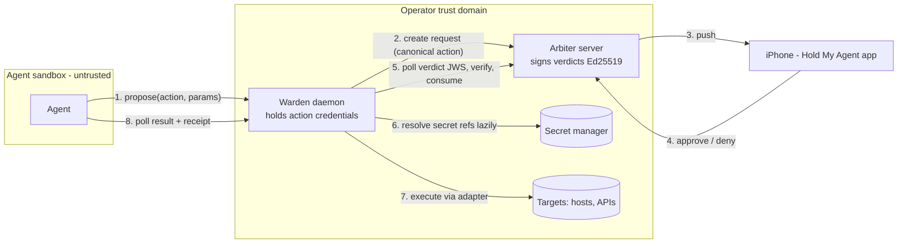

# Warden — verified enforcement

> **HMA is the gate; the warden decides whether the agent walks through it or merely
> promises to.**

The arbiter and the iOS app give you a human yes/no. The warden (`hold-warden`) turns
that yes into *enforcement*: a small daemon that runs **outside your agent's sandbox**,
holds the action credentials the agent never sees, and executes an action only after it
has:

1. fetched the verdict for the request from the arbiter,
2. verified the arbiter's **Ed25519 signature** against the key pinned at pairing time,
3. **re-computed the hash of exactly what it is about to execute** and refused on any
   drift from what the human approved,
4. **consumed** the approval on the arbiter — atomic and single-use, so replays are
   refused — and
5. run the action through one of three adapters: `command`, `http`, or `secret`.



A fully compromised agent can still *propose* registry actions with constrained
parameters, and it can spam proposals (the arbiter rate-limits and de-duplicates). It can
never execute anything unapproved, alter an action after approval, replay an approval,
read another agent's proposals, or see the warden's credentials.

## Install

```bash
pip install hold-warden      # Python 3.11+
```

The warden must run **outside** the agent's trust domain — on the host beside the
sandbox, or on another machine that both the agent and the arbiter can reach. Never
install it inside the sandbox: the entire point is that the agent cannot touch the
daemon, its config, or its credentials.

## Pair with your arbiter (init walkthrough)

On the **arbiter** host (holdmyagent 0.4.0+), mint a warden-role token:

```bash
hma token create knossos-warden --role warden
# prints the token ONCE - export it where the warden runs:
export HMA_WARDEN_TOKEN=hma_warden_...
```

On the **warden** host:

```bash
hma-warden init --arbiter-url http://arbiter.tailnet.example:8000 \
                --config ~/.config/hold-warden/warden.toml
```

`init` does three things:

- fetches `GET /v1/keys` from the arbiter and **pins** its Ed25519 verdict key into
  `warden.toml` as `arbiter_pubkey = "kid:base64url"`. From now on this warden trusts
  verdicts signed by that key and nothing else. If the arbiter's key ever rotates,
  re-pin it here.
- scaffolds `warden.toml` (mode 0600) with a harmless starter action (`echo`).
- mints one agent-facing bearer token, stores it at a `file:` reference next to the
  config (`agent.default.token`, mode 0600), and prints it **once**. Give it to your
  agent; the warden never prints it again.

Then verify everything before serving:

```bash
hma-warden doctor --config ~/.config/hold-warden/warden.toml
```

`doctor` parses the config, dry-runs **every** secret resolver (printing only
`ok (non-empty)` or `FAILED (exit N)` — never values), and checks that the arbiter is
reachable and that `GET /v1/keys` still matches the pinned key. Exit code 0 means ready;
1 means fix something first.

## warden.toml — annotated example

```toml
[warden]
arbiter_url = "https://arbiter.tailnet.example:8000"
arbiter_token = "env:HMA_WARDEN_TOKEN"        # warden-role token, a secret ref like any other
arbiter_pubkey = "kid1:base64..."             # pinned at `hma-warden init`, rotatable
name = "knossos-warden"                       # the warden identity string used in canonical documents (+ request titles)
bind = "127.0.0.1"                            # sandbox-facing API bind
port = 8646
retention_days = 7                            # startup purge window (see Retention)

[agents.hermes]                                # agent-facing bearer tokens, per agent identity
token = "env:WARDEN_AGENT_HERMES"

[actions.restart_service]
adapter = "command"
severity = "high"                              # warden-set, never agent-set
ttl_seconds = 300                              # how long the human has to rule
description = "Restart a systemd unit on hermes"
argv = ["ssh", "-o", "BatchMode=yes", "kclear@hermes", "sudo", "systemctl", "restart", "{unit}"]
  [actions.restart_service.params.unit]
  type = "enum"
  values = ["nginx", "caddy", "holdmyagent-server"]

[actions.post_status]
adapter = "http"
severity = "medium"
ttl_seconds = 300
description = "Post a status update"
url = "https://api.example.com/v1/status"
method = "POST"
body_template = '{"text": "{text}"}'
headers = { Authorization = "secret:api_bearer" }   # name references [secrets]
  [actions.post_status.params.text]
  type = "string"
  max_len = 500
  pattern = "^[^\\x00-\\x08\\x0b\\x0c\\x0e-\\x1f]*$"

[actions.release_deploy_key]
adapter = "secret"
severity = "critical"
ttl_seconds = 300
description = "Release the deploy key to the agent (single read)"
secret = "secret:deploy_key"

[secrets]
api_bearer = "cmd:rbw get api-bearer"          # Vaultwarden via the rbw agent
deploy_key = "file:/etc/warden/deploy_key"     # 0600
```

Registry rules (enforced at config load and at propose time):

- **Params are constrained-only**: `enum`, `string` (pattern + max_len), or `int`
  (min/max). No free-form shell. Unknown params, missing params, or a validation failure
  reject the proposal with `422`.
- **Whole-segment interpolation only**: each `{param}` must occupy an entire argv element
  or an entire bounded segment of `body_template`. Config load rejects embedded-in-flag
  interpolation such as `"--unit={unit}"` — a param can never splice flags.
- **Severity and TTL are warden-set**, never agent-set. The agent picks an action name
  and params; everything else comes from this file.
- **Command environment is scrubbed**: `command` actions run without a shell and with a
  subprocess environment containing only `PATH=/usr/bin:/bin:/usr/local/bin` — the
  warden's own environment (and any secrets in it) never leaks into subprocesses. There
  is no configurable extra env in v0.1.0.
- **Secrets appear only as references** (`env:` / `file:` / `cmd:`). Resolved values
  never enter the canonical document, the arbiter payload, receipts, or logs. See
  [secret-managers.md](secret-managers.md).

## See exactly what gets approved: `hash`

```bash
hma-warden hash restart_service --param unit=nginx
```

prints the canonical action document on one line and its sha256 on the next — exactly
the bytes the human's approval is cryptographically bound to. Use it to debug hash
mismatches or to convince yourself the binding is real: change one character of the
action in `warden.toml` and the hash changes.

## Serve

```bash
hma-warden serve --config ~/.config/hold-warden/warden.toml
```

- Binds the agent-facing API on `bind:port` (default `127.0.0.1:8646`).
- Polls the arbiter for verdicts every second in a background thread.
- On startup, purges proposals older than `retention_days` (see Retention).
- State lives in `~/.local/share/hold-warden/warden.sqlite3` (override the directory
  with `HOLD_WARDEN_DATA_DIR`). Proposals and receipts survive restarts independently of
  the arbiter's audit log.

## Agent-facing API

Auth: `Authorization: Bearer <token>` where the token is one of the `[agents.*]` tokens.
All bodies and responses are JSON; errors are `{"detail": "<message>"}`.

- `POST /v1/propose` — body `{"action": "...", "params": {...}, "idempotency_key": "..."}`
  → `201 {"proposal_id", "request_id", "status": "pending", "expires_at"}`. Retrying with
  the same `idempotency_key` returns the original proposal (no duplicate phone prompt).
- `GET /v1/proposals/{id}` → `{"status", "result"?, "receipt"?}` with status one of
  `pending | executing | executed | denied | expired | failed`. Only the proposing
  agent's token can read a proposal (anything else is a 404). For `secret` actions the
  `result` is returned **exactly once** — the value is deleted after the first read.
- `POST /v1/execute` — body `{"action", "params", "timeout_s"?}`: a blocking convenience
  wrapper that long-polls up to `timeout_s` (default 240 s) and returns `200` with the
  terminal proposal, or `202 {"proposal_id"}` on timeout so the caller can switch to
  polling. The async pair above is primary — agent-runtime turn timeouts are real.
- `GET /health` → `200 {"ok": true}` when the config is loaded and the arbiter was
  reachable within the last 60 s (cached probe); `503 {"ok": false}` otherwise.
  Unauthenticated.

```bash
TOKEN=<agent token printed by init>
curl -s -X POST http://127.0.0.1:8646/v1/propose \
  -H "Authorization: Bearer $TOKEN" -H "Content-Type: application/json" \
  -d '{"action": "echo", "params": {}, "idempotency_key": "demo-1"}'
# -> {"proposal_id": "...", "request_id": "...", "status": "pending", "expires_at": "..."}
curl -s http://127.0.0.1:8646/v1/proposals/<proposal_id> \
  -H "Authorization: Bearer $TOKEN"
# after you approve on the phone:
# -> {"status": "executed", "result": {...}, "receipt": {...}}
```

### Fail-closed contract

| Failure | Outcome |
|---|---|
| Arbiter unreachable at propose | `502`, no side effects |
| Arbiter unreachable while polling | proposal stays `pending`; past the request deadline → `expired` |
| Verdict signature invalid / wrong key | `failed`, never executes |
| Action drifted since approval (hash mismatch) | `failed`, never executes |
| Approval already consumed (replay) | `failed`, never executes |
| Approval older than its freshness window | `expired`, never executes |
| Warden token revoked/rotated (401/403) | proposal `failed`; CRITICAL log line naming the cause; daemon stays up |
| Adapter timeout or error | `failed`, receipt records the attempt |
| Secret resolution failure | that proposal `failed`; the daemon keeps serving |

## Run it as a systemd --user unit

```ini
# ~/.config/systemd/user/hold-warden.service
[Unit]
Description=Hold My Agent warden (verified action executor)
After=network-online.target

[Service]
ExecStart=%h/.venvs/warden/bin/hma-warden serve --config %h/.config/hold-warden/warden.toml
# env-referenced secrets (HMA_WARDEN_TOKEN, BW_SESSION, ...) live here, mode 0600:
EnvironmentFile=%h/.config/hold-warden/warden.env
Restart=on-failure
RestartSec=3

[Install]
WantedBy=default.target
```

```bash
systemctl --user daemon-reload
systemctl --user enable --now hold-warden
loginctl enable-linger "$USER"
```

The `enable-linger` line is **required** for a daemon: without linger, systemd stops
`--user` units when your session ends and never starts them at boot. If the warden
"mysteriously dies after you log out", this is why.

## Restart semantics (v0.1.0)

- **No config reload.** There is **no SIGHUP handler** — changes to `warden.toml` (new
  actions, rotated tokens, a re-pinned arbiter key) take effect only on restart:
  `systemctl --user restart hold-warden`.
- **Blocking calls drop on restart.** An in-flight `POST /v1/execute` long-poll dies with
  the socket when the daemon restarts, and the caller cannot tell from that failed call
  what happened to the underlying proposal.
- **The async pair is restart-safe.** Proposals persist in SQLite and polling resumes
  after restart. Point agents at `POST /v1/propose` + `GET /v1/proposals/{id}` and have
  them always send an `idempotency_key`: a retried propose after a crash or restart
  returns the original proposal instead of creating a duplicate approval prompt on your
  phone.

## Retention

`retention_days` (default 7) is deliberately dumb in v0.1.0: **on startup**, the warden
deletes proposals — results and receipts included — older than the window. There is no
background pruning task. Combined with the arbiter's per-identity rate limits, a
propose-spamming agent cannot grow the database unboundedly across restarts. Need
receipts for longer? Raise `retention_days`, or archive `warden.sqlite3` before
restarting.

## See also

- [secret-managers.md](secret-managers.md) — `env:`/`file:`/`cmd:` and tested recipes
  for rbw, bw, op, pass, and Vault
- [enforcement-models.md](enforcement-models.md) — tier 0/1/2 and what each does NOT
  protect against
- [api.md](api.md) — the arbiter's REST reference (verdicts, consume, keys)
- [reference-sandboxed-agent.md](reference-sandboxed-agent.md) — the flagship topology:
  sandboxed agent whose egress allowlist permits only warden + arbiter
